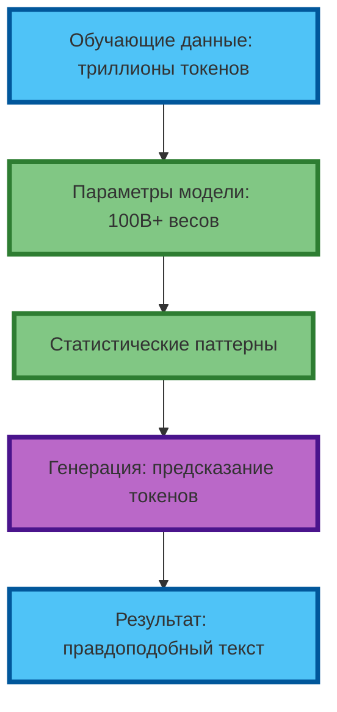
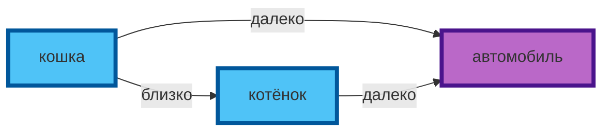
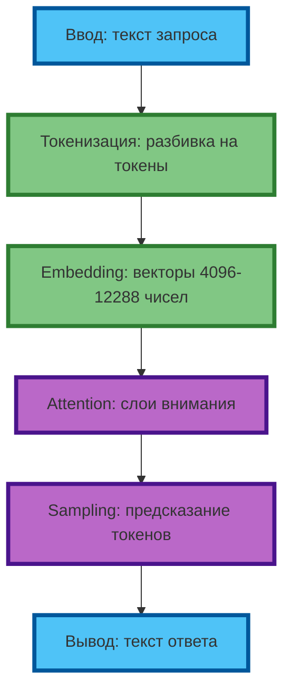

# Как работают нейросети

## Что такое нейросеть и зачем это знать промптеру

Нейросеть — статистическая модель, обученная на триллионах токенов. В отличие от программы с жёстким алгоритмом, она не следует правилам — она находит паттерны в данных и воспроизводит их. Современные языковые модели (GPT-4o, Claude 3.5, Grok 2) содержат сотни миллиардов параметров — «весов», которые определяют, какой токен с какой вероятностью следует за другим.

**Экспертный инсайт:** понимание этого принципа — фундамент профессионального промптинга. Когда вы знаете, что модель предсказывает токены, а не «думает», вы перестаёте просить её «понять» и начинаете явно задавать паттерны: роль, формат, ограничения, примеры. Это разница между «нажал и получил что-то» и «инженерия результата».

**Рис. 1.** От данных к результату: как нейросеть превращает статистику в текст.

---

## Как нейросеть обрабатывает ваш запрос

### Этап 1. Токенизация

Текст разбивается на токены — минимальные единицы, которые модель «знает». Токен может быть словом, частью слова или символом. Например:

| Исходный текст | Токены |
|----------------|--------|
| `промпт-инженерия` | `промпт`, `-`, `инженерия` |
| `нейросеть` | `нейро`, `сеть` |
| `ChatGPT` | `Chat`, `G`, `PT` |

**Экспертный совет:** короткие, частотные слова (stop-words) иногда «склеиваются» в один токен, а редкие термины дробятся. Это влияет на стоимость API и на «внимание» модели — чем меньше токенов, тем чётче фокус.

### Этап 2. Векторизация (Embedding)

Каждый токен превращается в вектор — массив из 4096–12288 чисел (в зависимости от модели). Этот вектор кодирует «смысл» токена в многомерном пространстве. Слова с похожим значением оказываются ближе друг к другу:

**Рис. 2.** Семантическое пространство: похожие токены — ближе.

**Практическая ценность:** если вы используете в промпте редкие или узкоспециализированные термины, модель может «не знать» их точного значения — и результат будет хуже. Используйте частотные синонимы или давайте определения.

### Этап 3. Attention (Механизм внимания)

Модель обрабатывает последовательность векторов через слои внимания. На каждом слое она вычисляет: «какие токены важны для понимания текущего контекста?». Это позволяет модели «связывать» местоимения с существительными, учитывать порядок слов и строить внутреннее представление смысла.

**Ключевой момент для промптера:** внимание — ограниченный ресурс. Если промпт длинный и «размытый», внимание «размажется» по нерелевантным токенам. Чёткие, структурированные промпты фокусируют внимание на важном.

### Этап 4. Генерация (Sampling)

Модель предсказывает следующий токен — выбирает из распределения вероятностей. Она не «знает», что написать, — она выбирает наиболее вероятное продолжение на основе паттернов из обучения.

**Галлюцинации** — следствие этого механизма: если в данных преобладал определённый паттерн, модель воспроизведёт его, даже если он неверен. Профессиональный промптер не «верит» ответу, а проверяет, уточняет, требует источники.

**Рис. 3.** Полный цикл обработки запроса: от токенизации до генерации.

---

## Ограничения нейросетей: как их обходить

| Ограничение | Что происходит | Как обходить (курс) |
|-------------|----------------|---------------------|
| **Нет понимания** | Модель предсказывает токены, не рассуждает | Цепочки промптов (Chain-of-Thought), самопроверка (Self-Check) |
| **Галлюцинации** | Уверенные, но ложные факты | Ролевой критик (Critic-Generator), требование источников |
| **Ограниченный контекст** | «Забывает» начало длинного диалога | Краткие, фокусированные промпты, итеративная работа |
| **Зависимость от данных** | Воспроизводит предубеждения и устаревшее | Явные ограничения, negative prompting, проверка |
| **Нет реального мышления** | Нет внутреннего монолога, самокритики | Разделение ролей, метапромпты, итеративное улучшение |

**Экспертный совет:** не пытайтесь «убедить» модель в очевидном. Используйте техники, которые обходят ограничения: цепочки промптов, разделение ролей, самопроверку. Это не «хаки» — это инженерные решения, основанные на понимании архитектуры.

---

## Практическое задание

**Цель:** эмпирически убедиться, что разные модели имеют разные «статистические отпечатки» — и научиться выбирать модель под задачу.

**Задание:**
1. Выберите две нейросети (ChatGPT / Claude / Grok / Gemini).
2. Задайте обеим один промпт: «Объясни, как работает нейросеть, как будто мне 12 лет. Используй не больше 80 слов».
3. Сравните ответы по критериям:
   - Плотность информации (слов на идею)
   - Наличие и качество аналогий
   - Точность технических деталей
   - Стиль и тон
   - Соответствие ограничению по длине

**Вывод для практики:** в следующих статьях вы научитесь формулировать промпты, которые «выжимают» максимум из любой модели — независимо от её «характера» и ограничений.

---

## Чек-лист: признаки профессиональной нейросети

| Признак | Что это значит | 🟢 Критично | 🟡 Важно | 🔴 Полезно |
|---------|----------------|-------------|----------|------------|
| Точность на сложных задачах | Многоступенчатые рассуждения без потери логики | ✓ | | |
| Честность (не галлюцинирует) | Признаёт неопределённость, не выдумывает факты | ✓ | | |
| Консистентность | Один и тот же вопрос → похожий ответ | ✓ | | |
| Адаптивность | Подстраивается под уровень и стиль пользователя | | ✓ | |
| Длина контекста | 128K+ токенов для длинных задач | | ✓ | |
| Скорость | < 3 сек на ответ для итеративной работы | | | ✓ |

**Экспертный совет:** выбирайте модель не по «популярности», а по соответствию задаче. Для аналитики и кода — Claude 3.5 / o1 (сильный reasoning). Для креатива и маркетинга — GPT-4o / Grok (широкое распределение). Для исследовательской работы — модели с доступом к интернету и проверкой фактов.

---

## Заключение

Нейросеть — статистическая машина, предсказывающая токены. Она не думает, не проверяет, не понимает. Но она умеет генерировать правдоподобный текст — если вы умеете задавать правильные паттерны.

**Польза курса:** вы не просто «научитесь писать промпты». Вы поймёте, как работает инструмент — и сможете использовать его на максимуме, обходя ограничения и эксплуатируя сильные стороны каждой модели. Это разница между «нажал кнопку и получил что-то» и «инженерия результата под конкретную задачу».

В следующей статье вы узнаете, что такое промпт и чем он отличается от обычного вопроса. Вы научитесь формулировать запросы так, чтобы нейросеть «попадала» в нужные статистические паттерны — а не генерировала случайный текст.