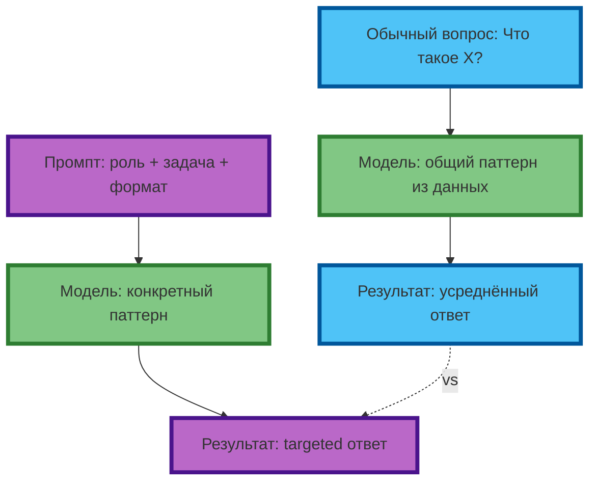
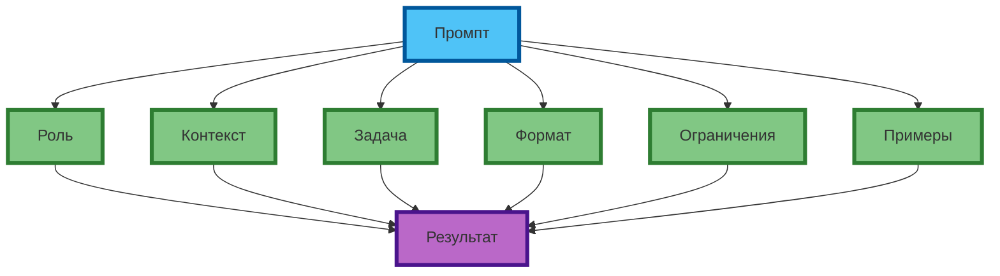

# Что такое промпт

## Промпт — не вопрос, а инструкция

Промпт — это **структурированный запрос**, который задаёт модели паттерн генерации. В отличие от обычного вопроса («Что такое нейросеть?»), промпт явно указывает: роль, контекст, задачу, формат, ограничения и критерии качества.

**Разница в результате:**

| Тип запроса | Пример | Результат |
|-------------|--------|---------|
| Обычный вопрос | `Что такое нейросеть?` | Общий ответ из 3–5 предложений, без структуры |
| Промпт | `Ты — технический писатель. Объясни, как работает нейросеть, для аудитории 12 лет. Используй одну аналогию. Формат: 3–4 предложения.` | Структурированный ответ с аналогией, заданной длины и тона |

**Экспертный инсайт:** модель не «понимает» намерение. Она предсказывает токены на основе паттернов из обучения. Промпт — это способ явно задать паттерн, а не полагаться на «понимание».



**Рис. 1.** Обычный вопрос vs промпт: разница в контроле над результатом.

---

## Компоненты промпта

Профессиональный промпт состоит из 4–6 компонентов. Не все обязательны для каждой задачи, но понимание каждого — ключ к точному контролю.

### 1. Роль (Role)

Задаёт «маску» модели — определяет стиль, глубину и тон ответа.

| Роль | Стиль | Глубина | Пример задачи |
|------|-------|---------|---------------|
| `Ты — технический писатель` | Формальный, точный | Высокая | Документация, объяснения |
| `Ты — маркетолог` | Продающий, эмоциональный | Средняя | Реклама, посты |
| `Ты — 12-летний ребёнок` | Простой, с примерами | Низкая | Объяснения для детей |
| `Ты — скептик` | Критичный, с вопросами | Высокая | Анализ, проверка |

**Пример:**
```
Ты — senior-программист с 15-летним опытом в Python.
Объясни, почему list comprehension быстрее цикла for.
```

**Экспертный совет:** конкретная роль («senior-программист с 15-летним опытом») даёт более точный результат, чем общая («программист»). Модель воспроизводит паттерны из обучения, связанные с этой ролью.

### 2. Контекст (Context)

Предыстория, факты, ограничения — всё, что модель должна учитывать.

**Пример:**
```
Контекст: компания X запустила продукт 3 месяца назад.
Конкуренция усилилась, CAC вырос на 40%.
Задача: предложить 3 гипотезы снижения CAC.
```

Без контекста модель даст общие советы. С контекстом — targeted гипотезы.

### 3. Задача (Task)

Конкретное действие, которое должна выполнить модель.

**Слабая формулировка:** `Напиши про продукт.`
**Сильная формулировка:** `Напиши продающий текст для лендинга (150–200 слов), акцент на скорость внедрения и ROI за 3 месяца.`

**Экспертный совет:** задача должна быть атомарной — одна операция. Если нужно несколько действий, используйте цепочку промптов (см. статью 20).

### 4. Формат (Format)

Структура ответа: список, таблица, JSON, эссе, диалог.

**Пример:**
```
Формат: таблица Markdown, 3 колонки: Гипотеза | Ожидаемый эффект | Риск.
```

**Экспертный совет:** если формат сложный (JSON, YAML), приведите пример структуры в промпте. Модель точнее воспроизводит паттерн, если видит его.

### 5. Ограничения (Constraints)

Что НЕ должно быть в ответе, лимиты, запреты.

**Пример:**
```
Ограничения: не используй слова "инновационный", "революционный".
Максимум 100 слов. Не упоминай конкурентов.
```

**Экспертный совет:** негативные ограничения («не используй…») работают лучше позитивных («используй только…»), потому что явно убирают нежелательные паттерны из распределения.

### 6. Примеры (Examples / Few-shot)

1–3 примера желаемого результата — «задают планку» качества.

**Пример:**
```
Пример 1: "Быстрый старт: внедрение за 2 недели, первые результаты за 30 дней."
Пример 2: "ROI за 90 дней: снижение CAC на 25% при сохранении LTV."
```

**Экспертный совет:** примеры должны быть разнообразными, но в одном стиле. 2–3 примера достаточно — больше перегружает контекст.



**Рис. 2.** Компоненты промпта: каждый элемент управляет отдельным аспектом результата.

---

## Примеры: вопрос vs промпт

### Пример 1. Объяснение термина

**Обычный вопрос:**
```
Что такое prompt engineering?
```

**Результат:** общий ответ из 4–5 предложений, без структуры, с возможными галлюцинациями.

**Промпт:**
```
Ты — технический писатель с опытом в NLP.
Объясни, что такое prompt engineering, для аудитории junior-разработчиков.
Используй 1 аналогию из реальной жизни.
Формат: 4–5 предложений, не больше 80 слов.
Ограничения: не используй термины "токен", "вектор", "embedding".
```

**Результат:** targeted объяснение с аналогией, заданной длины, без лишних терминов.

### Пример 2. Генерация идей

**Обычный вопрос:**
```
Придумай идеи для постов в Instagram про кофе.
```

**Результат:** 5–7 общих идей без структуры и связи с брендом.

**Промпт:**
```
Роль: ты — SMM-менеджер кофейни "Чёрный кот" (специалитет: авторские бленды, минимализм).
Контекст: целевая аудитория — 25–35 лет, IT-специалисты, ценят качество и эстетику.
Задача: предложи 5 идей постов на неделю.
Формат: нумерованный список, для каждой идеи — заголовок (3–5 слов) + 1 предложение.
Ограничения: без эмодзи, без хэштегов, без призывов "подписывайся".
Пример: "1. "Бленд для фокуса" — как мы подобрали кофе под 8-часовой кодинг."
```

**Результат:** 5 идей, связанных с брендом, в заданном формате, без лишних элементов.

---

## Практическое задание

**Цель:** научиться превращать обычные вопросы в структурированные промпты.

**Задание:**
1. Возьмите 3 обычных вопроса на разные темы (например: «Как приготовить пасту?», «Что такое блокчейн?», «Как написать резюме?»).
2. Для каждого вопроса составьте промпт, добавив:
   - Роль (конкретную, с опытом)
   - Контекст (аудитория, ситуация)
   - Задачу (атомарную)
   - Формат (структуру ответа)
   - Ограничения (1–2)
3. Протестируйте оба варианта (вопрос и промпт) в одной модели.
4. Сравните результаты по критериям:
   - Соответствие ожиданию
   - Структурированность
   - Отсутствие лишнего
   - Точность

**Критерии проверки:**
- Промпт содержит минимум 4 компонента (роль, задача, формат, ограничения)
- Результат промпта короче и точнее, чем результат вопроса
- Формат ответа соответствует заданному в промпте
- В ответе нет элементов, указанных в ограничениях

---

## Чек-лист: критерии хорошего промпта

| Компонент | Признак качества | 🟢 Обязательно | 🟡 Рекомендуется | 🔴 Опционально |
|-----------|------------------|----------------|------------------|----------------|
| Роль | Конкретная, с опытом/специализацией | ✓ | | |
| Контекст | Релевантные факты, без воды | | ✓ | |
| Задача | Атомарная, однозначная | ✓ | | |
| Формат | Явно указан, с примером структуры | | ✓ | |
| Ограничения | Негативные («не используй») | | ✓ | |
| Примеры | 2–3, в одном стиле | | | ✓ |

**Экспертный совет:** начинайте с 4 компонентов (роль + задача + формат + ограничения). Добавляйте контекст и примеры только если результат не соответствует ожиданиям. Перегруженный промпт хуже, чем минимально достаточный.

---

## Заключение

Промпт — это не «вопрос к ИИ», а инструмент управления генерацией. Он позволяет явно задавать паттерны, которые модель воспроизводят, вместо того чтобы полагаться на усреднённый результат обычного вопроса.

В следующей статье вы разберёте жизненный цикл промпта: от ввода до результата, и узнаете, почему один и тот же промпт может давать разные ответы в разных моделях — и как это использовать.