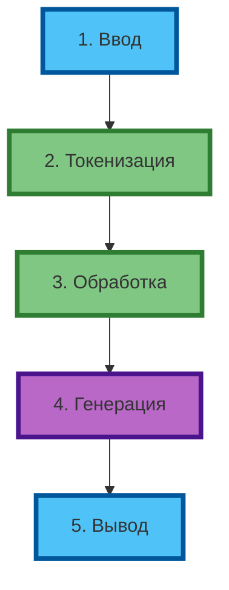
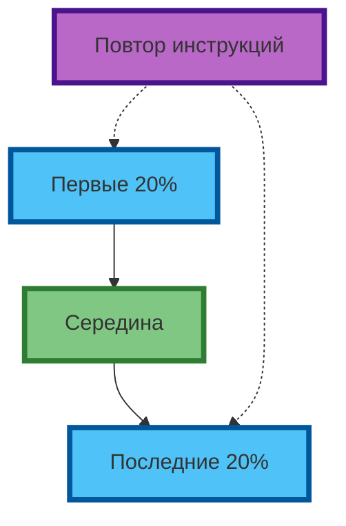

# Жизненный цикл промпта: от ввода до результата

## Этапы обработки промпта

Когда вы отправляете промпт, нейросеть проходит 5 этапов: ввод → токенизация → обработка → генерация → вывод. Понимание каждого этапа позволяет предсказывать, почему результат получился именно таким, и как его улучшить.



**Рис. 1.** Пять этапов жизненного цикла промпта (компактная схема).

---

### Этап 1. Ввод

Вы вводите текст в интерфейс модели. На этом этапе важно: длина промпта, порядок слов, наличие специальных инструкций («подумай пошагово», «ответь в формате JSON»).

**Экспертный совет:** первые 10–20% промпта (роль, контекст) задают «направление», последние 10–20% (ограничения, формат) — «фильтры». Середина — «задача».

### Этап 2. Токенизация

Текст разбивается на токены — минимальные единицы, которые модель «знает». Токен может быть словом, частью слова или символом.

| Исходный текст | Токены (примерно) |
|----------------|-------------------|
| `промпт-инженерия` | `промпт`, `-`, `инженерия` |
| `нейросеть` | `нейро`, `сеть` |
| `ChatGPT` | `Chat`, `G`, `PT` |

**Современные данные (2026):** один токен ≈ 4 символа английского текста или 1–2 символа русского. Промпт из 100 слов ≈ 130–150 токенов.

**Влияние на результат:**
- Длинный промпт (> 2000 токенов) «размывает» внимание модели
- Редкие слова дробятся на большее количество токенов → меньше «внимания» на каждом
- Порядок токенов влияет на то, какие паттерны активируются

**Аналогия:** токенизация — как разрезание текста на кусочки. Модель видит не целое слово, а набор кусочков, и по ним «угадывает» смысл.

### Этап 3. Обработка (Attention + Контекст)

Модель обрабатывает токены через слои **внимания (attention)**. На этом этапе:
- Вычисляется, какие токены важны для понимания контекста
- Учитывается «окно контекста» — максимальное количество токенов, которое модель может обработать за один раз

**Что такое «окно контекста» простыми словами:** это «память» модели. Если окно = 128K токенов, модель может «помнить» примерно 100–120 страниц текста. Если ваш промпт + история диалога превышает это окно, модель «забывает» начало.

**Современные данные (2026):**

| Модель | Окно контекста | Примерно страниц текста |
|--------|----------------|-------------------------|
| GPT-4o | 128K токенов | 100–120 |
| Claude 3.5 Sonnet | 200K токенов | 150–180 |
| Grok 2 | 128K токенов | 100–120 |
| Gemini 1.5 Pro | 1M–2M токенов | 750–1500 |

**Почему один промпт даёт разные результаты в разных моделях:**

1. **Разные токенизаторы** — одно слово в GPT-4o может быть 2 токенами, а в Claude — 3 токенами.
2. **Разные окна контекста** — Gemini «помнит» в 10 раз больше, чем GPT-4o.
3. **Разные обучающие данные** — модели обучались на разных текстах.
4. **Разные «температуры» по умолчанию** — см. ниже.

### Этап 4. Генерация

Модель предсказывает следующий токен, выбирая из распределения вероятностей. Здесь работает **температура** — параметр, который определяет, насколько «случайным» будет выбор.

**Что такое температура простыми словами:** это «регулятор креативности». Низкая температура = модель выбирает самые вероятные токены (предсказуемо). Высокая температура = модель может выбрать неожиданные токены (креативно, но непредсказуемо).

**Важно:** в веб-интерфейсах (ChatGPT, Claude, Grok, Gemini) пользователи **не могут выставить температуру явно**. Она «зашита под капотом» и отличается для разных моделей:

| Модель (веб) | Температура (примерно) | Стиль ответа |
|--------------|------------------------|--------------|
| ChatGPT (GPT-4o) | ~0.7–0.9 | Сбалансированный |
| Claude 3.5 Sonnet | ~0.5–0.7 | Более детерминированный |
| Grok 2 | ~0.8–1.0 | Более креативный |
| Gemini 1.5 Pro | ~0.7–0.9 | Сбалансированный |

**Вариант 1. Работа в веб-интерфейсе:**
- Вы не контролируете температуру напрямую
- Если результат слишком «скучный» — добавьте в промпт «будь креативным», «предложи нестандартные идеи»
- Если результат слишком «хаотичный» — добавьте «будь точным», «используй только факты»
- Для повторяемости — начните новый диалог

**Вариант 2. Работа через API:**
- Вы можете явно задать температуру
- **OpenAI / Gemini:** 0.0–2.0 (значения >1.0 используются редко, могут давать нестабильные результаты)
- **Claude (Anthropic):** 0.0–1.0 (максимум 1.0)
- 0.0–0.3 — детерминированный результат (для аналитики, кода, отчётов)
- 0.7–1.0 — сбалансированный (для большинства задач)
- Если модель «зациклилась» — снизьте температуру на 0.2–0.3

**Экспертный совет:** для production-задач используйте API с фиксированной температурой 0.1–0.3. Для креатива — веб-интерфейс с «креативными» инструкциями в промпте.

### Этап 5. Вывод

Результат возвращается пользователю. На этом этапе можно:
- Проверить, соответствует ли формат ожидаемому
- Оценить, все ли ограничения соблюдены
- Запросить уточнение или доработку

---

## Почему один промпт даёт разные результаты

### Фактор 1. Модель (архитектура + данные)

| Модель | Окно контекста | Сильные стороны | Слабые стороны |
|--------|----------------|-----------------|----------------|
| GPT-4o | 128K | Креатив, код, общие задачи | Галлюцинации на фактах |
| Claude 3.5 Sonnet | 200K | Аналитика, длинные тексты, reasoning | Менее «креативный» |
| Grok 2 | 128K | Реал-тайм данные, юмор, актуальность | Меньше контекста |
| Gemini 1.5 Pro | 1M–2M | Длинные документы, видео, код | Медленнее |

**Экспертный совет:** один и тот же промпт в GPT-4o и Claude 3.5 даст разные акценты. Тестируйте 2–3 модели на критически важных задачах.

### Фактор 2. Температура (случайность)

В веб-интерфейсах температура «зашита» в модель. В API вы можете её контролировать.

**Пример (API, температура явно задана):**
```
Промпт: "Придумай название для стартапа в fintech"
Температура 0.2 → "FinFlow", "PayCore", "CashFlow Pro"
Температура 1.0 → "NeonVault", "QuantumLedger", "EchoPay"
```

**В веб-интерфейсе:** если результат слишком предсказуемый — добавьте в промпт «предложи нестандартные варианты». Если слишком хаотичный — добавьте «будь точным и конкретным».

### Фактор 3. Контекст (предыдущие сообщения)

Модель «помнит» предыдущие сообщения в пределах окна контекста. Если вы уточняете промпт в том же диалоге, результат будет учитывать предыдущие ответы.

**Экспертный совет:** для «чистого» теста одного промпта начинайте новый диалог. Для итеративной работы — продолжайте в том же.

### Фактор 4. Системные инструкции

Некоторые модели (Claude, ChatGPT с кастомными GPT) имеют «системные инструкции» — скрытый промпт, который применяется к каждому запросу. Это объясняет, почему один и тот же промпт в «голой» модели и в кастомном GPT даёт разные результаты.

### Фактор 5. Длина и порядок токенов

- Первые 20% и последние 20% промпта «весомее» для модели
- Середина может «теряться» в длинных промптах
- Повторение ключевых инструкций в начале и конце повышает их «вес»



**Рис. 2.** «Вес» частей промпта: первые и последние токены важнее (компактная схема 1:1).

---

## Факторы, влияющие на результат промпта

| Фактор | Влияние | Как контролировать (веб) | Как контролировать (API) | 🟢 Критично | 🟡 Важно | 🔴 Полезно |
|--------|---------|--------------------------|--------------------------|-------------|----------|------------|
| Модель | Архитектура, данные, токенизатор | Выбрать модель в интерфейсе | Выбрать модель в коде | ✓ | | |
| Температура | Случайность генерации | Добавить инструкции в промпт | Указать явно (0.0–2.0 / 0.0–1.0) | | ✓ | |
| Контекст | Предыдущие сообщения | Новый диалог vs продолжение | Новый диалог vs продолжение | | ✓ | |
| Длина промпта | «Размытие» внимания | < 1500 токенов для точности | < 1500 токенов для точности | | ✓ | |
| Порядок слов | «Вес» инструкций | Ключевые инструкции в начале и конце | Ключевые инструкции в начале и конце | ✓ | | |
| Системные инструкции | Скрытый промпт модели | Учитывать при переносе между моделями | Учитывать при переносе между моделями | | | ✓ |
| Seed (если доступен) | Детерминированность | Не доступен в веб | Фиксировать для воспроизводимости | | | ✓ |

**Экспертный совет:** для production-задач используйте API с фиксированной температурой 0.1–0.3. Для креатива — веб-интерфейс с «креативными» инструкциями в промпте.

---

## Практическое задание

**Цель:** эмпирически убедиться, что один и тот же промпт даёт разные результаты в разных моделях, и научиться анализировать различия.

**Задание:**
1. Выберите 3 нейросети (например: ChatGPT, Claude, Grok).
2. Составьте один промпт:
   ```
   Ты — маркетолог. Опиши преимущества продукта X для аудитории Y.
   Формат: 3 тезиса по 1 предложению каждый.
   Ограничения: без эмодзи, без хэштегов.
   ```
3. Запустите промпт в каждой модели (новый диалог, температура по умолчанию).
4. Сравните результаты по критериям:
   - Длина ответа (слов)
   - Конкретность тезисов (есть ли цифры, факты)
   - Стиль и тон
   - Соответствие формату (ровно 3 тезиса?)
   - Наличие элементов, указанных в ограничениях

**Что записать:**
- Какая модель дала самый «точный» результат (по формату и ограничениям)?
- Какая модель дала самый «креативный» результат (нестандартные формулировки)?
- Какая модель «проигнорировала» ограничения?
- Какой фактор (модель, температура, контекст) повлиял сильнее всего?

**Вывод для практики:** в следующих статьях вы научитесь писать промпты, которые «работают» в любой модели — за счёт чёткой структуры и явных инструкций.

---

## Чек-лист: 7 факторов, влияющих на результат промпта

| Фактор | Вопрос для проверки | 🟢 Обязательно проверить | 🟡 Рекомендуется | 🔴 Опционально |
|--------|---------------------|--------------------------|------------------|----------------|
| Модель | Какая модель используется? | ✓ | | |
| Температура | Какая температура (если явно задана в API)? | | ✓ | |
| Контекст | Новый диалог или продолжение? | ✓ | | |
| Длина | Сколько токенов в промпте? | | ✓ | |
| Порядок | Ключевые инструкции в начале и конце? | ✓ | | |
| Системные инструкции | Есть ли скрытые инструкции модели? | | | ✓ |
| Seed | Зафиксирован ли seed для воспроизводимости (API)? | | | ✓ |

**Экспертный совет:** при переносе промпта из одной модели в другую — начинайте с «чистого листа» (новый диалог). Затем адаптируйте: если модель «игнорирует» формат — добавьте примеры; если «галлюцинирует» — добавьте «используй только проверенные факты».

---

## Заключение

Жизненный цикл промпта — это не «чёрный ящик», а последовательность этапов, каждый из которых можно контролировать. Понимание, почему один промпт даёт разные результаты в разных моделях, позволяет предсказывать поведение модели и писать промпты, которые работают стабильно.

В следующей статье вы разберёте четыре компонента промпта (задача, контекст, ограничения, формат) и научитесь строить минимально достаточный промпт для любой задачи.