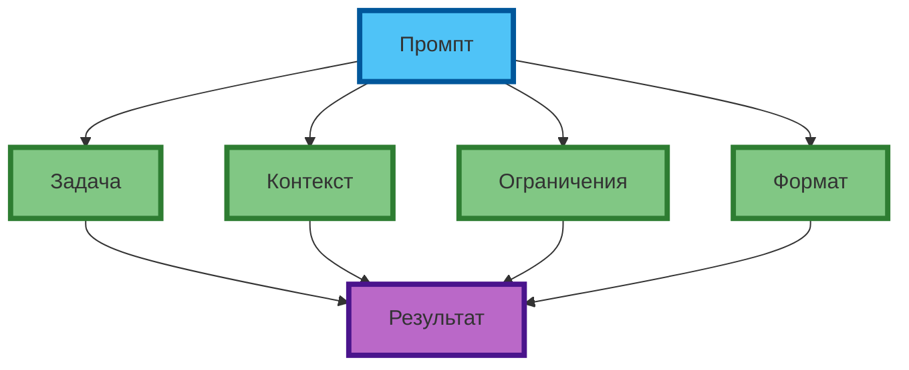

# Четыре компонента промпта: задача, контекст, ограничения, формат

## Почему структура промпта важнее «магии слов»

Профессиональный промпт — это не набор «волшебных фраз», а **структурированная инструкция**, состоящая из 4 компонентов: задача, контекст, ограничения, формат. Каждый компонент управляет отдельным аспектом результата. Если один компонент отсутствует или сформулирован неверно, результат «разваливается».

**Экспертный инсайт:** порядок компонентов в промпте влияет на «вес» инструкций. Первые 20% и последние 20% промпта модель «слышит» лучше. Поэтому структура «задача → контекст → ограничения → формат» даёт более стабильный результат, чем случайный порядок.



**Рис. 1.** Четыре компонента промпта: каждый управляет отдельным аспектом результата (компактная схема 1:1).

---

## Компонент 1. Задача (Task)

**Задача** — конкретное действие, которое должна выполнить модель. Это «сердце» промпта. Без чёткой задачи модель генерирует «средний» ответ на основе паттернов из обучения.

**Признаки хорошей задачи:**
- Атомарная (одна операция, не «сделай всё»)
- Конкретная (не «напиши про продукт», а «напиши продающий текст 150–200 слов»)
- Измеримая (можно проверить: «3 тезиса», «таблица из 5 строк», «JSON с 3 полями»)

**Пример:**
```
Слабая задача: "Напиши про кофе."
Сильная задача: "Напиши продающий текст для лендинга кофейни (150–200 слов), акцент на скорость доставки и авторские бленды."
```

**Экспертный совет:** если задача сложная (больше 3 действий), разбейте её на цепочку промптов (см. статью 20). Одна задача = один промпт.

---

## Компонент 2. Контекст (Context)

**Контекст** — предыстория, факты, ограничения, которые модель должна учитывать. Без контекста модель даёт общие советы. С контекстом — targeted рекомендации.

**Что включать в контекст:**
- Аудиторию (кто будет читать результат)
- Ситуацию (компания, продукт, рынок, ограничения)
- Цель (зачем нужен результат)
- Ограничения по времени/ресурсам (если есть)

**Пример:**
```
Контекст: компания X запустила продукт 3 месяца назад. Конкуренция усилилась, CAC вырос на 40%. Цель: снизить CAC на 25% за 6 месяцев без снижения LTV.
```

**Экспертный совет:** контекст должен быть релевантным. Если вы пишете промпт для генерации идей постов в Instagram, не нужно указывать финансовые показатели компании — это «шум». Указывайте: целевая аудитория, tone of voice, ограничения по длине.

---

## Компонент 3. Ограничения (Constraints)

**Ограничения** — что НЕ должно быть в ответе, лимиты, запреты. Это «фильтры», которые убирают нежелательные паттерны из распределения.

**Типы ограничений:**
- **Лексические:** не используй слова «инновационный», «революционный»
- **Структурные:** максимум 100 слов, ровно 3 тезиса
- **Содержательные:** не упоминай конкурентов, не используй данные старше 2024 года
- **Форматные:** без эмодзи, без хэштегов, без ссылок

**Пример:**
```
Ограничения: не используй слова "инновационный", "революционный". Максимум 100 слов. Не упоминай конкурентов. Без эмодзи, без хэштегов.
```

**Экспертный совет:** негативные ограничения («не используй…») работают лучше позитивных («используй только…»), потому что явно убирают нежелательные паттерны. Если модель игнорирует ограничения — продублируйте их в конце промпта (последние 20% «весомее»).

---

## Компонент 4. Формат (Format)

**Формат** — структура ответа: список, таблица, JSON, эссе, диалог. Это «контейнер», в который модель «упаковывает» результат.

**Примеры форматов:**
- Нумерованный список (3–5 пунктов)
- Таблица Markdown (3 колонки: Гипотеза | Ожидаемый эффект | Риск)
- JSON (объект с 3 полями: title, description, keywords)
- Эссе (введение + 3 аргумента + заключение)
- Диалог (2 реплики: вопрос → ответ)

**Пример:**
```
Формат: таблица Markdown, 3 колонки: Гипотеза | Ожидаемый эффект | Риск. Ровно 5 строк.
```

**Экспертный совет:** если формат сложный (JSON, YAML, XML), приведите пример структуры в промпте. Модель точнее воспроизводит паттерн, если видит его. Для простых форматов (список, таблица) достаточно указать название.

---

## Почему порядок компонентов важен

Модель «слышит» первые 20% и последние 20% промпта лучше, чем середину. Поэтому структура «задача → контекст → ограничения → формат» даёт более стабильный результат:

1. **Задача** (начало) — модель «знает», что делать
2. **Контекст** (середина) — модель «знает», для кого и зачем
3. **Ограничения** (конец) — модель «знает», чего избегать
4. **Формат** (конец) — модель «знает», как упаковать результат

**Альтернативная структура** (если контекст критически важен):
```
Контекст → Задача → Ограничения → Формат
```
Используйте, если модель «игнорирует» контекст (например, при длинных промптах).

---

## Минимум информации для рабочего промпта

**Минимальный рабочий промпт** = 3 компонента: задача + формат + ограничения (или контекст, если он критичен).

**Пример минимального промпта:**
```
Задача: Напиши продающий текст для лендинга (150–200 слов).
Формат: 3 абзаца: проблема → решение → CTA.
Ограничения: без эмодзи, без хэштегов, без ссылок.
```

**Когда добавлять контекст:**
- Если задача зависит от ситуации (аудитория, продукт, рынок)
- Если модель «не знает» предметную область (узкоспециализированные задачи)
- Если результат должен учитывать ограничения по времени/ресурсам

**Когда НЕ добавлять контекст:**
- Если задача универсальна (объяснить термин, перевести текст, написать код)
- Если модель «знает» предметную область (общие маркетинговые задачи)

---

## Практическое задание

**Цель:** научиться разбирать промпты по 4 компонентам и выявлять «слабые места».

**Задание:**
1. Возьмите 5 случайных промптов из практики (ваши собственные или из открытых источников).
2. Для каждого промпта разберите по 4 компонентам:
   - Задача: какая операция требуется?
   - Контекст: есть ли предыстория, аудитория, ситуация?
   - Ограничения: есть ли запреты, лимиты, фильтры?
   - Формат: указана ли структура ответа?
3. Оцените каждый промпт по шкале 1–5 (1 = отсутствует, 5 = чётко сформулирован).
4. Перепишите 2 weakest промпта, добавив недостающие компоненты.

**Пример разбора:**

```
Промпт: "Напиши пост про кофе для Instagram."
Разбор:
- Задача: написать пост (слабая — не указана длина, цель, акценты)
- Контекст: отсутствует (какая кофейня? какая аудитория? какой tone of voice?)
- Ограничения: отсутствуют
- Формат: отсутствует (сколько слов? структура? эмодзи?)
Оценка: 1/5
Переписанный промпт: [см. пример выше]
```

**Критерии проверки:**
- Каждый из 5 промптов разобран по 4 компонентам
- Выявлены слабые места (компоненты с оценкой 1–2)
- 2 weakest промпта переписаны с добавлением недостающих компонентов
- Переписанные промпты протестированы в модели и сравнены с оригиналами

---

## Чек-лист: шаблон базового промпта (4 поля)

| Компонент | Вопрос для проверки | 🟢 Обязательно | 🟡 Рекомендуется | 🔴 Опционально |
|-----------|---------------------|----------------|------------------|----------------|
| Задача | Конкретная операция указана? | ✓ | | |
| Задача | Атомарная (одна операция)? | ✓ | | |
| Контекст | Аудитория указана? | | ✓ | |
| Контекст | Ситуация/продукт описаны? | | ✓ | |
| Ограничения | Лексические запреты указаны? | | ✓ | |
| Ограничения | Лимиты (слова, строки) указаны? | | ✓ | |
| Формат | Структура ответа указана? | ✓ | | |
| Формат | Пример структуры (для сложных форматов)? | | ✓ | |

**Экспертный совет:** начинайте с 3 компонентов (задача + формат + ограничения). Добавляйте контекст только если результат «общий» или «не в тему». Перегруженный промпт хуже, чем минимально достаточный.

---

## Заключение

Четыре компонента промпта — это не «теория», а практический инструмент. Каждый компонент управляет отдельным аспектом результата. Понимание, какой компонент «слабый», позволяет быстро диагностировать и исправлять промпты.

В следующей статье вы разберёте, как каждый компонент влияет на результат в деталях, и научитесь визуально выделять компоненты в готовых промптах.