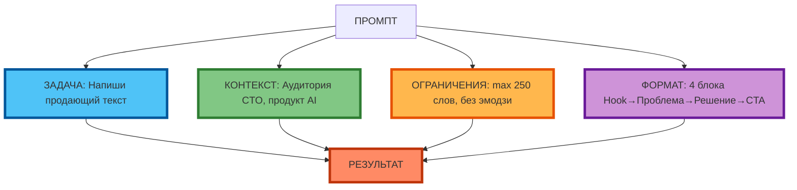
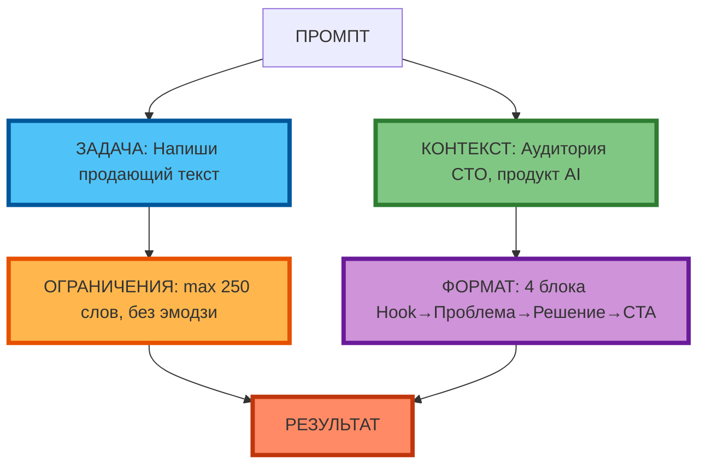
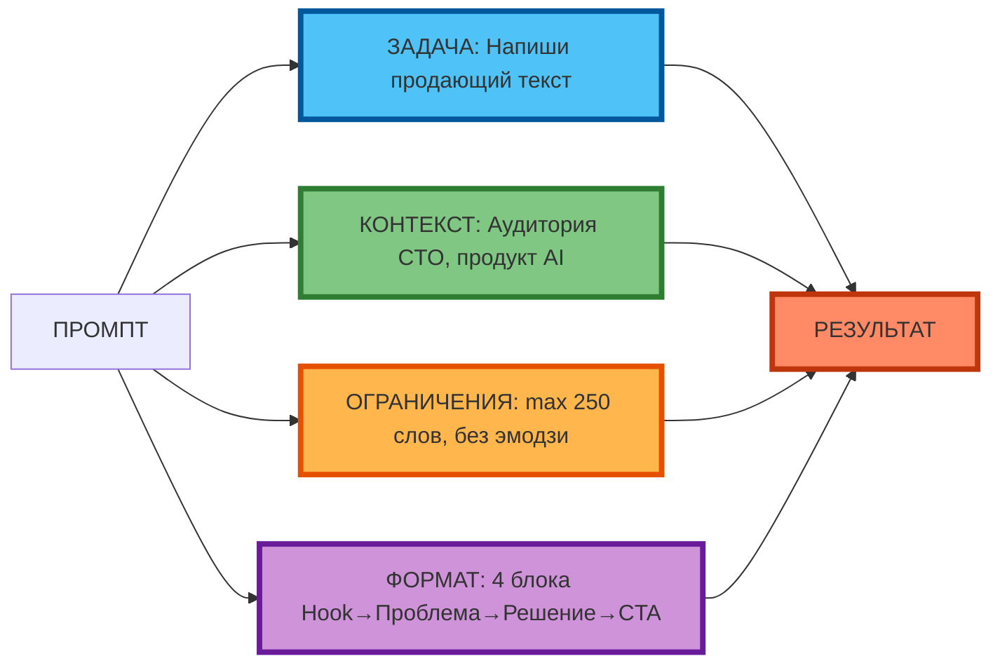

# Mermaid-схема (распределение узлов по 2-3 рядам, полный текст, компактная 1:1)

## Схема: 2 ряда (Промпт сверху, 4 компонента в ряд, Результат снизу)

**Характеристики:**
- **2 ряда**: Промпт сверху, 4 компонента в ряд, Результат снизу
- **Текст полный** (как в статье)
- **Компактная 1:1** — не растягивается по горизонтали
- **Цвета** по вашему коду
- **Рамки 4px**

---

## Схема: 3 ряда (Промпт сверху, 2 компонента в ряд, 2 компонента в ряд, Результат снизу)

**Характеристики:**
- **3 ряда**: Промпт сверху, 2 компонента в ряд, 2 компонента в ряд, Результат снизу
- **Текст полный**
- **Компактная 1:1**
- **Цвета** и **рамки 4px**

---

## Схема: 3 ряда с огибающими связями (Промпт слева, 4 компонента в 2 ряда, Результат справа)

**Характеристики:**
- **3 ряда**: Промпт слева, 4 компонента в 2 ряда (2+2), Результат справа
- **Текст полный**
- **Компактная 1:1** (горизонтальная компоновка `graph LR`)
- **Цвета** и **рамки 4px**
- **Связи огибают** и приходят к нужным блокам

---

## Рекомендация

**Лучший вариант для статьи 5:** **Схема 3 ряда с огибающими связями** (`graph LR`):

- Промпт слева
- 4 компонента в 2 ряда (2+2)
- Результат справа
- Текст полный
- Компактная 1:1
- Цвета и рамки 4px

Это соответствует вашему требованию: «распределял правильно узлы пусть в 2 3 ряда просто связи огибали и приходили к нужному блоку».