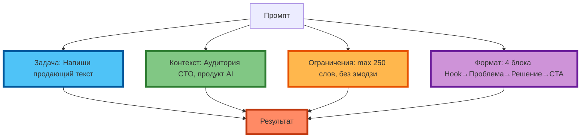

# Структура промптов в деталях: как каждый компонент влияет на результат

## Визуальное выделение компонентов

Чтобы понять, как структура промпта влияет на результат, разберём реальный промпт с **визуальным выделением компонентов**. Каждый компонент выделен цветом в схеме ниже.



**Рис. 1.** Визуальное выделение 4 компонентов промпта цветом: синий = задача, зелёный = контекст, оранжевый = ограничения, фиолетовый = формат.

**Пример 1. Продающий текст для лендинга**

```
Ты — копирайтер с 10-летним опытом в B2B SaaS.
Напиши продающий текст для лендинга продукта X.
Целевая аудитория: CTO и Head of Engineering в компаниях 50–200 сотрудников.
Продукт: AI-платформа для автоматизации code review, снижает время review на 40%.
Ограничения: максимум 250 слов, без эмодзи, без хэштегов, без ссылок.
Формат: 4 блока: Hook (1 предложение) → Проблема (2–3 предложения) → Решение (3–4 предложения) → CTA (1 предложение).
```

**Разбор по компонентам:**

| Компонент | Текст | Влияние на результат |
|-----------|-------|----------------------|
| **Задача** (синий) | «Напиши продающий текст для лендинга продукта X» | Определяет тип контента (продающий, не информационный) |
| **Контекст** (зелёный) | «Ты — копирайтер…» + «Целевая аудитория…» + «Продукт: AI-платформа…» | Задаёт tone of voice, уровень детализации, акценты |
| **Ограничения** (оранжевый) | «Максимум 250 слов, без эмодзи…» | Фильтрует «воду», запрещает нежелательные элементы |
| **Формат** (фиолетовый) | «4 блока: Hook → Проблема → Решение → CTA» | Задаёт структуру, которую модель воспроизводит |

**Результат:** модель выдаёт текст ровно 4 блоками, с акцентом на снижение времени review (из контекста), без эмодзи и ссылок, в пределах 250 слов.

---

## Как каждый компонент влияет на результат

### Задача: определяет «тип» результата

Задача — это «команда» модели. Она определяет, **что** делать, но не **как** упаковать результат.

**Пример влияния:**

| Задача | Результат (без других компонентов) |
|--------|------------------------------------|
| «Напиши про кофе» | Общий текст 100–200 слов, без структуры |
| «Напиши продающий текст» | Текст с акцентом на benefits, но без конкретной структуры |
| «Напиши продающий текст 150–200 слов» | Текст заданной длины, но без структуры |

**Экспертный совет:** задача должна быть атомарная. Если вы хотите «написать пост + сделать визуал + написать caption», разбейте на 3 промпты.

### Контекст: определяет «глубину» и «акценты»

Контекст — это «знания» модели о ситуации. Он определяет, **на чём акцентировать** внимание.

**Пример влияния:**

| Контекст | Результат (при одинаковой задаче) |
|----------|-----------------------------------|
| Отсутствует | Общие советы про кофе |
| «Кофейня для IT-специалистов, 25–35 лет» | Акцент на «кодинг до утра», «фокус», «энергия» |
| «Кофейня для родителей с детьми, 30–40 лет» | Акцент на «детское меню», «игровая зона», «спокойная атмосфера» |

**Экспертный совет:** контекст должен быть релевантным. Если вы пишете промпт для генерации идей постов, не нужно указывать финансовые показатели — это «шум».

### Ограничения: определяют «фильтры»

Ограничения — это «красные линии». Они убирают нежелательные паттерны из распределения.

**Пример влияния:**

| Ограничения | Результат (при одинаковой задаче + контексте) |
|-------------|-----------------------------------------------|
| Отсутствуют | Текст с эмодзи, хэштегами, ссылками |
| «Без эмодзи, без хэштегов» | Текст без эмодзи и хэштегов, но с «водой» |
| «Максимум 100 слов, без эмодзи, без хэштегов» | Текст 100 слов, без эмодзи и хэштегов, без «воды» |

**Экспертный совет:** если модель игнорирует ограничения — продублируйте их в конце промпта (последние 20% «весомее»).

### Формат: определяет «упаковку»

Формат — это «контейнер». Он определяет, **как** упаковать результат.

**Пример влияния:**

| Формат | Результат (при одинаковой задаче + контексте + ограничениях) |
|--------|-------------------------------------------------------------|
| Отсутствует | Сплошной текст 150–200 слов |
| «3 абзаца» | 3 абзаца, но без заголовков |
| «4 блока: Hook → Проблема → Решение → CTA» | 4 блока с заголовками, чёткой структурой |

**Экспертный совет:** для сложных форматов (JSON, YAML, XML) приведите пример структуры в промпте. Для простых (список, таблица) достаточно указать название.

---

## Типичные ошибки при составлении структуры

### Ошибка 1. Слишком общая задача

**Пример:**
```
"Напиши про кофе."
```

**Проблема:** модель не знает, что именно писать (продающий текст? информационная статья? рецепт?).

**Исправление:**
```
"Напиши продающий текст для лендинга кофейни (150–200 слов)."
```

---

### Ошибка 2. Контекст без цели

**Пример:**
```
"Компания X существует 5 лет, у неё 50 сотрудников, продукт — SaaS для HR."
```

**Проблема:** модель не знает, **зачем** ей эти факты. Она не понимает, что акцентировать.

**Исправление:**
```
"Компания X существует 5 лет, у неё 50 сотрудников, продукт — SaaS для HR. Цель: написать pitch deck для инвесторов."
```

---

### Ошибка 3. Ограничения без конкретности

**Пример:**
```
"Не пиши длинно."
```

**Проблема:** «длинно» — субъективно. Модель не знает, что значит «длинно» (100 слов? 500 слов?).

**Исправление:**
```
"Максимум 100 слов."
```

---

### Ошибка 4. Формат без примера

**Пример:**
```
"Ответь в формате JSON."
```

**Проблема:** модель не знает, какие поля должен содержать JSON.

**Исправление:**
```
"Ответь в формате JSON: {title: string, description: string, keywords: string[]}."
```

---

### Ошибка 5. Противоречивые компоненты

**Пример:**
```
"Напиши продающий текст (задача). Максимум 50 слов (ограничения). Сделай подробный обзор продукта (задача)."
```

**Проблема:** «подробный обзор» противоречит «максимум 50 слов».

**Исправление:**
```
"Напиши продающий текст (150–200 слов). Акцент на 3 ключевых преимущества."
```

---

### Ошибка 6. Перегрузка контекстом

**Пример:**
```
"Компания X существует 5 лет, у неё 50 сотрудников, продукт — SaaS для HR, рынок — Россия и СНГ, CAC = 5000 руб, LTV = 15000 руб, churn = 5%, NPS = 45, команда = 12 человек, офис в Москве..."
```

**Проблема:** модель «теряет» релевантную информацию в «шуме».

**Исправление:**
```
"Компания X: SaaS для HR, CAC = 5000 руб, LTV = 15000 руб. Цель: написать pitch deck для инвесторов."
```

---

## Практическое задание

**Цель:** научиться выявлять ошибки в структуре промптов и исправлять их.

**Задание:**
1. Возьмите 3 готовых промпта (ваши собственные или из открытых источников).
2. Для каждого промпта:
   - Разберите по 4 компонентам (задача, контекст, ограничения, формат)
   - Выявите ошибки (используйте список выше)
   - Перепишите промпт с исправлениями
3. Протестируйте оригинал и исправленную версию в одной модели.
4. Сравните результаты по критериям:
   - Соответствие ожиданию
   - Структурированность
   - Отсутствие «воды»
   - Точность

**Пример:**

```
Оригинал: "Напиши пост про кофе для Instagram. Сделай его интересным. Добавь эмодзи."

Разбор:
- Задача: написать пост (слабая — не указана цель, длина, акценты)
- Контекст: отсутствует (какая кофейня? какая аудитория?)
- Ограничения: отсутствуют (кроме «добавь эмодзи» — это не ограничение)
- Формат: отсутствует

Ошибки: 1 (слишком общая задача), 2 (контекст без цели), 3 (ограничения без конкретности)

Исправленный промпт:
"Ты — SMM-менеджер кофейни 'Чёрный кот' (специалитет: авторские бленды, минимализм).
Целевая аудитория: IT-специалисты 25–35 лет.
Напиши пост для Instagram (100–120 слов), акцент на 'кодинг до утра' и 'фокус'.
Ограничения: без хэштегов, без ссылок, без призыва 'подписывайся'.
Формат: Hook (1 предложение) → Benefit (2–3 предложения) → CTA (1 предложение)."
```

**Критерии проверки:**
- 3 промпта разобраны по 4 компонентам
- Выявлены ошибки (минимум 1 на промпт)
- Промпты переписаны с исправлениями
- Результаты оригинала и исправленной версии сравнены

---

## Чек-лист: расширенный шаблон структуры промпта

| Компонент | Вопрос для проверки | 🟢 Обязательно | 🟡 Рекомендуется | 🔴 Опционально |
|-----------|---------------------|----------------|------------------|----------------|
| **Задача** | Конкретная операция указана? | ✓ | | |
| **Задача** | Атомарная (одна операция)? | ✓ | | |
| **Задача** | Измеримая (можно проверить)? | ✓ | | |
| **Контекст** | Аудитория указана? | | ✓ | |
| **Контекст** | Ситуация/продукт описаны? | | ✓ | |
| **Контекст** | Цель указана? | | ✓ | |
| **Контекст** | Нет «шума» (нерелевантных фактов)? | ✓ | | |
| **Ограничения** | Лексические запреты указаны? | | ✓ | |
| **Ограничения** | Лимиты (слова, строки) указаны? | | ✓ | |
| **Ограничения** | Нет противоречий с задачей? | ✓ | | |
| **Формат** | Структура ответа указана? | ✓ | | |
| **Формат** | Пример структуры (для сложных форматов)? | | ✓ | |
| **Формат** | Нет противоречий с ограничениями? | ✓ | | |

**Экспертный совет:** при переписывании промпта начинайте с задачи. Если задача атомарная и измеримая — добавьте формат. Если результат «общий» — добавьте контекст. Если результат содержит нежелательные элементы — добавьте ограничения.

---

## Заключение

Структура промпта — это не «теория», а диагностический инструмент. Каждый компонент управляет отдельным аспектом результата. Понимание, какой компонент «слабый», позволяет быстро выявить и исправить ошибки.

В следующей статье вы разберёте технику «5W1H» — 6 вопросов, которые помогут сформулировать задачу максимально чётко и избежать двусмысленности.