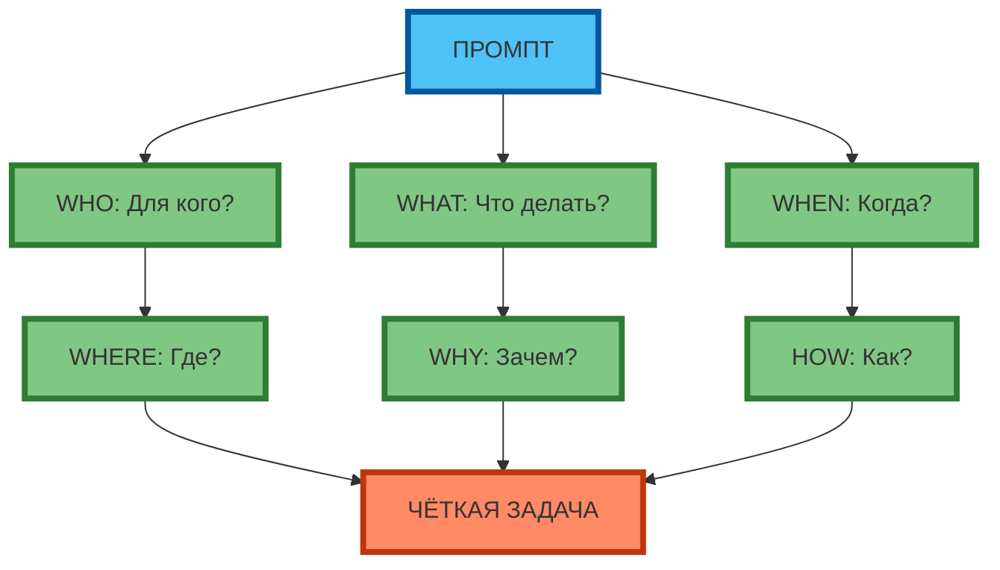
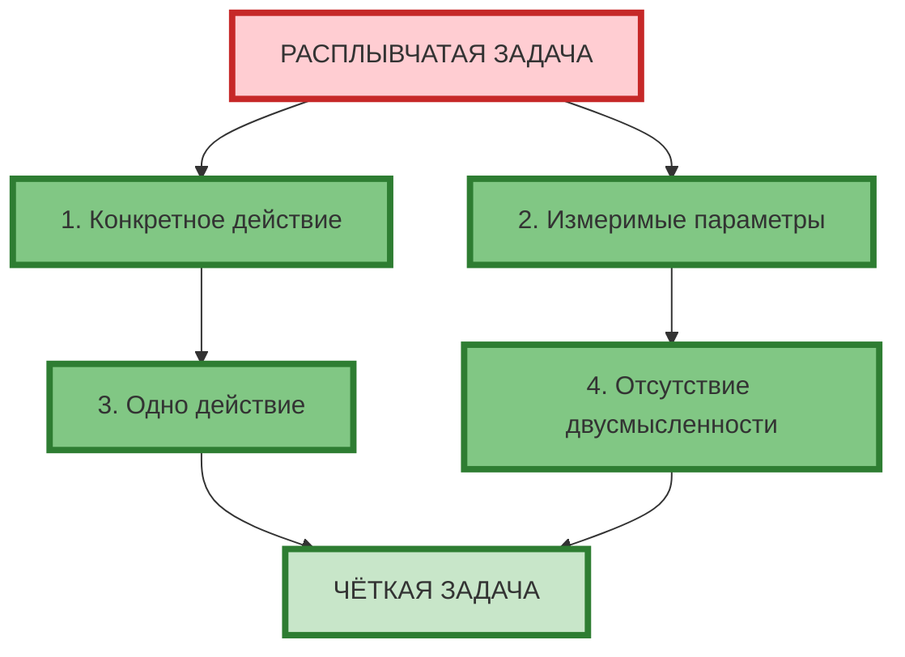
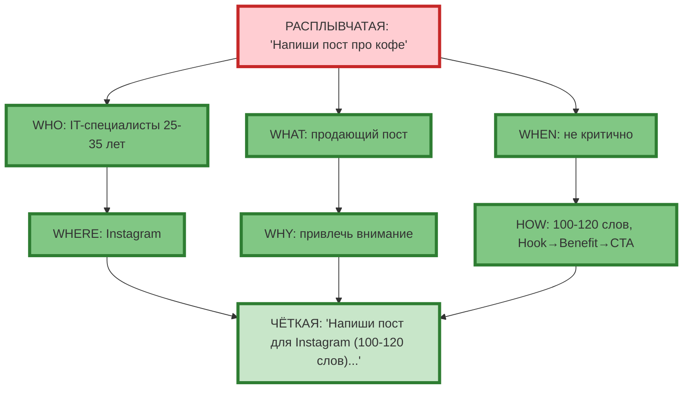

# Mermaid-схема для статьи 6: Чёткая формулировка задачи (распределение по 2-3 рядам)

## Схема 1: Техника 5W1H (3 ряда: Промпт сверху, 3 вопроса в ряд, 3 вопроса в ряд, Результат снизу)

**Рис. 1.** Техника 5W1H: 6 вопросов в 2 ряда (3+3), Результат снизу.

---

## Схема 2: Правила конкретности (3 ряда: Расплывчатая сверху, 2 правила в ряд, 2 правила в ряд, Чёткая снизу)

**Рис. 2.** 4 правила конкретности: 2 ряда (2+2), Результат снизу.

---

## Схема 3: Пример применения 5W1H (3 ряда: Расплывчатая сверху, 3 вопроса в ряд, 3 вопроса в ряд, Чёткая снизу)

**Рис. 3.** Пример: 2 ряда (3+3), Результат снизу.