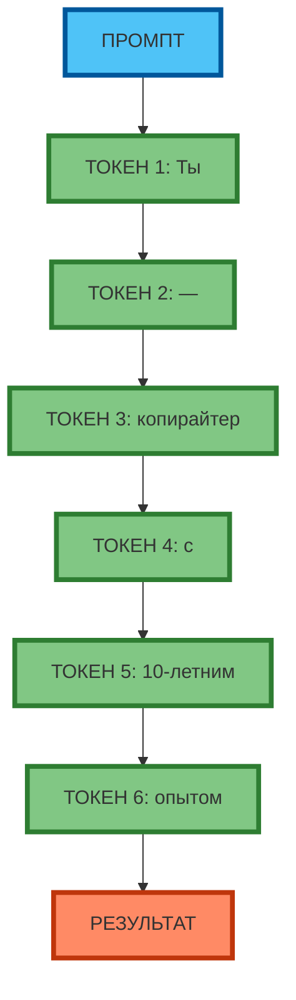
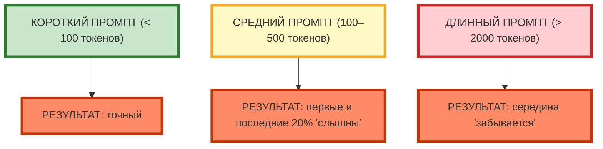
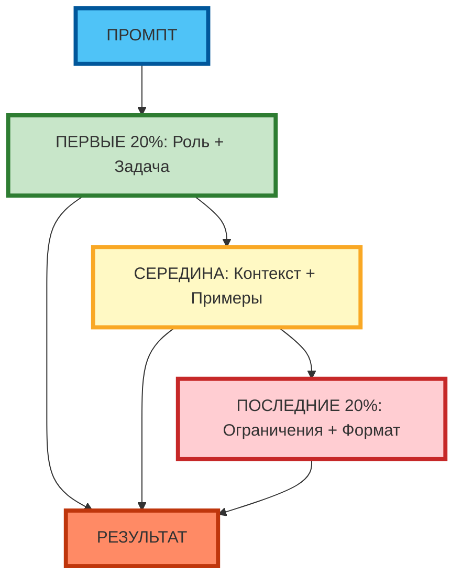
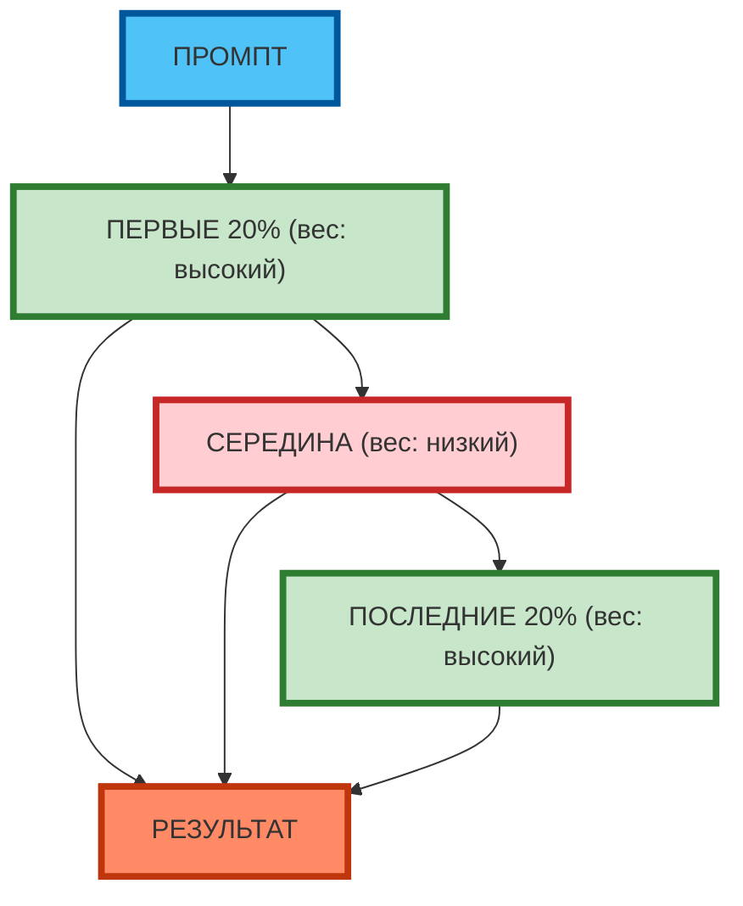

# Как нейросеть «читает» промпт: токены, порядок, длина

## Токенизация: как нейросеть разбивает текст

**Токенизация** — это разбиение текста на минимальные единицы (токены), которые модель «знает». Токен может быть словом, частью слова или символом. Модель не видит «слова» — она видит набор токенов и по ним предсказывает следующий.

**Пример токенизации:**

| Исходный текст | Токены (примерно) |
|----------------|-------------------|
| `промпт-инженерия` | `промпт`, `-`, `инженерия` |
| `нейросеть` | `нейро`, `сеть` |
| `ChatGPT` | `Chat`, `G`, `PT` |

**Современные данные (2026):** один токен ≈ 4 символа английского текста или 1–2 символа русского. Промпт из 100 слов ≈ 130–150 токенов.

**Влияние на результат:**
- Длинный промпт (> 2000 токенов) «размывает» внимание модели — она «забывает» середину
- Редкие слова дробятся на большее количество токенов → меньше «внимания» на каждом
- Порядок токенов влияет на то, какие паттерны активируются

**Рис. 1.** Токенизация: промпт разбивается на токены, модель «читает» их последовательно.

---

## Влияние длины промпта

**Длина промпта** влияет на «внимание» модели. Чем длиннее промпт, тем больше токенов, тем сильнее «размывается» внимание. Модель «помнит» первые и последние токены лучше, чем середину.

**Пример влияния длины:**

| Длина промпта | Результат |
|---------------|-----------|
| Короткий (< 100 токенов) | Модель «слышит» все токены, результат точный |
| Средний (100–500 токенов) | Модель «слышит» первые и последние 20%, середина «размывается» |
| Длинный (> 2000 токенов) | Модель «забывает» середину, результат непредсказуемый |

**Экспертный совет:** для точных задач (аналитика, код, отчёты) используйте промпты < 500 токенов. Для креативных задач (генерация идей) можно использовать более длинные промпты (500–1500 токенов).

**Рис. 2.** Влияние длины промпта на результат: короткий → точный, средний → частично «размытый», длинный → непредсказуемый.

---

## Порядок слов и предложений

**Порядок слов** влияет на то, какие паттерны активируются. Модель «читает» токены слева направо (для большинства языков), поэтому первые токены «задают направление», а последние — «фильтруют» результат.

**Пример влияния порядка:**

| Порядок | Результат |
|---------|-----------|
| Роль в начале, ограничения в конце | Модель «знает» роль с начала, «фильтрует» результат в конце |
| Ограничения в начале, роль в конце | Модель «фильтрует» до того, как «знает» роль → результат «размытый» |
| Ключевые инструкции повторяются в начале и конце | Модель «слышит» их дважды → результат точнее |

**Экспертный совет:** ключевые инструкции (роль, задача, формат) размещайте в **первых 20%** и **последних 20%** промпта. Середина — для контекста и примеров.

**Рис. 3.** Порядок слов: первые 20% и последние 20% «весомее», чем середина.

---

## Почему «первые» и «последние» токены важнее

**«Вес» токенов** — это то, насколько сильно токен влияет на результат. Первые и последние токены имеют больший «вес», чем токены в середине.

**Причина:**
- Модель «читает» токены слева направо
- Первые токены «задают направление» (роль, задача)
- Последние токены «фильтруют» результат (ограничения, формат)
- Середина «размывается» в длинных промптах

**Экспертный совет:** если нужно «усилить» инструкцию — продублируйте её в начале и конце промпта. Это повышает её «вес» в 2 раза.

**Рис. 4.** «Вес» токенов: первые и последние 20% имеют высокий вес, середина — низкий.

---

## Практическое задание

**Цель:** эмпирически убедиться, что длина и порядок слов влияют на результат.

**Задание:**
1. Составьте один промпт (например: «Напиши продающий текст для лендинга продукта X»).
2. Запустите промпт в 3 вариантах:
   - **Вариант A (короткий):** промпт < 100 токенов
   - **Вариант B (средний):** промпт 100–500 токенов
   - **Вариант C (длинный):** промпт > 2000 токенов
3. Сравните результаты по критериям:
   - Длина ответа (слов)
   - Конкретность (есть ли цифры, факты)
   - Структурированность (есть ли заголовки, списки)
   - Соответствие формату (если указан)
4. Запустите промпт в 2 вариантах порядка:
   - **Вариант D:** роль в начале, ограничения в конце
   - **Вариант E:** ограничения в начале, роль в конце
5. Сравните результаты D и E.

**Что записать:**
- Какая длина промпта дала самый «точный» результат?
- Какая длина промпта дала самый «размытый» результат?
- Какой порядок слов дал более точный результат?
- Какой фактор (длина или порядок) повлиял сильнее?

**Вывод для практики:** в следующих статьях вы научитесь писать промпты, которые «работают» независимо от длины и порядка — за счёт чёткой структуры и повторения ключевых инструкций.

---

## Чек-лист: 5 наблюдений о том, как нейросеть читает промпт

| Наблюдение | Что это значит | 🟢 Обязательно проверить | 🟡 Рекомендуется | 🔴 Опционально |
|------------|----------------|--------------------------|------------------|----------------|
| **1. Первые 20% «задают направление»** | Роль и задача в начале → модель «знает», что делать | ✓ | | |
| **2. Последние 20% «фильтруют» результат** | Ограничения и формат в конце → модель «знает», чего избегать | ✓ | | |
| **3. Середина «размывается» в длинных промптах** | Контекст и примеры в середине → модель может «забыть» | | ✓ | |
| **4. Повторение инструкций повышает «вес»** | Ключевые инструкции в начале и конце → модель «слышит» дважды | | ✓ | |
| **5. Длина > 2000 токенов → непредсказуемый результат** | Длинные промпты «размывают» внимание | ✓ | | |

**Экспертный совет:** для production-задач (отчёты, код, аналитика) используйте промпты < 500 токенов с ключевыми инструкциями в начале и конце. Для креатива (генерация идей) можно использовать промпты 500–1500 токенов.

---

## Заключение

Нейросеть «читает» промпт не как человек — она разбивает текст на токены и предсказывает следующий токен за следующим. Первые и последние токены имеют больший «вес», чем середина. Понимание этого принципа позволяет писать промпты, которые «работают» независимо от длины и порядка слов.

В следующей статье вы разберёте типичные ошибки новичков и научитесь их исправлять: слишком общие запросы, отсутствие контекста, противоречивые инструкции, перегрузка промпта.