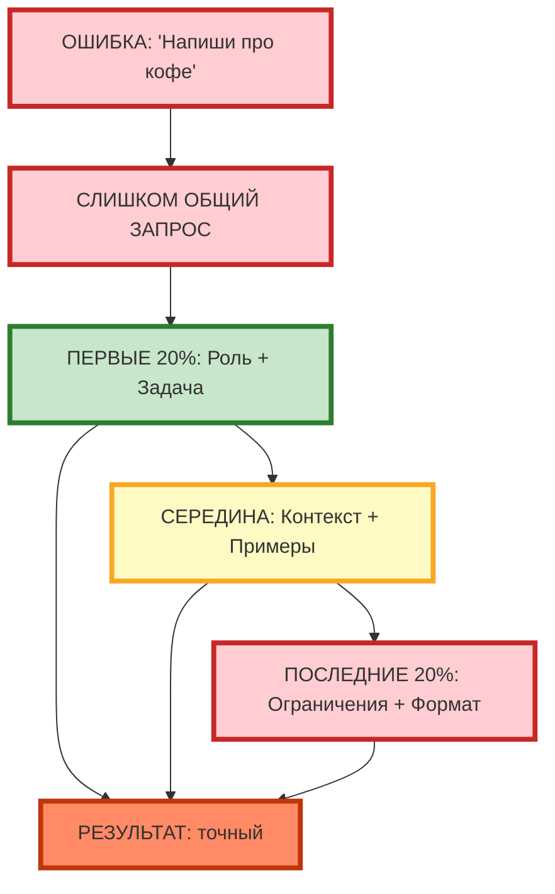
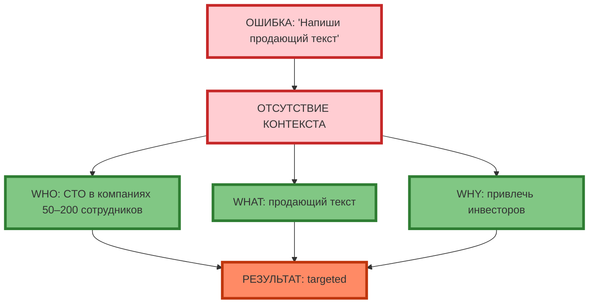
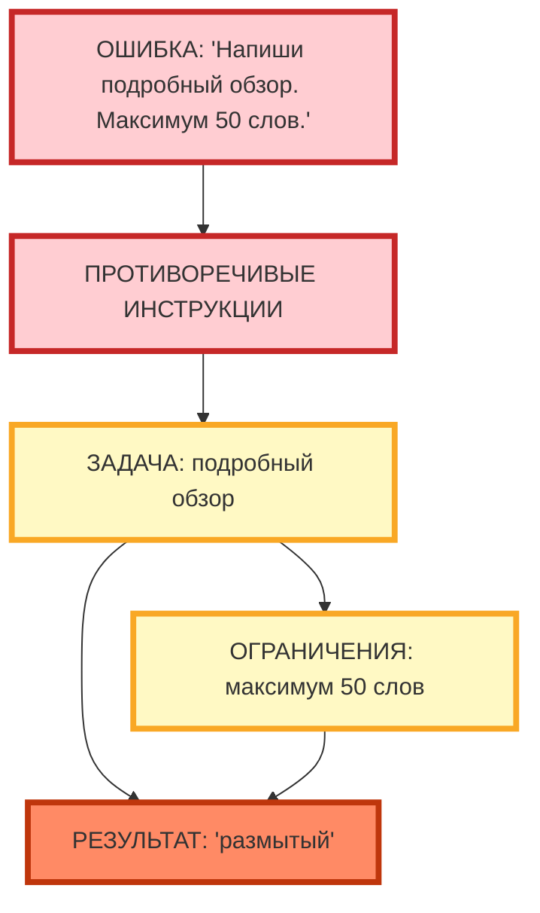
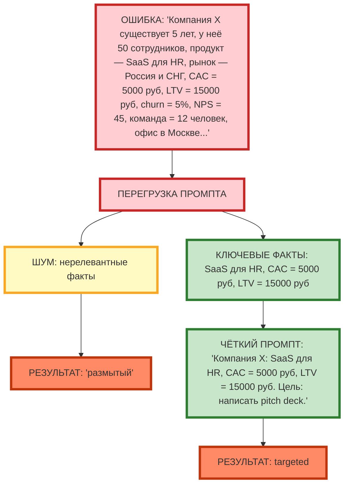

# Типичные ошибки новичков и как их исправить

## Слишком общие запросы

**Слишком общий запрос** — это задача без конкретного действия, измеримых параметров и структуры. Модель «выберет» наиболее вероятный паттерн, который может не совпадать с вашим намерением.

**Пример:**

| Ошибка | Пример | Исправление |
|--------|--------|-------------|
| Слишком общий запрос | «Напиши про кофе.» | «Напиши продающий текст для лендинга кофейни (150–200 слов), акцент на скорость доставки.» |
| Отсутствие измеримых параметров | «Сделай интересным.» | «Добавь 2 примера из реальной практики.» |
| Множественные действия | «Напиши пост + сделай визуал + напиши caption.» | «Напиши пост (100–120 слов).» (отдельный промпт для визуала) |



**Рис. 1.** Ошибка «Слишком общий запрос»: исправление через структуру (первые 20%, середина, последние 20%).

---

## Отсутствие контекста

**Отсутствие контекста** — это когда модель не знает, для кого и зачем нужен результат. Она даёт общие советы вместо targeted рекомендаций.

**Пример:**

| Ошибка | Пример | Исправление |
|--------|--------|-------------|
| Отсутствие аудитории | «Напиши продающий текст.» | «Напиши продающий текст для CTO в компаниях 50–200 сотрудников.» |
| Отсутствие цели | «Проанализируй продажи.» | «Проанализируй, почему продажи упали на 15% за квартал. Цель: снизить CAC на 25%.» |
| Отсутствие ситуации | «Предложи идеи.» | «Предложи 5 идей для Instagram-кофейни 'Чёрный кот' (IT-аудитория, 25–35 лет).» |



**Рис. 2.** Ошибка «Отсутствие контекста»: исправление через 5W1H (WHO, WHAT, WHY).

---

## Противоречивые инструкции

**Противоречивые инструкции** — это когда одна часть промпта противоречит другой. Модель «выберет» наиболее вероятный вариант, который может не совпадать с вашим намерением.

**Пример:**

| Ошибка | Пример | Исправление |
|--------|--------|-------------|
| Противоречие по длине | «Напиши подробный обзор (задача). Максимум 50 слов (ограничения).» | «Напиши продающий текст (150–200 слов). Акцент на 3 ключевых преимущества.» |
| Противоречие по тону | «Напиши официальный текст (задача). Добавь юмор (ограничения).» | «Напиши официальный текст (задача).» (отдельный промпт для юмористической версии) |
| Противоречие по формату | «Напиши текст (задача). Ответь в формате JSON (формат).» | «Напиши текст (задача). Формат: 3 абзаца.» (JSON для структурированных данных) |



**Рис. 3.** Ошибка «Противоречивые инструкции»: задача и ограничения противоречат друг другу.

---

## Перегрузка промпта

**Перегрузка промпта** — это когда промпт содержит слишком много информации, инструкций и примеров. Модель «теряет» релевантную информацию в «шуме».

**Пример:**

| Ошибка | Пример | Исправление |
|--------|--------|-------------|
| Перегрузка контекстом | «Компания X существует 5 лет, у неё 50 сотрудников, продукт — SaaS для HR, рынок — Россия и СНГ, CAC = 5000 руб, LTV = 15000 руб, churn = 5%, NPS = 45, команда = 12 человек, офис в Москве...» | «Компания X: SaaS для HR, CAC = 5000 руб, LTV = 15000 руб. Цель: написать pitch deck для инвесторов.» |
| Перегрузка примерами | «Пример 1: ... Пример 2: ... Пример 3: ... Пример 4: ... Пример 5: ...» | «Пример 1: ... Пример 2: ...» (2–3 примера достаточно) |
| Перегрузка инструкциями | «Напиши текст. Добавь заголовки. Добавь списки. Добавь таблицы. Добавь эмодзи. Добавь хэштеги. Добавь ссылки.» | «Напиши текст (150–200 слов). Формат: 3 абзаца.» (одна инструкция) |



**Рис. 4.** Ошибка «Перегрузка промпта»: шум (нерелевантные факты) vs ключевые факты.

---

## Практическое задание

**Цель:** научиться выявлять и исправлять типичные ошибки в промптах.

**Задание:**
1. Возьмите 5 готовых промптов (ваши собственные или из открытых источников).
2. Для каждого промпта:
   - Выявите ошибки (используйте чек-лист ниже)
   - Перепишите промпт с исправлениями
3. Протестируйте оригинал и исправленную версию в одной модели.
4. Сравните результаты по критериям:
   - Соответствие ожиданию
   - Конкретность
   - Отсутствие противоречий
   - Точность

**Пример:**

```
Оригинал: "Напиши пост про кофе для Instagram. Сделай его интересным. Добавь эмодзи. Добавь хэштеги. Добавь призыв к действию. Сделай его длинным. Добавь историю. Добавь рецепт. Добавь отзывы."

Ошибки:
1. Слишком общий запрос (что именно писать?)
2. Противоречивые инструкции (длинный + интересный + история + рецепт + отзывы)
3. Перегрузка инструкциями (эмодзи + хэштеги + призыв + история + рецепт + отзывы)
4. Отсутствие контекста (какая кофейня? какая аудитория?)

Исправленный промпт:
"Ты — SMM-менеджер кофейни 'Чёрный кот' (специалитет: авторские бленды, минимализм).
Целевая аудитория: IT-специалисты 25–35 лет.
Напиши пост для Instagram (100–120 слов), акцент на 'кодинг до утра' и 'фокус'.
Ограничения: без хэштегов, без ссылок, без призыва 'подписывайся'.
Формат: Hook (1 предложение) → Benefit (2–3 предложения) → CTA (1 предложение)."
```

**Критерии проверки:**
- 5 промптов разобраны и переписаны
- Каждый переписанный промпт не содержит ошибок из чек-листа
- Результаты оригинала и исправленной версии сравнены

---

## Чек-лист: 8 типичных ошибок и способы их исправления

| Ошибка | Признак | Способ исправления | 🟢 Обязательно | 🟡 Рекомендуется | 🔴 Опционально |
|--------|---------|-------------------|----------------|------------------|----------------|
| **1. Слишком общий запрос** | Отсутствие конкретного действия | Указать действие: «напиши», «составь», «разбей» | ✓ | | |
| **2. Отсутствие измеримых параметров** | Нет длины, количества, структуры | Указать: «150–200 слов», «3 тезиса», «таблица из 5 строк» | ✓ | | |
| **3. Отсутствие аудитории** | Не указано, для кого результат | Указать: «для CTO», «для junior-разработчиков», «для IT-специалистов 25–35 лет» | | ✓ | |
| **4. Отсутствие цели** | Не указано, зачем нужен результат | Указать: «цель: привлечь инвесторов», «цель: снизить CAC на 25%» | | ✓ | |
| **5. Противоречивые инструкции** | Одна часть противоречит другой | Убрать противоречие или разбить на отдельные промпты | ✓ | | |
| **6. Перегрузка контекстом** | Слишком много нерелевантных фактов | Оставить только релевантные факты (CAC, LTV, цель) | ✓ | | |
| **7. Перегрузка примерами** | Больше 3 примеров | Оставить 2–3 примера | | ✓ | |
| **8. Перегрузка инструкциями** | Больше 3 инструкций | Оставить 1–2 инструкции | ✓ | | |

**Экспертный совет:** при переписывании промпта начинайте с ошибок 1, 2, 5, 6 (общий запрос, измеримые параметры, противоречия, перегрузка контекстом). Добавляйте исправления ошибок 3, 4, 7, 8 (аудитория, цель, примеры, инструкции), если результат «общий» или «не в тему».

---

## Заключение

Типичные ошибки новичков — это не «мелочи», а фундаментальные проблемы, которые делают промпт неработающим. Понимание этих ошибок и способов их исправления позволяет быстро диагностировать и улучшать промпты.

В следующей статье вы разберёте фреймворк STAR (Situation, Task, Action, Result) — структурированный подход к формулировке задач, который помогает избежать большинства ошибок из этого чек-листа.