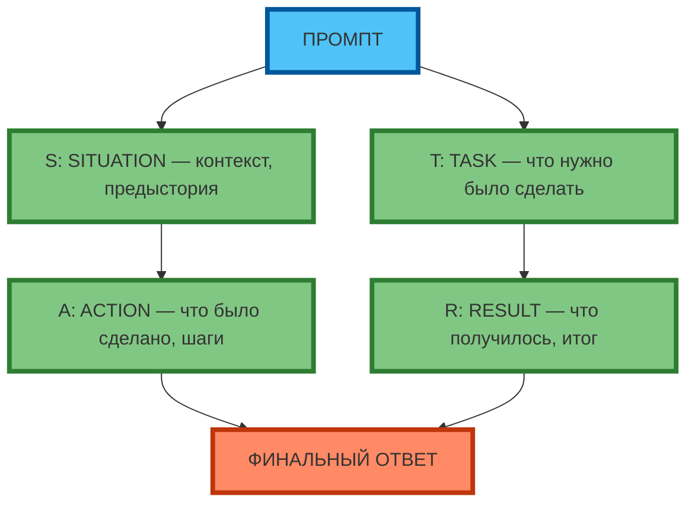
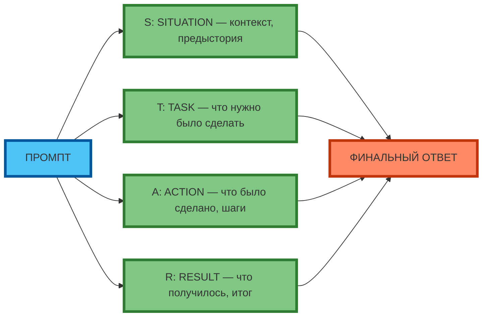

# Mermaid-схема для статьи 9: Фреймворк STAR (принцип 2+2 компонента в ряд)

## Схема 1: STAR (вертикальная, 2+2 компонента в ряд)

**Рис. 1.** Фреймворк STAR: вертикальная компоновка (2+2 компонента в ряд) — Промпт сверху, S и T в первом ряду, A и R во втором ряду, Финальный ответ снизу.

---

## Схема 2: STAR (горизонтальная, 2+2 компонента в ряд с огибающими связями)

**Рис. 2.** Фреймворк STAR: горизонтальная компоновка (2+2 компонента в ряд с огибающими связями) — Промпт слева, 4 компонента в 2 ряда (2+2), Финальный ответ справа.

---

## Схема 3: STAR (вертикальная, 3 ряда: Промпт сверху, 2 компонента в ряд, 2 компонента в ряд, Финальный ответ снизу)

**Рис. 3.** Фреймворк STAR: 3 ряда (Промпт сверху, 2 компонента в ряд, 2 компонента в ряд, Финальный ответ снизу) — текст полный, компактная 1:1.

---

## Принцип (зафиксирован)

- **Вертикальная** (`graph TD`): **2+2 компонента в ряд** (Промпт сверху, 2 компонента в ряд, 2 компонента в ряд, Результат снизу)
- **Горизонтальная** (`graph LR`): **2+2 компонента в ряд с огибающими связями** (Промпт слева, 4 компонента в 2 ряда, Результат справа)

В следующих статьях — **полный комплект** (текст + визуал) сразу в статье.