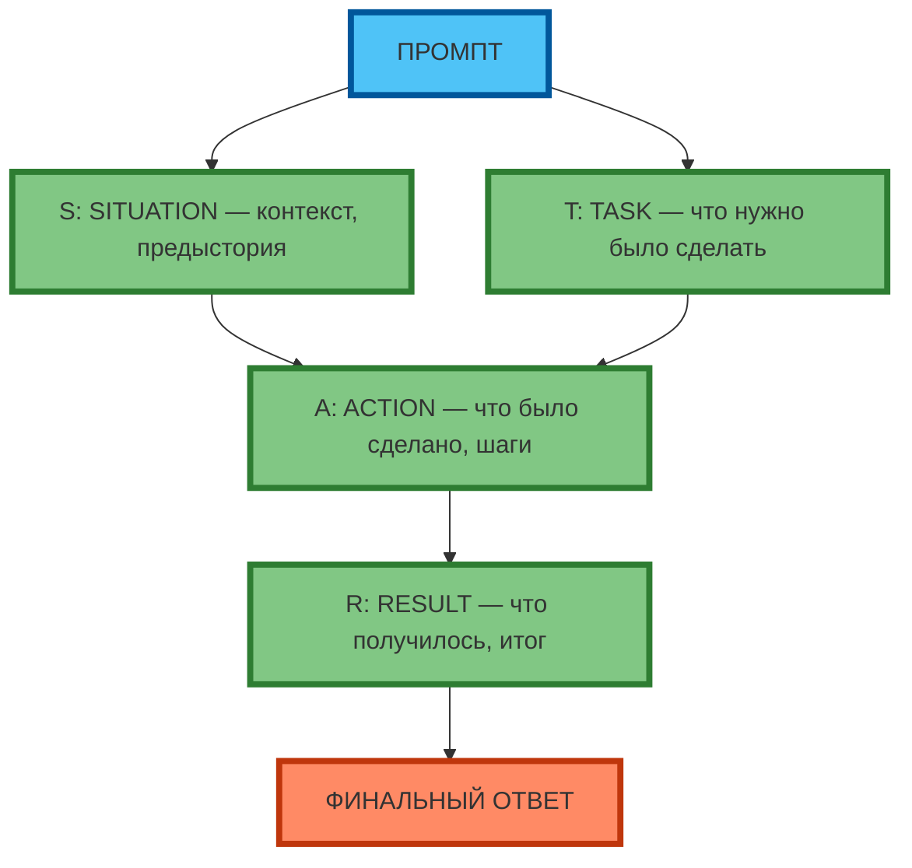

# Фреймворк STAR: Situation, Task, Action, Result

## Разбор каждого элемента

**STAR** — это структурированный фреймворк для описания событий и задач:

- **S**ituation (Ситуация) — контекст, предыстория, обстоятельства
- **T**ask (Задача) — что нужно было сделать, цель
- **A**ction (Действие) — что было сделано, шаги
- **R**esult (Результат) — что получилось, итог

**Экспертный инсайт:** STAR помогает модели «выстроить» логическую цепочку, а не генерировать «средний» ответ. Это особенно полезно для описания событий, достижений, кейсов.



**Рис. 1.** Фреймворк STAR: 4 элемента в цепочке (S → T → A → R → Финальный ответ).

---

## Когда применять STAR

**STAR** эффективен для:

| Ситуация | Пример задачи | Почему STAR |
|----------|---------------|-------------|
| Описание достижений | «Опиши свой вклад в проект» | Структура: контекст → цель → действия → результат |
| Кейсы и портфолио | «Опиши успешный проект» | Логическая цепочка: от проблемы к решению |
| Интервью и резюме | «Расскажи о сложной ситуации» | Чёткая структура: S → T → A → R |
| Анализ событий | «Что произошло и почему» | Причина (S) → цель (T) → действия (A) → итог (R) |

**Когда НЕ применять STAR:**
- Простые задачи (перевести текст, написать код)
- Креативные задачи (генерация идей, мозговой штурм)
- Структурированные данные (таблицы, JSON, списки)

---

## Примеры для описания событий и задач

### Пример 1. Описание достижения

**Промпт:**
```
Ты — senior-разработчик.
Опиши своё достижение в проекте X по STAR.
Situation: команда из 5 человек, дедлайн через 2 недели, сложная интеграция.
Task: интегрировать API стороннего сервиса.
Action: разбил задачу на 3 этапа, делегировал 2 этапа junior'у, лично провёл code review.
Result: интеграция выполнена за 10 дней, на 2 дня раньше дедлайна, без багов.
```

**Результат:**
```
Situation: В команде из 5 человек стояла задача интегрировать API стороннего сервиса за 2 недели.
Task: Нужно было выполнить сложную интеграцию без сбоев и в срок.
Action: Я разбил задачу на 3 этапа, делегировал 2 этапа junior-разработчику, лично провёл code review всех этапов.
Result: Интеграция была выполнена за 10 дней — на 2 дня раньше дедлайна, без единого бага в продакшене.
```

---

### Пример 2. Описание сложной ситуации

**Промпт:**
```
Ты — менеджер проекта.
Опиши сложную ситуацию по STAR.
Situation: клиент изменил требования за 3 дня до сдачи, бюджет не увеличен.
Task: выполнить новые требования без превышения бюджета и сроков.
Action: провёл переговоры с клиентом, перераспределил задачи в команде, ввёл daily-стендапы.
Result: проект сдан в срок, клиент доволен, команда не выгорела.
```

**Результат:**
```
Situation: За 3 дня до сдачи клиент изменил требования, но бюджет остался прежним.
Task: Нужно было выполнить новые требования без превышения бюджета и сроков.
Action: Я провёл переговоры с клиентом, перераспределил задачи в команде, ввёл daily-стендапы для контроля прогресса.
Result: Проект был сдан в срок, клиент остался доволен, а команда не выгорела благодаря чёткому планированию.
```

---

### Пример 3. Описание рабочего дня (практическое задание)

**Промпт:**
```
Ты — аналитик данных.
Опиши свой рабочий день по STAR.
Situation: понедельник, 10 задач в backlog, 2 срочные.
Task: закрыть 2 срочные задачи и 3 обычные до конца дня.
Action: расставил приоритеты, делегировал 1 задачу коллеге, работал в Pomodoro (25/5).
Result: закрыл 5 задач, 2 срочные выполнены в срок, backlog сократился на 20%.
```

**Результат:**
```
Situation: В понедельник в backlog было 10 задач, из них 2 — срочные.
Task: Нужно было закрыть 2 срочные задачи и 3 обычные до конца дня.
Action: Я расставил приоритеты, делегировал 1 задачу коллеге, работал в Pomodoro (25 минут фокус / 5 минут перерыв).
Result: К концу дня я закрыл 5 задач, 2 срочные были выполнены в срок, а backlog сократился на 20%.
```

---

## Практическое задание

**Цель:** научиться применять STAR для описания событий и задач.

**Задание:**
1. Возьмите задачу описания рабочего дня (или любого события/достижения).
2. Примените STAR:
   - **S**ituation: опишите контекст (когда, где, какие обстоятельства)
   - **T**ask: опишите задачу (что нужно было сделать, цель)
   - **A**ction: опишите действия (что было сделано, шаги, решения)
   - **R**esult: опишите результат (что получилось, итог, метрики)
3. Составьте промпт по STAR и протестируйте его в модели.
4. Сравните результат с «обычным» описанием (без STAR).

**Критерии проверки:**
- Промпт содержит all 4 элемента STAR (S, T, A, R)
- Результат структурирован и логичен
- Есть конкретные действия и измеримые результаты
- Описание занимает 150–250 слов (оптимально для STAR)

---

## Чек-лист: шаблон STAR-промпта

| Элемент | Вопрос для проверки | 🟢 Обязательно | 🟡 Рекомендуется | 🔴 Опционально |
|---------|---------------------|----------------|------------------|----------------|
| **S**ituation | Указан контекст (когда, где, какие обстоятельства)? | ✓ | | |
| **S**ituation | Указаны ограничения (время, бюджет, ресурсы)? | | ✓ | |
| **T**ask | Указана цель (что нужно было сделать)? | ✓ | | |
| **T**ask | Указана сложность (почему это было непросто)? | | ✓ | |
| **A**ction | Указаны конкретные шаги (что было сделано)? | ✓ | | |
| **A**ction | Указаны решения (почему именно так)? | | ✓ | |
| **R**esult | Указан итог (что получилось)? | ✓ | | |
| **R**esult | Указаны метрики (цифры, проценты, сравнение)? | | ✓ | |

**Экспертный совет:** для описания достижений используйте STAR с акцентом на **Action** (конкретные шаги) и **Result** (измеримые метрики). Для описания сложных ситуаций — с акцентом на **Situation** (контекст) и **Task** (цель).

---

## Заключение

STAR — это не просто «шаблон», а инструмент структурирования мышления. Он помогает модели «выстроить» логическую цепочку от контекста к результату. Применяйте STAR для описания событий, достижений, кейсов — и результат будет чётким, логичным и убедительным.

В следующей статье вы разберёте фреймворк RTF (Role, Task, Format) — упрощённую версию STAR для быстрых задач, и научитесь выбирать между STAR и RTF в зависимости от ситуации.