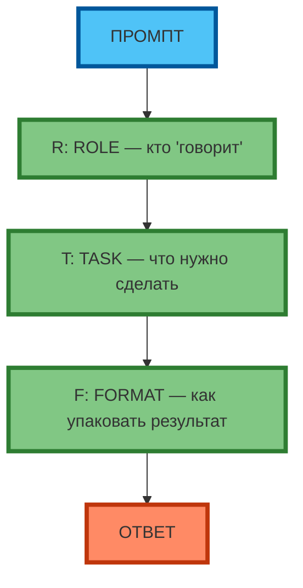
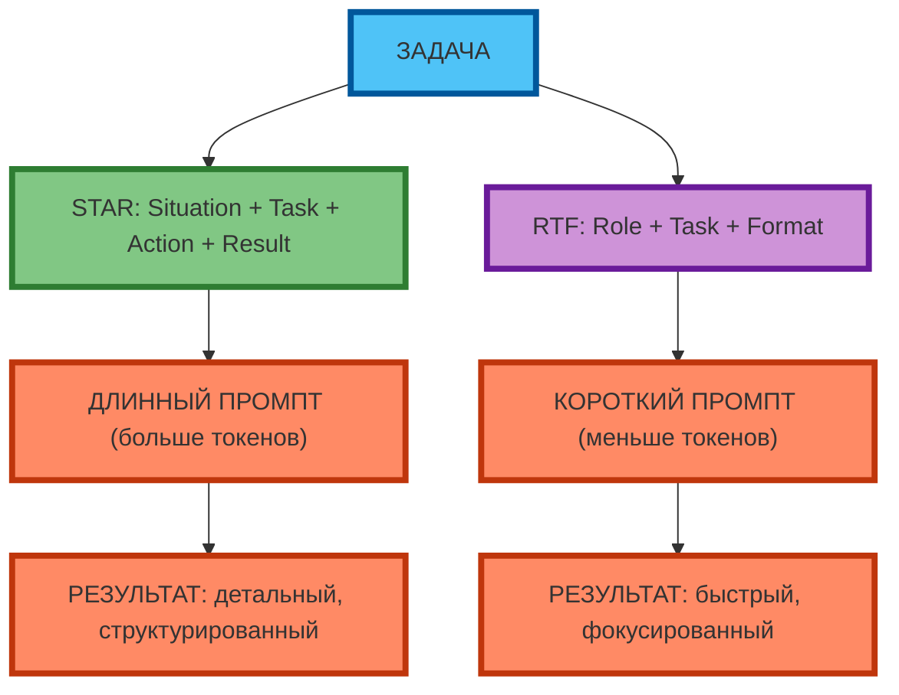

# Фреймворк RTF: Role, Task, Format — когда использовать

## Разбор каждого элемента

**RTF** — это упрощённый фреймворк для быстрых задач:

- **R**ole (Роль) — кто «говорит» (эксперт, копирайтер, аналитик)
- **T**ask (Задача) — что нужно сделать (конкретное действие)
- **F**ormat (Формат) — как упаковать результат (список, таблица, текст)

**Экспертный инсайт:** RTF — это «облегчённая» версия STAR для задач, где не нужен полный контекст (Situation) и детальный разбор действий (Action). RTF фокусируется на результате.



**Рис. 1.** Фреймворк RTF: 3 элемента в цепочке (R → T → F → Ответ).

---

## Когда RTF эффективнее STAR

**RTF** эффективнее STAR, когда:

| Ситуация | Пример | Почему RTF |
|----------|--------|------------|
| Быстрая задача | «Напиши пост для Instagram» | Не нужен полный контекст (S), достаточно роли (R), задачи (T), формата (F) |
| Креативная задача | «Придумай 5 идей» | STAR перегружает (S, A, R не нужны), RTF фокусируется на результате |
| Ограниченное время | «Сделай быстро» | RTF короче STAR, меньше токенов, быстрее ответ |
| Простая структура | «Напиши список» | Формат (F) важнее контекста (S) и действий (A) |

**Когда STAR эффективнее RTF:**
- Описание достижений и кейсов (нужен контекст S и действия A)
- Анализ сложных ситуаций (нужен полный разбор)
- Интервью и резюме (нужна логическая цепочка S → T → A → R)



**Рис. 2.** STAR vs RTF: STAR — длинный промпт (детальный результат), RTF — короткий промпт (быстрый результат).

---

## Ограничения фреймворка RTF

**RTF** имеет ограничения:

| Ограничение | Пример | Решение |
|-------------|--------|---------|
| Нет контекста (S) | «Напиши текст (R: копирайтер, T: текст, F: 3 абзаца).» | Модель не знает, для кого и зачем → результат «общий» | Добавьте контекст в Role («Ты — копирайтер для IT-аудитории») |
| Нет действий (A) | «Напиши пост (R: SMM, T: пост, F: 100 слов).» | Модель не знает, какие шаги привели к результату → нет «истории» | Используйте STAR для кейсов и достижений |
| Нет измеримых результатов (R) | «Напиши текст (R: копирайтер, T: текст, F: 3 абзаца).» | Модель не знает, какой результат ожидается → нет метрик | Добавьте Result в Format («3 абзаца, 150 слов, 2 примера») |

**Экспертный совет:** RTF — это «быстрый» фреймворк. Если результат «общий» или «не в тему» — добавьте контекст (S) или используйте STAR.

---

## Примеры RTF vs STAR

### Пример 1. Быстрая задача (RTF эффективнее)

**RTF:**
```
Роль: ты — SMM-менеджер кофейни 'Чёрный кот'.
Задача: напиши пост для Instagram.
Формат: 100–120 слов, Hook → Benefit → CTA.
```

**Результат:** быстрый, фокусированный пост.

**STAR (перегрузка):**
```
Situation: понедельник, нужно опубликовать пост.
Task: написать пост для Instagram.
Action: [не нужно для этой задачи].
Result: [не нужно для этой задачи].
```

**Результат:** STAR перегружает промпт ненужными элементами.

---

### Пример 2. Описание достижения (STAR эффективнее)

**STAR:**
```
Situation: команда из 5 человек, дедлайн через 2 недели.
Task: интегрировать API стороннего сервиса.
Action: разбил задачу на 3 этапа, делегировал 2 этапа junior'у, лично провёл code review.
Result: интеграция выполнена за 10 дней, на 2 дня раньше дедлайна, без багов.
```

**Результат:** детальный, структурированный ответ.

**RTF (недостаточно):**
```
Роль: ты — senior-разработчик.
Задача: опиши своё достижение.
Формат: текст 150–200 слов.
```

**Результат:** «общий» ответ без контекста и действий.

---

## Практическое задание

**Цель:** научиться сравнивать RTF и STAR на одной задаче.

**Задание:**
1. Выберите одну задачу (например: «Напиши пост для Instagram» или «Опиши своё достижение»).
2. Составьте 2 промпта:
   - **RTF:** Role + Task + Format
   - **STAR:** Situation + Task + Action + Result
3. Протестируйте оба промпта в одной модели.
4. Сравните результаты по критериям:
   - Длина ответа (слов)
   - Конкретность
   - Структурированность
   - Время генерации (если доступно)
   - Соответствие ожиданию

**Критерии проверки:**
- Оба промпта составлены корректно (RTF: 3 элемента, STAR: 4 элемента)
- Результаты сравнены по 5 критериям
- Сделан вывод: какой фреймворк эффективнее для данной задачи

---

## Чек-лист: 4 ситуации, когда использовать RTF

| Ситуация | Признак | Фреймворк | 🟢 Обязательно | 🟡 Рекомендуется | 🔴 Опционально |
|----------|---------|-----------|----------------|------------------|----------------|
| **1. Быстрая задача** | Нужно сделать быстро, не нужен контекст | RTF | ✓ | | |
| **2. Креативная задача** | Генерация идей, мозговой штурм | RTF | ✓ | | |
| **3. Простая структура** | Список, таблица, текст без «истории» | RTF | | ✓ | |
| **4. Ограниченное время** | Дедлайн, нужно быстро получить результат | RTF | ✓ | | |
| **5. Описание достижений** | Нужно описать контекст (S) и действия (A) | STAR | ✓ | | |
| **6. Анализ сложных ситуаций** | Нужно полный разбор (S → T → A → R) | STAR | ✓ | | |
| **7. Интервью и резюме** | Нужно логическая цепочка | STAR | | ✓ | |
| **8. Кейсы и портфолио** | Нужно «история» от проблемы к решению | STAR | ✓ | | |

**Экспертный совет:** начинайте с RTF. Если результат «общий» или «не в тему» — добавьте контекст (S) или используйте STAR. RTF — это «первый выбор» для быстрых задач.

---

## Заключение

RTF — это «облегчённая» версия STAR для быстрых задач. Он фокусируется на результате (Role + Task + Format), а не на контексте и действиях. Используйте RTF, когда нужно быстро получить результат, и STAR, когда нужен детальный разбор.

В следующей статье вы разберёте фреймворк CO-STAR (Context, Objective, Style, Tone, Audience, Role) — расширенную версию RTF для текстовых задач, и научитесь выбирать между RTF, STAR и CO-STAR в зависимости от ситуации.