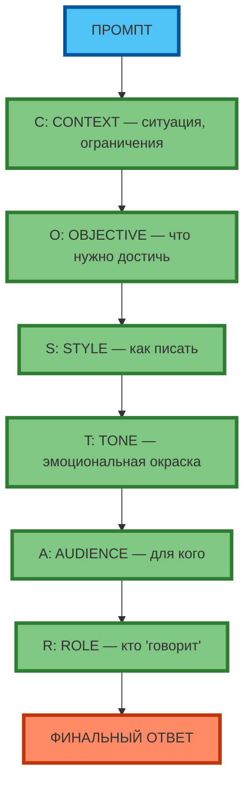
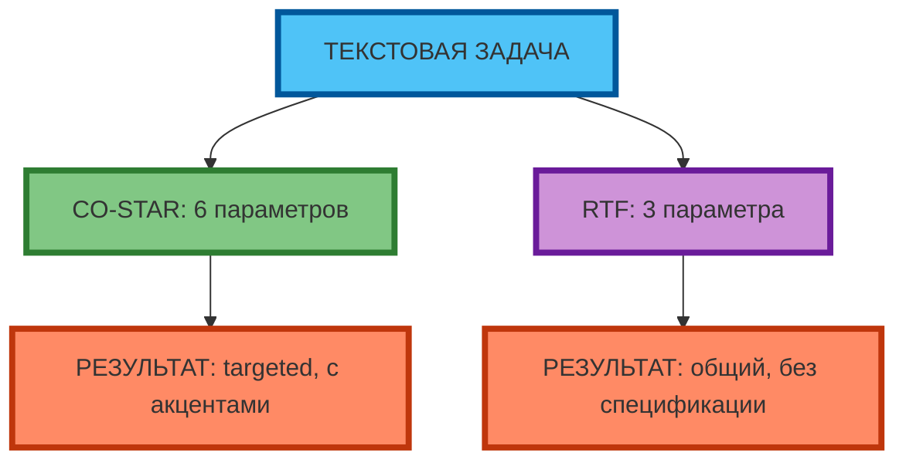

# Фреймворк CO-STAR: Context, Objective, Style, Tone, Audience, Role

## Разбор каждого элемента

**CO-STAR** — это расширенный фреймворк для текстовых задач:

- **C**ontext (Контекст) — ситуация, предыстория, ограничения
- **O**bjective (Цель) — что нужно достичь (конкретный результат)
- **S**tyle (Стиль) — как писать (формальный, разговорный, технический)
- **T**one (Тон) — эмоциональная окраска (нейтральный, persuasive, empathetic)
- **A**udience (Аудитория) — для кого (роль, уровень, контекст)
- **R**ole (Роль) — кто «говорит» (эксперт, копирайтер, аналитик)

**Экспертный инсайт:** CO-STAR — это «полная» версия RTF для текстовых задач. Он добавляет Context (S из STAR) и детализирует Tone/Style, которые в RTF объединены в Format. CO-STAR минимизирует «общий» результат за счёт явной спецификации всех параметров.



**Рис. 1.** Фреймворк CO-STAR: 6 элементов в цепочке (C → O → S → T → A → R → Финальный ответ).

---

## Применение для текстовых задач

**CO-STAR** эффективен для:

| Задача | Пример | Почему CO-STAR |
|--------|--------|----------------|
| Продающий текст | «Напиши текст для лендинга» | Context (продукт, рынок) + Objective (привлечь инвесторов) + Style/Tone (официальный, persuasive) + Audience (CTO) + Role (копирайтер) |
| Email-рассылка | «Напиши email клиентам» | Context (новый продукт) + Objective (увеличить retention) + Tone (empathetic) + Audience (существующие клиенты) |
| Пост в соцсети | «Напиши пост для LinkedIn» | Context (достижение команды) + Objective (повысить engagement) + Style (профессиональный) + Audience (B2B) |
| Статья/блог | «Напиши статью про X» | Context (тренд 2026) + Objective (позиционировать как эксперта) + Style (технический) + Audience (senior-разработчики) |

**Когда НЕ применять CO-STAR:**
- Простые задачи (перевести текст, написать код) — RTF достаточно
- Описание достижений (нужен Action из STAR)
- Анализ сложных ситуаций (нужен полный STAR)



**Рис. 2.** CO-STAR vs RTF: CO-STAR даёт targeted результат за счёт 6 параметров, RTF — общий результат за счёт 3 параметров.

---

## Пример: описание продукта

**Промпт (CO-STAR):**
```
Context: продукт X — AI-платформа для автоматизации code review, снижает время review на 40%, целевой рынок — IT-компании 50–200 сотрудников.
Objective: написать продающий текст для лендинга, привлечь внимание CTO.
Style: технический, с акцентом на ROI.
Tone: confident, не агрессивный.
Audience: CTO и Head of Engineering, 35–45 лет, ценят факты и метрики.
Role: ты — B2B-копирайтер с опытом в SaaS.
```

**Результат:**
```
Context: Продукт X — AI-платформа для автоматизации code review, которая снижает время review на 40%. Целевой рынок — IT-компании 50–200 сотрудников.
Objective: Написать продающий текст для лендинга, который привлечет внимание CTO.
Style: Технический, с акцентом на ROI (время, деньги, качество).
Tone: Уверенный, но не агрессивный — факты, а не обещания.
Audience: CTO и Head of Engineering, 35–45 лет, ценят факты и метрики.
Role: Ты — B2B-копирайтер с опытом в SaaS.

Текст:
Внедрение AI-платформы X сокращает время code review на 40% — с 4 часов до 2.4 часа на спринт. Для команды из 10 разработчиков это экономия 16 часов в неделю, или $8,000 в месяц при ставке $500/час. Платформа интегрируется с GitHub и GitLab за 2 дня, без изменения workflow. Результат: первые 30 дней — снижение CAC на 15% за счёт ускорения релизов.
```

---

## Практическое задание

**Цель:** научиться применять CO-STAR для описания продукта.

**Задание:**
1. Выберите продукт (реальный или вымышленный).
2. Составьте CO-STAR-промпт:
   - **Context:** ситуация, ограничения, рынок
   - **Objective:** цель (что нужно достичь)
   - **Style:** стиль (формальный, технический, разговорный)
   - **Tone:** тон (нейтральный, persuasive, empathetic)
   - **Audience:** аудитория (роль, уровень, контекст)
   - **Role:** роль (кто «говорит»)
3. Протестируйте промпт в модели.
4. Оцените результат по критериям:
   - Соответствие Objective
   - Соответствие Style и Tone
   - Адаптация под Audience
   - Конкретность (есть ли цифры, факты)

**Критерии проверки:**
- Промпт содержит all 6 элементов CO-STAR
- Результат соответствует Objective, Style, Tone, Audience
- Есть конкретные метрики и факты
- Текст 150–250 слов (оптимально для CO-STAR)

---

## Чек-лист: структура CO-STAR (6 полей)

| Поле | Вопрос для проверки | 🟢 Обязательно | 🟡 Рекомендуется | 🔴 Опционально |
|------|---------------------|----------------|------------------|----------------|
| **C**ontext | Указана ситуация (продукт, рынок, ограничения)? | ✓ | | |
| **C**ontext | Указаны релевантные факты (не «шум»)? | ✓ | | |
| **O**bjective | Указана цель (что нужно достичь)? | ✓ | | |
| **O**bjective | Указан измеримый результат (метрики)? | | ✓ | |
| **S**tyle | Указан стиль (формальный, технический, разговорный)? | ✓ | | |
| **T**one | Указан тон (нейтральный, persuasive, empathetic)? | ✓ | | |
| **A**udience | Указана аудитория (роль, уровень, контекст)? | ✓ | | |
| **R**ole | Указана роль (кто «говорит»)? | ✓ | | |
| **R**ole | Указан опыт/специализация (senior, B2B, SaaS)? | | ✓ | |

**Экспертный совет:** начинайте с 4 элементов (Context, Objective, Audience, Role). Добавляйте Style и Tone, если результат «не в тему» или «не попадает в аудиторию». CO-STAR — это «полная» версия RTF; используйте её, когда RTF даёт «общий» результат.

---

## Заключение

CO-STAR — это расширенный фреймворк для текстовых задач. Он добавляет Context (S из STAR) и детализирует Tone/Style, которые в RTF объединены в Format. CO-STAR минимизирует «общий» результат за счёт явной спецификации всех параметров. Используйте CO-STAR, когда RTF даёт «общий» результат, и RTF, когда нужна скорость.

В следующей статье вы разберёте метод Chain-of-Thought (пошаговое разбиение задачи) — технику, которая улучшает результат на логических задачах за счёт явного указания «подумай пошагово».