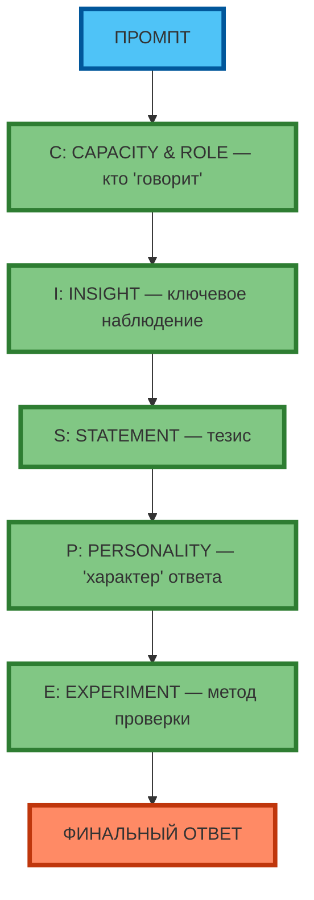
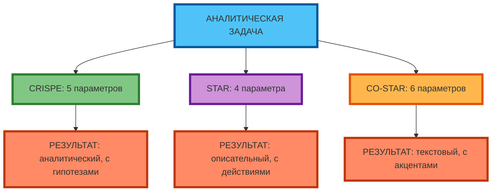

# Фреймворк CRISPE: Capacity & Role, Insight, Statement, Personality, Experiment

## Разбор каждого элемента

**CRISPE** — это фреймворк для анализа ситуаций и генерации идей:

- **C**apacity & **R**ole (Способность и Роль) — кто «говорит» и какие у него компетенции
- **I**nsight (Инсайт) — ключевое наблюдение, которое нужно учесть
- **S**tatement (Утверждение) — тезис, который нужно доказать или опровергнуть
- **P**ersonality (Личность) — «характер» ответа (скептик, оптимист, реалист)
- **E**xperiment (Эксперимент) — метод проверки или подход к решению

**Экспертный инсайт:** CRISPE — это «гибрид» STAR и CO-STAR для аналитических задач. Он добавляет Personality (Tone из CO-STAR) и Experiment (Action из STAR), но фокусируется на Insight (ключевом наблюдении) и Statement (тезисе). CRISPE минимизирует «поверхностный» анализ за счёт явного указания Personality и Experiment.



**Рис. 1.** Фреймворк CRISPE: 5 элементов в цепочке (C → I → S → P → E → Финальный ответ).

---

## Когда использовать CRISPE

**CRISPE** эффективен для:

| Задача | Пример | Почему CRISPE |
|--------|--------|---------------|
| Анализ ситуации | «Почему продажи упали?» | Insight (ключевые факты) + Statement (тезис) + Experiment (метод проверки) |
| Генерация гипотез | «Какие причины проблемы?» | Personality (скептик/оптимист) + Experiment (метод проверки) |
| Дебаты и обсуждения | «Спор: да/нет» | Personality (роль оппонента) + Statement (тезис) |
| Исследовательские задачи | «Что если...?» | Experiment (метод проверки) + Insight (ключевые наблюдения) |

**Когда НЕ применять CRISPE:**
- Простые задачи (перевести текст, написать код) — RTF достаточно
- Креативные задачи (генерация идей) — RTF или CO-STAR
- Описание достижений (нужен STAR)



**Рис. 2.** CRISPE vs STAR vs CO-STAR: CRISPE — аналитический результат с гипотезами, STAR — описательный с действиями, CO-STAR — текстовый с акцентами.

---

## Пример: анализ ситуации

**Промпт (CRISPE):**
```
Capacity & Role: ты — аналитик с 10-летним опытом в e-commerce, специализируешься на CAC/LTV.
Insight: CAC вырос на 40%, LTV упал на 10%, churn вырос на 5%.
Statement: «Рост CAC вызван неэффективностью маркетинга, а не изменением рынка.»
Personality: скептик — проверяй каждую гипотезу фактами.
Experiment: проверь 3 гипотезы: 1) изменение рынка, 2) неэффективность каналов, 3) внутренние процессы.
```

**Результат:**
```
Capacity & Role: Ты — аналитик с 10-летним опытом в e-commerce, специализируешься на CAC/LTV.
Insight: CAC вырос на 40% (с $50 до $70), LTV упал на 10% (с $150 до $135), churn вырос на 5% (с 5% до 10%).
Statement: «Рост CAC вызван неэффективностью маркетинга, а не изменением рынка.»
Personality: Скептик — проверяй каждую гипотезу фактами, не принимай на веру.
Experiment: Проверь 3 гипотезы: 1) изменение рынка (конкуренты, сезонность), 2) неэффективность каналов (CAC по каналам), 3) внутренние процессы (время отклика, качество лидов).

Гипотеза 1 (рынок): CAC по конкурентам вырос на 20%, по нам — на 40%. Вывод: не только рынок.
Гипотеза 2 (каналы): Google Ads CAC вырос на 60%, Facebook — на 20%. Вывод: неэффективность Google Ads.
Гипотеза 3 (процессы): Время отклика выросло с 2 до 8 часов. Вывод: потеря лидов из-за медленного отклика.

Итог: Рост CAC вызван комбинацией факторов: неэффективность Google Ads (+60%) и внутренние процессы (+30% от потери лидов). Рекомендация: перераспределить бюджет из Google Ads в Facebook, сократить время отклика до 2 часов.
```

---

## Практическое задание

**Цель:** научиться применять CRISPE для анализа ситуации.

**Задание:**
1. Выберите ситуацию для анализа (реальную или вымышленную).
2. Составьте CRISPE-промпт:
   - **Capacity & Role:** кто «говорит» и какие у него компетенции
   - **Insight:** ключевое наблюдение (факты, данные)
   - **Statement:** тезис, который нужно проверить
   - **Personality:** «характер» ответа (скептик, оптимист, реалист)
   - **Experiment:** метод проверки (гипотезы, данные, шаги)
3. Протестируйте промпт в модели.
4. Оцените результат по критериям:
   - Соответствие Insight (учтены ли факты)
   - Соответствие Statement (проверен ли тезис)
   - Соответствие Personality (скептик/оптимист)
   - Соответствие Experiment (проверены ли гипотезы)

**Критерии проверки:**
- Промпт содержит all 5 элементов CRISPE
- Результат соответствует Personality (скептик/оптимист)
- Есть проверка гипотез (Experiment)
- Выводы основаны на Insight (фактах)

---

## Чек-лист: шпаргалка по CRISPE

| Поле | Вопрос для проверки | 🟢 Обязательно | 🟡 Рекомендуется | 🔴 Опционально |
|------|---------------------|----------------|------------------|----------------|
| **C**apacity & **R**ole | Указана роль и компетенции? | ✓ | | |
| **C**apacity & **R**ole | Указан опыт (10 лет, senior, специализируюсь на...)? | | ✓ | |
| **I**nsight | Указаны ключевые факты (цифры, метрики)? | ✓ | | |
| **I**nsight | Указаны релевантные данные (не «шум»)? | ✓ | | |
| **S**tatement | Указан тезис (что нужно проверить)? | ✓ | | |
| **S**tatement | Тезис конкретный (не «всё плохо»)? | ✓ | | |
| **P**ersonality | Указан «характер» (скептик, оптимист, реалист)? | ✓ | | |
| **P**ersonality | Personality влияет на выводы? | | ✓ | |
| **E**xperiment | Указан метод проверки (гипотезы, данные, шаги)? | ✓ | | |
| **E**xperiment | Experiment проверяет Statement? | ✓ | | |

**Экспертный совет:** начинайте с 3 элементов (Insight, Statement, Experiment). Добавляйте Capacity & Role и Personality, если результат «поверхностный» или «не в тему». CRISPE — это «аналитический» фреймворк; используйте его, когда STAR даёт «описательный» результат, а CO-STAR — «текстовый».

---

## Заключение

CRISPE — это фреймворк для анализа ситуаций и генерации гипотез. Он добавляет Personality (Tone из CO-STAR) и Experiment (Action из STAR), но фокусируется на Insight (ключевом наблюдении) и Statement (тезисе). CRISPE минимизирует «поверхностный» анализ за sчёт явного указания Personality и Experiment. Используйте CRISPE, когда STAR даёт «описательный» результат, а CO-STAR — «текстовый».

В следующей статье вы разберёте метод Chain-of-Thought (пошаговое разбиение задачи) — технику, которая улучшает результат на логических задачах за счёт явного указания «подумай пошагово».