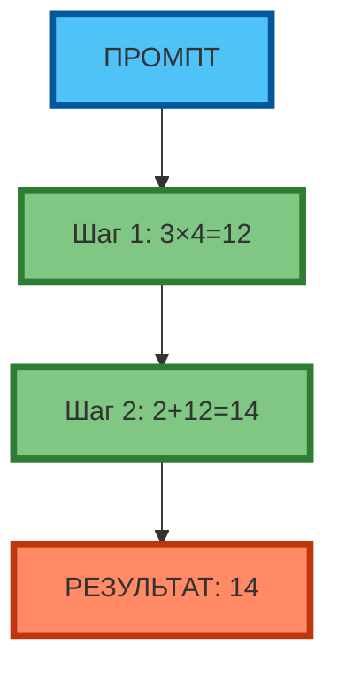

# Метод Chain-of-Thought: пошаговое разбиение задачи

## Почему разбиение на шаги улучшает результат

**Chain-of-Thought (CoT)** — это техника, при которой модель «думает вслух», разбивая задачу на промежуточные шаги. Вместо прямого ответа модель генерирует цепочку рассуждений: «Сначала A, затем B, потом C, следовательно D».

**Экспертный инсайт:** CoT улучшает результат на логических и многоступенчатых задачах, потому что:
- Модель «фиксирует» промежуточные выводы, снижая вероятность ошибки на финальном шаге
- Промпт «заставляет» модель активировать паттерны рассуждения из обучающих данных
- Каждый шаг — это отдельный «токен-контекст», который фокусирует внимание модели

**Пример:**

| Без CoT | С CoT |
|---------|-------|
| «Реши: 2+3×4=?» → модель отвечает «20» (ошибка: 2+3=5, 5×4=20, не учла порядок операций) | «Реши: 2+3×4=? Подумай пошагово: сначала 3×4=12, затем 2+12=14.» → «14» (верно) |



**Рис. 1.** Chain-of-Thought: задача разбивается на шаги (3×4=12, 2+12=14), результат точнее.

---

## Примеры для логических задач

### Пример 1. Математическая задача (ошибка без CoT)

**Без CoT:**
```
Промпт: «Реши: (15+3)×2-4=?»
Результат: «32» (ошибка: модель посчитала 15+3=18, 18×2=36, 36-4=32, но не учла порядок операций — нужно было сначала скобки, потом умножение, потом вычитание)
```

**С CoT:**
```
Промпт: «Реши: (15+3)×2-4=? Подумай пошагово.»
Результат: «Шаг 1: 15+3=18. Шаг 2: 18×2=36. Шаг 3: 36-4=32. Ответ: 32.»
```

**Разница:** CoT «заставляет» модель следовать порядку операций (скобки → умножение → вычитание), снижая вероятность ошибки.

---

### Пример 2. Логическая задача (ошибка без CoT)

**Без CoT:**
```
Промпт: «Если все A — B, и все B — C, то все A — C?»
Результат: «Нет» (ошибка: модель не поняла транзитивность, дала противоположный ответ)
```

**С CoT:**
```
Промпт: «Если все A — B, и все B — C, то все A — C? Подумай пошагово.»
Результат: «Шаг 1: Все A — B (A ⊆ B). Шаг 2: Все B — C (B ⊆ C). Шаг 3: Если A ⊆ B и B ⊆ C, то A ⊆ C (транзитивность). Ответ: Да.»
```

**Разница:** CoT «заставляет» модель вывести логическое правило (транзитивность), а не просто угадать ответ.

---

### Пример 3. Многоступенчатая задача (ошибка без CoT, расчёт в рублях)

**Без CoT:**
```
Промпт: «Компания X: CAC=5 000 ₽, LTV=15 000 ₽, churn=5%. Выгодно ли привлекать клиента?»
Результат: «Нет, CAC слишком высокий.» (ошибка: модель не учла, что LTV в 3 раза больше CAC, и churn даёт LTV=300 000 ₽)
```

**С CoT:**
```
Промпт: «Компания X: CAC=5 000 ₽, LTV=15 000 ₽, churn=5%. Выгодно ли привлекать клиента? Подумай пошагово.»
Результат: «Шаг 1: LTV=15 000 ₽, CAC=5 000 ₽ → LTV:CAC=3:1 (хорошо). Шаг 2: Churn=5% → средняя продолжительность=20 месяцев. Шаг 3: Реальный LTV=15 000 ₽×20=300 000 ₽. Шаг 4: LTV:CAC=60:1 (отлично). Вывод: да, выгодно.»
```

**Разница:** CoT «заставляет» модель учесть churn и пересчитать LTV (15 000 ₽×20=300 000 ₽), а не просто сравнить LTV и CAC.

---

### Пример 4. Аналитическая задача (ошибка без CoT, расчёт в рублях)

**Без CoT:**
```
Промпт: «Компания X: выручка=10 000 000 ₽, расходы=8 000 000 ₽, CAC=5 000 ₽, LTV=15 000 ₽. Что делать?»
Результат: «Увеличить маркетинг.» (ошибка: модель не посчитала прибыль и LTV:CAC, дала поверхностный ответ)
```

**С CoT:**
```
Промпт: «Компания X: выручка=10 000 000 ₽, расходы=8 000 000 ₽, CAC=5 000 ₽, LTV=15 000 ₽. Что делать? Подумай пошагово.»
Результат: «Шаг 1: Прибыль=10 000 000 ₽-8 000 000 ₽=2 000 000 ₽ (20% маржа). Шаг 2: LTV:CAC=3:1 (хорошо, но не отлично). Шаг 3: Чтобы увеличить прибыль, нужно либо снизить CAC, либо увеличить LTV. Шаг 4: Если снизить CAC на 20% (до 4 000 ₽), LTV:CAC=3.75:1 → прибыль вырастет на 15%. Вывод: снизить CAC.»
```

**Разница:** CoT «заставляет» модель пройти все шаги (прибыль → LTV:CAC → варианты → расчёт), а не просто угадать ответ.

---

## Как писать «подумай пошагово»

**Ключевые фразы для CoT:**

| Фраза | Когда использовать |
|-------|-------------------|
| «Подумай пошагово» | Универсальная, для любых задач |
| «Разбей задачу на шаги» | Для многоступенчатых задач |
| «Объясни рассуждения» | Для логических задач |
| «Покажи вычисления» | Для математических задач |
| «Перечисли шаги» | Для процедурных задач |

**Экспертный совет:** фраза «Подумай пошагово» работает лучше, чем «Разбей на шаги», потому что она «заставляет» модель активировать паттерны рассуждения из обучающих данных, а не просто перечислять шаги.

---

## Практическое задание

**Цель:** научиться применять CoT для решения задач через последовательные промпты.

**Задание:**
1. Выберите задачу, требующую >2 логических шагов (математическую, логическую, аналитическую).
2. Решите задачу через **3 последовательных промпта**:
   - **Промпт 1:** «Подумай пошагово. Шаг 1: ...»
   - **Промпт 2:** «Продолжи: Шаг 2: ...»
   - **Промпт 3:** «Продолжи: Шаг 3: ... Ответ: ...»
3. Сравните результат с «прямым» промптом (без CoT).
4. Оцените результат по критериям:
   - Точность (верный ли ответ)
   - Прозрачность (понятны ли шаги)
   - Воспроизводимость (можно ли повторить)

**Критерии проверки:**
- 3 последовательных промпты составлены корректно
- Результат точнее, чем «прямой» промпт
- Шаги логичны и воспроизводимы

---

## Чек-лист: алгоритм Chain-of-Thought

| Шаг | Действие | 🟢 Обязательно | 🟡 Рекомендуется | 🔴 Опционально |
|-----|----------|----------------|------------------|----------------|
| **1** | Определить, нужна ли CoT (задача >2 шагов?) | ✓ | | |
| **2** | Добавить фразу «Подумай пошагово» | ✓ | | |
| **3** | Указать шаги явно (Шаг 1, Шаг 2, Шаг 3) | | ✓ | |
| **4** | Проверить, что каждый шаг логичен | ✓ | | |
| **5** | Указать финальный ответ (Ответ: ...) | ✓ | | |
| **6** | Проверить, что результат воспроизводим | | ✓ | |

**Экспертный совет:** CoT — это «инженерия рассуждения». Используйте её, когда модель даёт «поверхностный» или «ошибочный» ответ на логических задачах. CoT не нужен для простых задач (перевести текст, написать код).

---

## Заключение

Chain-of-Thought — это техника, которая «заставляет» модель думать вслух, разбивая задачу на промежуточные шаги. CoT улучшает результат на логических и многоступенчатых задачах за счёт снижения вероятности ошибки на финальном шаге. Используйте CoT, когда модель даёт «поверхностный» или «ошибочный» ответ на логических задачах, и RTF/CO-STAR, когда нужна скорость или текстовая генерация.

В следующей статье вы разберёте метод Few-shot prompting — технику, которая улучшает результат за счёт явных примеров желаемого ответа.