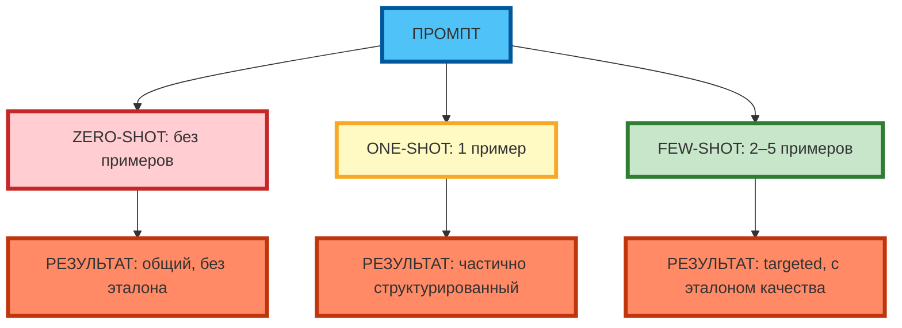
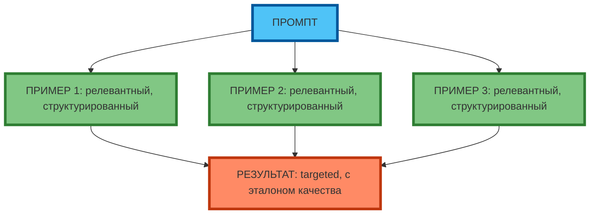

# Few-shot prompting: как и сколько примеров давать

## Что такое few-shot prompting и чем он отличается от zero-shot и one-shot

**Few-shot prompting** — это техника, при которой в промпт добавляют 2–5 примеров желаемого результата. Модель «учится» на примерах и воспроизводит их структуру, стиль и качество.

**Zero-shot** — работа без примеров. Модель опирается только на инструкции в промпте.

**One-shot** — работа с одним примером. Модель использует его как «эталон».

**Экспертный инсайт:** few-shot работает лучше zero-shot и one-shot на задачах, где структура и стиль результата критичны (генерация идей, продающие тексты, анализ). Примеры «задают планку» качества и снижают вероятность «общего» ответа.

**Рис. 1.** Zero-shot vs One-shot vs Few-shot: результат зависит от количества примеров.

---

## Оптимальное количество примеров для разных типов задач

| Тип задачи | Оптимальное количество примеров | Почему |
|------------|---------------------------------|--------|
| Генерация идей | 3–5 | Модель «ловит» разнообразие и стиль |
| Продающий текст | 2–3 | Достаточно для понимания структуры и тона |
| Анализ данных | 2–4 | Примеры задают формат и глубину |
| Код | 1–3 | Один пример структуры + 1–2 варианта |
| Перевод | 1–2 | Достаточно для стиля и терминологии |

**Экспертный совет:** больше 5 примеров перегружает промпт и «размывает» внимание модели. Меньше 2 — недостаточно для «усвоения» паттерна.

---

## Критерии качества примеров: релевантность, разнообразие, чёткость структуры

| Критерий | Описание | Пример хорошего примера | Пример плохого примера |
|----------|----------|-------------------------|------------------------|
| **Релевантность** | Пример соответствует теме промпта | «Идея: AI-платформа для code review, CAC=5 000 ₽, LTV=15 000 ₽» | «Идея: кофейня» (не соответствует теме fintech) |
| **Разнообразие** | Примеры отличаются по содержанию и подходу | Пример 1: снижение CAC; Пример 2: увеличение LTV; Пример 3: новый канал | Пример 1: снижение CAC; Пример 2: снижение CAC другим способом (дублирование) |
| **Чёткость структуры** | Пример имеет явную структуру (заголовок, описание, метрики) | «Идея: X. Описание: Y. Метрики: CAC=5 000 ₽, LTV=15 000 ₽» | «Идея: X. Описание: Y» (нет метрик) |
| **Лаконичность** | Пример 50–70 слов, не перегружает промпт | «Идея: AI-платформа для code review. Описание: снижает время review на 40%. Метрики: CAC=5 000 ₽, LTV=15 000 ₽.» | «Идея: AI-платформа для code review. Описание: снижает время review на 40%. Метрики: CAC=5 000 ₽, LTV=15 000 ₽, churn=5%, NPS=45, команда=12 человек...» (перегрузка) |
| **Ключевые маркеры** | Пример содержит маркеры, которые модель должна воспроизвести | «Идея: X. Описание: Y. Метрики: CAC=5 000 ₽, LTV=15 000 ₽.» | «Идея: X. Описание: Y.» (нет маркеров) |

**Рис. 2.** Few-shot: 3 примера (2+1 в ряд) задают эталон качества.

---

## Где брать примеры: готовые шаблоны, создание собственных примеров

**Источники примеров:**

| Источник | Плюсы | Минусы |
|----------|-------|--------|
| Готовые шаблоны (Notion, Coda, PromptBase) | Быстро, проверено | Не всегда релевантны |
| Создание собственных примеров | Точно соответствуют задаче | Требует времени и экспертизы |
| Реальные кейсы из практики | Аутентичны, с метриками | Нужно документировать |
| Примеры из статей и кейсов | Доступны, разнообразны | Не всегда структурированы |

**Экспертный совет:** создавайте собственные примеры — это гарантирует релевантность и качество. Готовые шаблоны используйте только как отправную точку.

---

## Форматы подачи примеров (нумерованный список, таблица, диалог) и их влияние на результат

| Формат | Влияние на результат | Когда использовать |
|--------|----------------------|--------------------|
| **Нумерованный список** | Модель воспроизводит структуру (1, 2, 3) | Для идей, шагов, рекомендаций |
| **Таблица** | Модель воспроизводит колонки и формат | Для сравнения, метрик, анализа |
| **Диалог** | Модель воспроизводит стиль и тон | Для чатов, email, сценариев |

**Экспертный совет:** для генерации идей используйте нумерованный список; для анализа — таблицу; для коммуникации — диалог.

---

## Как примеры влияют на точность и креативность ответа нейросети

| Количество примеров | Точность | Креативность |
|---------------------|----------|--------------|
| 0 (zero-shot) | Низкая | Высокая |
| 1 (one-shot) | Средняя | Средняя |
| 2–3 (few-shot) | Высокая | Средняя |
| 4–5 (few-shot) | Высокая | Низкая |

**Экспертный совет:** 2–3 примера — оптимальный баланс между точностью и креативностью. Больше 5 примеров снижает креативность (модель «копирует» примеры).

---

## Типичные ошибки при использовании few-shot (избыточность, противоречивость, нерелевантность) и способы их избежать

| Ошибка | Пример | Способ избежать |
|--------|--------|-----------------|
| **Избыточность** | 7 примеров в промпте | Оставить 2–3 примера |
| **Противоречивость** | Пример 1: «снизить CAC»; Пример 2: «увеличить CAC» | Проверить, что все примеры в одном направлении |
| **Нерелевантность** | Пример про кофейню в промпте про fintech | Проверить, что все примеры соответствуют теме |

**Экспертный совет:** перед добавлением примера в промпт спросите: «Этот пример релевантен? Он не противоречит другим? Он не перегружает промпт?»

---

## Практическое задание

**Цель:** научиться улучшать промпт с помощью few-shot.

**Задание:**
1. Возьмите промпт для генерации бизнес-идей (например: «Придумай 5 идей для fintech-стартапа»).
2. Составьте 3 примера успешных идей (50–70 слов каждая) с кратким описанием.
3. Добавьте примеры в промпт (few-shot).
4. Протестируйте оба варианта (без примеров и с примерами) в одной модели.
5. Сравните результаты по критериям:
   - Конкретность (есть ли метрики, описание)
   - Релевантность (соответствуют ли теме)
   - Структурированность (есть ли заголовок, описание, метрики)
   - Креативность (нестандартные ли идеи)

**Критерии проверки:**
- 3 примера составлены (50–70 слов каждый)
- Примеры релевантны, структурированы, разнообразны
- Результат с примерами лучше, чем без примеров

---

## Чек-лист: 5 критериев хороших примеров

| Критерий | Вопрос для проверки | 🟢 Обязательно | 🟡 Рекомендуется | 🔴 Опционально |
|----------|---------------------|----------------|------------------|----------------|
| **1. Соответствуют теме промпта** | Пример релевантен задаче? | ✓ | | |
| **2. Имеют чёткую структуру** | Есть заголовок, описание, метрики? | ✓ | | |
| **3. Разнообразны по содержанию** | Примеры отличаются по подходу? | ✓ | | |
| **4. Лаконичны (не перегружают промпт)** | Пример 50–70 слов? | ✓ | | |
| **5. Содержат ключевые маркеры для нейросети** | Есть маркеры (CAC, LTV, структура)? | | ✓ | |

**Экспертный совет:** перед добавлением примера в промпт проверьте все 5 критериев. Если пример не проходит хотя бы один критерий — замените его.

---

## Заключение

Few-shot prompting — это техника, которая «задаёт планку» качества результата через 2–5 примеров. Примеры должны быть релевантными, разнообразными, структурированными и лаконичными. Используйте few-shot, когда zero-shot и one-shot дают «общий» или «не в тему» результат.

В следующей статье вы разберёте zero-shot и one-shot prompting — когда можно не давать примеры и как выбрать между zero/one/few-shot.