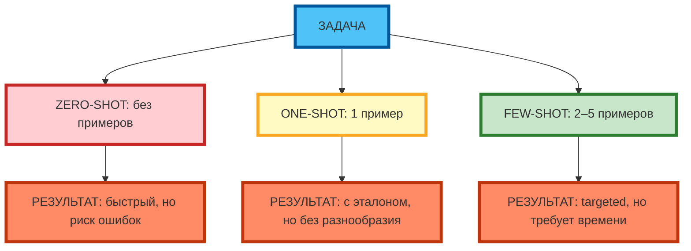
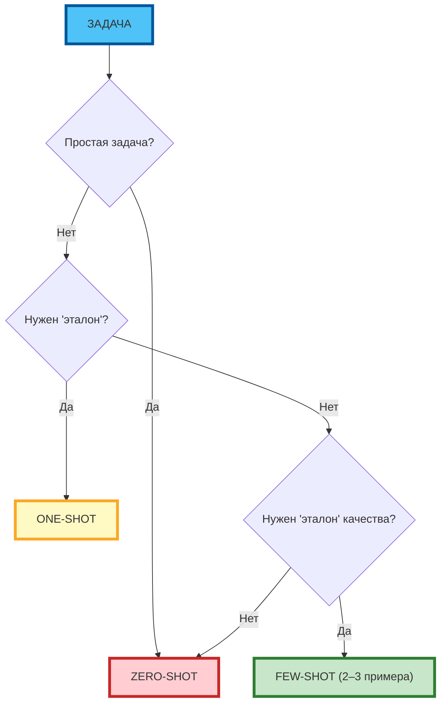

# Zero-shot и One-shot prompting: когда можно не давать примеры

## Определение zero-shot и one-shot prompting

**Zero-shot prompting** — работа без примеров. Модель опирается только на инструкции в промпте.

**One-shot prompting** — работа с одним примером. Модель использует его как «эталон» качества и структуры.

**Экспертный инсайт:** zero-shot работает, когда задача простая и модель «знает» паттерн из обучающих данных. One-shot — когда нужен «эталон» для понимания стиля или формата.

---

## Сравнение эффективности методов для разных задач

| Метод | Подходит для | Не подходит для | Риски | Примеры задач |
|-------|--------------|-----------------|-------|---------------|
| **Zero-shot** | Простые задачи, стандартные форматы | Сложные задачи, нестандартные форматы | Высокая вероятность ошибок, расплывчатые ответы | Генерация заголовков, ответы на вопросы, классификация |
| **One-shot** | Задачи, где нужен «эталон» стиля или формата | Задачи, требующие разнообразия | Модель «копирует» пример | Email-рассылки, посты в соцсети, продающие тексты |
| **Few-shot** | Сложные задачи, нестандартные форматы | Простые задачи (перегрузка) | Перегрузка промпта | Генерация идей, анализ данных, кейсы |



**Рис. 1.** Zero-shot vs One-shot vs Few-shot: выбор метода зависит от сложности задачи.

---

## Когда zero-shot работает лучше few-shot

**Zero-shot** эффективнее few-shot, когда:

| Ситуация | Пример | Почему zero-shot |
|----------|--------|------------------|
| Простая задача | «Напиши заголовок для статьи» | Модель «знает» паттерн из обучающих данных |
| Стандартный формат | «Ответь в формате JSON» | Модель «знает» структуру JSON |
| Ограниченное время | «Сделай быстро» | Few-shot перегружает промпт |
| Креативная задача | «Придумай слоган» | Few-shot снижает креативность |

**Экспертный совет:** zero-shot — это «первый выбор» для простых задач. Если результат «общий» или «не в тему» — переходите к one-shot или few-shot.

---

## Риски zero-shot: высокая вероятность ошибок, расплывчатые ответы

**Риски zero-shot:**

| Риск | Пример | Способ избежать |
|------|--------|-----------------|
| **Высокая вероятность ошибок** | «Реши: (15+3)×2-4=?» → «32» (ошибка) | Добавить «Подумай пошагово» (CoT) |
| **Расплывчатые ответы** | «Напиши пост про кофе» → «Кофе — это напиток...» | Добавить контекст и формат |
| **Игнорирование ограничений** | «Без эмодзи» → модель добавляет эмодзи | Продублировать ограничения в конце промпта |

**Экспертный совет:** zero-shot — это «рискованный» метод. Если задача сложная или формат нестандартный — используйте one-shot или few-shot.

---

## One-shot как компромисс: когда достаточно одного примера

**One-shot** — это «золотая середина» между zero-shot и few-shot:

| Ситуация | Почему one-shot |
|----------|-----------------|
| Нужно «эталон» стиля | Один пример задаёт тон и структуру |
| Ограниченное время | Один пример не перегружает промпт |
| Задача требует разнообразия | Few-shot снижает креативность |

**Экспертный совет:** one-shot — это «первый выбор» для задач, где нужен «эталон», но не требуется разнообразие (email-рассылки, посты в соцсети).

---

## Алгоритм выбора метода в зависимости от сложности задачи



**Рис. 2.** Дерево решений: выбор между zero/one/few-shot.

---

## Примеры задач для каждого метода

### Zero-shot (реальный промпт)

```
Промпт: «Напиши заголовок для статьи про AI в маркетинге.»
Результат: «Как AI меняет маркетинг: 5 трендов 2026 года.»
```

### One-shot (реальный промпт)

```
Промпт: «Напиши email-рассылку для напоминания о вебинаре.
Пример: 'Subject: Не пропустите вебинар завтра в 18:00. Body: Уважаемые коллеги, напоминаем о вебинаре...'»
Результат: email в заданном стиле.
```

### Few-shot (реальный промпт)

```
Промпт: «Напиши 3 варианта email-рассылки для напоминания о вебинаре.
Пример 1: 'Subject: Вебинар завтра: 5 идей для роста CAC. Body: ...'
Пример 2: 'Subject: Не пропустите: как снизить CAC на 25%. Body: ...'
Пример 3: 'Subject: Завтра в 18:00: кейсы из практики. Body: ...'»
Результат: 3 варианта email в заданном стиле.
```

---

## Практическое задание

**Цель:** научиться сравнивать zero-shot, one-shot и few-shot на одной задаче.

**Задание:**
1. Выберите задачу: «Напиши 3 варианта email-рассылки для напоминания о вебинаре».
2. Составьте 3 промпта:
   - **Zero-shot:** без примеров
   - **One-shot:** 1 пример
   - **Few-shot:** 3 примера
3. Протестируйте все 3 промпта в одной модели.
4. Сравните результаты по критериям:
   - Конкретность (есть ли метрики, описание)
   - Структурированность (есть ли заголовок, описание, CTA)
   - Креативность (нестандартные ли формулировки)
   - Соответствие формату

**Критерии проверки:**
- 3 промпта составлены корректно
- Результаты сравнены по 4 критериям
- Сделан вывод: какой метод эффективнее для данной задачи

---

## Чек-лист: таблица выбора между методами

| Метод | Подходит для | Не подходит для | Риски | Примеры задач |
|-------|--------------|-----------------|-------|---------------|
| **Zero-shot** | Простые задачи, стандартные форматы | Сложные задачи, нестандартные форматы | Высокая вероятность ошибок, расплывчатые ответы | Генерация заголовков, ответы на вопросы, классификация |
| **One-shot** | Задачи, где нужен «эталон» стиля или формата | Задачи, требующие разнообразия | Модель «копирует» пример | Email-рассылки, посты в соцсети, продающие тексты |
| **Few-shot** | Сложные задачи, нестандартные форматы | Простые задачи (перегрузка) | Перегрузка промпта | Генерация идей, анализ данных, кейсы |

**Экспертный совет:** начинайте с zero-shot. Если результат «общий» или «не в тему» — переходите к one-shot. Если нужен «эталон качества» — используйте few-shot (2–3 примера).

---

## Заключение

Zero-shot и one-shot — это «быстрые» методы, которые работают для простых задач и стандартных форматов. Few-shot — это «точный» метод для сложных задач и нестандартных форматов. Выбирайте метод в зависимости от сложности задачи и требуемого качества результата.

В следующей статье вы разберёте метод Role-Playing Prompting — технику, которая улучшает результат за счёт явного указания роли нейросети.