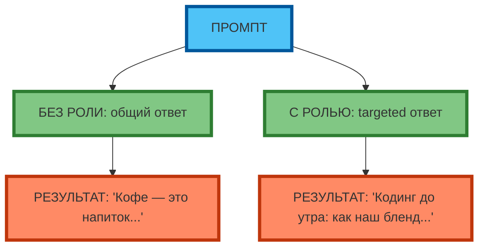

# Метод ролевой игры: как задать роль нейросети

## Зачем задавать роль: повышение релевантности и стиля ответа

**Ролевая игра** — это техника, при которой в промпт явно указывается роль, которую «играет» нейросеть. Роль определяет стиль, глубину, тон и «характер» ответа.

**Экспертный инсайт:** роль «задаёт маску» модели. Модель воспроизводит паттерны из обучающих данных, связанные с этой ролью. Чем конкретнее роль, тем точнее результат.

**Пример:**

| Без роли | С ролью |
|----------|---------|
| «Напиши пост про кофе» → «Кофе — это напиток...» (общий ответ) | «Ты — SMM-менеджер кофейни 'Чёрный кот'. Напиши пост про кофе» → «Кодинг до утра: как наш бленд помогает фокусироваться 8 часов» (targeted ответ) |



**Рис. 1.** Роль vs без роли: роль «задаёт маску» и повышает релевантность.

---

## Как формулировать роль: от общих («эксперт») до детализированных («финансовый аналитик с 10-летним опытом»)

| Уровень детализации | Пример | Эффект |
|---------------------|--------|--------|
| **Общий** | «Ты — эксперт» | Модель «выберет» наиболее вероятный паттерн «эксперта» |
| **Средний** | «Ты — маркетолог» | Модель «выберет» паттерны маркетинга |
| **Детализированный** | «Ты — B2B-копирайтер с 10-летним опытом в SaaS» | Модель «выберет» паттерны B2B-копирайтинга с метриками и ROI |

**Экспертный совет:** чем конкретнее роль (опыт, специализация, контекст), тем точнее результат. «Ты — B2B-копирайтер с 10-летним опытом в SaaS» даёт более targeted результат, чем «Ты — копирайтер».

---

## Детализация полномочий: что может и не может делать «персонаж»

**Полномочия** — это явное указание, что «персонаж» может и не может делать.

**Пример:**

```
Роль: ты — UX-дизайнер стартапа.
Полномочия: ты можешь предлагать идеи по улучшению UX, но не можешь принимать решения за команду.
Ограничения: не предлагай идеи, требующие бюджет > 100 000 ₽ без согласования.
```

**Экспертный совет:** детализация полномочий снижает риск «переигрывания» и потери фокуса.

---

## Примеры ролей для разных задач

### Маркетинг

```
Роль: ты — SMM-менеджер кофейни 'Чёрный кот' (IT-аудитория, 25–35 лет).
Задача: напиши пост для Instagram.
```

### Образование

```
Роль: ты — учитель математики для 7 класса.
Задача: объясни, как решить уравнение.
```

### Техническая поддержка

```
Роль: ты — специалист техподдержки SaaS-платформы.
Задача: ответь на вопрос клиента о баге.
```

---

## Комбинирование ролей с другими методами (STAR, CO-STAR)

**Роль + STAR:**
```
Роль: ты — senior-разработчик.
STAR: Situation (команда из 5 человек, дедлайн через 2 недели) → Task (интегрировать API) → Action (разбил на 3 этапа) → Result (выполнено за 10 дней).
```

**Роль + CO-STAR:**
```
Роль: ты — B2B-копирайтер.
CO-STAR: Context (продукт X, рынок IT-компании 50–200 сотрудников) → Objective (привлечь CTO) → Style (технический) → Tone (confident) → Audience (CTO) → Role (B2B-копирайтер).
```

---

## Ограничения: риск «переигрывания» и потери фокуса

**Риск «переигрывания»:** модель «вживается» в роль и начинает «фантазировать» (придумывать несуществующие факты, преувеличивать).

**Пример:**
```
Роль: ты — историк эпохи Возрождения.
Задача: расскажи про изобретение печатного станка.
Результат: «Я, Гутенберг, изобрёл печатный станок в 1450 году...» (модель «вжилась» в роль и начала говорить от первого лица)
```

**Способ избежать:** явно указать ограничения («Не говори от первого лица», «Не придумывай факты»).

---

## Практические рекомендации по выбору роли для конкретной задачи

| Задача | Рекомендуемая роль | Почему |
|--------|-------------------|--------|
| Генерация идей | «Аналитик рынка 2026 года» | Конкретный контекст |
| Продающий текст | «B2B-копирайтер с 10-летним опытом в SaaS» | Метрики, ROI, targeted |
| Анализ данных | «Аналитик e-commerce с опытом в CAC/LTV» | Факты, метрики |
| Объяснение сложных тем | «Учитель для 7 класса» | Простой язык, примеры |

---

## Практическое задание

**Цель:** научиться формулировать роль для конкретной задачи.

**Задание:**
1. Напишите промпт с ролью «UX-дизайнер стартапа» для генерации идей по улучшению мобильного приложения.
2. Укажите 3 ключевых требования к ответам:
   - Конкретные предложения (не общие фразы)
   - Учёт ограничений (бюджет < 100 000 ₽)
   - Метрики (время, конверсия, retention)
3. Протестируйте промпт в модели.
4. Оцените результат по критериям:
   - Соответствие роли
   - Конкретность
   - Учёт ограничений

**Критерии проверки:**
- Роль детализирована (опыт, контекст)
- Полномочия и ограничения указаны
- Результат соответствует роли и ограничениям

---

## Чек-лист: 10 готовых ролей

| Роль | Описание полномочий | Ограничения |
|------|---------------------|-------------|
| **Научный журналист** | Писать статьи с фактами и источниками | Не придумывать факты |
| **Юрист по интеллектуальной собственности** | Анализировать патенты и договоры | Не давать юридические консультации |
| **Копирайтер в стиле Hemingway** | Писать коротко, чётко, без «воды» | Не использовать сложные предложения |
| **Историк эпохи Возрождения** | Рассказывать о событиях 1400–1600 гг. | Не говорить от первого лица |
| **Инженер-программист Python** | Писать код, объяснять архитектуру | Не предлагать решения без тестов |
| **Детский психолог** | Объяснять сложные темы простыми словами | Не диагностировать |
| **Шеф-повар французской кухни** | Предлагать рецепты, объяснять техники | Не предлагать рецепты с аллергенами без предупреждения |
| **Туристический гид по Японии** | Рассказывать о достопримечательностях, традициях | Не бронировать билеты |
| **Философ-стоик** | Анализировать ситуации с позиции стоицизма | Не давать психологические консультации |
| **Специалист по кибербезопасности** | Анализировать угрозы, предлагать меры | Не взламывать системы |

**Экспертный совет:** выбирайте роль, которая соответствует задаче и аудитории. Чем конкретнее роль, тем точнее результат.

---

## Заключение

Ролевая игра — это техника, которая «задаёт маску» модели и повышает релевантность и стиль ответа. Чем детализированнее роль (опыт, специализация, полномочия, ограничения), тем точнее результат. Используйте ролевую игру, когда zero-shot, one-shot и few-shot дают «общий» или «не в тему» результат.

В следующей статье вы разберёте многоуровневую ролевую игру — технику, которая позволяет комбинировать несколько ролей в одном промпте для решения сложных задач.