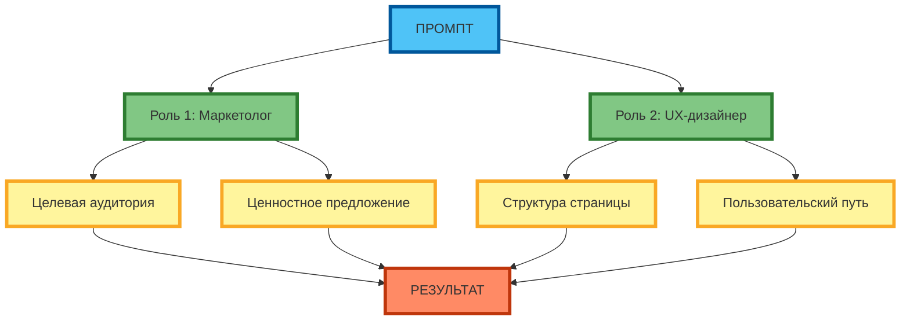
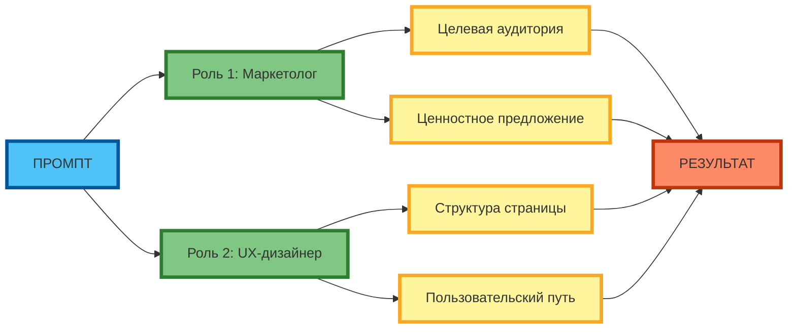

# Многоуровневая ролевая игра: комбинирование ролей

В предыдущей статье вы узнали, как задать нейросети одну роль с помощью метода ролевой игры. Но реальные задачи часто требуют знаний из нескольких областей. В этой статье вы научитесь комбинировать несколько ролей в одном промпте, чтобы получать более глубокие и сбалансированные ответы.

## Понятие многоуровневой ролевой игры и её цели

Многоуровневая ролевая игра — это метод, при котором в одном промпте задаётся несколько ролей одновременно. Каждая роль отвечает за свою область экспертизы, а вместе они решают сложную задачу.

**Цель метода** — имитировать работу команды экспертов внутри одной нейросети. Когда задача требует знаний маркетинга, дизайна и аналитики, одна роль не справится. Многоуровневая игра позволяет нейросети «переключаться» между разными точками зрения и выдавать комплексный результат.

В отличие от обычной ролевой игры, здесь роли взаимодействуют друг с другом: обсуждают, спорят, уточняют. Это делает ответ более обоснованным и учитывает разные аспекты проблемы.

## Правила сочетания ролей: совместимость, иерархия, распределение функций

Чтобы многоуровневая игра работала эффективно, роли нужно сочетать по определённым правилам.

**Совместимость ролей** — роли должны дополнять друг друга, а не дублировать. Маркетолог и UX-дизайнер хорошо работают вместе, потому что один отвечает за привлечение внимания, а другой — за удобство использования. Две роли «маркетолог» будут конфликтовать без добавленной пользы.

**Иерархия ролей** — нужно определить, кто принимает финальное решение при разногласиях. Обычно это ведущий эксперт или «модератор». Без иерархии нейросеть может зациклиться на споре и не пойти к выводу.

**Распределение функций** — каждая роль должна иметь чёткую зону ответственности. Маркетолог отвечает за ценностное предложение и целевую аудиторию, UX-дизайнер — за структуру страницы и пользовательский путь, аналитик — за метрики и данные.



**Рисунок 1.** «Матрица совместимости ролей в многоуровневой игре» (grid). 3 ряда: Промпт сверху, 2 компонента в ряд, 2 компонента в ряд, Результат снизу. Компактная 1:1, текст полный, цвета и рамки 4px.

## Управление конфликтами между ролями: техники разрешения противоречий

Когда роли расходятся во мнениях, нужен механизм разрешения конфликтов. Без него нейросеть может выдать противоречивый ответ или не пойти к выводу.

**Техника «Ведущий эксперт»** — одна роль получает право финального решения. Например, при расхождении маркетолога и дизайнера приоритет отдаётся маркетологу, если цель — увеличить конверсию.

**Техника «Поиск компромисса»** — нейросеть должна предложить решение, которое учитывает позиции обеих сторон. Маркетолог хочет яркий заголовок, дизайнер — минималистичный. Компромисс: заголовок с визуальным акцентом, но без перегрузки.

**Техника «Обоснование позиции»** — каждая роль должна аргументировать свою точку зрения данными или логикой. Это снижает субъективность и помогает выбрать лучшее решение.



**Рисунок 2.** «Структура диалога между экспертами» (sequence diagram). 3 ряда: Промпт слева, 4 компонента в 2 ряда (2+2), Результат справа. Компактная 1:1, текст полный, цвета и рамки 4px, связи огибают.

## Сценарии дебатов между экспертами разных областей

Дебаты между ролями — мощный инструмент для сложных задач. Они позволяют рассмотреть проблему с разных сторон и найти неочевидные решения.

**Сценарий 1: Маркетолог vs UX-дизайнер** — маркетолог настаивает на ярких элементах для привлечения внимания, дизайнер — на минимализме для удобства. Дебат помогает найти баланс между заметностью и юзабилити.

**Сценарий 2: Аналитик vs Креативщик** — аналитик требует данных и доказательств, креативщик предлагает нестандартные идеи. Дебат помогает отделить рабочую идею от «красивой, но бесполезной».

**Сценарий 3: Консерватор vs Инноватор** — консерватор опирается на проверенные решения, инноватор предлагает новые подходы. Дебат показывает риски и преимущества каждого варианта.

## Примеры успешных комбинаций ролей для решения сложных задач

**Пример 1: Улучшение конверсии лендинга**

```markdown
Ты — команда из трёх экспертов, решающая задачу увеличения конверсии лендинга:

1. Маркетолог — специалист по позиционированию и ценностному предложению. Отвечает за то, чтобы посетитель понял, зачем ему продукт, и захотел его купить.

2. UX-дизайнер — специалист по пользовательскому опыту. Отвечает за структуру страницы, удобство навигации и устранение барьеров на пути к цели.

3. Аналитик — специалист по данным и гипотезам. Отвечает за формулировку измеримых гипотез и определение, какие изменения дадут наибольший эффект.

Задача: предложить улучшения для лендинга SaaS-продукта (CRM для малого бизнеса).

Правила взаимодействия:
- Каждая роль высказывает свою позицию по очереди.
- При расхождении мнений ведущим считается маркетолог.
- Каждая позиция должна быть обоснована.
- Итоговый ответ должен содержать конкретные рекомендации с приоритетами.
```

В этом промпте три роли решают одну задачу, но с разных точек зрения. Результат — комплексный план улучшений, а не разрозненные советы.

**Пример 2: Разработка контент-стратегии**

```markdown
Ты — редакторская коллегия из трёх специалистов:

1. SEO-специалист — отвечает за поисковый трафик, ключевые слова, структуру и технические требования.

2. Редактор — отвечает за читаемость, стиль, логику изложения и соответствие бренд-голоса.

3. SMM-менеджер — отвечает за вирусность, вовлечённость, форматы под социальные сети и тренды.

Задача: разработать контент-план на месяц для блога о цифровом маркетинге.

Правила:
- Каждая роль предлагает 3 темы.
- При конфликте приоритет у SEO-специалиста.
- Каждая тема должна быть обоснована с позиции своей роли.
- Итоговый список — 5 тем с указанием, кто и за что отвечает.
```

## Ограничения метода: когда многоуровневая игра неэффективна

Многоуровневая ролевая игра — мощный метод, но он не универсален. Важно знать, когда он неэффективен.

**Когда метод неэффективен:**

- **Простые задачи** — если задача не требует экспертизы из нескольких областей, многоуровневая игра избыточна. Для написания короткого email достаточно одной роли «копирайтер».
- **Ограничение контекста** — каждая роль занимает место в промпте. Если ролей слишком много, нейросеть может «забыть» часть инструкций.
- **Низкая способность модели к инструкциям** — не все модели одинаково хорошо справляются с многоуровневыми промптами. Более слабые модели могут путать роли или игнорировать правила взаимодействия.
- **Высокая стоимость** — многоуровневые промпты длиннее, а значит, дороже при использовании платных API.

**Когда метод эффективен:**

- Задача требует знаний из 2–3 смежных областей.
- Нужно рассмотреть проблему с разных точек зрения.
- Важно найти баланс между противоречивыми требованиями (например, яркость vs удобство).

## Практические советы по организации многоуровневой ролевой игры

**Совет 1: Ограничивайте количество ролей** — оптимально 2–3 роли. Больше — и промпт становится слишком длинным, нейросеть теряет фокус.

**Совет 2: Чётко определяйте зоны ответственности** — каждая роль должна знать, за что она отвечает и за что не отвечает. Это снижает риск дублирования и конфликтов.

**Совет 3: Задавайте правила взаимодействия** — укажите, в каком порядке роли высказываются, как разрешаются конфликты, кто принимает финальное решение.

**Совет 4: Используйте иерархию** — определите ведущую роль. Это помогает нейросети не зацикливаться на споре и прийти к выводу.

**Совет 5: Тестируйте на простой задаче** — перед применением к сложной задаче проверьте, как модель справляется с многоуровневым промптом на простом примере.

## Таблица: Правила сочетания ролей и разрешения конфликтов

| Правило | Описание | Пример |
|---------|----------|--------|
| **Совместимость ролей** | Роли должны дополнять друг друга, а не дублировать | Маркетолог + UX-дизайнер: привлечение внимания + удобство использования |
| **Иерархия ролей** | Определить ведущего эксперта при расхождении мнений | Приоритет маркетологу, если цель — конверсия |
| **Распределение функций** | Чётко задать зону ответственности каждой роли | Маркетолог — ценностное предложение; Дизайнер — структура страницы |
| **Правила взаимодействия** | Задать очерёдность и формат ответов | Каждая роль высказывается по очереди, затем — компромисс |
| **Ограничение количества** | Оптимально 2–3 роли | Больше 3 — нейросеть теряет фокус |

**Рисунок 3.** Таблица правил сочетания ролей и разрешения конфликтов. Каждая ячейка имеет цветную заливку и жирный бордюр 4 px.

## Практическое задание

**Задание:** Создайте промпт для диалога между двумя экспертами — маркетологом и UX-дизайнером — по теме «Как улучшить конверсию лендинга для SaaS-продукта (CRM для фрилансеров)».

**Требования:**
- Задайте две роли с чёткими зонами ответственности.
- Определите правила взаимодействия и ведущего эксперта.
- Попросите экспертов предложить по 3 улучшения и обосновать каждое.
- При расхождении мнений — найти компромисс.
- Итоговый ответ должен содержать 5 рекомендаций с приоритетами.

**Чек-лист для самопроверки:**

- [ ] Роли чётко определены и дополняют друг друга
- [ ] Зоны ответственности распределены без дублирования
- [ ] Определён ведущий эксперт при расхождении мнений
- [ ] Заданы правила взаимодействия (очерёдность, формат ответов)
- [ ] Количество ролей ограничено (2–3)
- [ ] Промпт содержит конкретную задачу и контекст
- [ ] Требуется обоснование каждой позиции
- [ ] Результат — конкретные рекомендации, а не общие советы

## Заключение

Многоуровневая ролевая игра позволяет решать сложные задачи, требующие экспертизы из нескольких областей. Главное — правильно сочетать роли, задавать правила взаимодействия и ограничивать количество участников. В следующей статье вы узнаете, как разделить роли «генератора» и «критика» в одном промпте для итеративного улучшения результата.