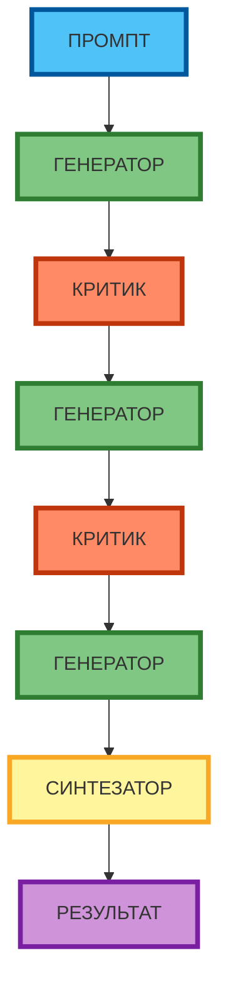

# Метод «Критик и генератор»: разделение ролей в одном промпте

В предыдущей статье вы узнали, как комбинировать несколько ролей в одном промпте для решения сложных задач. Но иногда нужно не просто объединить роли, а **разделить** их на «генератора» и «критика», чтобы получить более качественный результат через итеративное улучшение. В этой статье вы научитесь организовывать диалог между двумя ролями внутри одного промпта и создавать рабочие промпты, которые действительно работают.

## Суть метода: разделение ролей на «генератора» идей и «критика»

Метод «Критик и генератор» — это техника, при которой в одном промпте задаются **две роли с противоположными функциями**:

- **Генератор** — предлагает идеи, решения, варианты. Его задача — генерировать максимум вариантов, даже если они неидеальны. Генератор не должен критиковать свои идеи — это задача критика.
- **Критик** — анализирует предложения генератора, выявляет сильные и слабые стороны, даёт конкретные рекомендации по улучшению. Критик не должен предлагать новые идеи — это задача генератора.

**Цель метода** — имитировать процесс итеративного улучшения внутри одной нейросети. Генератор создаёт черновик, критик его оценивает, генератор дорабатывает — и так несколько циклов. Это позволяет получить более проработанный результат, чем при однократной генерации.

В отличие от многоуровневой ролевой игры, здесь роли **не дополняют друг друга**, а **противостоят** — генератор предлагает, критик критикует. Это создаёт напряжение, которое заставляет нейросеть глубже анализировать задачу и находить слабые места.

**Почему метод работает:**

- Генератор не ограничен самокритикой и может предлагать смелые идеи.
- Критик, не отвлекаясь на генерацию, фокусируется на анализе и выявлении проблем.
- Несколько циклов улучшения позволяют найти оптимальное решение, которое не очевидно с первого взгляда.

## Организация диалога: последовательность шагов, правила взаимодействия

Чтобы метод работал эффективно, нужно чётко организовать диалог между ролями.

**Последовательность шагов:**

1. **Постановка задачи** — пользователь формулирует задачу, задаёт роли и критерии оценки.
2. **Генерация** — генератор предлагает 2–3 варианта решения с обоснованием.
3. **Критика** — критик анализирует каждый вариант по заданным критериям, выявляет сильные и слабые стороны, даёт конкретные рекомендации.
4. **Улучшение** — генератор дорабатывает предложения с учётом критики, объясняя, что изменилось.
5. **Синтез** — финальный этап, где лучшие элементы объединяются в итоговый ответ.

**Правила взаимодействия (обязательно указывать в промпте):**

- Генератор не критиkuje свои идеи — это задача критика.
- Критик не предлагает новые идеи — это задача генератора.
- Каждый цикл должен заканчиваться конкретными рекомендациями, а не общими замечаниями («хорошо/плохо»).
- Количество итераций ограничивается (обычно 3–5 циклов).
- При расхождении мнений модератор (или пользователь) принимает решение.



**Рисунок 1.** «Цикл взаимодействия „генератор → критик“» (loop diagram). Промпт задаёт цикл: генератор предлагает → критик анализирует → генератор улучшает → синтезатор формирует результат. Каждый этап имеет чёткую зону ответственности.

## Когда применять метод: задачи на улучшение, оптимизацию, поиск слабых мест

Метод «Критик и генератор» эффективен не для всех задач. Его стоит применять, когда:

- **Нужен качественный результат** — задача важна, и однократная генерация даёт слишком поверхностный ответ.
- **Требуется оптимизация** — нужно найти слабые места в решении, предложении, стратегии.
- **Есть противоречивые требования** — нужно сбалансировать несколько критериев (бюджет vs качество, скорость vs глубина).
- **Важно выявить риски** — критик помогает увидеть потенциальные проблемы, которые генератор упускает.

**Когда метод неэффективен:**

- Простые задачи (написать email, перевести текст, ответить на вопрос) — избыточен, достаточно одной роли.
- Задачи, требующие креатива без ограничений — критик может «задавить» нестандартные идеи.
- Слабые модели — если модель не справляется с ролью критика (не может выявить слабые места), метод не работает.

## Примеры использования метода для разных типов задач

**Пример 1: Улучшение бизнес-предложения (полный рабочий промпт)**

```markdown
Ты — команда из двух специалистов, работающих над бизнес-предложением для компании с 50 сотрудниками. Компания занимается разработкой ПО, средний чек сделки — 500 000 рублей, цикл продажи — 3 месяца. Цель — увеличить конверсию в сделку с 15% до 25%.

1. Генератор — специалист по генерации идей и формулировок. Задача — предложить 3 варианта структуры бизнес-предложения. Каждый вариант должен содержать: заголовок, проблему клиента, решение, преимущества, стоимость, призыв к действию. Генератор не критикует свои идеи — это задача критика.

2. Критик — специалист по анализу и оценке. Задача — проанализировать каждый вариант по критериям: убедительность (насколько предложение решает проблему клиента), реалистичность (насколько предложение соответствует возможностям компании), риск отказа (насколько легко клиенту сказать «нет»). Критик не предлагает новые идеи — это задача генератора.

Правила взаимодействия:
- Генератор предлагает 3 варианта структуры предложения.
- Критик анализирует каждый вариант по трём критериям и даёт конкретные рекомендации по улучшению (что добавить, что убрать, как переформулировать).
- Генератор дорабатывает предложения с учётом критики, объясняя, что изменилось и почему.
- После 3 циклов модератор формирует финальную версию предложения.

Задача: улучшить бизнес-предложение о внедрении CRM-системы. Варианты должны учитывать, что компания уже использует Excel для управления сделками, а сотрудники сопротивляются изменениям.
```

**Разбор примера 1:**

- **Контекст** — указан явно (50 сотрудников, средний чек, цикл продажи, текущая конверсия, цель). Это позволяет генератору и критику работать с конкретными данными, а не общими фразами.
- **Критерии оценки** — чётко заданы (убедительность, реалистичность, риск отказа). Критик не может сказать «это плохо» — он должен обосновать, почему.
- **Правила взаимодействия** — явно прописаны. Генератор не критикует, критик не предлагает новые идеи. Это предотвращает смешение ролей.
- **Ограничение циклов** — 3 цикла. Это не даёт нейросети зациклиться на бесконечных правках.
- **Конкретная задача** — улучшить предложение о внедрении CRM, с учётом сопротивления сотрудников. Это не абстрактная задача, а конкретная проблема.

**Пример 2: Оптимизация кода (полный рабочий промпт)**

```markdown
Ты — команда из двух специалистов, работающих над оптимизацией функции обработки массива из 100 000 элементов. Функция должна работать на Python 3.9+, время выполнения — не более 2 секунд на стандартном ноутбуке, использование памяти — не более 500 МБ.

1. Генератор — специалист по алгоритмам и структурам данных. Задача — предложить 2 варианта реализации функции. Каждый вариант должен содержать: алгоритм, сложность по времени и памяти, пример кода, обоснование выбора. Генератор не критикует свои идеи — это задача критика.

2. Критик — специалист по производительности и качеству кода. Задача — проанализировать каждый вариант по критериям: время выполнения (Big O и реальное время), использование памяти, читаемость кода, соответствие стандартам PEP 8, потенциальные ошибки (edge cases). Критик не предлагает новые идеи — это задача генератора.

Правила взаимодействия:
- Генератор предлагает 2 варианта реализации.
- Критик анализирует каждый вариант по пяти критериям и даёт конкретные рекомендации (что изменить в коде, какие edge cases добавить, как улучшить читаемость).
- Генератор дорабатывает код с учётом критики, объясняя, что изменилось и почему.
- После 4 циклов модератор формирует финальную версию функции с комментариями.

Задача: оптимизировать функцию, которая принимает список словарей и возвращает агрегированные данные по заданным ключам. Текущая реализация работает 15 секунд и использует 1.2 ГБ памяти.
```

**Разбор примера 2:**

- **Конкретные ограничения** — Python 3.9+, время ≤ 2 сек, память ≤ 500 МБ. Это не абстрактная «оптимизация», а задача с измеримыми критериями.
- **Критерии оценки** — 5 конкретных критериев (Big O, реальное время, память, читаемость, PEP 8, edge cases). Критик не может быть поверхностным.
- **Правила взаимодействия** — явно прописаны. Генератор не критикует, критик не предлагает новые идеи.
- **Ограничение циклов** — 4 цикла. Это даёт достаточно итераций для оптимизации, но не позволяет зациклиться.
- **Конкретная задача** — оптимизировать функцию с известными проблемами (15 сек, 1.2 ГБ). Это не «улучшить код», а решить конкретную проблему.

## Типичные ошибки: смешение ролей, отсутствие чёткой структуры диалога

**Ошибка 1: Смешение ролей**

Генератор начинает критиковать свои идеи («этот вариант, наверное, не подойдёт»), а критик — предлагать новые («а что если сделать так...»). Это размывает функции и снижает качество результата.

**Решение:** Чётко прописать в промпте: «Генератор не критикует свои идеи — это задача критика. Критик не предлагает новые идеи — это задача генератора».

**Ошибка 2: Отсутствие чёткой структуры диалога**

Промпт не задаёт последовательность шагов, и нейросеть генерирует хаотичный текст, где роли путаются, а результат не структурирован.

**Решение:** Задать явную последовательность: «Сначала генератор предлагает 3 варианта, затем критик анализирует каждый, затем генератор дорабатывает, затем модератор формирует финальный ответ».

**Ошибка 3: Слишком много итераций без ограничения**

Без ограничения циклов нейросеть может зациклиться на мелких правках (изменение одного слова, перестановка предложений) и не прийти к финальному ответу.

**Решение:** Указать максимальное количество циклов (3–5) и условие остановки: «После третьего цикла модератор формирует финальный ответ, даже если не все замечания учтены».

**Ошибка 4: Отсутствие критериев оценки**

Критик анализирует «в общем» («это хорошо/плохо»), без конкретных критериев. Это делает критику субъективной и бесполезной.

**Решение:** Задать конкретные критерии: «Критик анализирует по критериям: бюджет, сроки, аудитория, риски, практическая реализуемость».

## Способы повышения эффективности метода (добавление третьей роли — «модератора»)

Метод можно усилить, добавив **третью роль — «модератора»** (или «синтезатора»).

**Функции модератора:**

- Следит за соблюдением правил взаимодействия (генератор не критикует, критик не предлагает).
- При расхождении мнений принимает решение, чья позиция приоритетна.
- Объединяет лучшие идеи в финальный ответ.
- Останавливает цикл, когда результат достигнут или достигнуто максимальное количество итераций.

**Пример промпта с модератором (фрагмент):**

```markdown
3. Модератор — специалист по управлению процессом. Задача — следить за соблюдением правил, разрешать споры между генератором и критиком, принимать решение о приоритете критериев, формировать финальный ответ. Модератор не предлагает новые идеи и не критикует — это задачи генератора и критика.

Правила взаимодействия:
- Генератор и критик не нарушают свои роли.
- Модератор разрешает споры и решает, когда цикл завершён.
- Максимум 4 цикла. После четвёртого цикла модератор формирует финальный ответ.
```

## Практические рекомендации по формулировке промптов с разделением ролей

**Рекомендация 1: Чётко определяйте роли**

Пропишите не только название роли, но и её задачу и ограничения: «Генератор предлагает 3 варианта, даже если они неидеальны. Генератор не критикует свои идеи — это задача критика».

**Рекомендация 2: Задавайте критерии оценки**

Критик должен знать, по каким критериям оценивать: «Критик анализирует по критериям: бюджет (до 100 000 руб.), сроки (2 недели), аудитория (CTO), практическая реализуемость».

**Рекомендация 3: Ограничивайте количество итераций**

Укажите явно: «Максимум 3 цикла. После третьего цикла модератор формирует финальный ответ, даже если не все замечания учтены».

**Рекомендация 4: Добавляйте этап синтеза**

В конце промпта укажите: «После завершения цикла модератор объединяет лучшие идеи в итоговый ответ с обоснованием выбора».

**Рекомендация 5: Давайте контекст**

Укажите конкретные данные: «Компания с 50 сотрудниками, средний чек 500 000 руб., цикл продажи 3 месяца, текущая конверсия 15%, цель — 25%».

## Таблица: Шаблон диалога с распределением ролей

| Этап | Роль | Задача | Пример формулировки |
|------|------|--------|---------------------|
| **Постановка задачи** | Пользователь | Сформулировать цель, контекст, критерии | «Улучшить конверсию лендинга. Контекст: компания 50 чел., средний чек 500к, цикл 3 мес. Критерии: бюджет до 100к, аудитория CTO, срок 2 нед.» |
| **Генерация идей** | Генератор | Предложить 2–3 варианта с обоснованием | «Генератор: предложи 3 варианта структуры лендинга. Каждый вариант: заголовок, проблема, решение, преимущества, стоимость, CTA.» |
| **Анализ и критика** | Критик | Выявить сильные/слабые стороны по критериям | «Критик: проанализируй каждый вариант по критериям: убедительность, реалистичность, риск отказа. Дай конкретные рекомендации.» |
| **Улучшение** | Генератор | Доработать с учётом критики | «Генератор: доработай варианты с учётом замечаний критика. Объясни, что изменилось и почему.» |
| **Синтез** | Модератор | Объединить лучшие идеи в финальный ответ | «Модератор: выбери лучшие элементы из всех вариантов и сформируй финальный план с обоснованием.» |

**Рисунок 2.** «Шаблон диалога с распределением ролей». Таблица содержит 5 этапов с указанием роли, задачи и примера формулировки. Каждый этап имеет чёткую зону ответственности.

## Практическое задание

**Задание:** Проведите диалог «генератор → критик» по теме улучшения идеи онлайн-курса по промптам.

**Требования:**
- Генератор предлагает 3 улучшения идеи курса (структура, контент, формат, цена, маркетинг).
- Критик анализирует каждое улучшение по критериям: бюджет (до 50 000 руб. на запуск), сроки (2 недели на подготовку), аудитория (новички без опыта в ИИ), практическая ценность (можно применить сразу после курса).
- После 3 циклов модератор формирует финальный план улучшений.
- Промпт должен содержать контекст: курс для новичков, 8 модулей, 50 статей, текущая конверсия 5%, цель — 15%.

**Чек-лист для самопроверки:**

- [ ] Роли чётко определены в промпте (генератор, критик, модератор)
- [ ] Заданы правила взаимодействия (генератор предлагает → критик анализирует → модератор синтезирует)
- [ ] Ограничено количество итераций (3–5 циклов)
- [ ] Указаны критерии оценки (бюджет, сроки, аудитория, практическая ценность)
- [ ] Добавлен финальный этап синтеза лучших идей
- [ ] Промпт содержит конкретную задачу и контекст (конверсия, цель, аудитория)
- [ ] Требуется обоснование каждой позиции критика (не «это плохо», а «это слабо по критерию X, потому что...»)
- [ ] Результат — конкретный план улучшений с обоснованием, а не общие советы

## Заключение

Метод «Критик и генератор» позволяет получать более качественные результаты за счёт итеративного улучшения внутри одного промпта. Главное — чётко разделить роли, задать правила взаимодействия, указать критерии оценки и ограничить количество циклов. В следующей статье вы узнаете, как управлять контекстом промпта для получения более точных и релевантных ответов.