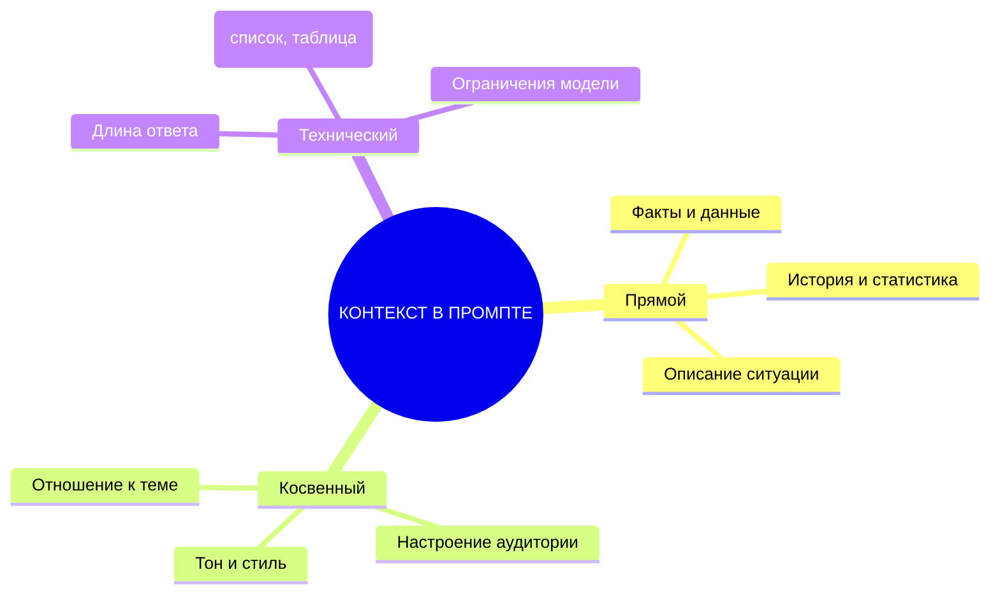

# Контекст: как дать нейросети больше информации

В предыдущей статье вы узнали, как разделить роли «генератора» и «критика» в одном промпте для итеративного улучшения результата. Но даже самый проработанный промпт не даст хорошего ответа, если нейросети не хватает **контекста** — информации, которая помогает ей понять задачу. В этой статье вы научитесь давать нейросети контекст так, чтобы она выдавала точные, релевантные и полезные ответы.

## Понятие контекста в промптах и его роль в качестве ответа

**Контекст** — это дополнительная информация, которую вы предоставляете нейросети, чтобы она лучше поняла задачу и дала более точный ответ. Без контекста нейросеть работает «вслепую» — она не знает, кто вы, какая у вас цель, какие ограничения есть, какие данные важны.

**Роль контекста в качестве ответа:**

- **Точность** — контекст помогает нейросети избежать общих фраз и дать конкретный ответ, учитывающий вашу ситуацию.
- **Релевантность** — контекст направляет нейросеть на нужную тему и не даёт ей «уйти в сторону».
- **Полезность** — контекст позволяет нейросети учитывать ваши ограничения (бюджет, сроки, аудитория) и предлагать реалистичные решения.
- **Согласованность** — контекст помогает нейросети сохранить стиль, тон и логику ответа.

**Пример без контекста:**

```
Напиши пост для соцсетей о пользе йоги.
```

**Результат:** Общий текст про «йога помогает расслабиться, улучшает гибкость, снижает стресс». Подойдёт для любой аудитории, но не решает конкретную задачу.

**Пример с контекстом:**

```
Напиши пост для соцсетей о пользе йоги. Целевая аудитория: женщины 30–40 лет, офисные работницы, у которых есть дети и мало времени на себя. Цель поста: привлечь на бесплатный вебинар «Йога для начинающих за 15 минут в день». Style: дружелюбный, мотивирующий, без давления. Длина: 150–200 слов. В посте упомяни, что вебинар бесплатный и пройдёт 15 марта в 20:00.
```

**Результат:** Пост, который говорит именно с этой аудиторией, решает её проблемы (мало времени, дети, усталость) и содержит конкретный призыв к действию.

## Виды контекста: прямой (факты, данные), косвенный (настроение, тон), технический (ограничения по длине, формат)

Контекст можно разделить на три вида:

**1. Прямой контекст (факты, данные)**

Это конкретная информация, которая нужна нейросети для ответа:

- Факты о компании, продукте, ситуации.
- Данные (цифры, статистика, результаты).
- История предыдущих взаимодействий.
- Описание проблемы или задачи.

**Пример:** «Компания с 50 сотрудниками, средний чек 500 000 руб., цикл продажи 3 месяца, текущая конверсия 15%, цель — 25%.»

**2. Косвенный контекст (настроение, тон)**

Это информация о том, **как** нужно говорить:

- Тон (дружелюбный, формальный, мотивирующий, осторожный).
- Стиль (эмоциональный, аналитический, юмористический).
- Настроение аудитории (усталые, скептичные, мотивированные).
- Отношение к теме (позитивное, нейтральное, негативное).

**Пример:** «Стиль: дружелюбный и мотивирующий, как разговор с подругой. Не давить, не использовать слова „должна“, „обязательно“.»

**3. Технический контекст (ограничения по длине, формат)**

Это ограничения и требования к ответу:

- Длина ответа (слов, символов, токенов).
- Формат (список, таблица, абзацы, JSON).
- Структура (заголовки, подзаголовки, блоки).
- Ограничения модели (максимум токенов в контексте).

**Пример:** «Длина поста: 150–200 слов. Формат: 3 абзаца + призыв к действию в конце. Не использовать эмодзи.»

## Способы подачи контекста: нумерованный список, маркированный список, абзацы с подзаголовками, таблица

Контекст можно подавать разными способами. Выбор зависит от объёма информации и типа задачи.

**1. Нумерованный список**

Используется, когда важен **порядок** элементов или нужно перечислить **шаги/этапы**.

**Пример:**

```
1. Целевая аудитория: женщины 30–40 лет, офисные работницы, у которых есть дети.
2. Цель поста: привлечь на бесплатный вебинар 15 марта в 20:00.
3. Стиль: дружелюбный, мотивирующий, без давления.
4. Длина: 150–200 слов.
5. Обязательно упомянуть: бесплатный, 15 минут в день, для начинающих.
```

**2. Маркированный список**

Используется, когда **порядок не важен**, но нужно перечислить **требования** или **характеристики**.

**Пример:**

```
- Целевая аудитория: женщины 30–40 лет, офисные работницы, матери.
- Цель: привлечение на бесплатный вебинар.
- Стиль: дружелюбный, мотивирующий.
- Длина: 150–200 слов.
- Обязательные элементы: бесплатный, 15 минут в день, для начинающих.
```

**3. Абзацы с подзаголовками**

Используется, когда контекст **объёмный** и его нужно структурировать для удобства чтения.

**Пример:**

```
## Аудитория
Женщины 30–40 лет, офисные работницы, у которых есть дети. У них мало времени на себя, они устали, скептичны к «очередной йоге».

## Цель поста
Привлечь на бесплатный вебинар «Йога для начинающих за 15 минут в день». Вебинар пройдёт 15 марта в 20:00.

## Стиль и тон
Дружелюбный, мотивирующий, как разговор с подругой. Не давить, не использовать слова «должна», «обязательно».

## Ограничения
Длина: 150–200 слов. Без эмодзи. Формат: 3 абзаца + призыв к действию в конце.
```

**4. Таблица «Параметр → Значение»**

Используется, когда нужно **чётко сопоставить** параметр и его значение. Удобно для технических задач.

**Пример:**

| Параметр | Значение |
|----------|----------|
| Целевая аудитория | Женщины 30–40 лет, офисные работницы, матери |
| Цель поста | Привлечение на бесплатный вебинар 15 марта в 20:00 |
| Стиль | Дружелюбный, мотивирующий, без давления |
| Длина | 150–200 слов |
| Обязательные элементы | Бесплатный, 15 минут в день, для начинающих |
| Запрещённые элементы | Эмодзи, слова «должна», «обязательно» |

## Оптимальный объём контекста (200–500 токенов) и последствия превышения лимита

**Оптимальный объём контекста:** 200–500 токенов.

**Почему именно этот объём:**

- **200 токенов** — достаточно для простых задач (пост в соцсети, email, короткий текст).
- **300–400 токенов** — оптимально для большинства задач (анализ, креатив, обучение).
- **500 токенов** — максимум для сложных задач с большим количеством данных.

**Последствия превышения лимита:**

- **Потеря информации** — нейросеть «забывает» начало промпта и работает только с последними токенами.
- **Путаница** — нейросеть смешивает разные части контекста и выдаёт противоречивый ответ.
- **Снижение качества** — нейросеть начинает «плыть», теряет фокус, выдаёт общие фразы.
- **Переполнение контекстного окна** — если промпт + ответ превышают лимит модели (например, 4096 токенов), модель обрезает ответ или выдаёт ошибку.

**Правило:** Если контекст занимает больше 500 токенов — это сигнал, что его нужно **разбить** или **сжать**.

## Что делать, если контекст слишком большой: разбиение на части, использование цепочек промптов, выделение ключевых тезисов

Если контекст слишком большой, есть три способа справиться:

**1. Разбиение на части (Semantic Chunking)**

Разделите контекст на логические блоки и подавайте их **отдельно** или **по очереди**.

**Пример:**

- Блок 1: Аудитория и цель.
- Блок 2: Стиль и тон.
- Блок 3: Ограничения и формат.
- Блок 4: Данные и факты.

**2. Использование цепочек промптов (Chain of Prompts)**

Разделите задачу на **несколько промптов**, где каждый следующий использует результат предыдущего.

**Пример:**

- Промпт 1: «Проанализируй аудиторию и опиши её проблемы и потребности.»
- Промпт 2: «На основе анализа аудитории напиши пост о пользе йоги.»
- Промпт 3: «Проверь пост на соответствие стилю и ограничениям.»

**3. Выделение ключевых тезисов (Compression)**

Сожмите контекст до **ключевых тезисов**, убрав второстепенные детали.

**Пример:**

**До сжатия (600 токенов):**

«Женщины 30–40 лет, офисные работницы, у которых есть дети. Они встают в 6:30, готовят детей в школу, едут на работу, работают 9 часов, забирают детей, готовят ужин, укладывают детей спать, и только в 22:00 у них появляется время на себя. Они устали, раздражены, скептичны к „очередной йоге“, потому что уже пробовали и не получилось. Они не верят, что можно заниматься йогой 15 минут в день и получить результат...»

**После сжатия (150 токенов):**

«Женщины 30–40 лет, офисные работницы, матери. У них мало времени на себя (22:00–23:00), они устали, скептичны к „очередной йоге“. Не верят, что 15 минут в день дадут результат.»

## Примеры эффективной подачи контекста для разных задач (анализ данных, креатив, обучение)

**Пример 1: Анализ данных (таблица + нумерованный список)**

```
## Данные для анализа
| Месяц | Выручка | Затраты | Прибыль |
|-------|---------|---------|---------|
| Январь | 1 200 000 | 800 000 | 400 000 |
| Февраль | 1 350 000 | 850 000 | 500 000 |
| Март | 1 100 000 | 900 000 | 200 000 |

## Задача
Проанализируй данные и ответь на вопросы:
1. В каком месяце маржа прибыли была максимальной?
2. Почему в марте прибыль упала, несмотря на снижение выручки?
3. Какие рекомендации можно дать на апрель?

## Ограничения
- Отвечай только на основе данных в таблице.
- Не придумывай факты, которых нет в таблице.
- Формат ответа: 3 абзаца (анализ, причина, рекомендации).
```

**Пример 2: Креатив (абзацы с подзаголовками)**

```
## Продукт
SaaS-платформа для управления проектами. Цена: 990 руб./мес. Бесплатный период: 14 дней. Аудитория: руководители команд 5–15 человек в IT-компаниях.

## Задача
Напиши email-рассылку из 3 писем для привлечения на бесплатный период.

## Стиль
Дружелюбный, но не навязчивый. Не давить, не пугать «если не купите, то...». Говорить как с коллегой.

## Ограничения
- Каждое письмо: 150–200 слов.
- Обязательно упомянуть: 14 дней бесплатно, 990 руб./мес., отмена в любой момент.
- Не использовать эмодзи.
```

**Пример 3: Обучение (нумерованный список + таблица)**

```
## Тема
Как объяснить новичку, что такое токены в LLM.

## Аудитория
Новички без технического образования, 25–35 лет, интересуются ИИ, но боятся сложных терминов.

## План урока
1. Введение (2 мин): что такое токен простыми словами.
2. Пример (3 мин): «Сколько токенов в предложении „Я люблю йогу“?»
3. Практика (5 мин): посчитать токены в своём предложении.
4. Вывод (2 мин): зачем это нужно знать.

## Формат
- Каждый пункт плана: заголовок + 2–3 предложения объяснения.
- Использовать аналогии (токен = кусочек пазла).
- Не использовать термины «нейросеть», «вектор», «embedding».
```

## Типичные ошибки при подаче контекста и способы их избежать

**Ошибка 1: Слишком много контекста (stuffing)**

Вы добавляете всё, что знаете, и промпт превращается в «стену текста». Нейросеть теряет фокус и выдаёт общий ответ.

**Решение:** Ограничьте контекст 500 токенами. Если нужно больше — разбейте на части или используйте цепочки промптов.

**Ошибка 2: Противоречивый контекст**

Вы указываете противоречивые требования: «Стиль: дружелюбный, но формальный. Тон: мотивирующий, но осторожный.» Нейросеть не понимает, что делать.

**Решение:** Убирайте противоречия. Выберите один стиль, один тон, одно ограничение.

**Ошибка 3: Отсутствие критериев оценки**

Вы даёте контекст, но не указываете, **как** нейросеть должна его использовать.

**Пример ошибки:** «Напиши пост о йоге. Аудитория: женщины 30–40 лет.»

**Решение:** Укажите, **как** использовать контекст: «Напиши пост о йоге. Аудитория: женщины 30–40 лет. Учти, что у них мало времени, они устали, скептичны к „очередной йоге“.»

**Ошибка 4: Контекст без цели**

Вы даёте данные, но не объясняете, **зачем** они нужны.

**Пример ошибки:** «Компания: 50 сотрудников, средний чек 500 000 руб.»

**Решение:** Укажите цель: «Компания: 50 сотрудников, средний чек 500 000 руб. Цель: увеличить конверсию с 15% до 25%.»

## Схема: «Способы подачи контекста в промпте» (mind map)



**Рисунок 1.** «Способы подачи контекста в промпте» (mind map). Три вида контекста: прямой (факты, данные), косвенный (тон, настроение), технический (ограничения, формат).

## Таблица: «6 способов подачи контекста»

| Способ | Описание | Пример | Ограничения |
|--------|----------|--------|-------------|
| **Краткий абзац (1–2 предложения)** | Один-два предложения с ключевой информацией | «Целевая аудитория: женщины 30–40 лет, офисные работницы, матери. У них мало времени на себя.» | Не подходит для сложных задач с большим количеством данных |
| **Нумерованный список (3–5 пунктов)** | Перечисление с порядковыми номерами | «1. Аудитория: женщины 30–40 лет. 2. Цель: привлечение на вебинар. 3. Стиль: дружелюбный.» | Порядок важен; не подходит, если порядок не имеет значения |
| **Маркированный список** | Перечисление без номеров | «- Аудитория: женщины 30–40 лет. - Цель: привлечение на вебинар. - Стиль: дружелюбный.» | Не показывает приоритет; не подходит для последовательных шагов |
| **Таблица «Параметр → Значение»** | Чёткое сопоставление параметра и значения | \| Параметр \| Значение \| \| Аудитория \| Женщины 30–40 лет \| | Не подходит для объёмных описаний; требует структурированных данных |
| **Диалог (вопрос-ответ)** | Формат диалога для уточнения деталей | «Q: Какая аудитория? A: Женщины 30–40 лет. Q: Какая цель? A: Привлечение на вебинар.» | Неудобно читать; подходит только для простых задач |
| **Аналогия («Представь, что ты…")** | Сравнение с известной ситуацией | «Представь, что ты — женщина 35 лет, у тебя двое детей, ты работаешь в офисе и устаёшь к вечеру.» | Требует точной аналогии; не подходит для технических задач |

**Рисунок 2.** «6 способов подачи контекста». Таблица содержит 6 способов с описанием, примером и ограничениями.

## Практическое задание

**Задание:** Добавьте контекст к промпту «Напиши пост для соцсетей о пользе йоги».

**Требования:**

- Целевая аудитория: женщины 30–40 лет, офисные работницы, у которых есть дети.
- Цель: привлечение на бесплатный вебинар «Йога для начинающих за 15 минут в день».
- Стиль: дружелюбный и мотивирующий, без давления.
- Длина: 150–200 слов.
- Обязательно упомянуть: бесплатный, 15 минут в день, для начинающих, вебинар 15 марта в 20:00.
- Запрещено: эмодзи, слова «должна», «обязательно».

**Часть 1:** Напишите **базовый вариант** (без контекста).

**Часть 2:** Напишите **вариант с контекстом** (используйте один из 6 способов подачи контекста).

**Часть 3:** Сравните два варианта и ответьте:
- Какой вариант более релевантен для целевой аудитории?
- Какой вариант лучше решает задачу (привлечение на вебинар)?
- Какой способ подачи контекста вы использовали и почему?

**Чек-лист для самопроверки:**

- [ ] Указана целевая аудитория (женщины 30–40 лет, офисные работницы, матери)
- [ ] Указана цель (привлечение на бесплатный вебинар 15 марта в 20:00)
- [ ] Указан стиль (дружелюбный, мотивирующий, без давления)
- [ ] Указана длина (150–200 слов)
- [ ] Указаны обязательные элементы (бесплатный, 15 минут в день, для начинающих)
- [ ] Указаны запрещённые элементы (эмодзи, слова «должна», «обязательно»)
- [ ] Выбран подходящий способ подачи контекста (список, таблица, абзацы)
- [ ] Базовый вариант и вариант с контекстом явно различаются по релевантности и полезности

## Заключение

Контекст — это ключ к качественным ответам нейросети. Без контекста нейросеть работает «вслепую»; с контекстом она даёт точные, релевантные и полезные ответы. Главное — не перегружать промпт (оптимально 200–500 токенов), выбирать подходящий способ подачи и чётко указывать, как нейросеть должна использовать контекст. В следующей статье вы узнаете, как задавать ограничения и условия, чтобы управлять результатом без потери качества.