# Ограничения и условия: как управлять результатом без потери качества

В предыдущей статье вы узнали, как давать нейросети контекст, чтобы она лучше понимала задачу. Но контекст — это только часть управления результатом. Вторая часть — **ограничения и условия**, которые задают границы, в рамках которых нейросеть должна работать. В этой статье вы научитесь формулировать ограничения так, чтобы результат был точным, релевантным и качественным, без потери креативности и гибкости.

## Зачем нужны ограничения в промптах

**Ограничения** — это правила и границы, которые вы устанавливаете для ответа нейросети. Без ограничений нейросеть работает «на автопилоте» — она выдаёт общий, усреднённый ответ, который может не соответствовать вашим целям.

**Зачем нужны ограничения:**

- **Контроль качества** — ограничения не дают нейросети «уйти в сторону» и выдать нерелевантный или низкокачественный ответ.
- **Соответствие требованиям** — ограничения помогают учесть ваши конкретные нужды (бюджет, сроки, аудитория, формат).
- **Предсказуемость** — ограничения делают результат более предсказуемым и повторяемым.
- **Эффективность** — ограничения сокращают количество итераций, потому что ответ с первого раза ближе к желаемому.

**Пример без ограничений:**

```
Напиши статью о том, как выбрать ноутбук для работы.
```

**Результат:** Общий текст про «обратите внимание на процессор, память, экран». Подойдёт для любой аудитории, но не решает конкретную задачу.

**Пример с ограничениями:**

```
Напиши статью о том, как выбрать ноутбук для работы. Объём: 500 слов. Стиль: информационно-аналитический. Тон: нейтральный. Обязательно используй ключевые слова: «производительность», «автономность», «эргономика». Не используй слова «лучший», «идеальный», «рекомендую». Структура: введение (100 слов), 3 раздела по 120 слов, вывод (40 слов).
```

**Результат:** Статья, которая соответствует всем требованиям: объём, стиль, тон, ключевые слова, структура. Нейросеть не может «схалтурить» и выдать общий текст.

## Виды ограничений: объём текста, стиль изложения, тон, структура ответа, целевая аудитория, ключевые слова, запрещённые темы

Ограничения можно разделить на несколько видов:

**1. Ограничения по объёму текста**

- Длина ответа (слов, символов, токенов).
- Количество пунктов в списке.
- Количество абзацев или разделов.

**Пример:** «Напиши текст объёмом 300–400 слов.»

**2. Ограничения по стилю изложения**

- Стиль (научный, публицистический, разговорный, академический).
- Жанр (обзор, инструкция, эссе, кейс-стади).

**Пример:** «В стиле научного обзора.»

**3. Ограничения по тону**

- Тон (дружелюбный, нейтральный, мотивирующий, осторожный, скептичный).
- Эмоциональная окраска (позитивный, нейтральный, негативный).

**Пример:** «Тон: дружелюбный и мотивирующий.»

**4. Ограничения по структуре ответа**

- Наличие заголовков и подзаголовков.
- Количество разделов.
- Формат (список, таблица, абзацы, JSON).

**Пример:** «Используй подзаголовки для каждого раздела. Структура: введение, 3 раздела, вывод.»

**5. Ограничения по целевой аудитории**

- Возраст, пол, профессия, уровень знаний.
- Проблемы и потребности аудитории.

**Пример:** «Аудитория: женщины 30–40 лет, офисные работницы, матери.»

**6. Ограничения по ключевым словам**

- Обязательные слова и фразы.
- Запрещённые слова и фразы.

**Пример:** «Обязательно используй слова: „производительность“, „автономность“, „эргономика“.»

**7. Ограничения по запрещённым темам**

- Темы, которые нельзя упоминать.
- Аспекты, которые нельзя затрагивать.

**Пример:** «Не упоминай политику, религию, личные предпочтения.»

## Как формулировать ограничения без потери качества результата

**Правило 1: Используйте положительные инструкции вместо отрицательных**

**Некорректно:** «Не используй жаргон.»

**Корректно:** «Используй простой язык, понятный неспециалисту.»

**Почему:** Положительные инструкции направляют нейросеть на нужное действие, а отрицательные — только запрещают, но не говорят, что делать вместо этого.

**Правило 2: Будьте конкретны и измеримы**

**Некорректно:** «Напиши короткий текст.»

**Корректно:** «Напиши текст объёмом 150–200 слов.»

**Почему:** «Короткий» — это субъективно. 150–200 слов — это измеримо.

**Правило 3: Используйте сильные слова («must», «exactly», «no more than»)**

**Некорректно:** «Постарайся не использовать эмодзи.»

**Корректно:** «Не используй эмодзи. Это обязательное требование.»

**Почему:** «Постарайся» — это слабая формулировка. Нейросеть может её игнорировать. «Обязательное требование» — это сильная формулировка.

**Правило 4: Ограничивайте количество ограничений (3–5)**

**Некорректно:** 10 ограничений в одном промпте.

**Корректно:** 3–5 ключевых ограничений.

**Почему:** Слишком много ограничений перегружает модель, и она начинает игнорировать их.

**Правило 5: Организуйте ограничения в список**

**Некорректно:** Ограничения в тексте промпта без структуры.

**Корректно:**

```
Ограничения:
- Объём: 300–400 слов.
- Стиль: информационно-аналитический.
- Тон: нейтральный.
- Ключевые слова: «производительность», «автономность», «эргономика».
```

**Почему:** Список легче читать и следовать.

## Баланс между жёсткими и гибкими ограничениями

**Жёсткие ограничения** — это правила, которые **нельзя нарушать**:

- Объём: «точно 350 слов».
- Формат: «только JSON».
- Запрещённые слова: «не использовать слово „лучший“».

**Гибкие ограничения** — это правила, которые **желательно соблюдать**, но можно адаптировать:

- Стиль: «в стиле научного обзора, но можно использовать элементы публицистики».
- Тон: «дружелюбный, но не навязчивый».
- Структура: «желательно использовать подзаголовки».

**Баланс:**

- **Слишком жёсткие ограничения** — нейросеть теряет гибкость, ответ становится шаблонным, креативность падает.
- **Слишком гибкие ограничения** — нейросеть игнорирует их, ответ не соответствует требованиям.
- **Оптимальный баланс** — 2–3 жёстких ограничения (объём, формат, ключевые слова) + 2–3 гибких ограничения (стиль, тон, структура).

**Пример баланса:**

```
Жёсткие ограничения:
- Объём: 500 слов (не меньше 450, не больше 550).
- Формат: 5 абзацев.
- Ключевые слова: «производительность», «автономность», «эргономика».

Гибкие ограничения:
- Стиль: информационно-аналитический, можно использовать элементы публицистики.
- Тон: нейтральный, но можно добавить лёгкую эмоциональную окраску.
```

## Примеры корректных и некорректных формулировок ограничений

**Ограничение по объёму:**

- **Некорректно:** «Напиши короткую статью.»
- **Корректно:** «Напиши статью объёмом 400–500 слов.»

**Ограничение по стилю:**

- **Некорректно:** «Напиши в хорошем стиле.»
- **Корректно:** «Напиши в стиле научного обзора с элементами публицистики.»

**Ограничение по тону:**

- **Некорректно:** «Напиши позитивно.»
- **Корректно:** «Тон: дружелюбный и мотивирующий, как разговор с подругой.»

**Ограничение по структуре:**

- **Некорректно:** «Напиши с заголовками.»
- **Корректно:** «Структура: введение (80 слов), 3 раздела по 120 слов, вывод (60 слов).»

**Ограничение по ключевым словам:**

- **Некорректно:** «Используй слова про производительность.»
- **Корректно:** «Обязательно используй ключевые слова: „производительность“, „автономность“, „эргономика“.»

**Ограничение по запрещённым словам:**

- **Некорректно:** «Не используй плохие слова.»
- **Корректно:** «Не используй слова: „лучший“, „идеальный“, „рекомендую“, „должен“.»

## Влияние ограничений на креативность и точность ответа

**Влияние на креативность:**

- **Слишком много ограничений** — креативность падает. Нейросеть не может «выходить за рамки», ответ становится шаблонным.
- **Слишком мало ограничений** — креативность растёт, но ответ может быть нерелевантным или низкокачественным.
- **Оптимальное количество** — 3–5 ограничений. Это даёт достаточно свободы для креативности, но не позволяет «уйти в сторону».

**Влияние на точность:**

- **Жёсткие ограничения** (объём, формат, ключевые слова) — точность растёт. Нейросеть точно знает, что нужно сделать.
- **Гибкие ограничения** (стиль, тон) — точность падает, но растёт естественность ответа.
- **Баланс** — жёсткие ограничения для точности + гибкие ограничения для естественности.

**Правило:** Если задача требует высокой точности (анализ данных, юридический текст, техническая документация) — используйте больше жёстких ограничений. Если задача требует креативности (пост в соцсети, креативный текст, идея) — используйте больше гибких ограничений.

## Практические рекомендации по сочетанию нескольких ограничений в одном промпте

**Рекомендация 1: Начинайте с жёстких ограничений**

Сначала укажите объём, формат, ключевые слова — это «каркас» ответа.

**Рекомендация 2: Добавляйте гибкие ограничения вторыми**

Стиль, тон, структура — это «украшения» ответа.

**Рекомендация 3: Ограничивайте количество ограничений (3–5)**

Больше 5 ограничений — нейросеть начинает игнорировать их.

**Рекомендация 4: Организуйте ограничения в список**

```
Ограничения:
- Объём: 500 слов.
- Стиль: информационно-аналитический.
- Тон: нейтральный.
- Ключевые слова: «производительность», «автономность», «эргономика».
```

**Рекомендация 5: Тестируйте ограничения по одному**

Добавьте одно ограничение, проверьте результат. Добавьте второе, проверьте. Это помогает понять, какое ограничение влияет на результат.

**Рекомендация 6: Используйте положительные инструкции**

«Используй простой язык» вместо «Не используй жаргон».

## Схема: «Классификация ограничений в промптах» (tree diagram)

```mermaid
graph TD
    ROOT["ОГРАНИЧЕНИЯ В ПРОМПТАХ"] --> V1["ОБЪЁМ ТЕКСТА"]
    ROOT --> V2["СТИЛЬ ИЗЛОЖЕНИЯ"]
    ROOT --> V3["ТОН"]
    ROOT --> V4["СТРУКТУРА ОТВЕТА"]
    ROOT --> V5["ЦЕЛЕВАЯ АУДИТОРИЯ"]
    ROOT --> V6["КЛЮЧЕВЫЕ СЛОВА"]
    ROOT --> V7["ЗАПРЕЩЁННЫЕ ТЕМЫ"]

    V1 --> V1a["Слова: 300–400"]
    V1 --> V1b["Абзацы: 5"]
    V1 --> V1c["Токены: max 500"]

    V2 --> V2a["Научный"]
    V2 --> V2b["Публицистический"]
    V2 --> V2c["Разговорный"]

    V3 --> V3a["Дружелюбный"]
    V3 --> V3b["Нейтральный"]
    V3 --> V3c["Мотивирующий"]

    V4 --> V4a["Подзаголовки"]
    V4 --> V4b["Список"]
    V4 --> V4c["Таблица"]

    V5 --> V5a["Возраст"]
    V5 --> V5b["Профессия"]
    V5 --> V5c["Уровень знаний"]

    V6 --> V6a["Обязательные"]
    V6 --> V6b["Запрещённые"]

    V7 --> V7a["Политика"]
    V7 --> V7b["Религия"]
    V7 --> V7c["Личные предпочтения"]

    classDef root fill:#1565c0,stroke:#0d47a1,stroke-width:4px,color:#fff
    classDef level1 fill:#e3f2fd,stroke:#1565c0,stroke-width:4px,color:#0d47a1
    classDef level2 fill:#fff3e0,stroke:#f57c00,stroke-width:4px,color:#e65100

    class ROOT root
    class V1,V2,V3,V4,V5,V6,V7 level1
    class V1a,V1b,V1c,V2a,V2b,V2c,V3a,V3b,V3c,V4a,V4b,V4c,V5a,V5b,V5c,V6a,V6b,V7a,V7b,V7c level2
```



**Рисунок 1.** «Классификация ограничений в промптах» (tree diagram). Семь видов ограничений с примерами для каждого.

## Таблица: «Формулировки ограничений для разных типов»

| Тип ограничения | Шаблон промпта | Пример | Ошибка |
|-----------------|----------------|--------|--------|
| **Объём** | «Напиши текст объёмом X–Y слов» | «Статья на 350 слов о преимуществах удалённой работы» | «Напиши короткую статью» (неизмеримо) |
| **Стиль** | «В стиле [стиль]» | «Обзор новинок смартфонов в академическом стиле» | «Напиши в хорошем стиле» (субъективно) |
| **Тон** | «Тон: [тон]» | «Пост для соцсетей с вдохновляющим тоном» | «Напиши позитивно» (неясно, что значит) |
| **Структура** | «Используй [элемент] для каждого раздела» | «Инструкция с 3 разделами и выводами» | «Напиши с заголовками» (неясно, сколько и где) |
| **Целевая аудитория** | «Аудитория: [описание]» | «Аудитория: женщины 30–40 лет, офисные работницы, матери» | «Напиши для обычных людей» (неясно, кто это) |
| **Ключевые слова** | «Обязательно используй слова: [список]» | «Обязательно используй: „производительность“, „автономность“, „эргономика“» | «Используй слова про производительность» (неясно, какие именно) |
| **Запрещённые темы** | «Не упоминай [темы]» | «Не упоминай политику, религию, личные предпочтения» | «Не пиши о плохом» (неясно, что значит «плохое») |

**Рисунок 3.** «Формулировки ограничений для разных типов». Таблица содержит 7 типов ограничений с шаблонами, примерами и ошибками.

## Практическое задание

**Задание:** Напишите промпт с 4 ограничениями для генерации статьи на тему «Как выбрать ноутбук для работы».

**Ограничения:**

1. Объём: 500 слов.
2. Стиль: информационно-аналитический.
3. Тон: нейтральный.
4. Ключевые слова: «производительность», «автономность», «эргономика».

**Требования к промпту:**

- Укажите все 4 ограничения явно.
- Добавьте контекст (аудитория, цель, формат).
- Организуйте ограничения в список.
- Используйте положительные инструкции.

**Чек-лист для самопроверки:**

- [ ] Указано ограничение по объёму (500 слов)
- [ ] Указано ограничение по стилю (информационно-аналитический)
- [ ] Указано ограничение по тону (нейтральный)
- [ ] Указаны ключевые слова («производительность», «автономность», «эргономика»)
- [ ] Ограничения организованы в список
- [ ] Использованы положительные инструкции (не «не используй», а «используй»)
- [ ] Добавлен контекст (аудитория, цель, формат)
- [ ] Количество ограничений не превышает 5

## Заключение

Ограничения — это мощный инструмент управления результатом. Они помогают нейросети выдавать точные, релевантные и качественные ответы. Главное — формулировать ограничения конкретно, измеримо, с использованием положительных инструкций, и не перегружать промпт слишком большим количеством ограничений. В следующей статье вы узнаете, как задавать форматы ответов, чтобы получать результат в нужном виде.