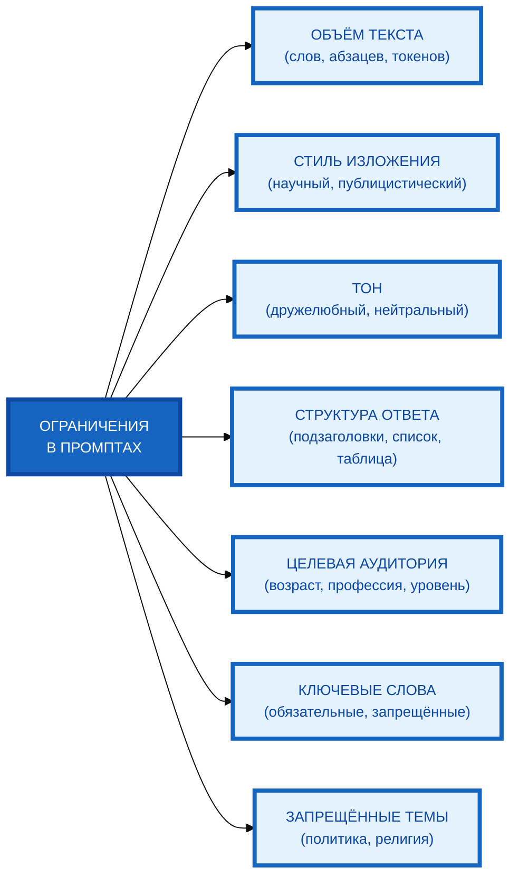

# Схема: «Классификация ограничений в промптах» (вертикальная компоновка)

**Рисунок.** «Классификация ограничений в промптах» (вертикальная компоновка). Корневой узел слева, 7 блоков один над другим. Компактная 1:1, текст полный, цвета и рамки 4px.