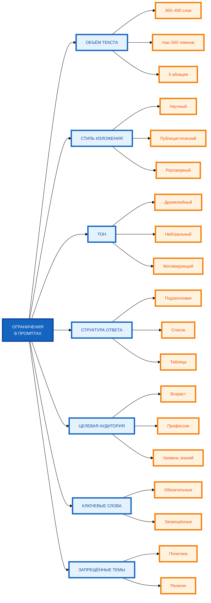

# Схема: «Классификация ограничений в промптах» (3-уровневая компоновка)

**Рисунок.** «Классификация ограничений в промптах» (3-уровневая компоновка). Уровень 1: корневой узел слева. Уровень 2: 7 блоков в среднем ряду. Уровень 3: 2–3 примера справа напротив каждого блока. Компактная 1:1, текст полный, цвета и рамки 4px.