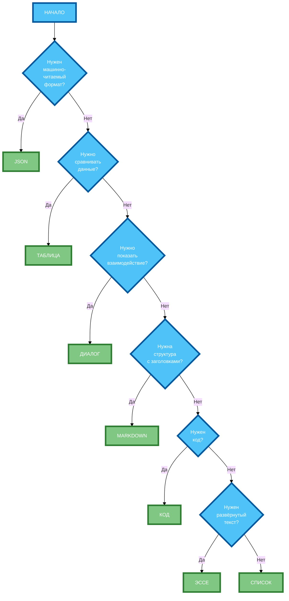

# Форматы ответов: как указать нужный вид результата

В предыдущей статье вы узнали, как формулировать ограничения и условия, чтобы управлять результатом без потери качества. Но даже если нейросеть понимает задачу и соблюдает ограничения, она может выдать ответ в **неудобном формате** — сплошным текстом, когда нужна таблица, или списком, когда нужен JSON. В этой статье вы научитесь указывать формат ответа так, чтобы получать результат в нужном виде без лишних доработок.

## Основные форматы вывода: список, таблица, эссе, диалог, JSON, Markdown, код

**Формат вывода** — это структура, в которой нейросеть должна представить ответ. Выбор формата зависит от цели задачи и того, как вы планируете использовать результат.

**1. Список (нумерованный или маркированный)**

Используется, когда нужно **перечислить** элементы без сложных связей.

**Пример:** «Напиши 5 советов по улучшению сна.»

**2. Таблица**

Используется, когда нужно **сопоставить** параметры и значения, или сравнить несколько вариантов.

**Пример:** «Представь результат в виде таблицы с колонками „Совет“ и „Объяснение“.»

**3. Эссе (развёрнутый текст)**

Используется, когда нужно **объяснить** тему, привести аргументы, дать развёрнутый анализ.

**Пример:** «Напиши развёрнутый текст на тему „Как выбрать ноутбук для работы“.»

**4. Диалог**

Используется, когда нужно **показать** взаимодействие между сторонами, или представить информацию в форме разговора.

**Пример:** «Создай диалог между врачом и пациентом о пользе йоги.»

**5. JSON**

Используется, когда нужно **машинно-читаемое** представление данных для дальнейшей обработки программой.

**Пример:** «Выведи результат в формате JSON с полями „номер“, „совет“, „описание“.»

**6. Markdown**

Используется, когда нужно **структурировать** текст с заголовками, списками, таблицами для публикации.

**Пример:** «Используй заголовки и списки Markdown для оформления ответа.»

**7. Код**

Используется, когда нужно **представить** результат как фрагмент программного кода.

**Пример:** «Представь результат как фрагмент кода на Python с комментариями.»

## Как указать формат без использования кода (естественным языком)

**Формат можно указать естественным языком**, без кода и специальных инструкций. Главное — **чёткость и конкретность**.

**Правило 1: Используйте глаголы действия**

- «Напиши 5 пунктов…»
- «Представь в виде таблицы…»
- «Создай диалог между…»
- «Выведи результат в формате JSON…»
- «Используй заголовки и списки Markdown…»
- «Представь результат как фрагмент кода на Python…»

**Правило 2: Указывайте структуру явно**

- «Структура: введение (80 слов), 3 раздела по 120 слов, вывод (60 слов).»
- «Колонки таблицы: „Совет“, „Объяснение“, „Пример“.»
- «Поля JSON: „номер“, „совет“, „описание“.»

**Правило 3: Добавляйте примеры (Few-shot)**

Если формат сложный, добавьте **пример** желаемого ответа:

```
Пример ответа:
{
  "совет_1": {
    "номер": 1,
    "совет": "Ложитесь спать в одно и то же время",
    "описание": "Это помогает синхронизировать циркадные ритмы..."
  }
}
```

**Правило 4: Указывайте, что НЕ нужно**

- «Не добавляй комментарии и объяснения.»
- «Не оборачивай JSON в Markdown code blocks.»
- «Выведи только JSON, без дополнительного текста.»

## Альтернативные способы описания структуры ответа

**1. Описание в тексте промпта**

```
Структура ответа:
- Введение (80 слов): общая информация о теме.
- 3 раздела по 120 слов: каждый раздел — один аспект темы.
- Вывод (60 слов): итоговые рекомендации.
```

**2. Таблица «Элемент → Описание»**

```
| Элемент | Описание |
|---------|----------|
| Введение | 80 слов, общая информация |
| Раздел 1 | 120 слов, аспект производительности |
| Раздел 2 | 120 слов, аспект автономности |
| Раздел 3 | 120 слов, аспект эргономики |
| Вывод | 60 слов, итоговые рекомендации |
```

**3. Пример структуры (Few-shot)**

```
Пример структуры:
1. Введение
   [текст введения]
2. Раздел 1: Производительность
   [текст раздела 1]
3. Раздел 2: Автономность
   [текст раздела 2]
4. Раздел 3: Эргономика
   [текст раздела 3]
5. Вывод
   [текст вывода]
```

**4. JSON Schema (для сложных структур)**

```
{
  "type": "object",
  "properties": {
    "введение": { "type": "string" },
    "разделы": {
      "type": "array",
      "items": {
        "type": "object",
        "properties": {
          "заголовок": { "type": "string" },
          "текст": { "type": "string" }
        }
      }
    },
    "вывод": { "type": "string" }
  }
}
```

## Примеры промптов для каждого формата

**Пример 1: Нумерованный список**

```
Напиши 5 советов по улучшению сна для офисных работников. Каждый совет должен содержать: номер, заголовок (3–5 слов), объяснение (20–30 слов). Формат: нумерованный список. Не добавляй введение и вывод.
```

**Пример 2: Таблица**

```
Представь 5 советов по улучшению сна в виде таблицы с колонками: «Номер», «Совет», «Объяснение». Каждый совет — 20–30 слов. Не добавляй текст до и после таблицы.
```

**Пример 3: Эссе**

```
Напиши развёрнутый текст на тему «Как выбрать ноутбук для работы». Объём: 500 слов. Стиль: информационно-аналитический. Тон: нейтральный. Структура: введение (80 слов), 3 раздела по 120 слов (производительность, автономность, эргономика), вывод (60 слов). Обязательно используй ключевые слова: «производительность», «автономность», «эргономика».
```

**Пример 4: Диалог**

```
Создай диалог между врачом-сомнологом и пациентом (офисный работник, 35 лет) о пользе йоги для улучшения сна. Диалог должен содержать: 6 реплик врача, 5 реплик пациента. Каждая реплика — 15–25 слов. Формат: «Врач: [текст]» и «Пациент: [текст]». Не добавляй комментарии и объяснения.
```

**Пример 5: JSON**

```
Выведи 5 советов по улучшению сна в формате JSON. Структура:
{
  "советы": [
    {
      "номер": 1,
      "совет": "Ложитесь спать в одно и то же время",
      "описание": "Это помогает синхронизировать циркадные ритмы..."
    }
  ]
}
Выведи только JSON, без дополнительного текста и комментариев.
```

**Пример 6: Markdown**

```
Напиши статью о пользе йоги для улучшения сна. Используй заголовки и списки Markdown. Структура: # Заголовок, ## Подзаголовок, - Маркированный список, 1. Нумерованный список. Объём: 400 слов. Не добавляй текст до и после Markdown-разметки.
```

**Пример 7: Код**

```
Представь 5 советов по улучшению сна как фрагмент кода на Python. Каждый совет — функция с docstring. Код должен быть валидным Python 3.9+. Добавь комментарии к каждой функции. Не добавляй текст до и после кода.
```

## Типичные ошибки при указании формата (несовместимость форматов, избыточная детализация)

**Ошибка 1: Несовместимость форматов**

**Некорректно:** «Напиши пост в формате JSON с Markdown-разметкой.»

**Почему не работает:** JSON и Markdown — несовместимые форматы. JSON — это структура данных, Markdown — это разметка текста.

**Корректно:** «Напиши пост в формате Markdown.» или «Выведи результат в формате JSON.»

**Ошибка 2: Избыточная детализация**

**Некорректно:** «Напиши таблицу с колонками: „Номер“, „Совет“, „Объяснение“, „Пример“, „Источник“, „Дата“, „Автор“.»

**Почему не работает:** Слишком много колонок. Нейросеть теряет фокус и может пропустить часть колонок.

**Корректно:** «Напиши таблицу с колонками: „Совет“ и „Объяснение“.»

**Ошибка 3: Противоречивые требования**

**Некорректно:** «Напиши JSON с Markdown-разметкой внутри строк.»

**Почему не работает:** JSON не должен содержать Markdown-разметку. Это нарушает структуру JSON.

**Корректно:** «Напиши JSON с plain text в строках, без Markdown-разметки.»

**Ошибка 4: Отсутствие примера**

**Некорректно:** «Выведи результат в формате JSON.»

**Почему не работает:** Нейросеть не знает точную структуру JSON (какие поля, какие типы данных).

**Корректно:** «Выведи результат в формате JSON с полями: „номер“, „совет“, „описание“.» + пример структуры.

## Как комбинировать форматы в одном промпте

**Комбинирование форматов** — это указание нескольких форматов для разных частей ответа.

**Пример 1: Текст + Таблица**

```
Напиши статью о пользе йоги для улучшения сна. Структура:
- Введение (80 слов): текст в формате эссе.
- Таблица: 5 советов с колонками «Совет» и «Объяснение».
- Вывод (60 слов): текст в формате эссе.
```

**Пример 2: JSON + Markdown**

```
Выведи 5 советов по улучшению сна в двух форматах:
1. JSON: массив объектов с полями «номер», «совет», «описание».
2. Markdown: нумерованный список с заголовками и описаниями.
Раздели два формата разделителем: ---JSON--- и ---MARKDOWN---.
```

**Пример 3: Диалог + Таблица**

```
Создай диалог между врачом и пациентом о пользе йоги. После диалога добавь таблицу с колонками: «Реплика», «Кто говорит», «Ключевой тезис».
```

**Правило комбинирования:** Указывайте **чёткий разделитель** между форматами и **структуру** каждого формата.

## Влияние формата на восприятие и полезность результата

**Влияние на восприятие:**

- **Список** — легко сканировать, быстро усваивать. Подходит для инструкций и советов.
- **Таблица** — удобно сравнивать, находить информацию. Подходит для данных и сравнений.
- **Эссе** — удобно читать, но требует времени. Подходит для объяснений и аргументации.
- **Диалог** — живо, интересно, но может быть избыточным. Подходит для демонстрации взаимодействия.
- **JSON** — машинно-читаемый, но неудобен для человека. Подходит для программной обработки.
- **Markdown** — структурирован, удобен для публикации. Подходит для блогов и документации.
- **Код** — точен, но требует технических знаний. Подходит для разработчиков.

**Влияние на полезность:**

- **Неправильный формат** — результат неудобен для использования (например, JSON для публикации в блоге).
- **Правильный формат** — результат сразу готов к использованию (например, Markdown для публикации, JSON для API).

**Правило:** Выбирайте формат **под задачу**, а не «как удобнее нейросети».

## Схема: «Выбор формата вывода» (decision tree)



**Рисунок 1.** «Выбор формата вывода» (decision tree). Шесть вопросов ведут к одному из семи форматов.

## Таблица: «8 шаблонов для разных форматов»

| Формат | Структура промпта | Пример запроса | Пример ответа |
|--------|-------------------|----------------|---------------|
| **Нумерованный список** | «Напиши N пунктов…» | «Напиши 5 советов по улучшению сна.» | 1. Ложитесь спать в одно и то же время… |
| **Маркированный список** | «Перечисли в виде маркированного списка…» | «Перечисли 5 преимуществ йоги.» | - Улучшает гибкость… |
| **Таблица** | «Представь в виде таблицы с колонками…» | «Представь 5 советов в таблице с колонками „Совет“ и „Объяснение“.» | \| Совет \| Объяснение \| \| Ложитесь спать… \| Это помогает… |
| **Эссе** | «Напиши развёрнутый текст на тему…» | «Напиши развёрнутый текст на тему „Как выбрать ноутбук“.» | Выбор ноутбука для работы — это важное решение… |
| **Диалог** | «Создай диалог между X и Y о…» | «Создай диалог между врачом и пациентом о пользе йоги.» | Врач: Добрый день! Какой у вас сон? Пациент: Я плохо сплю… |
| **JSON** | «Выведи результат в формате JSON с полями…» | «Выведи 5 советов в JSON с полями „номер“, „совет“, „описание“.» | { "советы": [ { "номер": 1, "совет": "…", "описание": "…" } ] } |
| **Markdown** | «Используй заголовки и списки Markdown…» | «Напиши статью в Markdown с заголовками и списками.» | # Заголовок\n\n## Подзаголовок\n\n- Пункт 1 |
| **Код** | «Представь результат как фрагмент кода на Python…» | «Представь 5 советов как фрагмент кода на Python.» | def improve_sleep():\n    """Ложитесь спать в одно и то же время"""\n    pass |

**Рисунок 2.** «8 шаблонов для разных форматов». Таблица содержит 8 форматов с структурой промпта, примером запроса и примером ответа.

## Практическое задание

**Задание:** Запросите один и тот же контент («5 советов по улучшению сна») в 4 разных форматах.

**Требования:**

1. **Нумерованный список:** «Напиши 5 советов по улучшению сна. Каждый совет — 20–30 слов.»
2. **Таблица:** «Представь 5 советов по улучшению сна в виде таблицы с колонками „Совет“ и „Объяснение“.»
3. **Диалог:** «Создай диалог между врачом-сомнологом и пациентом (офисный работник, 35 лет) о 5 советах по улучшению сна. 6 реплик врача, 5 реплик пациента.»
4. **JSON:** «Выведи 5 советов по улучшению сна в формате JSON с полями „номер“, „совет“, „описание“.»

**Часть 1:** Напишите 4 промпта (по одному для каждого формата).

**Часть 2:** Получите ответы от нейросети.

**Часть 3:** Сравните 4 формата и ответьте:
- Какой формат удобнее для публикации в блоге?
- Какой формат удобнее для программной обработки?
- Какой формат удобнее для понимания и запоминания?
- Какой формат вы бы выбрали для задачи «передать 5 советов коллеге»?

**Чек-лист для самопроверки:**

- [ ] Нумерованный список: указан формат (нумерованный список), указан объём (20–30 слов на совет)
- [ ] Таблица: указаны колонки («Совет», «Объяснение»), указан формат (таблица)
- [ ] Диалог: указаны участники (врач и пациент), указан объём (6 реплик врача, 5 реплик пациента)
- [ ] JSON: указаны поля («номер», «совет», «описание»), указан формат (JSON)
- [ ] Все 4 промпта запрашивают один и тот же контент (5 советов по улучшению сна)
- [ ] Сравнение 4 форматов проведено по 4 критериям (публикация, обработка, понимание, передача коллеге)
- [ ] Выбран оптимальный формат для конкретной задачи

## Заключение

Формат ответа — это не просто «как красиво выглядит», а **как удобно использовать результат**. Правильный формат экономит время на доработку, повышает полезность ответа и делает его готовым к применению. Главное — чётко указывать формат естественным языком, добавлять примеры структуры и избегать несовместимых комбинаций. В следующей статье вы узнаете, как задавать тон и стиль, чтобы ответ «звучал» так, как нужно.