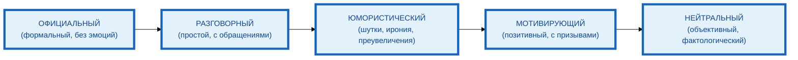

# Тон и стиль: как задать настроение текста

В предыдущей статье вы узнали, как указывать формат ответа, чтобы получать результат в нужном виде. Но даже если формат правильный, **тон и стиль** текста определяют, как аудитория его воспримет. Один и тот же факт можно подать сухо и официально, или живо и с юмором — и реакция будет совершенно разной. В этой статье вы научитесь задавать тон и стиль так, чтобы текст «звучал» именно так, как нужно.

## Влияние тона и стиля на восприятие ответа

**Тон** — это эмоциональная окраска текста: дружелюбный, нейтральный, ироничный, мотивирующий. **Стиль** — это манера изложения: научный, публицистический, разговорный, поэтический.

**Влияние тона и стиля на восприятие:**

- **Доверие** — официальный тон повышает доверие к информации, разговорный — снижает формальность и повышает близость.
- **Запоминаемость** — юмористический тон делает текст запоминающимся, нейтральный — информативным, но менее эмоциональным.
- **Убедительность** — мотивирующий тон побуждает к действию, критический — заставляет задуматься, саркастический — может оттолкнуть.
- **Соответствие аудитории** — тон должен соответствовать ожиданиям аудитории. Для корпоративного бюллетеня — официальный, для блога — разговорный, для соцсетей — юмористический или мотивирующий.

**Пример:**

**Тема:** «Преимущества утренней зарядки»

**Официально-деловой тон:**

«Утренняя зарядка способствует повышению работоспособности, улучшению кровообращения и снижению риска заболеваний опорно-двигательного аппарата. Согласно исследованиям, регулярные физические упражнения в утренние часы повышают концентрацию внимания на 20–30%.»

**Разговорный тон:**

«Знаешь, что происходит, когда ты делаешь зарядку утром? Твоё тело просыпается, кровь разгоняется, и ты уже не зеваешь на первом совещании. Плюс, исследования говорят, что концентрация внимания растёт на 20–30%. Не плохо для 15 минут в день, правда?»

**Юмористический тон:**

«Утренняя зарядка — это когда ты просыпаешься и думаешь: „Сейчас я стану суперменом“. А потом понимаешь, что супермен — это тот, кто смог встать с кровати и не упасть. Но если серьёзно, то 15 минут упражнений реально дают +20–30% к концентрации. И да, это лучше, чем кофе. Ну, почти.»

Один и тот же факт (зарядка улучшает концентрацию на 20–30%) воспринимается совершенно по-разному в зависимости от тона.

## Основные категории тона: официальный, разговорный, юмористический, мотивирующий, нейтральный

**1. Официальный тон**

- Используется в: деловой переписке, отчётах, официальных документах, корпоративных бюллетенях.
- Характеристики: формальный язык, отсутствие сленга, полные предложения, отсутствие эмоциональной окраски.
- Пример: «Согласно результатам исследования, проведённого в 2024 году…»

**2. Разговорный тон**

- Используется в: блогах, личной переписке, неформальных текстах.
- Характеристики: простые предложения, разговорные обороты, обращения («ты», «вы»), эмоциональная окраска.
- Пример: «Знаешь, что происходит, когда ты делаешь зарядку утром?»

**3. Юмористический тон**

- Используется в: соцсетях, развлекательном контенте, блогах.
- Характеристики: шутки, ирония, преувеличения, разговорный язык, самоирония.
- Пример: «Утренняя зарядка — это когда ты просыпаешься и думаешь: „Сейчас я стану суперменом“.»

**4. Мотивирующий тон**

- Используется в: мотивационных текстах, постах в соцсетях, рекламных материалах.
- Характеристики: позитивная эмоциональная окраска, призывы к действию, вдохновляющие формулировки.
- Пример: «Начни свой день с зарядки — и ты почувствуешь, как энергия наполняет тебя!»

**5. Нейтральный тон**

- Используется в: новостных текстах, аналитических материалах, инструкциях.
- Характеристики: отсутствие эмоциональной окраски, факты без оценок, объективность.
- Пример: «Утренняя зарядка повышает концентрацию внимания на 20–30%.»

## Словарь терминов для описания тона (20+ слов)

**20 терминов для описания тона и стиля:**

1. **Официальный** — формальный, без эмоциональной окраски, с полными предложениями.
2. **Разговорный** — простой, с разговорными оборотами, обращениями («ты», «вы»).
3. **Юмористический** — с шутками, иронией, преувеличениями.
4. **Мотивирующий** — позитивный, вдохновляющий, с призывами к действию.
5. **Нейтральный** — объективный, без эмоциональной окраски, фактологический.
6. **Дружелюбный** — тёплый, открытый, с элементами заботы и поддержки.
7. **Ироничный** — с иронией, но без злости, с лёгким подтекстом.
8. **Научный** — с терминологией, ссылками на исследования, объективный.
9. **Поэтический** — образный, с метафорами, эмоционально насыщенный.
10. **Драматический** — с напряжением, контрастами, эмоциональными пиками.
11. **Саркастический** — с сарказмом, часто с негативной окраской.
12. **Вдохновляющий** — мотивирующий, с позитивными образами, призывающий к действию.
13. **Критический** — с анализом недостатков, указанием на проблемы.
14. **Оптимистичный** — позитивный, с верой в лучшее, с акцентом на возможности.
15. **Пессимистичный** — негативный, с акцентом на риски и проблемы.
16. **Сатирический** — с сатирой, высмеиванием недостатков, часто с политическим подтекстом.
17. **Лирический** — эмоциональный, с личными переживаниями, образный.
18. **Объективный** — без личной оценки, основанный на фактах.
19. **Субъективный** — с личной оценкой, эмоциональной окраской.
20. **Патетический** — возвышенный, с пафосом, эмоционально насыщенный.

## Как чётко указать тон в промпте

**Правило 1: Используйте конкретные термины из словаря**

**Некорректно:** «Напиши в хорошем стиле.»

**Корректно:** «Напиши в официально-деловом тоне.»

**Правило 2: Добавьте описание тона (1–2 предложения)**

**Корректно:** «Тон: официально-деловой. Используй формальный язык, полные предложения, избегай сленга и эмоциональной окраски.»

**Правило 3: Укажите, как НЕ нужно писать**

**Корректно:** «Тон: официально-деловой. Не используй слова „я“, „мы“, „наш“. Не используй сленг и разговорные обороты.»

**Правило 4: Добавьте пример (Few-shot)**

**Корректно:**

```
Тон: официально-деловой.

Пример:
«Согласно результатам исследования, проведённого в 2024 году, регулярные физические упражнения в утренние часы повышают концентрацию внимания на 20–30%.»
```

**Правило 5: Укажите, для какой аудитории**

**Корректно:** «Тон: официально-деловой, для корпоративного бюллетеня. Аудитория: сотрудники компании, 25–50 лет, с высшим образованием.»

## Примеры промптов с разными тонами для одной темы

**Тема:** «Преимущества утренней зарядки»

**Пример 1: Официально-деловой тон (для корпоративного бюллетеня)**

```
Напиши текст о преимуществах утренней зарядки для корпоративного бюллетеня. Тон: официально-деловой. Аудитория: сотрудники компании, 25–50 лет, с высшим образованием. Объём: 300 слов. Стиль: информационно-аналитический. Не используй слова «я», «мы», «наш». Не используй сленг и разговорные обороты. Обязательно используй ключевые слова: «производительность», «концентрация внимания», «здоровье».

Пример тона:
«Согласно результатам исследования, проведённого в 2024 году, регулярные физические упражнения в утренние часы повышают концентрацию внимания на 20–30%.»
```

**Пример 2: Разговорный тон (для блога)**

```
Напиши пост для блога о преимуществах утренней зарядки. Тон: разговорный. Аудитория: женщины и мужчины 25–40 лет, офисные работники, которые хотят улучшить самочувствие. Объём: 400 слов. Стиль: дружелюбный, с элементами личного опыта. Используй обращения «ты», «вы». Можно использовать разговорные обороты.

Пример тона:
«Знаешь, что происходит, когда ты делаешь зарядку утром? Твоё тело просыпается, кровь разгоняется, и ты уже не зеваешь на первом совещании.»
```

**Пример 3: Юмористический тон (для соцсетей)**

```
Напиши пост для соцсетей о преимуществах утренней зарядки. Тон: юмористический. Аудитория: молодые люди 20–35 лет, активные пользователи соцсетей. Объём: 150–200 слов. Стиль: лёгкий, с шутками и самоиронией. Можно использовать преувеличения и иронию. Не используй эмодзи.

Пример тона:
«Утренняя зарядка — это когда ты просыпаешься и думаешь: „Сейчас я стану суперменом“. А потом понимаешь, что супермен — это тот, кто смог встать с кровати и не упасть.»
```

## Типичные ошибки: противоречивость указаний, слишком абстрактные формулировки

**Ошибка 1: Противоречивость указаний**

**Некорректно:** «Тон: официально-деловой, но с элементами юмора.»

**Почему не работает:** Официально-деловой тон и юмор — противоречивые указания. Нейросеть не понимает, как их сочетать.

**Корректно:** «Тон: официально-деловой.» или «Тон: юмористический.»

**Ошибка 2: Слишком абстрактные формулировки**

**Некорректно:** «Напиши в хорошем стиле.»

**Почему не работает:** «Хороший стиль» — это субъективно. Нейросеть не знает, что значит «хороший».

**Корректно:** «Напиши в официально-деловом тоне с элементами научного стиля.»

**Ошибка 3: Отсутствие примера**

**Некорректно:** «Тон: дружелюбный.»

**Почему не работает:** «Дружелюбный» — это абстрактно. Нейросеть может интерпретировать это по-разному.

**Корректно:** «Тон: дружелюбный, как разговор с подругой. Пример: „Знаешь, что происходит, когда ты делаешь зарядку утром?“»

**Ошибка 4: Смешение тона и стиля**

**Некорректно:** «Тон: научный, с элементами юмора.»

**Почему не работает:** Научный стиль и юмор — несовместимы. Научный стиль требует объективности, юмор — субъективности.

**Корректно:** «Стиль: научный. Тон: нейтральный.»

## Практические советы по выбору тона в зависимости от целевой аудитории и цели текста

**Совет 1: Учитывайте возраст аудитории**

- 18–25 лет: разговорный, юмористический, ироничный.
- 25–40 лет: дружелюбный, мотивирующий, разговорный.
- 40+ лет: официальный, нейтральный, научный.

**Совет 2: Учитывайте профессию аудитории**

- IT-специалисты: разговорный, ироничный, с техническим сленгом.
- Менеджеры: официальный, мотивирующий, с элементами аналитики.
- Творческие профессии: поэтический, лирический, вдохновляющий.

**Совет 3: Учитывайте цель текста**

- Привлечение внимания: юмористический, мотивирующий, драматический.
- Информирование: нейтральный, научный, объективный.
- Побуждение к действию: мотивирующий, вдохновляющий, оптимистичный.
- Критика: критический, саркастический, ироничный.

**Совет 4: Учитывайте канал публикации**

- Корпоративный бюллетень: официальный, нейтральный.
- Блог: разговорный, дружелюбный.
- Соцсети: юмористический, мотивирующий, ироничный.
- Научная статья: научный, объективный, нейтральный.

**Совет 5: Тестируйте тон на небольшой части текста**

Напишите 2–3 предложения в нужном тоне, проверьте результат. Если тон не тот — скорректируйте промпт.

## Схема: «Шкала тонов и стилей» (spectrum diagram)



**Рисунок 1.** «Шкала тонов и стилей» (spectrum diagram). Пять основных тонов расположены на шкале от официального (слева) до нейтрального (справа), с переходными тонами между ними.

## Таблица: «Словарь из 20 терминов для тона и стиля»

| Термин | Описание | Пример использования |
|--------|----------|----------------------|
| **Официальный** | Формальный, без эмоциональной окраски, с полными предложениями | «Согласно результатам исследования…» |
| **Разговорный** | Простой, с разговорными оборотами, обращениями («ты», «вы») | «Знаешь, что происходит, когда ты…» |
| **Юмористический** | С шутками, иронией, преувеличениями | «Утренняя зарядка — это когда ты просыпаешься и думаешь: „Сейчас я стану суперменом“.» |
| **Мотивирующий** | Позитивный, вдохновляющий, с призывами к действию | «Начни свой день с зарядки — и ты почувствуешь, как энергия наполняет тебя!» |
| **Нейтральный** | Объективный, без эмоциональной окраски, фактологический | «Утренняя зарядка повышает концентрацию внимания на 20–30%.» |
| **Дружелюбный** | Тёплый, открытый, с элементами заботы и поддержки | «Я понимаю, как сложно вставать утром. Но давай попробуем вместе.» |
| **Ироничный** | С иронией, но без злости, с лёгким подтекстом | «Конечно, можно и без зарядки. Но тогда не удивляйся, если в 10 утра ты уже зеваешь.» |
| **Научный** | С терминологией, ссылками на исследования, объективный | «Согласно мета-анализу 2024 года, опубликованному в Journal of Sports Medicine…» |
| **Поэтический** | Образный, с метафорами, эмоционально насыщенный | «Утро — это не просто начало дня. Это момент, когда тело просыпается, а душа наполняется светом.» |
| **Драматический** | С напряжением, контрастами, эмоциональными пиками | «Ты просыпаешься. Твоё тело — свинцовое. Но ты знаешь: если не встанешь сейчас, день будет потерян.» |
| **Саркастический** | С сарказмом, часто с негативной окраской | «Конечно, можно проспать. А потом удивляться, почему всё идёт не так.» |
| **Вдохновляющий** | Мотивирующий, с позитивными образами, призывающий к действию | «Каждое утро — это новый шанс. Зарядка — это твой первый шаг к лучшей версии себя.» |
| **Критический** | С анализом недостатков, указанием на проблемы | «Большинство людей не понимают, что утренняя зарядка — это не просто „полезно“. Это необходимость.» |
| **Оптимистичный** | Позитивный, с верой в лучшее, с акцентом на возможности | «Утренняя зарядка — это не обязанность. Это возможность почувствовать себя лучше уже сегодня.» |
| **Пессимистичный** | Негативный, с акцентом на риски и проблемы | «Без утренней зарядки ваше тело будет скованным, а мозг — заторможенным. И это только начало.» |
| **Сатирический** | С сатирой, высмеиванием недостатков, часто с политическим подтекстом | «Утренняя зарядка — это когда ты делаешь упражнения, чтобы потом сидеть 8 часов в офисе. Логика.» |
| **Лирический** | Эмоциональный, с личными переживаниями, образный | «Я помню, как впервые сделал зарядку утром. Тело было тяжёлым, но через 10 минут я почувствовал: день уже не будет таким, как вчера.» |
| **Объективный** | Без личной оценки, основанный на фактах | «Исследования показывают, что утренняя зарядка повышает концентрацию внимания на 20–30%.» |
| **Субъективный** | С личной оценкой, эмоциональной окраска | «Для меня утренняя зарядка — это не просто упражнения. Это ритуал, который задаёт тон всему дню.» |
| **Патетический** | Возвышенный, с пафосом, эмоционально насыщенный | «Утренняя зарядка — это не просто движение. Это акт воли, который определяет, каким будет твой день.» |

**Рисунок 2.** «Словарь из 20 терминов для тона и стиля». Таблица содержит 20 терминов с описанием и примером использования.

## Практическое задание

**Задание:** Напишите 3 промпта на тему «Преимущества утренней зарядки» в разных тонах.

**Требования:**

1. **Официально-деловой тон (для корпоративного бюллетеня):** Аудитория — сотрудники компании, 25–50 лет, с высшим образованием. Объём: 300 слов. Стиль: информационно-аналитический. Не использовать слова «я», «мы», «наш». Не использовать сленг и разговорные обороты.
2. **Разговорный тон (для блога):** Аудитория — женщины и мужчины 25–40 лет, офисные работники. Объём: 400 слов. Стиль: дружелюбный, с элементами личного опыта. Использовать обращения «ты», «вы».
3. **Юмористический тон (для соцсетей):** Аудитория — молодые люди 20–35 лет. Объём: 150–200 слов. Стиль: лёгкий, с шутками и самоиронией. Можно использовать преувеличения и иронию. Не использовать эмодзи.

**Чек-лист для самопроверки:**

- [ ] Промпт 1 (официально-деловой): указан тон (официально-деловой), указана аудитория (сотрудники компании, 25–50 лет), указан объём (300 слов), указан стиль (информационно-аналитический), указаны запрещённые элементы (слова «я», «мы», «наш», сленг)
- [ ] Промпт 2 (разговорный): указан тон (разговорный), указана аудитория (женщины и мужчины 25–40 лет), указан объём (400 слов), указан стиль (дружелюбный, с элементами личного опыта), указаны разрешённые элементы (обращения «ты», «вы»)
- [ ] Промпт 3 (юмористический): указан тон (юмористический), указана аудитория (молодые люди 20–35 лет), указан объём (150–200 слов), указан стиль (лёгкий, с шутками и самоиронией), указаны разрешённые элементы (преувеличения, ирония), указаны запрещённые элементы (эмодзи)
- [ ] Все 3 промпты запрашивают один и тот же контент (преимущества утренней зарядки)
- [ ] Каждый промпт содержит пример тона (Few-shot)
- [ ] Каждый промпт содержит конкретные инструкции по тону, а не абстрактные формулировки

## Заключение

Тон и стиль — это не просто «как красиво звучит текст», а **как аудитория его воспримет**. Правильный тон повышает доверие, запоминаемость и убедительность текста. Главное — чётко указывать тон конкретными терминами, добавлять примеры и учитывать аудиторию, цель текста и канал публикации. В следующей статье вы узнаете, как использовать негативные ограничения («не делай»), чтобы управлять результатом.