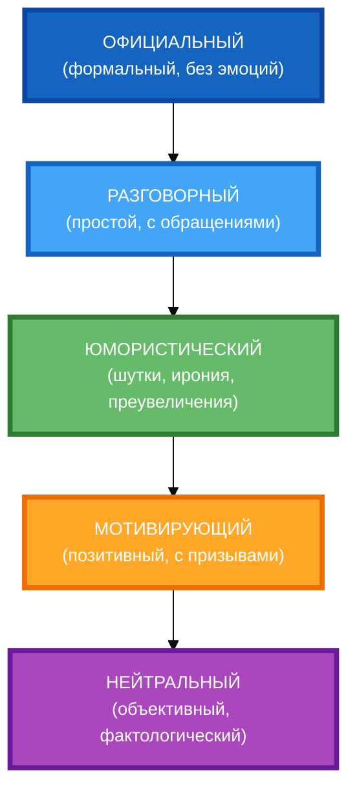

# Схема: «Шкала тонов и стилей» (вертикальная компоновка)

**Рисунок.** «Шкала тонов и стилей» (вертикальная компоновка). Пять тонов в один столбец сверху вниз с равными расстояниями. Компактная 1:1, текст полный, цвета и рамки 4px. Каждый тон имеет свой цвет для визуального разделения.