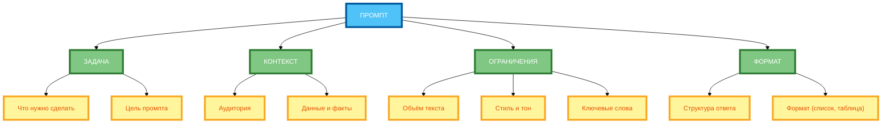
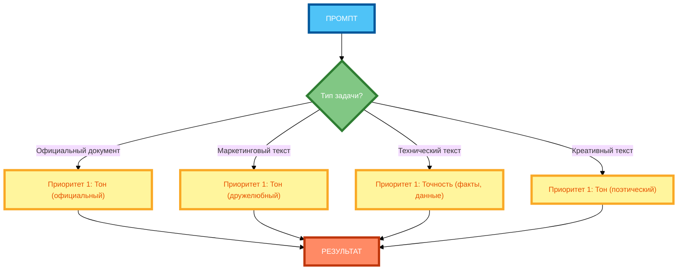

# Приоритеты в промпте: как расставить что важнее

В предыдущей статье вы узнали, как использовать негативные ограничения («не делай»), чтобы управлять результатом. Но даже если все ограничения сформулированы правильно, нейросеть может **не знать, что важнее** — и выдать результат, который не соответствует вашим приоритетам. В этой статье вы научитесь расставлять приоритеты в промпте так, чтобы нейросеть понимала, что критически важно, а что — опционально.

## Зачем нужны приоритеты в промптах

**Приоритеты** — это указание нейросети, **какие компоненты промпта важнее других**. Без приоритетов нейросеть работает «на автопилоте» — она пытается удовлетворить все требования одновременно, но не знает, что делать при конфликте.

**Зачем нужны приоритеты:**

- **Разрешение конфликтов** — когда требования противоречат друг другу (например, «максимальная точность» vs «максимальная креативность»), приоритеты помогают нейросети выбрать, что важнее.
- **Контроль качества** — приоритеты гарантируют, что критически важные параметры будут соблюдены, даже если это означает нарушение второстепенных.
- **Предсказуемость** — приоритеты делают результат более предсказуемым и повторяемым.
- **Эффективность** — приоритеты сокращают количество итераций, потому что ответ с первого раза ближе к желаемому.

**Пример без приоритетов:**

```
Напиши пресс-релиз о запуске нового продукта. Тон: официальный. Структура: заголовок, лид, основная часть, контакты. Ключевые сообщения: 3 тезиса. Объём: 400 слов. Стиль: информативный.
```

**Результат:** Нейросеть может сделать акцент на объёме (400 слов) и упустить ключевые сообщения, или сделать акцент на тоне (официальный) и упустить структуру.

**Пример с приоритетами:**

```
Напиши пресс-релиз о запуске нового продукта. Приоритеты:
1. Тон (официальный) — критически важный.
2. Структура (заголовок, лид, основная часть, контакты) — важный.
3. Ключевые сообщения (3 тезиса) — средний приоритет.
4. Объём (400 слов) — второстепенный.
5. Стиль (информативный) — опциональный.

Если при конфликте приоритетов нужно выбрать, что важнее — выбирай более высокий приоритет.
```

**Результат:** Нейросеть знает, что тон (официальный) важнее объёма, и если нужно пожертвовать одним, то объёмом, а не тоном.

## Компоненты промпта, которым можно назначить приоритеты (задача, контекст, ограничения, формат)

**Приоритеты можно назначить любому компоненту промпта:**

**1. Задача**

- Что нужно сделать.
- Цель промпта.

**Пример приоритета:** «Задача (приоритет 1) — написать пресс-релиз о запуске нового продукта.»

**2. Контекст**

- Информация о ситуации, аудитории, продукте.
- Данные и факты.

**Пример приоритета:** «Контекст (приоритет 2) — аудитория CTO, продукт AI, компания 50 сотрудников.»

**3. Ограничения**

- Объём текста, стиль, тон, структура.
- Ключевые слова, запрещённые темы.

**Пример приоритета:** «Ограничения (приоритет 3) — тон официальный, структура: заголовок, лид, основная часть, контакты.»

**4. Формат**

- Формат ответа (список, таблица, JSON, Markdown).
- Структура ответа.

**Пример приоритета:** «Формат (приоритет 4) — 4 блока: Hook, Проблема, Решение, CTA.»

**5. Дополнительные параметры**

- Примеры (Few-shot).
- Роли.
- Цепочки промптов.

**Пример приоритета:** «Примеры (приоритет 5) — использовать пример пресс-релиза из примера.»

## Способы указания приоритетов: явные (нумерация, ранжирование), неявные (порядок слов, акцент)

**1. Явные способы (рекомендуется)**

**Нумерация:**

```
Приоритеты:
1. Тон (официальный) — критически важный.
2. Структура (заголовок, лид, основная часть, контакты) — важный.
3. Ключевые сообщения (3 тезиса) — средний приоритет.
4. Объём (400 слов) — второстепенный.
5. Стиль (информативный) — опциональный.
```

**Ранжирование:**

```
Ранжирование требований (от высшего к низшему приоритету):
1. Тон (официальный).
2. Структура (заголовок, лид, основная часть, контакты).
3. Ключевые сообщения (3 тезиса).
4. Объём (400 слов).
5. Стиль (информативный).
```

**2. Неявные способы (не рекомендуется для сложных задач)**

**Порядок слов:**

```
Напиши пресс-релиз о запуске нового продукта. Тон: официальный. Структура: заголовок, лид, основная часть, контакты. Ключевые сообщения: 3 тезиса. Объём: 400 слов. Стиль: информативный.
```

**Почему не работает:** Нейросеть может интерпретировать порядок слов как приоритет, но это **неявно** и **ненадёжно**.

**Акцент:**

```
Напиши пресс-релиз о запуске нового продукта. **ОБЯЗАТЕЛЬНО** используй официальный тон. **КРИТИЧЕСКИ ВАЖНО** соблюдать структуру: заголовок, лид, основная часть, контакты.
```

**Почему не работает:** Акцент (жирный шрифт, CAPS LOCK) может не сработать в некоторых моделях, и это **неявно**.

**Рекомендация:** Используйте **явные способы** (нумерация, ранжирование) — они надёжны и однозначны.

## Влияние приоритетов на результат генерации

**Влияние на точность:**

- **Высокий приоритет (1–2)** — нейросеть **обязательно** соблюдает эти параметры, даже если это означает нарушение второстепенных.
- **Средний приоритет (3)** — нейросеть **старается** соблюдать эти параметры, но может пожертвовать ими ради более высоких приоритетов.
- **Низкий приоритет (4–5)** — нейросеть **может** соблюдать эти параметры, но не обязана.

**Влияние на креативность:**

- **Высокий приоритет** — креативность падает, потому что нейросеть ограничена жёсткими рамками.
- **Низкий приоритет** — креативность растёт, потому что нейросеть имеет больше свободы.

**Влияние на время генерации:**

- **Много приоритетов** — нейросеть тратит больше времени на анализ конфликтов и поиск оптимального решения.
- **Мало приоритетов** — нейросеть генерирует ответ быстрее, но результат может быть менее точным.

**Правило:** Чем важнее результат, тем **больше приоритетов** нужно расставить. Для простых задач достаточно 2–3 приоритетов. Для сложных — 4–5.

## Примеры промптов с расставленными приоритетами

**Пример 1: Пресс-релиз (полный рабочий промпт)**

```
Напиши пресс-релиз о запуске нового продукта. Продукт: AI-платформа для управления проектами. Цена: 990 руб./мес. Бесплатный период: 14 дней. Аудитория: руководители команд 5–15 человек в IT-компаниях. Цель: привлечь на бесплатный период.

Приоритеты (от высшего к низшему):
1. Тон (официальный) — критически важный. Используй формальный язык, полные предложения, избегай сленга и эмоциональной окраски.
2. Структура (заголовок, лид, основная часть, контакты) — важный. Заголовок: 1 строка. Лид: 2–3 предложения. Основная часть: 3–4 абзаца. Контакты: имя, должность, email, телефон.
3. Ключевые сообщения (3 тезиса) — средний приоритет. Тезис 1: AI-автоматизация рутинных задач. Тезис 2: 14 дней бесплатно. Тезис 3: Цена 990 руб./мес.
4. Объём (400 слов) — второстепенный. Допустимо отклонение ±50 слов.
5. Стиль (информативный) — опциональный. Можно использовать элементы публицистики.

Если при конфликте приоритетов нужно выбрать, что важнее — выбирай более высокий приоритет.
```

**Разбор:**

- **Приоритет 1 (тон)** — критически важен, потому что пресс-релиз — официальный документ.
- **Приоритет 2 (структура)** — важен, потому что пресс-релиз имеет стандартную структуру.
- **Приоритет 3 (ключевые сообщения)** — средний, потому что нужно донести 3 тезиса, но можно адаптировать формулировки.
- **Приоритет 4 (объём)** — второстепенный, потому что 400 слов — это рекомендация, а не жёсткое ограничение.
- **Приоритет 5 (стиль)** — опциональный, потому что информативный стиль — это желательно, но не обязательно.

**Пример 2: Пост для соцсетей (полный рабочий промпт)**

```
Напиши пост для соцсетей о пользе йоги. Целевая аудитория: женщины 30–40 лет, офисные работницы, матери. Цель: привлечь на бесплатный вебинар «Йога для начинающих за 15 минут в день». Вебинар бесплатный, пройдёт 15 марта в 20:00.

Приоритеты (от высшего к низшему):
1. Тон (дружелюбный и мотивирующий) — критически важный. Как разговор с подругой. Не давить, не использовать слова «должна», «обязательно».
2. Ключевые сообщения (3 тезиса) — важный. Тезис 1: 15 минут в день. Тезис 2: Для начинающих. Тезис 3: Бесплатный вебинар 15 марта в 20:00.
3. Объём (150–200 слов) — средний приоритет. Допустимо отклонение ±20 слов.
4. Стиль (лёгкий, с элементами личного опыта) — второстепенный.
5. Формат (3 абзаца + призыв к действию в конце) — опциональный.

Если при конфликте приоритетов нужно выбрать, что важнее — выбирай более высокий приоритет.
```

**Разбор:**

- **Приоритет 1 (тон)** — критически важен, потому что пост для соцсетей должен быть дружелюбным и мотивирующим.
- **Приоритет 2 (ключевые сообщения)** — важен, потому что нужно донести 3 тезиса.
- **Приоритет 3 (объём)** — средний, потому что 150–200 слов — это рекомендация.
- **Приоритет 4 (стиль)** — второстепенный, потому что лёгкий стиль — это желательно, но не обязательно.
- **Приоритет 5 (формат)** — опциональный, потому что 3 абзаца + CTA — это рекомендация.

## Типичные ошибки: противоречивость приоритетов, отсутствие чёткой иерархии

**Ошибка 1: Противоречивость приоритетов**

**Некорректно:**

```
Приоритеты:
1. Тон (официальный) — критически важный.
2. Тон (дружелюбный) — важный.
```

**Почему не работает:** Приоритет 1 и приоритет 2 противоречат друг другу. Нейросеть не понимает, какой тон выбрать.

**Корректно:**

```
Приоритеты:
1. Тон (официальный) — критически важный.
2. Структура (заголовок, лид, основная часть, контакты) — важный.
```

**Ошибка 2: Отсутствие чёткой иерархии**

**Некорректно:**

```
Приоритеты:
- Тон (официальный).
- Структура (заголовок, лид, основная часть, контакты).
- Ключевые сообщения (3 тезиса).
```

**Почему не работает:** Нет явного ранжирования. Нейросеть не знает, что важнее — тон или структура.

**Корректно:**

```
Приоритеты (от высшего к низшему):
1. Тон (официальный).
2. Структура (заголовок, лид, основная часть, контакты).
3. Ключевые сообщения (3 тезиса).
```

**Ошибка 3: Слишком много приоритетов**

**Некорректно:** 10 приоритетов в одном промпте.

**Почему не работает:** Нейросеть не может запомнить все приоритеты и начинает игнорировать их.

**Корректно:** 3–5 приоритетов в одном промпте.

**Ошибка 4: Приоритеты без описания**

**Некорректно:**

```
Приоритеты:
1. Тон (официальный).
2. Структура.
```

**Почему не работает:** Нет описания, что значит «официальный тон» и «структура».

**Корректно:**

```
Приоритеты:
1. Тон (официальный) — критически важный. Используй формальный язык, полные предложения, избегай сленга и эмоциональной окраски.
2. Структура (заголовок, лид, основная часть, контакты) — важный. Заголовок: 1 строка. Лид: 2–3 предложения. Основная часть: 3–4 абзаца. Контакты: имя, должность, email, телефон.
```

## Практические рекомендации по расстановке приоритетов для разных типов задач

**Рекомендация 1: Для официальных документов (пресс-релиз, отчёт, договор)**

- Приоритет 1: Тон (официальный).
- Приоритет 2: Структура (стандартная структура документа).
- Приоритет 3: Ключевые сообщения.
- Приоритет 4: Объём.
- Приоритет 5: Стиль.

**Рекомендация 2: Для маркетинговых текстов (пост в соцсетях, email, landing page)**

- Приоритет 1: Тон (дружелюбный, мотивирующий).
- Приоритет 2: Ключевые сообщения.
- Приоритет 3: Объём.
- Приоритет 4: Стиль.
- Приоритет 5: Формат.

**Рекомендация 3: Для технических текстов (инструкция, документация, код)**

- Приоритет 1: Точность (факты, данные, код).
- Приоритет 2: Структура (шаги, разделы).
- Приоритет 3: Формат (JSON, Markdown, код).
- Приоритет 4: Объём.
- Приоритет 5: Стиль.

**Рекомендация 4: Для креативных текстов (статья, эссе, рассказ)**

- Приоритет 1: Тон (поэтический, драматический, юмористический).
- Приоритет 2: Стиль (образный, эмоциональный).
- Приоритет 3: Структура (начало, середина, конец).
- Приоритет 4: Объём.
- Приоритет 5: Формат.

**Рекомендация 5: Тестируйте приоритеты по одному**

Добавьте один приоритет, проверьте результат. Добавьте второе, проверьте. Это помогает понять, какое приоритет влияет на результат.

## Схема 1: «Иерархия компонентов промпта» (hierarchy tree)



**Рисунок 1.** «Иерархия компонентов промпта» (hierarchy tree). 3 ряда: Промпт сверху, 2 компонента в ряд (Задача, Контекст, Ограничения, Формат), 2 компонента в ряд (подкомпоненты), Результат (иерархия). Компактная 1:1, текст полный, цвета и рамки 4px.

## Схема 2: «Алгоритм расстановки приоритетов» (flowchart)



**Рисунок 2.** «Алгоритм расстановки приоритетов» (flowchart). 3 ряда: Промпт сверху, 2 компонента в ряд (вопрос и действия), 2 компонента в ряд (действия), Результат снизу. Компактная 1:1, текст полный, цвета и рамки 4px.

## Таблица: «Шкала приоритетов (1–5)»

| Уровень приоритета | Описание | Пример формулировки |
|--------------------|----------|---------------------|
| **1 (высший)** | Критически важный параметр. Нарушение недопустимо. | «Приоритет 1: Тон (официальный) — критически важный. Используй формальный язык, полные предложения, избегай сленга и эмоциональной окраски.» |
| **2** | Важный, но допускает гибкость. | «Приоритет 2: Структура (заголовок, лид, основная часть, контакты) — важный. Заголовок: 1 строка. Лид: 2–3 предложения. Основная часть: 3–4 абзаца. Контакты: имя, должность, email, телефон.» |
| **3** | Средний приоритет. Можно адаптировать. | «Приоритет 3: Ключевые сообщения (3 тезиса) — средний приоритет. Тезис 1: AI-автоматизация рутинных задач. Тезис 2: 14 дней бесплатно. Тезис 3: Цена 990 руб./мес.» |
| **4** | Второстепенный. Можно пожертвовать ради более высоких приоритетов. | «Приоритет 4: Объём (400 слов) — второстепенный. Допустимо отклонение ±50 слов.» |
| **5 (низший)** | Опциональный параметр. Не обязателен. | «Приоритет 5: Стиль (информативный) — опциональный. Можно использовать элементы публицистики.» |

**Рисунок 3.** «Шкала приоритетов (1–5)». Таблица содержит 5 уровней приоритета с описанием и примером формулировки.

## Практическое задание

**Задание:** Создайте промпт с ранжированием требований для задачи «Напиши пресс-релиз о запуске нового продукта».

**Требования:**

- **Приоритет 1:** Тон (официальный) — критически важный.
- **Приоритет 2:** Структура (заголовок, лид, основная часть, контакты) — важный.
- **Приоритет 3:** Ключевые сообщения (3 тезиса) — средний приоритет.
- **Приоритет 4:** Объём (400 слов) — второстепенный.
- **Приоритет 5:** Стиль (информативный) — опциональный.

**Требования к промпту:**

- Укажите все 5 приоритетов явно.
- Добавьте контекст (продукт, аудитория, цель).
- Организуйте приоритеты в список (от высшего к низшему).
- Укажите, что делать при конфликте приоритетов.

**Чек-лист для самопроверки:**

- [ ] Приоритет 1: Тон (официальный) — критически важный
- [ ] Приоритет 2: Структура (заголовок, лид, основная часть, контакты) — важный
- [ ] Приоритет 3: Ключевые сообщения (3 тезиса) — средний приоритет
- [ ] Приоритет 4: Объём (400 слов) — второстепенный
- [ ] Приоритет 5: Стиль (информативный) — опциональный
- [ ] Приоритеты организованы в список (от высшего к низшему)
- [ ] Указано, что делать при конфликте приоритетов («выбирай более высокий приоритет»)
- [ ] Добавлен контекст (продукт, аудитория, цель)
- [ ] Каждый приоритет имеет описание (что значит «официальный тон», «структура» и т.д.)

## Заключение

Приоритеты — это ключ к управлению результатом, когда требования конфликтуют. Они помогают нейросети понять, что критически важно, а что — опционально. Главное — использовать **явные способы** (нумерация, ранжирование), ограничивать количество приоритетов (3–5) и указывать, что делать при конфликте. В следующей статье вы узнаете, как использовать примеры и контрпримеры в промптах.