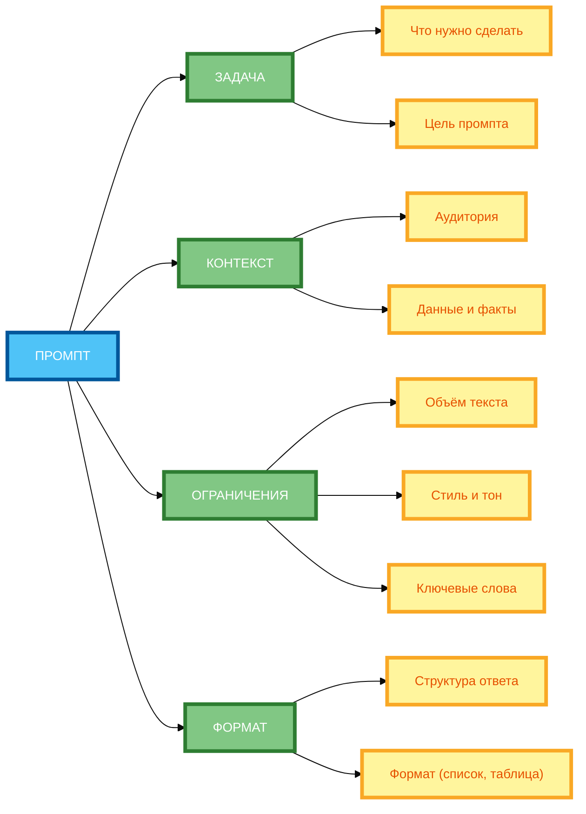

# Схема 1: «Иерархия компонентов промпта» (вертикальная компоновка)

**Рисунок 1.** «Иерархия компонентов промпта» (hierarchy tree). 1 колонка: ПРОМПТ. 2 колонка: ЗАДАЧА, КОНТЕКСТ, ОГРАНИЧЕНИЯ, ФОРМАТ (в столбик). У каждой свои строки (подкомпоненты). Компактная 1:1, текст полный, цвета и рамки 4px.