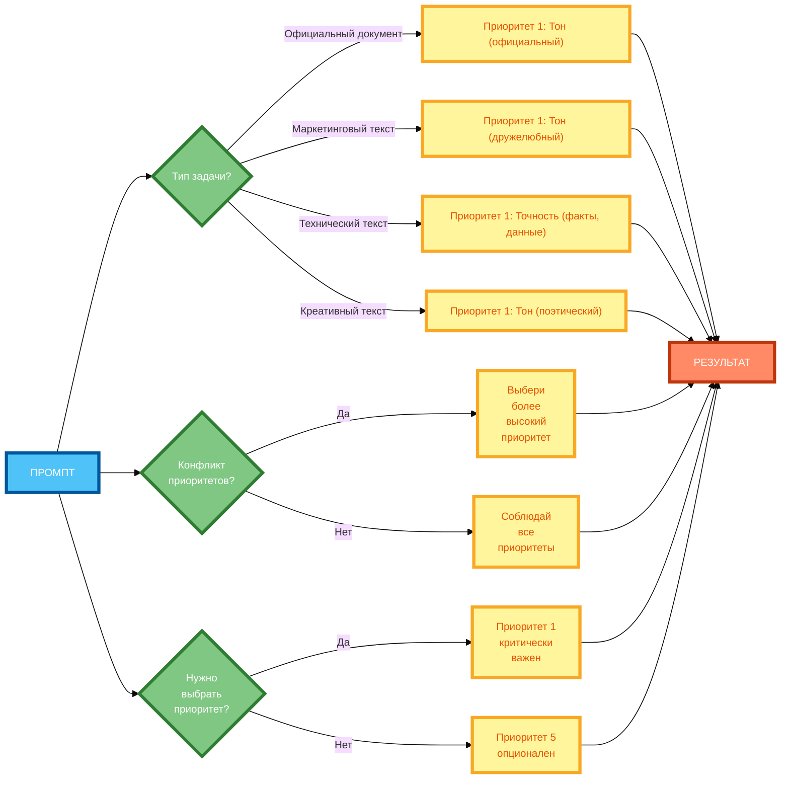

# Схема 2: «Алгоритм расстановки приоритетов» (вертикальная компоновка)

**Рисунок 2.** «Алгоритм расстановки приоритетов» (flowchart). 1 колонка: ПРОМПТ. 2 колонка: вопросы и действия (в столбик). У каждой свои строки. Компактная 1:1, текст полный, цвета и рамки 4px.