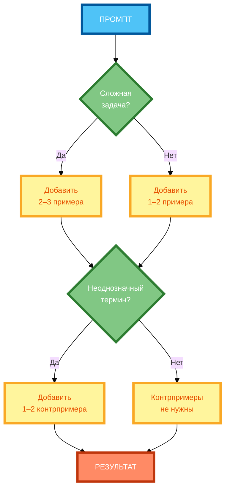
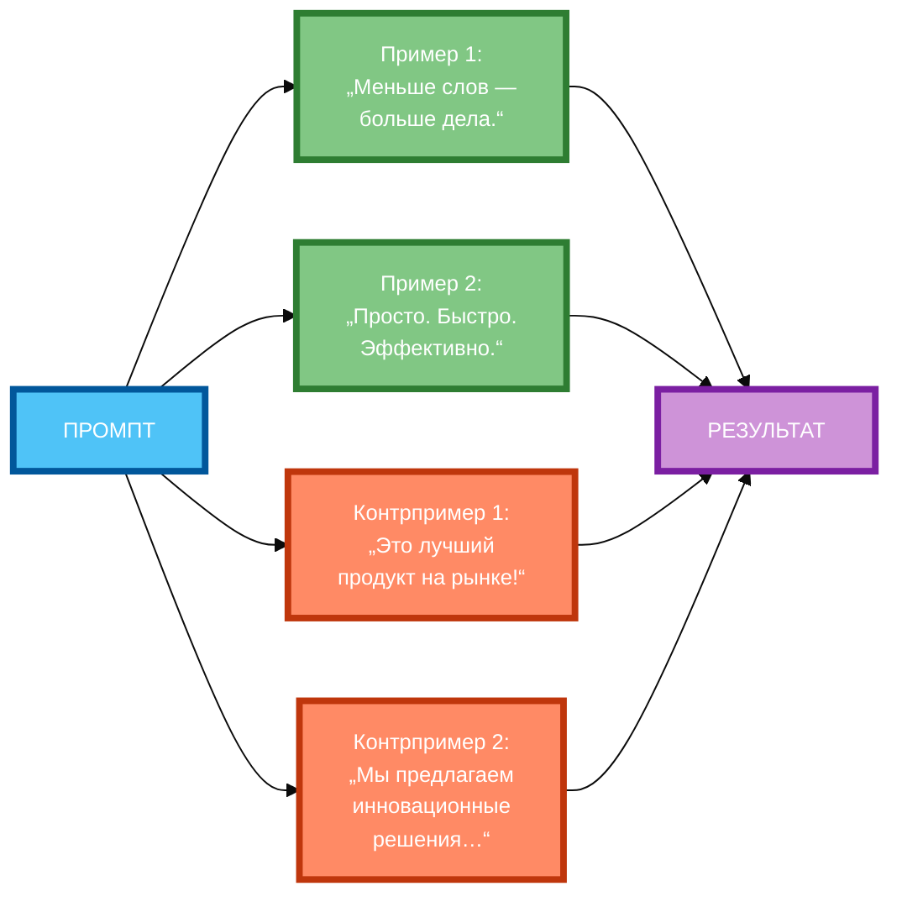

# Промпты с примерами и контрпримерами: когда нужны оба

В предыдущей статье вы узнали, как расставлять приоритеты в промпте, чтобы нейросеть понимала, что важнее. Но даже если приоритеты расставлены правильно, нейросеть может **не понять, что именно вы имеете в виду** — особенно если задача сложная или термин неоднозначен. В этой статье вы научитесь использовать **примеры и контрпримеры** так, чтобы нейросеть точно знала, чего вы хотите.

## Разница между примерами и контрпримерами

**Примеры** — это образцы желаемого результата. Они показывают нейросети, **что делать**.

**Пример:**

```
Пример слогана: «Меньше слов — больше дела.»
```

**Контрпримеры** — это образцы нежелательного результата. Они показывают нейросети, **чего не делать**.

**Пример:**

```
Контрпример: «Это лучший продукт на рынке!» — неудачный слоган, потому что он не конкретен и не запоминающийся.
```

**Разница:**

- **Примеры** направляют нейросеть на нужный путь.
- **Контрпримеры** предотвращают ошибки и уточняют границы.

**Когда нужны только примеры:**

- Простые задачи (написать email, перевести текст).
- Когда нейросеть уже понимает, что нужно.
- Когда достаточно показать один-два образца.

**Когда нужны оба (примеры + контрпримеры):**

- Сложные задачи (креатив, анализ, генерация идей).
- Неоднозначные термины («хороший слоган», «качественный код»).
- Риск ошибок (нейросеть может выдать нежелательный результат).

## Когда нужны контрпримеры: сложные задачи, неоднозначные термины, риск ошибок

**1. Сложные задачи**

Когда задача требует **много шагов** или **специальных знаний**, примеры показывают, как структурировать ответ, а контрпримеры — как избежать ошибок.

**Пример:**

```
Задача: Напиши код для расчёта факториала.

Пример:
def factorial(n):
    if n == 0:
        return 1
    return n * factorial(n - 1)

Контрпример:
def factorial(n):
    result = 1
    for i in range(n):
        result *= i  # Ошибка: range(n) не включает n
    return result
```

**2. Неоднозначные термины**

Когда термин **может быть истолкован по-разному**, контрпримеры уточняют, что именно вы имеете в виду.

**Пример:**

```
Задача: Напиши «хороший» слоган.

Пример: «Меньше слов — больше дела.» — конкретный, запоминающийся, вызывает эмоцию.

Контрпример: «Это лучший продукт на рынке!» — неудачный, потому что не конкретен и не запоминающийся.
```

**3. Риск ошибок**

Когда нейросеть **может совершить ошибку**, контрпримеры показывают, как её избежать.

**Пример:**

```
Задача: Напиши код для сортировки списка.

Пример:
def sort_list(lst):
    return sorted(lst)

Контрпример:
def sort_list(lst):
    for i in range(len(lst)):
        for j in range(len(lst)):
            if lst[i] < lst[j]:
                lst[i], lst[j] = lst[j], lst[i]  # Ошибка: сравнение с самим собой
    return lst
```

## Как формулировать контрпримеры: прямое указание, описание нежелательных результатов

**1. Прямое указание**

**Формулировка:** «Не делай так: …»

**Пример:**

```
Контрпример: Не пиши слоган «Это лучший продукт на рынке!» — он не конкретен и не запоминающийся.
```

**2. Описание нежелательных результатов**

**Формулировка:** «Это неудачно, потому что …»

**Пример:**

```
Контрпример: «Это лучший продукт на рынке!» — неудачный слоган, потому что он не конкретен и не запоминающийся.
```

**3. Сравнение с примером**

**Формулировка:** «В отличие от примера, не делай так: …»

**Пример:**

```
Пример: «Меньше слов — больше дела.» — конкретный, запоминающийся.

Контрпример: В отличие от примера, не пиши «Это лучший продукт на рынке!» — он не конкретен и не запоминающийся.
```

**4. Указание на конкретную ошибку**

**Формулировка:** «Не повторяй ошибку: …»

**Пример:**

```
Контрпример: Не повторяй ошибку: «Это лучший продукт на рынке!» — слоган должен быть конкретным, а не общим.
```

## Баланс между примерами и контрпримерами (оптимальное соотношение)

**Оптимальное соотношение:** 2–3 примера + 1–2 контрпримера.

**Почему именно так:**

- **2–3 примера** — достаточно, чтобы показать паттерн.
- **1–2 контрпримера** — достаточно, чтобы уточнить границы, но не перегружать промпт.

**Пример баланса:**

```
Пример 1: «Меньше слов — больше дела.» — конкретный, запоминающийся.

Пример 2: «Просто. Быстро. Эффективно.» — короткий, ясный, вызывает эмоцию.

Контрпример 1: «Это лучший продукт на рынке!» — неудачный, потому что не конкретен и не запоминающийся.

Контрпример 2: «Мы предлагаем инновационные решения для вашего бизнеса.» — неудачный, потому что слишком общий и не вызывает эмоции.
```

**Если слишком много примеров:**

- Нейросеть теряет фокус.
- Промпт становится слишком длинным.
- Нейросеть может «застрять» на примерах и не генерировать новые идеи.

**Если слишком много контрпримеров:**

- Нейросеть становится слишком осторожной.
- Результат становится шаблонным.
- Нейросеть может игнорировать контрпримеры, если их слишком много.

## Влияние контрпримеров на точность генерации

**Влияние на точность:**

- **Без контрпримеров** — нейросеть может выдать результат, который соответствует примерам, но не соответствует вашим ожиданиям (например, слоган «Это лучший продукт на рынке!»).
- **С контрпримерами** — нейросеть понимает, **чего не делать**, и выдаёт более точный результат.

**Влияние на креативность:**

- **Без контрпримеров** — креативность выше, но риск ошибок тоже выше.
- **С контрпримерами** — креативность ниже, но результат более точный.

**Влияние на время генерации:**

- **С контрпримерами** — нейросеть тратит больше времени на анализ границ, но результат ближе к желаемому.

**Правило:** Для простых задач достаточно примеров. Для сложных задач или неоднозначных терминов — добавляйте контрпримеры.

## Примеры успешных промптов с примерами и контрпримерами

**Пример 1: Генерация слоганов (полный рабочий промпт)**

```
Напиши 5 слоганов для бренда кофе. Бренд: «Кофе для тех, кто ценит вкус». Аудитория: люди 25–40 лет, которые любят качественный кофе. Тон: дружелюбный, с лёгкой иронией.

Пример 1: «Меньше слов — больше дела.» — конкретный, запоминающийся, вызывает эмоцию.

Пример 2: «Просто. Быстро. Эффективно.» — короткий, ясный, вызывает эмоцию.

Контрпример 1: «Это лучший продукт на рынке!» — неудачный, потому что не конкретен и не запоминающийся.

Контрпример 2: «Мы предлагаем инновационные решения для вашего бизнеса.» — неудачный, потому что слишком общий и не вызывает эмоцию.

Не повторяйте ошибки из контрпримеров. Каждый слоган должен быть конкретным, коротким и вызывать эмоцию.
```

**Разбор:**

- **Примеры** показывают, что такое «хороший слоган».
- **Контрпримеры** показывают, что такое «плохой слоган».
- **Инструкция** («Не повторяйте ошибки из контрпримеров») помогает нейросети избежать ошибок.

**Пример 2: Генерация кода (полный рабочий промпт)**

```
Напиши функцию для расчёта факториала на Python. Функция должна принимать одно число и возвращать его факториал.

Пример 1:
def factorial(n):
    if n == 0:
        return 1
    return n * factorial(n - 1)

Пример 2:
def factorial(n):
    result = 1
    for i in range(1, n + 1):
        result *= i
    return result

Контрпример 1:
def factorial(n):
    result = 1
    for i in range(n):
        result *= i  # Ошибка: range(n) не включает n
    return result

Контрпример 2:
def factorial(n):
    if n == 0:
        return 1
    return n * factorial(n)  # Ошибка: бесконечная рекурсия

Не повторяйте ошибки из контрпримеров. Функция должна быть корректной и эффективной.
```

**Разбор:**

- **Примеры** показывают два способа реализации (рекурсивный и итеративный).
- **Контрпримеры** показывают две распространённые ошибки (неправильный range, бесконечная рекурсия).
- **Инструкция** («Не повторяйте ошибки из контрпримеров») помогает нейросети избежать ошибок.

## Практические советы по подбору контрпримеров

**Совет 1: Выбирайте контрпримеры, которые иллюстрируют конкретную ошибку**

**Некорректно:** «Контрпример: „Это плохой слоган“.»

**Корректно:** «Контрпример: „Это лучший продукт на рынке!“ — неудачный, потому что не конкретен и не запоминающийся.»

**Совет 2: Формулируйте контрпримеры чётко и однозначно**

**Некорректно:** «Контрпример: „Это не то, что нужно“.»

**Корректно:** «Контрпример: „Это лучший продукт на рынке!“ — неудачный, потому что не конкретен и не запоминающийся.»

**Совет 3: Используйте 1–2 контрпримера на 2–3 примера**

**Некорректно:** 5 контрпримеров на 2 примера.

**Корректно:** 2 контрпримера на 3 примера.

**Совет 4: Убедитесь, что контрпримеры не противоречат основному заданию**

**Некорректно:** «Контрпример: „Это лучший продукт на рынке!“» + «Напиши слоган, который говорит, что продукт лучший.»

**Корректно:** «Контрпример: „Это лучший продукт на рынке!“» + «Напиши слоган, который конкретен и запоминающийся.»

**Совет 5: Используйте контрпримеры для сложных или неоднозначных понятий**

**Некорректно:** «Контрпример: „Это плохой код“.» (для простой задачи)

**Корректно:** «Контрпример: „Это лучший продукт на рынке!“» (для неоднозначного понятия «хороший слоган»).

## Схема 1: «Алгоритм включения примеров и контрпримеров» (flowchart)



**Рисунок 1.** «Алгоритм включения примеров и контрпримеров» (flowchart). 3 ряда: Промпт сверху, 2 компонента в ряд (вопросы и действия), 2 компонента в ряд (действия), Результат снизу. Компактная 1:1, текст полный, цвета и рамки 4px.

## Схема 2: «Матрица соответствия примеров и контрпримеров» (grid)



**Рисунок 2.** «Матрица соответствия примеров и контрпримеров» (grid). 3 ряда: Промпт слева, 4 компонента в 2 ряда (2+2), Результат справа. Компактная 1:1, текст полный, цвета и рамки 4px, связи огибают.

## Таблица: «Правила использования контрпримеров»

| Правило | Описание | Пример |
|---------|----------|--------|
| **Контрпример должен иллюстрировать конкретную ошибку** | Не просто «это плохо», а «это плохо, потому что …» | «Контрпример: „Это лучший продукт на рынке!“ — неудачный, потому что не конкретен и не запоминающийся.» |
| **Формулировка должна быть чёткой и однозначной** | Не «это не то, что нужно», а «это неудачно, потому что …» | «Контрпример: „Это лучший продукт на рынке!“ — неудачный, потому что не конкретен и не запоминающийся.» |
| **Оптимально 1–2 контрпримера на 2–3 примеры** | Не перегружать промпт | 3 примера + 2 контрпримера = оптимально |
| **Контрпример не должен противоречить основному заданию** | Если задание «напиши слоган, который говорит, что продукт лучший», то контрпример «Это лучший продукт на рынке!» противоречит заданию | «Контрпример: „Это лучший продукт на рынке!“» + «Напиши слоган, который конкретен и запоминающийся.» |
| **Используйте контрпримеры для сложных или неоднозначных понятий** | Для простых задач контрпримеры не нужны | «Контрпример: „Это лучший продукт на рынке!“» (для неоднозначного понятия «хороший слоган») |

**Рисунок 3.** «Правила использования контрпримеров». Таблица содержит 5 правил с описанием и примером.

## Практическое задание

**Задание:** Улучшите промпт для генерации слоганов, добавив 2 примера удачных слоганов и 2 контрпримера.

**Промпт без примеров и контрпримеров:**

```
Напиши 5 слоганов для бренда кофе. Бренд: «Кофе для тех, кто ценит вкус». Аудитория: люди 25–40 лет, которые любят качественный кофе. Тон: дружелюбный, с лёгкой иронией.
```

**Промпт с примерами и контрпримерами:**

```
Напиши 5 слоганов для бренда кофе. Бренд: «Кофе для тех, кто ценит вкус». Аудитория: люди 25–40 лет, которые любят качественный кофе. Тон: дружелюбный, с лёгкой иронией.

Пример 1: «Меньше слов — больше дела.» — конкретный, запоминающийся, вызывает эмоцию.

Пример 2: «Просто. Быстро. Эффективно.» — короткий, ясный, вызывает эмоцию.

Контрпример 1: «Это лучший продукт на рынке!» — неудачный, потому что не конкретен и не запоминающийся.

Контрпример 2: «Мы предлагаем инновационные решения для вашего бизнеса.» — неудачный, потому что слишком общий и не вызывает эмоцию.

Не повторяйте ошибки из контрпримеров. Каждый слоган должен быть конкретным, коротким и вызывать эмоцию.
```

**Часть 1:** Напишите промпт без примеров и контрпримеров.

**Часть 2:** Напишите промпт с 2 примерами и 2 контрпримерами.

**Часть 3:** Сравните результаты и ответьте:
- Какой результат больше соответствует требованиям?
- Какие ошибки были в результате без контрпримеров?
- Как контрпримеры помогли избежать ошибок?

**Чек-лист для самопроверки:**

- [ ] Добавлено 2 примера удачных слоганов
- [ ] Добавлено 2 контрпримера (почему они неудачны)
- [ ] Каждый контрпример иллюстрирует конкретную ошибку
- [ ] Формулировка контрпримеров чёткая и однозначная
- [ ] Соотношение: 2 примера + 2 контрпримера (оптимально)
- [ ] Контрпримеры не противоречат основному заданию
- [ ] Использованы контрпримеры для неоднозначного понятия («хороший слоган»)
- [ ] Сравнение результатов до и после проведено

## Заключение

Примеры и контрпримеры — это мощный инструмент для уточнения границ и предотвращения ошибок. Главное — использовать их для сложных задач или неоднозначных терминов, соблюдать оптимальное соотношение (2–3 примера + 1–2 контрпримера) и формулировать контрпримеры чётко и однозначно. В следующей статье вы узнаете, как использовать логические ветвления («если… то…») в промптах.