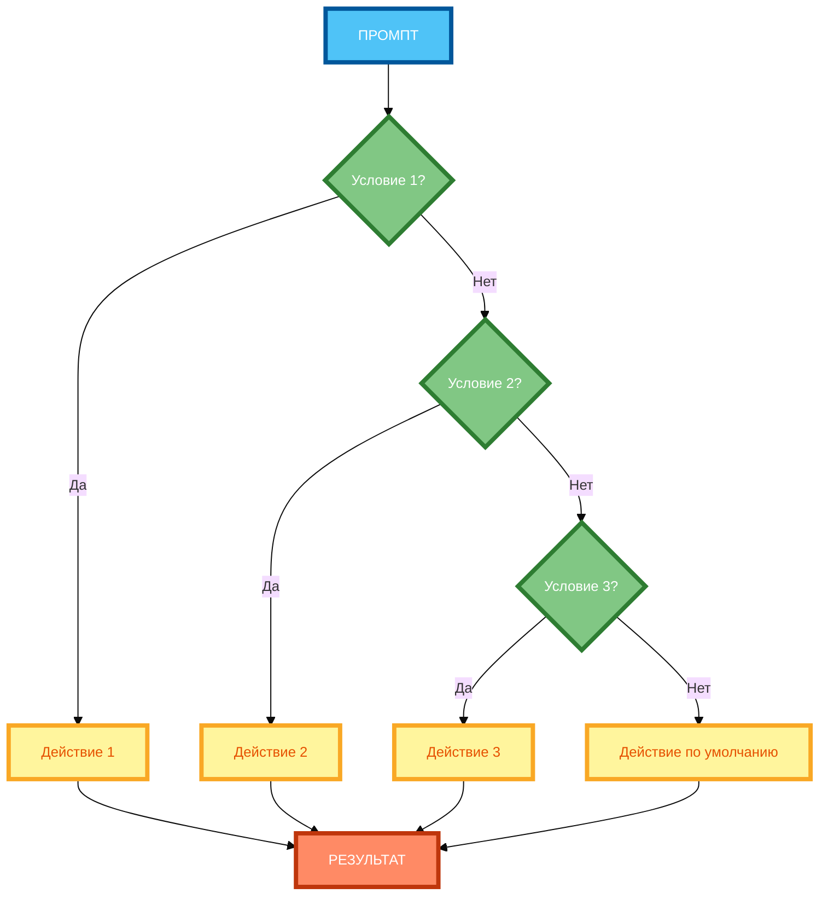
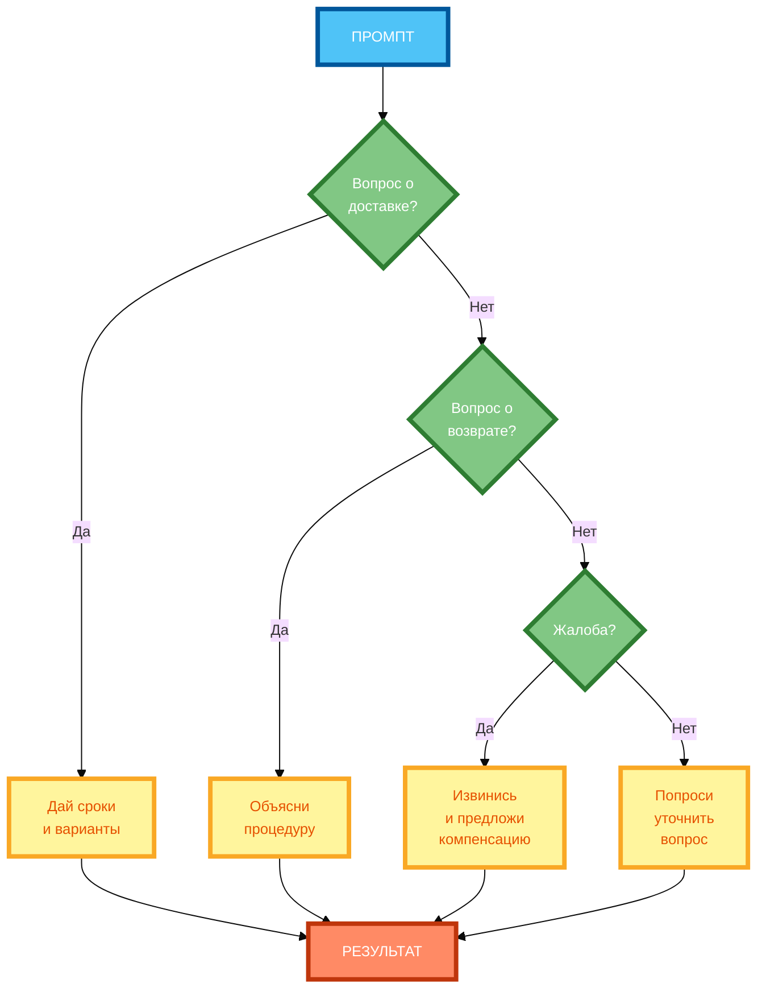

# Промпты с условиями «если… то…»: логические ветвления

В предыдущей статье вы узнали, как использовать примеры и контрпримеры, чтобы нейросеть точно знала, чего вы хотите. Но даже если примеры подобраны правильно, нейросеть может **не понять, что делать в разных ситуациях** — особенно если задача требует разных ответов в зависимости от условий. В этой статье вы научитесь использовать **логические условия** («если… то…») так, чтобы нейросеть адаптировала ответ под разные сценарии.

## Суть логических условий в промптах

**Логические условия** — это инструкции, которые указывают нейросети, **что делать в зависимости от ситуации**. Они позволяют создавать **адаптивные ответы**, которые меняются в зависимости от входных данных.

**Суть метода:**

- **Условие** — это проверка («если вопрос о доставке»).
- **Действие** — это то, что нужно сделать, если условие выполнено («дай сроки и варианты»).
- **Ветвление** — это выбор между несколькими действиями в зависимости от условия.

**Пример без условий:**

```
Напиши сценарий чат-бота для поддержки клиентов.
```

**Результат:** Нейросеть выдаст общий сценарий, который не учитывает разные типы вопросов (доставка, возврат, жалоба).

**Пример с условиями:**

```
Напиши сценарий чат-бота для поддержки клиентов. Используй условия:

Если вопрос о доставке, то дай сроки и варианты доставки.
Если вопрос о возврате, то объясни процедуру возврата.
Если жалоба, то извинись и предложи компенсацию.
Если вопрос не подходит ни под одно условие, то вежливо попроси уточнить вопрос.
```

**Результат:** Нейросеть выдаст адаптивный сценарий, который учитывает разные типы вопросов и даёт разные ответы в зависимости от ситуации.

## Синтаксис условий: «если X, то Y», «в случае A, сделай B»

**1. «Если X, то Y»**

**Формулировка:** «Если [условие], то [действие].»

**Пример:**

```
Если вопрос о доставке, то дай сроки и варианты доставки.
```

**2. «В случае A, сделай B»**

**Формулировка:** «В случае [условие], [действие].»

**Пример:**

```
В случае жалобы, извинись и предложи компенсацию.
```

**3. «Если X, то Y, иначе Z»**

**Формулировка:** «Если [условие], то [действие], иначе [действие по умолчанию].»

**Пример:**

```
Если вопрос о доставке, то дай сроки и варианты доставки, иначе вежливо попроси уточнить вопрос.
```

**4. «Когда X, то Y»**

**Формулировка:** «Когда [условие], то [действие].»

**Пример:**

```
Когда клиент спрашивает о возврате, то объясни процедуру возврата.
```

**5. «Если X, то Y; если A, то B; иначе Z»**

**Формулировка:** «Если [условие 1], то [действие 1]; если [условие 2], то [действие 2]; иначе [действие по умолчанию].»

**Пример:**

```
Если вопрос о доставке, то дай сроки и варианты доставки; если вопрос о возврате, то объясни процедуру возврата; если жалоба, то извинись и предложи компенсацию; иначе вежливо попроси уточнить вопрос.
```

## Когда применять условия: многовариантные задачи, адаптивные ответы, сценарии

**1. Многовариантные задачи**

Когда задача имеет **несколько возможных вариантов** ответа в зависимости от ситуации.

**Пример:**

- Вопрос о доставке → сроки и варианты.
- Вопрос о возврате → процедура возврата.
- Жалоба → извинение и компенсация.

**2. Адаптивные ответы**

Когда нужно **адаптировать ответ** под разные типы пользователей или ситуаций.

**Пример:**

- Если пользователь новичок → объясни простым языком.
- Если пользователь эксперт → используй технические термины.
- Если пользователь не указал уровень → спроси уточняющий вопрос.

**3. Сценарии**

Когда нужно **создать сценарий** (чат-бот, инструкция, процесс), который учитывает разные ветвления.

**Пример:**

- Если клиент доволен → поблагодари.
- Если клиент недоволен → извинись и предложи решение.
- Если клиент не ответил → напомни через 24 часа.

**4. Диалоги**

Когда нужно **создать диалог**, который меняется в зависимости от ответов собеседника.

**Пример:**

- Если собеседник согласен → переходи к следующему шагу.
- Если собеседник не согласен → объясни преимущества.
- Если собеседник не понял → приведи пример.

## Примеры промптов с условиями для разных задач

**Пример 1: Чат-бот для поддержки клиентов (полный рабочий промпт)**

```
Ты — чат-бот поддержки клиентов интернет-магазина. Твоя задача — отвечать на вопросы клиентов вежливо и по делу.

Используй условия:

Если вопрос о доставке, то дай сроки и варианты доставки. Сроки: 3–7 дней. Варианты: курьер, почта, самовывоз.

Если вопрос о возврате, то объясни процедуру возврата. Процедура: написать на email support@shop.ru в течение 14 дней с момента получения, указать причину возврата, отправить товар обратно.

Если жалоба, то извинись и предложи компенсацию. Извинись: «Приносим извинения за неудобства». Компенсация: 10% скидка на следующую покупку или возврат денег.

Если вопрос не подходит ни под одно условие, то вежливо попроси уточнить вопрос: «Пожалуйста, уточните, что именно вас интересует: доставка, возврат или что-то другое?»

Не задавай вопросов, если не нужно. Отвечай кратко и по делу.
```

**Разбор:**

- **Условие 1:** «Если вопрос о доставке, то дай сроки и варианты доставки.»
- **Условие 2:** «Если вопрос о возврате, то объясни процедуру возврата.»
- **Условие 3:** «Если жалоба, то извинись и предложи компенсацию.»
- **Условие по умолчанию:** «Если вопрос не подходит ни под одно условие, то вежливо попроси уточнить вопрос.»

**Пример 2: Инструкция по настройке VPN (полный рабочий промпт)**

```
Напиши инструкцию по настройке VPN для новичков. Аудитория: люди без технического образования, 25–50 лет.

Используй условия:

Если пользователь использует Windows, то дай инструкцию для Windows. Шаги: 1) Скачать приложение. 2) Установить. 3) Ввести логин и пароль. 4) Нажать «Подключить».

Если пользователь использует macOS, то дай инструкцию для macOS. Шаги: 1) Скачать приложение. 2) Установить. 3) Ввести логин и пароль. 4) Нажать «Подключить».

Если пользователь использует iOS, то дай инструкцию для iOS. Шаги: 1) Скачать приложение из App Store. 2) Установить. 3) Ввести логин и пароль. 4) Нажать «Подключить».

Если пользователь использует Android, то дай инструкцию для Android. Шаги: 1) Скачать приложение из Google Play. 2) Установить. 3) Ввести логин и пароль. 4) Нажать «Подключить».

Если пользователь не указал операционную систему, то спроси: «Какой у вас телефон или компьютер: Windows, macOS, iPhone или Android?»

Не используй сложные термины. Объясняй простым языком.
```

**Разбор:**

- **Условие 1:** «Если пользователь использует Windows, то дай инструкцию для Windows.»
- **Условие 2:** «Если пользователь использует macOS, то дай инструкцию для macOS.»
- **Условие 3:** «Если пользователь использует iOS, то дай инструкцию для iOS.»
- **Условие 4:** «Если пользователь использует Android, то дай инструкцию для Android.»
- **Условие по умолчанию:** «Если пользователь не указал операционную систему, то спроси: …»

## Ограничения метода: сложность обработки длинных цепочек условий

**Ограничение 1: Сложность обработки длинных цепочек**

Когда условий **больше 5–7**, нейросеть может **запутаться** и не понять, какое условие применять.

**Решение:** Ограничьте количество условий (3–5 оптимально). Если нужно больше — разбейте на несколько промптов.

**Ограничение 2: Пересекающиеся условия**

Когда условия **пересекаются** (например, «если вопрос о доставке» и «если вопрос о доставке и возврате»), нейросеть не понимает, какое условие применять.

**Решение:** Убедитесь, что условия **непересекающиеся**. Каждое условие должно быть **взаимоисключающим**.

**Ограничение 3: Отсутствие варианта по умолчанию**

Когда ни одно условие не подходит, нейросеть может **не знать, что делать**.

**Решение:** Всегда добавляйте вариант «по умолчанию»: «Если вопрос не подходит ни под одно условие, то вежливо попроси уточнить вопрос.»

**Ограничение 4: Сложность формулировки**

Когда условия **сложные** («если вопрос о доставке и клиент из Москвы»), нейросеть может не понять, как их интерпретировать.

**Решение:** Упрощайте условия. Разбивайте сложные условия на простые.

## Комбинирование условий с другими техниками (роли, контекст)

**Комбинирование 1: Условия + Роли**

```
Ты — менеджер поддержки клиентов. Твоя задача — отвечать на вопросы клиентов вежливо и по делу.

Используй условия:

Если вопрос о доставке, то дай сроки и варианты доставки.
Если вопрос о возврате, то объясни процедуру возврата.
Если жалоба, то извинись и предложи компенсацию.
Если вопрос не подходит ни под одно условие, то вежливо попроси уточнить вопрос.
```

**Комбинирование 2: Условия + Контекст**

```
Напиши сценарий чат-бота для поддержки клиентов интернет-магазина. Магазин продаёт одежду. Доставка: 3–7 дней. Возврат: в течение 14 дней.

Используй условия:

Если вопрос о доставке, то дай сроки и варианты доставки.
Если вопрос о возврате, то объясни процедуру возврата.
Если жалоба, то извинись и предложи компенсацию.
Если вопрос не подходит ни под одно условие, то вежливо попроси уточнить вопрос.
```

**Комбинирование 3: Условия + Примеры**

```
Напиши сценарий чат-бота для поддержки клиентов. Используй условия:

Если вопрос о доставке, то дай сроки и варианты доставки.
Если вопрос о возврате, то объясни процедуру возврата.
Если жалоба, то извинись и предложи компенсацию.
Если вопрос не подходит ни под одно условие, то вежливо попроси уточнить вопрос.

Пример ответа на вопрос о доставке:
«Доставка занимает 3–7 дней. Варианты: курьер (500 руб.), почта (300 руб.), самовывоз (бесплатно).»

Пример ответа на жалобу:
«Приносим извинения за неудобства. В качестве компенсации предлагаем 10% скидку на следующую покупку.»
```

## Практические рекомендации по формулировке условий

**Рекомендация 1: Чётко сформулируй условие**

**Некорректно:** «Если вопрос про доставку, то …»

**Корректно:** «Если вопрос о доставке, то дай сроки и варианты доставки.»

**Рекомендация 2: Укажи конкретное действие для каждого условия**

**Некорректно:** «Если вопрос о доставке, то ответь на него.»

**Корректно:** «Если вопрос о доставке, то дай сроки и варианты доставки.»

**Рекомендация 3: Ограничь количество условий (3–5 оптимально)**

**Некорректно:** 10 условий в одном промпте.

**Корректно:** 3–5 условий в одном промпте.

**Рекомендация 4: Обеспечь непересекаемость условий**

**Некорректно:** «Если вопрос о доставке» и «Если вопрос о доставке и возврате».

**Корректно:** «Если вопрос о доставке» и «Если вопрос о возврате» (взаимоисключающие).

**Рекомендация 5: Добавь вариант «по умолчанию»**

**Некорректно:** «Если вопрос о доставке, то …; если вопрос о возврате, то …»

**Корректно:** «Если вопрос о доставке, то …; если вопрос о возврате, то …; если вопрос не подходит ни под одно условие, то вежливо попроси уточнить вопрос.»

## Схема 1: «Структура условного промпта» (flowchart)



**Рисунок 1.** «Структура условного промпта» (flowchart). 3 ряда: Промпт сверху, 2 компонента в ряд (условия и действия), 2 компонента в ряд (действия), Результат снизу. Компактная 1:1, текст полный, цвета и рамки 4px.

## Схема 2: «Дерево решений с условиями» (decision tree)



**Рисунок 2.** «Дерево решений с условиями» (decision tree). 3 ряда: Промпт сверху, 2 компонента в ряд (условия и действия), 2 компонента в ряд (действия), Результат снизу. Компактная 1:1, текст полный, цвета и рамки 4px.

## Таблица: «Шаблон условного промпта»

| Шаблон | Описание | Пример задачи |
|--------|----------|---------------|
| «Если X, то Y» | Простое условие | «Если вопрос о доставке, то дай сроки и варианты доставки.» |
| «Если X, то Y; если A, то B» | Два условия | «Если вопрос о доставке, то дай сроки и варианты; если вопрос о возврате, то объясни процедуру.» |
| «Если X, то Y; если A, то B; иначе Z» | Два условия + вариант по умолчанию | «Если вопрос о доставке, то дай сроки и варианты; если вопрос о возврате, то объясни процедуру; иначе вежливо попроси уточнить вопрос.» |
| «Если X, то Y; если A, то B; если C, то D; иначе Z» | Три условия + вариант по умолчанию | «Если вопрос о доставке, то …; если вопрос о возврате, то …; если жалоба, то …; иначе вежливо попроси уточнить вопрос.» |
| «Когда X, то Y» | Альтернативная формулировка | «Когда клиент спрашивает о возврате, то объясни процедуру возврата.» |

**Рисунок 3.** «Шаблон условного промпта». Таблица содержит 5 шаблонов с описанием и примером задачи.

## Практическое задание

**Задание:** Создайте промпт с 3 условиями «если… то…» для задачи «Напиши сценарий чат-бота для поддержки клиентов».

**Условия:**

1. Если вопрос о доставке — дай сроки и варианты.
2. Если вопрос о возврате — объясни процедуру.
3. Если жалоба — извинись и предложи компенсацию.
4. Если вопрос не подходит ни под одно условие — вежливо попроси уточнить вопрос.

**Требования к промпту:**

- Укажите все 3 условия явно.
- Добавьте вариант «по умолчанию».
- Добавьте контекст (интернет-магазин, доставка 3–7 дней, возвраты в течение 14 дней).
- Организуйте условия в список.

**Чек-лист для самопроверки:**

- [ ] Условие 1: «Если вопрос о доставке, то дай сроки и варианты доставки»
- [ ] Условие 2: «Если вопрос о возврате, то объясни процедуру возврата»
- [ ] Условие 3: «Если жалоба, то извинись и предложи компенсацию»
- [ ] Добавлен вариант «по умолчанию»: «Если вопрос не подходит ни под одно условие, то вежливо попроси уточнить вопрос»
- [ ] Каждое условие чётко сформулировано
- [ ] Каждое условие указывает конкретное действие
- [ ] Количество условий не превышает 5 (оптимально 3–5)
- [ ] Условия непересекающиеся (взаимоисключающие)
- [ ] Добавлен вариант «по умолчанию» для непредвиденных случаев
- [ ] Добавлен контекст (интернет-магазин, доставка 3–7 дней, возвраты в течение 14 дней)

## Заключение

Логические условия («если… то…») позволяют создавать адаптивные промпты, которые меняются в зависимости от ситуации. Главное — чётко формулировать условия, указывать конкретные действия, ограничивать количество условий (3–5) и добавлять вариант «по умолчанию». В следующей статье вы узнаете, как комбинировать техники для создания сложных промптов.