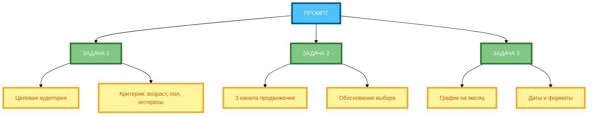

# Промпты с несколькими задачами: как разделять и упорядочивать

В предыдущей статье вы узнали, как использовать логические условия («если… то…») для создания адаптивных промптов. Но даже если условия сформулированы правильно, нейросеть может **не понять, как организовать работу**, если задача состоит из нескольких взаимосвязанных подзадач. В этой статье вы научитесь разделять и упорядочивать **несколько задач** в одном промпте так, чтобы нейросеть выполняла их последовательно и без ошибок.

## Понятие многоцелевого промпта

**Многоцелевой промпт** — это промпт, который содержит **несколько задач или подзадач**, которые нужно выполнить для достижения общей цели.

**Пример одноцелевого промпта:**

```
Напиши пресс-релиз о запуске нового продукта.
```

**Пример многоцелевого промпта:**

```
Напиши план маркетинговой кампании для нового продукта. Выполни 3 задачи:

1. Определи целевую аудиторию (возраст, пол, интересы, проблемы).
2. Предложи 3 канала продвижения (с обоснованием выбора).
3. Составь график публикаций на месяц (с указанием дат и форматов).

Каждая задача должна быть выполнена последовательно. Результат предыдущей задачи используй для следующей.
```

**Разница:**

- **Одноцелевой промпт** — одна задача, один результат.
- **Многоцелевой промпт** — несколько задач, несколько результатов, которые вместе дают общий результат.

## Когда использовать: комплексные задачи, поэтапные процессы, взаимосвязанные подзадачи

**1. Комплексные задачи**

Когда задача **слишком большая** для одного ответа и требует **разбиения на части**.

**Пример:**

- План маркетинговой кампании = целевая аудитория + каналы продвижения + график публикаций.

**2. Поэтапные процессы**

Когда нужно **выполнить задачи последовательно**, где результат одной задачи используется для следующей.

**Пример:**

- Напиши статью = определи тему + собери информацию + напиши черновик + отредактируй.

**3. Взаимосвязанные подзадачи**

Когда подзадачи **зависят друг от друга** и их нужно выполнять в определённом порядке.

**Пример:**

- Анализ данных = собери данные + очисти данные + проанализируй данные + сделай выводы.

**4. Параллельные задачи**

Когда подзадачи **независимы** и их можно выполнять **одновременно**.

**Пример:**

- Исследование рынка = проанализируй конкурентов + изучи отзывы + изучи тренды.

## Способы разделения задач: нумерация, маркированные списки, подзаголовки

**1. Нумерация**

**Формулировка:** «Выполни 3 задачи: 1) … 2) … 3) …»

**Пример:**

```
Выполни 3 задачи:
1. Определи целевую аудиторию.
2. Предложи 3 каналов продвижения.
3. Составь график публикаций на месяц.
```

**2. Маркированные списки**

**Формулировка:** «Выполни следующие задачи: - … - … - …»

**Пример:**

```
Выполни следующие задачи:
- Определи целевую аудиторию.
- Предложи 3 каналов продвижения.
- Составь график публикаций на месяц.
```

**3. Подзаголовки**

**Формулировка:** «## Задача 1: … ## Задача 2: … ## Задача 3: …»

**Пример:**

```
## Задача 1: Определи целевую аудиторию
[описание задачи 1]

## Задача 2: Предложи 3 каналов продвижения
[описание задачи 2]

## Задача 3: Составь график публикаций на месяц
[описание задачи 3]
```

**4. Комбинирование**

**Формулировка:** «Выполни 3 задачи: 1) … 2) … 3) …» + подзаголовки для каждой задачи.

**Пример:**

```
Выполни 3 задачи:

## Задача 1: Определи целевую аудиторию
[описание задачи 1]

## Задача 2: Предложи 3 каналов продвижения
[описание задачи 2]

## Задача 3: Составь график публикаций на месяц
[описание задачи 3]
```

## Порядок выполнения задач: последовательный, параллельный, иерархический

**1. Последовательный порядок**

Когда задачи **зависят друг от друга** и их нужно выполнять **по очереди**.

**Формулировка:** «Выполняй задачи последовательно. Результат предыдущей задачи используй для следующей.»

**Пример:**

```
Выполни 3 задачи последовательно:

1. Определи целевую аудиторию.
2. На основе аудитории предложи 3 канала продвижения.
3. На основе каналов составь график публикаций на месяц.
```

**2. Параллельный порядок**

Когда задачи **независимы** и их можно выполнять **одновременно**.

**Формулировка:** «Выполняй задачи параллельно. Каждая задача независима от других.»

**Пример:**

```
Выполни 3 задачи параллельно:

1. Определи целевую аудиторию.
2. Предложи 3 канала продвижения.
3. Составь график публикаций на месяц.
```

**3. Иерархический порядок**

Когда задачи **вложены друг в друга** (подзадачи внутри задач).

**Формулировка:** «Выполни основную задачу, разбив её на подзадачи.»

**Пример:**

```
Выполни основную задачу: «Напиши план маркетинговой кампании».

Разбей на подзадачи:
1. Определи целевую аудиторию.
2. Предложи 3 канала продвижения.
3. Составь график публикаций на месяц.
```

## Примеры многоцелевых промптов

**Пример 1: План маркетинговой кампании (полный рабочий промпт)**

```
Напиши план маркетинговой кампании для нового продукта. Продукт: AI-платформа для управления проектами. Цена: 990 руб./мес. Аудитория: руководители команд 5–15 человек в IT-компаниях.

Выполни 3 задачи последовательно:

## Задача 1: Определи целевую аудиторию
Определи целевую аудиторию по критериям: возраст, пол, профессия, интересы, проблемы, потребности. Опиши 3 сегмента аудитории.

## Задача 2: Предложи 3 канала продвижения
На основе аудитории предложи 3 канала продвижения. Для каждого канала укажи: название канала, почему подходит для аудитории, пример контента, ожидаемый результат.

## Задача 3: Составь график публикаций на месяц
На основе каналов составь график публикаций на месяц (30 дней). Для каждого дня укажи: дата, канал, формат контента, тема, цель.

Каждая задача должна быть выполнена последовательно. Результат предыдущей задачи используй для следующей.
```

**Разбор:**

- **Задача 1:** Определи целевую аудиторию.
- **Задача 2:** Предложи 3 канала продвижения (на основе аудитории).
- **Задача 3:** Составь график публикаций на месяц (на основе каналов).
- **Порядок:** Последовательный («Выполняй задачи последовательно. Результат предыдущей задачи используй для следующей.»).

**Пример 2: Анализ данных (полный рабочий промпт)**

```
Проанализируй данные о продажах за 3 месяца. Данные: таблица с колонками «Месяц», «Выручка», «Затраты», «Прибыль».

Выполни 3 задачи параллельно:

## Задача 1: Рассчитай средние показатели
Рассчитай среднюю выручку, средние затраты, среднюю прибыль за 3 месяца.

## Задача 2: Выяви тренды
Выяви тренды: растёт ли выручка, растут ли затраты, растёт ли прибыль.

## Задача 3: Сделай выводы
Сделай выводы: в каком месяце маржа прибыли была максимальной, почему в марте прибыль упала, какие рекомендации можно дать на апрель.

Каждая задача независима от других. Выполняй задачи параллельно.
```

**Разбор:**

- **Задача 1:** Рассчитай средние показатели.
- **Задача 2:** Выяви тренды.
- **Задача 3:** Сделай выводы.
- **Порядок:** Параллельный («Выполняй задачи параллельно. Каждая задача независима от других.»).

## Типичные ошибки: смешение задач, отсутствие чёткой структуры

**Ошибка 1: Смешение задач**

**Некорректно:**

```
Напиши план маркетинговой кампании. Определи целевую аудиторию и предложи 3 канала продвижения.
```

**Почему не работает:** Две задачи в одном предложении без разделения. Нейросеть может смешать результаты.

**Корректно:**

```
Выполни 2 задачи:

1. Определи целевую аудиторию.
2. Предложи 3 канала продвижения.
```

**Ошибка 2: Отсутствие чёткой структуры**

**Некорректно:**

```
Напиши план маркетинговой кампании. Определи целевую аудиторию. Предложи 3 канала продвижения. Составь график публикаций на месяц.
```

**Почему не работает:** Нет явного разделения задач. Нейросеть может не понять, где заканчивается одна задача и начинается другая.

**Корректно:**

```
Выполни 3 задачи:

## Задача 1: Определи целевую аудиторию
[описание задачи 1]

## Задача 2: Предложи 3 канала продвижения
[описание задачи 2]

## Задача 3: Составь график публикаций на месяц
[описание задачи 3]
```

**Ошибка 3: Пересекающиеся задачи**

**Некорректно:**

```
1. Определи целевую аудиторию.
2. Предложи 3 канала продвижения для этой аудитории.
3. Составь график публикаций на месяц для этих каналов.
```

**Почему не работает:** Задача 2 зависит от задачи 1, а задача 3 зависит от задачи 2. Это неявная зависимость, которую нейросеть может не понять.

**Корректно:**

```
Выполни 3 задачи последовательно:

1. Определи целевую аудиторию.
2. На основе аудитории предложи 3 канала продвижения.
3. На основе каналов составь график публикаций на месяц.
```

**Ошибка 4: Слишком много задач**

**Некорректно:** 10 задач в одном промпте.

**Почему не работает:** Нейросеть теряет фокус и начинает игнорировать задачи.

**Корректно:** 3–5 задач в одном промпте.

## Практические рекомендации по организации многоцелевых промптов

**Рекомендация 1: Чётко раздели задачи (нумерация или маркеры)**

**Некорректно:** «Напиши план маркетинговой кампании. Определи целевую аудиторию и предложи 3 канала продвижения.»

**Корректно:** «Выполни 2 задачи: 1) Определи целевую аудиторию. 2) Предложи 3 канала продвижения.»

**Рекомендация 2: Укажи порядок выполнения (если важен)**

**Некорректно:** «Выполни 3 задачи: 1) … 2) … 3) …»

**Корректно:** «Выполни 3 задачи последовательно: 1) … 2) … 3) …»

**Рекомендация 3: Для каждой задачи определи критерии успеха**

**Некорректно:** «1. Определи целевую аудиторию.»

**Корректно:** «1. Определи целевую аудиторию по критериям: возраст, пол, профессия, интересы, проблемы, потребности.»

**Рекомендация 4: Избегай пересекающихся задач**

**Некорректно:** «1. Определи целевую аудиторию. 2. Предложи 3 канала продвижения для этой аудитории.»

**Корректно:** «1. Определи целевую аудиторию. 2. Предложи 3 канала продвижения.» + «Выполняй задачи последовательно.»

**Рекомендация 5: Используй подзаголовки для сложных структур**

**Некорректно:** «1. Определи целевую аудиторию. 2. Предложи 3 канала продвижения.»

**Корректно:**

```
## Задача 1: Определи целевую аудиторию
[описание задачи 1]

## Задача 2: Предложи 3 канала продвижения
[описание задачи 2]
```

**Рекомендация 6: Ограничь количество задач (3–5 оптимально)**

**Некорректно:** 10 задач в одном промпте.

**Корректно:** 3–5 задач в одном промпте.

## Схема 1: «Структура многоцелевого промпта» (mind map)



**Рисунок 1.** «Структура многоцелевого промпта» (mind map). 3 ряда: Промпт сверху, 2 компонента в ряд (Задача 1, Задача 2, Задача 3), 2 компонента в ряд (подзадачи), Результат (структура). Компактная 1:1, текст полный, цвета и рамки 4px.

## Схема 2: «Порядок выполнения задач» (Gantt chart)


**Рисунок 2.** «Порядок выполнения задач» (Gantt chart). 3 ряда: Промпт слева, 3 задачи в ряд (последовательно), Результат справа. Компактная 1:1, текст полный, цвета и рамки 4px, связи огибают.

## Таблица: «Правила многоцелевых промптов»

| Правило | Описание | Пример |
|---------|----------|--------|
| **Чётко раздели задачи (нумерация или маркеры)** | Используй номера или маркеры для разделения задач | «Выполни 3 задачи: 1) … 2) … 3) …» |
| **Укажи порядок выполнения (если важен)** | Укажи «последовательно» или «параллельно» | «Выполняй задачи последовательно.» |
| **Для каждой задачи определи критерии успеха** | Укажи, что должно быть в результате | «Определи целевую аудиторию по критериям: возраст, пол, интересы.» |
| **Избегай пересекающихся задач** | Убедись, что задачи не пересекаются | «1. Определи аудиторию. 2. Предложи каналы.» (не «2. Предложи каналы для этой аудитории») |
| **Используй подзаголовки для сложных структур** | Раздели задачи подзаголовками | «## Задача 1: … ## Задача 2: …» |
| **Ограничь количество задач (3–5 оптимально)** | Не больше 5 задач в одном промпте | «Выполни 3 задачи: …» |

**Рисунок 3.** «Правила многоцелевых промптов». Таблица содержит 6 правил с описанием и примером.

## Практическое задание

**Задание:** Напишите промпт с 3 связанными задачами для генерации плана маркетинговой кампании.

**Задачи:**

1. Определи целевую аудиторию.
2. Предложи 3 канала продвижения.
3. Составь график публикаций на месяц.

**Требования к промпту:**

- Укажите все 3 задачи явно.
- Укажите порядок выполнения (последовательный).
- Для каждой задачи определи критерии успеха.
- Добавьте контекст (продукт, аудитория, цель).

**Чек-лист для самопроверки:**

- [ ] Чётко раздели задачи (нумерация или маркеры)
- [ ] Укажи порядок выполнения (последовательный)
- [ ] Для каждой задачи определи критерии успеха
- [ ] Избегай пересекающихся задач
- [ ] Используй подзаголовки для сложных структур
- [ ] Ограничь количество задач (3–5 оптимально)
- [ ] Добавлен контекст (продукт, аудитория, цель)
- [ ] Каждая задача имеет конкретное описание

## Заключение

Многоцелевые промпты позволяют решать комплексные задачи, разбивая их на подзадачи. Главное — чётко разделять задачи, указывать порядок выполнения, определять критерии успеха и ограничивать количество задач (3–5). В следующей статье вы узнаете, как комбинировать техники для создания сложных промптов.