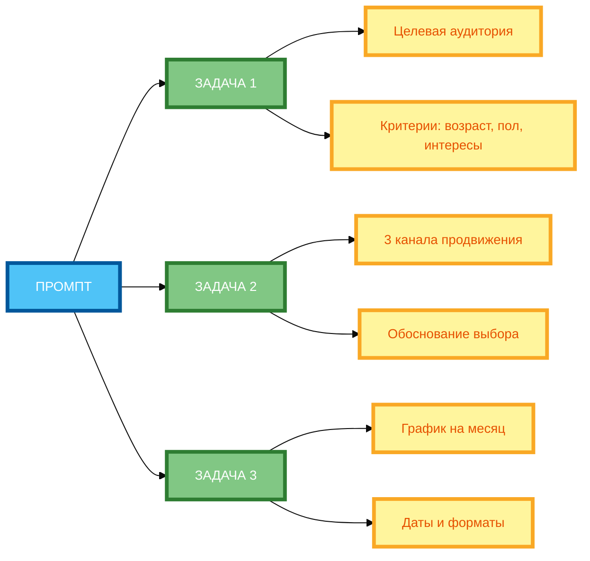

# Схема 1: «Структура многоцелевого промпта» (вертикальная компоновка)

**Рисунок 1.** «Структура многоцелевого промпта» (mind map). 3 ряда: Промпт слева, 3 задачи в столбик (ЗАДАЧА 1, ЗАДАЧА 2, ЗАДАЧА 3), расширения-ветвления справа от каждой задачи. Компактная 1:1, текст полный, цвета и рамки 4px. Расширение в вертикали, поворот на 90 градусов.