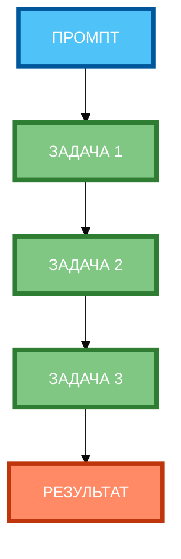

# Схема 2: «Порядок выполнения задач» (вертикальная компоновка)

**Рисунок 2.** «Порядок выполнения задач» (Gantt chart). 3 ряда: Промпт сверху, 3 задачи в столбик (последовательно), Результат снизу. Компактная 1:1, текст полный, цвета и рамки 4px. Расширение в вертикали, а не в горизонтали.