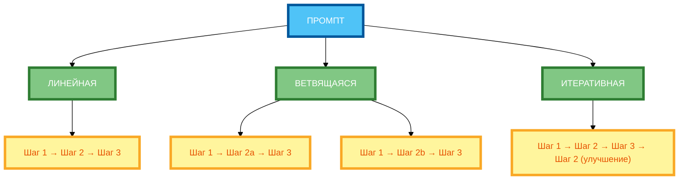
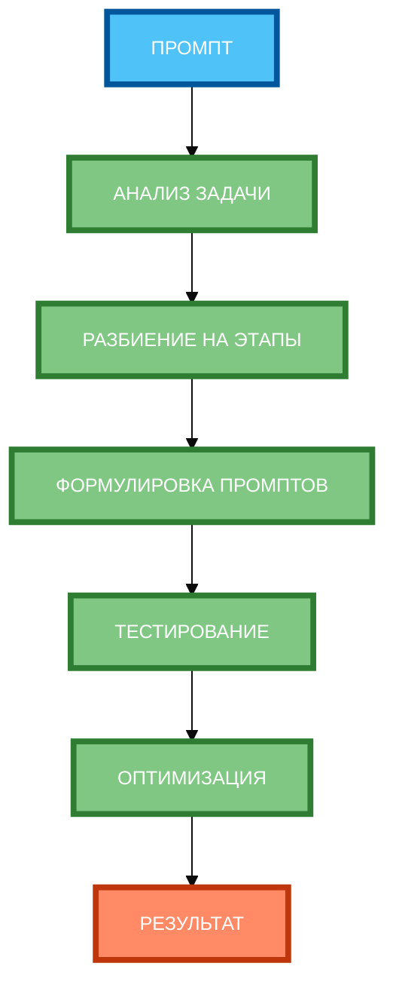

# Цепочки промптов: разбиваем сложную задачу на шаги

В предыдущей статье вы узнали, как разделять и упорядочивать несколько задач в одном промпте. Но даже если задачи разделены правильно, нейросеть может **не справиться со сложной задачей**, если она требует много шагов и промежуточных результатов. В этой статье вы научитесь создавать **цепочки промптов**, которые разбивают сложную задачу на последовательные шаги и передают результат от одного шага к другому.

## Что такое цепочка промптов и когда её использовать

**Цепочка промптов** — это последовательность промптов, где **результат одного промпта передаётся на вход следующему**. Каждый промпт выполняет **одну конкретную подзадачу**, а вместе они решают сложную задачу.

**Пример без цепочки:**

```
Проанализируй отзывы о продукте и предложи улучшения.
```

**Результат:** Нейросеть выдаст общий анализ и общие рекомендации, которые могут быть поверхностными или неполными.

**Пример с цепочкой:**

```
Шаг 1: Собери и сгруппируй отзывы о продукте по темам (доставка, качество, цена, сервис).

Шаг 2: На основе сгруппированных отзывов выдели 3 основные проблемы.

Шаг 3: Для каждой проблемы предложи 2–3 решения.

Шаг 4: Составь план внедрения улучшений с приоритетами и сроками.
```

**Результат:** Нейросеть выполняет задачу поэтапно, накапливая результаты и передавая их от шага к шагу. Это даёт более глубокий и структурированный анализ.

**Когда использовать цепочки промптов:**

- **Сложные задачи** — анализ данных, генерация контента, синтез информации.
- **Многоэтапные процессы** — исследования, планирование, разработка стратегий.
- **Задачи, требующие точности** — когда ошибка на одном этапе может испортить весь результат.
- **Задачи с накоплением контекста** — когда результат предыдущего шага нужен для следующего.

## Принципы разбиения сложной задачи на подзадачи

**Принцип 1: Определи конечную цель**

Прежде чем разбивать задачу, чётко сформулируй, **какой результат** должен получиться в конце.

**Пример:** «Проанализируй отзывы о продукте и предложи улучшения» → конечная цель: «План внедрения улучшений с приоритетами и сроками».

**Принцип 2: Разбей задачу на логические этапы**

Разбей задачу на **3–5 логических этапов**, где каждый этап — это **одна конкретная подзадачка**.

**Пример:**

- Этап 1: Собрать и сгруппировать отзывы.
- Этап 2: Выделить основные проблемы.
- Этап 3: Предложить решения для каждой проблемы.
- Этап 4: Составить план внедрения улучшений.

**Принцип 3: Убедись, что этапы последовательны**

Каждый этап должен **опираться на результат предыдущего**. Если этапы независимы, их можно выполнять параллельно.

**Пример:**

- Этап 1 → Этап 2 (на основе сгруппированных отзывов).
- Этап 2 → Этап 3 (на основе выделенных проблем).
- Этап 3 → Этап 4 (на основе предложенных решений).

**Принцип 4: Определи критерии успеха для каждого этапа**

Для каждого этапа укажи, **какой результат** должен получиться.

**Пример:**

- Этап 1: «Сгруппируй отзывы по 4 темам: доставка, качество, цена, сервис.»
- Этап 2: «Выдели 3 основные проблемы с обоснованием.»
- Этап 3: «Предложи 2–3 решения для каждой проблемы.»
- Этап 4: «Составь план внедрения с приоритетами и сроками.»

## Связь между шагами: передача контекста, накопление результатов

**1. Передача контекста**

Результат предыдущего шага **передаётся на вход следующему**.

**Пример:**

```
Шаг 1: Сгруппируй отзывы по темам.

Результат шага 1: «Группа 1: Доставка (15 отзывов), Группа 2: Качество (12 отзывов)…» 

Шаг 2: На основе сгруппированных отзывов выдели 3 основные проблемы.

[Результат шага 1 передаётся в шаг 2]
```

**2. Накопление результатов**

Каждый шаг **накапливает** результаты предыдущих шагов.

**Пример:**

```
Шаг 1: Сгруппируй отзывы.
Шаг 2: Выдели проблемы (на основе шага 1).
Шаг 3: Предложи решения (на основе шага 2).
Шаг 4: Составь план (на основе шагов 1–3).
```

**3. Валидация промежуточных результатов**

После каждого шага можно **проверить** результат и исправить ошибки, если они есть.

**Пример:**

```
Шаг 1: Сгруппируй отзывы.
[Проверка: все отзывы распределены по группам?]
Шаг 2: Выдели проблемы.
[Проверка: проблемы основаны на отзывах?]
```

## Форматы цепочек: линейные, ветвящиеся, итеративные

**1. Линейные цепочки**

Когда задачи выполняются **последовательно**, одна за другой.

**Пример:**

```
Шаг 1 → Шаг 2 → Шаг 3 → Шаг 4
```

**Когда использовать:** Когда каждый шаг зависит от предыдущего.

**2. Ветвящиеся цепочки**

Когда одна задача **разветвляется** на несколько параллельных задач.

**Пример:**

```
Шаг 1 → Шаг 2a → Шаг 3
      → Шаг 2b → Шаг 3
      → Шаг 2c → Шаг 3
```

**Когда использовать:** Когда нужно проанализировать несколько аспектов одновременно.

**3. Итеративные цепочки**

Когда результат шага **возвращается на предыдущий шаг** для улучшения.

**Пример:**

```
Шаг 1 → Шаг 2 → Шаг 3 → Шаг 4
                    ↓
                 Шаг 2 (улучшение)
```

**Когда использовать:** Когда нужно итеративно улучшать результат.

## Примеры цепочек для разных задач (анализ, генерация, синтез)

**Пример 1: Анализ отзывов (полный рабочий промпт)**

```
Проанализируй отзывы о продукте и предложи улучшения. Выполни 4 шага последовательно:

## Шаг 1: Собери и сгруппируй отзывы
Собери отзывы о продукте и сгруппируй их по темам: доставка, качество, цена, сервис. Для каждой группы укажи: количество отзывов, ключевые тезисы.

## Шаг 2: Выдели основные проблемы
На основе сгруппированных отзывов выдели 3 основные проблемы. Для каждой проблемы укажи: описание, количество отзывов, примеры.

## Шаг 3: Предложи решения
Для каждой проблемы предложи 2–3 решения. Для каждого решения укажи: описание, ожидаемый эффект, сложность внедрения.

## Шаг 4: Составь план внедрения
Составь план внедрения улучшений. Для каждого улучшения укажи: приоритет, срок, ответственный, критерии успеха.

Каждый шаг должен быть выполнен последовательно. Результат предыдущего шага используй для следующего.
```

**Разбор:**

- **Шаг 1:** Собрать и сгруппировать отзывы.
- **Шаг 2:** Выделить основные проблемы (на основе шага 1).
- **Шаг 3:** Предложить решения (на основе шага 2).
- **Шаг 4:** Составить план внедрения (на основе шагов 1–3).
- **Порядок:** Последовательный.
- **Связь:** Результат каждого шага передаётся на следующий.

**Пример 2: Генерация контента (полный рабочий промпт)**

```
Напиши статью о пользе йоги для улучшения сна. Выполни 4 шага последовательно:

## Шаг 1: Определи структуру статьи
Определи структуру статьи: введение, 3 раздела, вывод. Для каждого раздела укажи: заголовок, ключевые тезисы.

## Шаг 2: Напиши черновик
На основе структуры напиши черновик статьи. Каждый раздел должен содержать 200–300 слов.

## Шаг 3: Отредактируй черновик
Отредактируй черновик: убери повторы, улучши формулировки, добавь примеры.

## Шаг 4: Добавь призыв к действию
Добавь в конец статьи призыв к действию: «Запишись на бесплатный вебинар».

Каждый шаг должен быть выполнен последовательно. Результат предыдущего шага используй для следующего.
```

**Разбор:**

- **Шаг 1:** Определить структуру.
- **Шаг 2:** Написать черновик (на основе шага 1).
- **Шаг 3:** Отредактировать (на основе шага 2).
- **Шаг 4:** Добавить призыв к действию (на основе шагов 1–3).
- **Порядок:** Последовательный.
- **Связь:** Результат каждого шага передаётся на следующий.

## Автоматизация цепочек через API и инструменты

**Важно:** Мы не будем углубляться в технические детали, но важно понимать, что цепочки промптов можно **автоматизировать**.

**Как это работает:**

- Каждый промпт отправляется нейросети по очереди.
- Результат одного промпта **автоматически передаётся** на вход следующего.
- Цепочка выполняется **без участия человека** (или с минимальным участием).

**Преимущества автоматизации:**

- Экономия времени.
- Повторяемость результата.
- Возможность обрабатывать большие объёмы данных.

**Ограничения:**

- Нужно точно сформулировать каждый промпт.
- Ошибка в одном шаге может испортить всю цепочку.
- Требуется тестирование и отладка.

## Практические рекомендации по созданию эффективных цепочек

**Рекомендация 1: Определи конечную цель**

Прежде чем создавать цепочку, чётко сформулируй, **какой результат** должен получиться в конце.

**Рекомендация 2: Разбей задачу на 3–5 логических этапов**

Не делай цепочку слишком длинной. 3–5 шагов — оптимально.

**Рекомендация 3: Для каждого этапа сформулируй промпт с чётким результатом**

Каждый промпт должен **чётко указывать**, какой результат должен получиться.

**Рекомендация 4: Укажи, как результат предыдущего шага влияет на следующий**

Явно укажи, **какой результат** предыдущего шага передаётся на следующий.

**Рекомендация 5: Протестируй цепочку на небольшом примере**

Прежде чем запускать цепочку на реальных данных, **протестируй** её на небольшом примере.

**Рекомендация 6: Оптимизируй промпты при необходимости**

Если результат не соответствует ожиданиям, **измени** промпты и протестируй заново.

## Схема 1: «Типы цепочек промптов» (classification diagram)



**Рисунок 1.** «Типы цепочек промптов» (classification diagram). 3 ряда: Промпт сверху, 2 компонента в ряд (типы цепочек), 2 компонента в ряд (примеры), Результат (классификация). Компактная 1:1, текст полный, цвета и рамки 4px.

## Схема 2: «Алгоритм создания цепочки» (flowchart)



**Рисунок 2.** «Алгоритм создания цепочки» (flowchart). 3 ряда: Промпт сверху, 2 компонента в ряд (этапы создания), 2 компонента в ряд (этапы), Результат снизу. Компактная 1:1, текст полный, цвета и рамки 4px.

## Таблица: «Примеры цепочек для задач»

| Задача | Количество шагов | Описание шагов | Ожидаемый результат |
|--------|------------------|----------------|---------------------|
| **Проанализировать отзывы и предложить улучшения** | 4 | 1) Собрать и сгруппировать отзывы. 2) Выделить проблемы. 3) Предложить решения. 4) Составить план внедрения. | План внедрения улучшений с приоритетами и сроками |
| **Написать статью** | 4 | 1) Определить структуру. 2) Написать черновик. 3) Отредактировать. 4) Добавить призыв к действию. | Готовая статья с призывом к действию |
| **Исследовать рынок** | 3 | 1) Проанализировать конкурентов. 2) Изучить отзывы. 3) Изучить тренды. | Отчёт о состоянии рынка |
| **Разработать стратегию** | 5 | 1) Определить цель. 2) Проанализировать аудиторию. 3) Выбрать каналы. 4) Составить план. 5) Определить метрики. | Стратегия с планом и метриками |

**Рисунок 3.** «Примеры цепочек для задач». Таблица содержит 4 задачи с количеством шагов, описанием и ожидаемым результатом.

## Практическое задание

**Задание:** Создайте цепочку из 4 промптов для решения задачи «Проанализируй отзывы о продукте и предложи улучшения».

**Шаги:**

1. Собери и сгруппируй отзывы.
2. Выдели основные проблемы.
3. Предложи решения для каждой проблемы.
4. Составь план внедрения улучшений.

**Требования к промпту:**

- Укажите все 4 шага явно.
- Укажите порядок выполнения (последовательный).
- Для каждого шага укажите, какой результат должен получиться.
- Укажите, как результат предыдущего шага передаётся на следующий.

**Чек-лист для самопроверки:**

- [ ] Определена конечная цель (план внедрения улучшений)
- [ ] Разбита задача на 4 логических этапа
- [ ] Для каждого этапа сформулирован промпт с чётким результатом
- [ ] Указано, как результат предыдущего шага влияет на следующий
- [ ] Протестирована цепочка на небольшом примере
- [ ] Оптимизированы промпты при необходимости
- [ ] Количество шагов не превышает 5 (оптимально 3–5)
- [ ] Каждый шаг имеет конкретное описание

## Заключение

Цепочки промптов позволяют решать сложные задачи, разбивая их на последовательные шаги. Главное — чётко определять этапы, формулировать промпты с конкретными результатами и указывать, как результат предыдущего шага передаётся на следующий. В следующей статье вы узнаете, как использовать итеративное улучшение промптов для достижения лучшего результата.