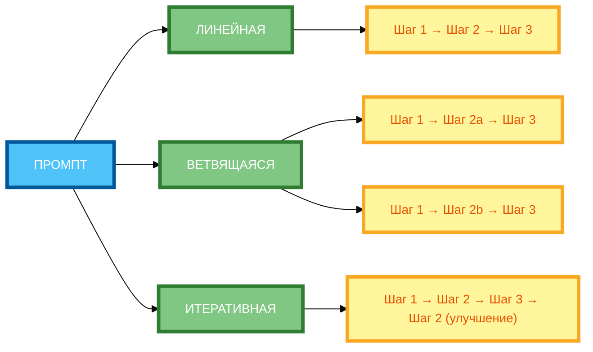

# Схема 1: «Типы цепочек промптов» (горизонтальная компоновка)

**Рисунок 1.** «Типы цепочек промптов» (classification diagram). 3 ряда: Промпт слева, 3 типа цепочек в столбик (ЛИНЕЙНАЯ, ВЕТВЯЩАЯСЯ, ИТЕРАТИВНАЯ), примеры справа. Компактная 1:1, текст полный, цвета и рамки 4px. Расширение слева направо, не длинная по горизонтали.