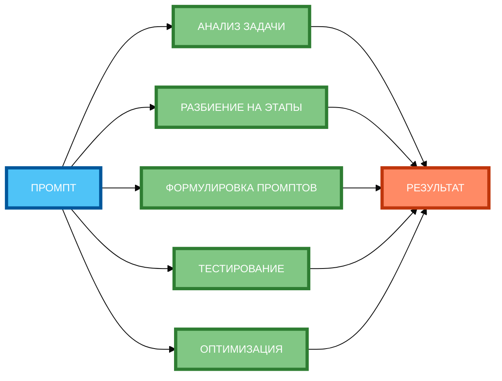

# Схема 2: «Алгоритм создания цепочки» (горизонтальная компоновка)

**Рисунок 2.** «Алгоритм создания цепочки» (flowchart). 3 ряда: Промпт слева, 5 этапов в столбик (АНАЛИЗ ЗАДАЧИ, РАЗБИЕНИЕ НА ЭТАПЫ, ФОРМУЛИРОВКА ПРОМПТОВ, ТЕСТИРОВАНИЕ, ОПТИМИЗАЦИЯ), Результат справа. Компактная 1:1, текст полный, цвета и рамки 4px. Расширение слева направо, не длинная по горизонтали.