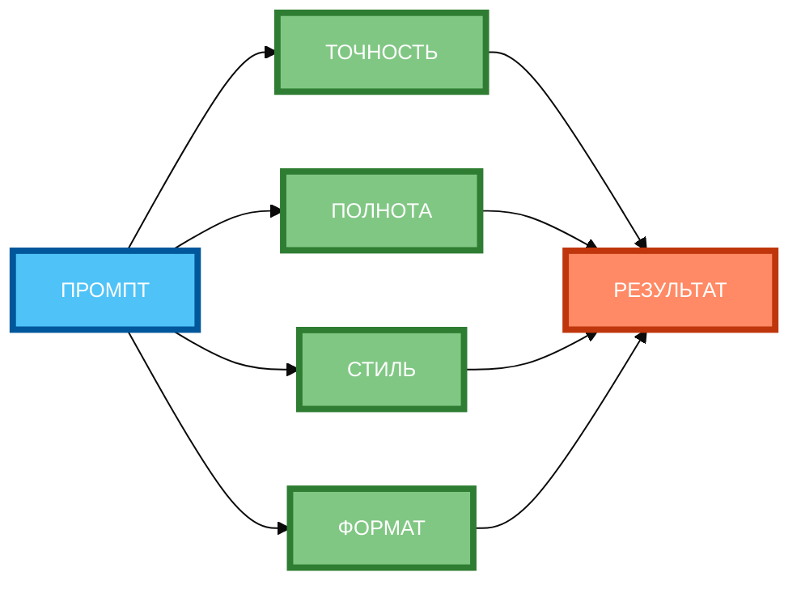

# Итеративное улучшение промптов: цикл доработки

В предыдущей статье вы узнали, как создавать цепочки промптов для разбиения сложной задачи на шаги. Но даже если цепочка составлена правильно, **первый результат редко бывает идеальным**. В этой статье вы научитесь использовать **итеративный подход** — последовательное улучшение промпта через анализ результатов и доработку, пока результат не станет удовлетворительным.

## Суть итеративного подхода: последовательное улучшение промпта через анализ результатов

**Итеративный подход** — это метод, при котором вы **не ожидаете идеального результата с первого раза**, а улучшаете промпт постепенно, анализируя каждый результат и внося изменения.

**Суть метода:**

- **Промпт** — вы создаёте промпт и получаете результат.
- **Результат** — вы анализируете результат и выявляете проблемы.
- **Анализ** — вы определяете, что нужно улучшить.
- **Доработка** — вы вносите изменения в промпт.
- **Новый промпт** — вы повторяете цикл до достижения желаемого результата.

**Почему итеративный подход эффективен:**

- **Сложные задачи** — невозможно создать идеальный промпт с первого раза.
- **Неопределённость** — трудно предсказать, как нейросеть интерпретирует промпт.
- **Улучшение качества** — каждый цикл улучшает результат.
- **Обучение** — вы лучше понимаете, как работает нейросеть.

**Пример без итераций:**

```
Напиши сценарий вебинара о тайм-менеджменте.
```

**Результат:** Общий сценарий без структуры, без примеров, без конкретных техник.

**Пример с итерациями:**

- **Итерация 1:** Базовый промпт → общий сценарий.
- **Итерация 2:** Добавить структуру и тон → структурированный сценарий с дружелюбным тоном.
- **Итерация 3:** Включить примеры техник → сценарий с конкретными примерами.

## Цикл «промпт → результат → анализ → доработка»: разбор каждого этапа

**Этап 1: Промпт**

Вы создаёте промпт и отправляете его нейросети.

**Пример:**

```
Напиши сценарий вебинара о тайм-менеджменте. Длительность: 60 минут. Аудитория: офисные работники 25–40 лет.
```

**Этап 2: Результат**

Нейросеть генерирует ответ.

**Пример результата:**

```
Сценарий вебинара:
1. Введение (5 мин)
2. Что такое тайм-менеджмент (10 мин)
3. Техники тайм-менеджмента (30 мин)
4. Вопросы и ответы (15 мин)
```

**Этап 3: Анализ**

Вы анализируете результат и выявляете проблемы.

**Пример анализа:**

- Слишком общий (нет конкретных техник).
- Нет примеров.
- Нет структуры (только заголовки).
- Тон не указан.

**Этап 4: Доработка**

Вы вносите изменения в промпт.

**Пример доработки:**

```
Напиши сценарий вебинара о тайм-менеджменте. Длительность: 60 минут. Аудитория: офисные работники 25–40 лет. Тон: дружелюбный, мотивирующий. Структура: введение (5 мин), 3 блока по 15 мин (каждый блок — одна техника), вопросы и ответы (10 мин). Для каждой техники приведи пример из реальной жизни.
```

**Этап 5: Новый промпт**

Вы повторяете цикл с новым промптом.

## Вопросы для анализа результата (точность, полнота, стиль, соответствие ограничениям)

**1. Соответствует ли ответ основной задаче?**

- Выполнена ли задача, которую вы поставили?
- Есть ли лишние элементы, которые не нужны?

**Пример:** «Напиши сценарий вебинара» → сценарий должен содержать структуру, тайминг, примеры. Если есть только заголовки — задача не выполнена.

**2. Полнота информации (нет ли пропусков?)**

- Все ли аспекты задачи освещены?
- Нет ли пропущенных разделов или деталей?

**Пример:** «Напиши сценарий вебинара о тайм-менеджменте» → должны быть: введение, 3 техники, примеры, Q&A. Если нет примеров — информация неполная.

**3. Соблюдены ли ограничения (объём, стиль, тон)?**

- Соответствует ли объём указанному?
- Соответствует ли стиль и тон запросу?

**Пример:** «Объём: 60 минут» → сценарий должен быть рассчитан на 60 минут. Если получился 90 минут — ограничение не соблюдено.

**4. Соответствует ли формат запросу?**

- Правильный ли формат ответа?
- Указаны ли все необходимые элементы формата?

**Пример:** «Структура: введение, 3 блока, Q&A» → сценарий должен иметь эти разделы. Если нет разделов — формат не соответствует.

**5. Есть ли логические противоречия?**

- Нет ли противоречий в информации?
- Логично ли построен ответ?

**Пример:** «Техника 1: делай всё сразу» + «Техника 2: делай по одной задаче» — противоречие.

**6. Достаточно ли конкретны формулировки?**

- Конкретны ли примеры и рекомендации?
- Нет ли общих фраз без содержания?

**Пример:** «Используй технику помидора» — конкретно. «Используй эффективные техники» — неконкретно.

**7. Учтён ли контекст?**

- Учтена ли аудитория?
- Учтены ли ограничения и условия?

**Пример:** «Аудитория: офисные работники 25–40 лет» → примеры должны быть из офисной жизни. Если примеры про фермеров — контекст не учтён.

**8. Можно ли улучшить ясность и читаемость?**

- Легко ли читать ответ?
- Есть ли длинные предложения или сложные формулировки?

**Пример:** «Используйте метод, который предполагает разделение рабочего времени на интервалы с перерывами» — сложно. «Используйте метод «помидор»: 25 минут работы + 5 минут перерыва» — ясно.

## Техники доработки: добавление контекста, уточнение ролей, изменение формата

**1. Добавление контекста**

**Проблема:** Результат слишком общий.

**Решение:** Добавьте контекст (аудитория, цель, ограничения).

**Пример:**

- **До:** «Напиши сценарий вебинара о тайм-менеджменте.»
- **После:** «Напиши сценарий вебинара о тайм-менеджменте. Аудитория: офисные работники 25–40 лет. Цель: научить слушателей планировать день. Ограничения: 60 минут, дружелюбный тон.»

**2. Уточнение ролей**

**Проблема:** Результат не соответствует тону или стилю.

**Решение:** Уточните роль нейросети.

**Пример:**

- **До:** «Напиши сценарий вебинара.»
- **После:** «Ты — эксперт по тайм-менеджменту с 10-летним опытом. Напиши сценарий вебинара для офисных работников.»

**3. Изменение формата**

**Проблема:** Результат не соответствует нужному формату.

**Решение:** Укажите формат явно.

**Пример:**

- **До:** «Напиши сценарий вебинара.»
- **После:** «Напиши сценарий вебинара. Формат: введение (5 мин), 3 блока по 15 мин, Q&A (10 мин).»

**4. Добавление примеров**

**Проблема:** Результат слишком абстрактный.

**Решение:** Добавьте примеры.

**Пример:**

- **До:** «Напиши сценарий вебинара.»
- **После:** «Напиши сценарий вебинара. Пример блока: «Техника «помидор»: 25 минут работы + 5 минут перерыва. Пример: «Вы работаете над отчётом 25 минут, потом делаете перерыв»».»

**5. Уточнение критериев**

**Проблема:** Результат не соответствует критериям качества.

**Решение:** Укажите критерии явно.

**Пример:**

- **До:** «Напиши сценарий вебинара.»
- **После:** «Напиши сценарий вебинара. Критерии: конкретные примеры, дружелюбный тон, структура с таймингом.»

## Примеры итеративного улучшения для разных типов задач

**Пример 1: Сценарий вебинара (3 итерации)**

**Итерация 1 (базовый промпт):**

```
Напиши сценарий вебинара о тайм-менеджменте.
```

**Результат:** Общий сценарий без структуры, без примеров, без тона.

**Анализ:** Слишком общий, нет структуры, нет примеров, тон не указан.

**Итерация 2 (добавить структуру и тон):**

```
Напиши сценарий вебинара о тайм-менеджменте. Длительность: 60 минут. Аудитория: офисные работники 25–40 лет. Тон: дружелюбный, мотивирующий. Структура: введение (5 мин), 3 блока по 15 мин, вопросы и ответы (10 мин).
```

**Результат:** Структурированный сценарий с дружелюбным тоном, но без конкретных примеров.

**Анализ:** Есть структура и тон, но нет примеров техник.

**Итерация 3 (включить примеры):**

```
Напиши сценарий вебинара о тайм-менеджменте. Длительность: 60 минут. Аудитория: офисные работники 25–40 лет. Тон: дружелюбный, мотивирующий. Структура: введение (5 мин), 3 блока по 15 мин (каждый блок — одна техника тайм-менеджмента с примером из реальной жизни), вопросы и ответы (10 мин).
```

**Результат:** Сценарий с структурой, тоном и конкретными примерами.

## Инструменты автоматизации итераций (API, скрипты, платформы)

**Важно:** Мы не будем углубляться в технические детали, но важно понимать, что итеративное улучшение можно **автоматизировать**.

**Как это работает:**

- Вы создаёте промпт и получаете результат.
- Вы анализируете результат (вручную или автоматически).
- Вы вносите изменения в промпт.
- Вы повторяете цикл.

**Преимущества автоматизации:**

- Экономия времени.
- Повторяемость процесса.
- Возможность тестировать множество вариантов.

**Ограничения:**

- Нужно точно сформулировать критерии оценки.
- Автоматический анализ может быть менее точным, чем ручной.
- Требуется настройка и тестирование.

## Практические рекомендации по организации итеративного процесса

**Рекомендация 1: Начинайте с простого промпта**

Не пытайтесь создать идеальный промпт с первого раза. Начните с базового и улучшайте постепенно.

**Рекомендация 2: Анализируйте результат по 8 вопросам**

Используйте 8 вопросов из чек-листа для анализа каждого результата.

**Рекомендация 3: Вносите изменения по одному**

Не пытайтесь исправить всё сразу. Вносите изменения по одному и проверяйте результат.

**Рекомендация 4: Документируйте итерации**

Записывайте, какие изменения вы вносили и как они повлияли на результат. Это поможет понять, что работает.

**Рекомендация 5: Останавливайтесь, когда результат удовлетворителен**

Не пытайтесь сделать промпт идеальным. Остановитесь, когда результат соответствует вашим требованиям.

**Рекомендация 6: Используйте итерации для сложных задач**

Для простых задач достаточно 1–2 итераций. Для сложных — 3–5 итераций.

## Схема 1: «Цикл итеративного улучшения» (flowchart)


**Рисунок 1.** «Цикл итеративного улучшения» (flowchart). 3 ряда: Промпт слева, 4 этапа цикла в столбик (ГЕНЕРАЦИЯ, АНАЛИЗ, ДОРАБОТКА, НОВЫЙ ПРОМПТ), Результат справа. Компактная 1:1, текст полный, цвета и рамки 4px. Расширение слева направо, не длинная по горизонтали.

## Схема 2: «Матрица анализа результатов» (grid)



**Рисунок 2.** «Матрица анализа результатов» (grid). 3 ряда: Промпт слева, 4 параметра оценки в столбик (ТОЧНОСТЬ, ПОЛНОТА, СТИЛЬ, ФОРМАТ), Результат справа. Компактная 1:1, текст полный, цвета и рамки 4px. Расширение слева направо, не длинная по горизонтали.

## Таблица: «8 вопросов для анализа результата»

| Вопрос | Цель | Пример применения |
|--------|------|-------------------|
| **Соответствует ли ответ основной задаче?** | Убедиться, что задача выполнена | «Напиши сценарий вебинара» → сценарий должен содержать структуру, тайминг, примеры |
| **Полнота информации (нет ли пропусков?)** | Убедиться, что все аспекты освещены | «Напиши сценарий вебинара о тайм-менеджменте» → должны быть: введение, 3 техники, примеры, Q&A |
| **Соблюдены ли ограничения (объём, стиль, тон)?** | Убедиться, что ограничения выполнены | «Объём: 60 минут» → сценарий должен быть рассчитан на 60 минут |
| **Соответствует ли формат запросу?** | Убедиться, что формат правильный | «Структура: введение, 3 блока, Q&A» → сценарий должен иметь эти разделы |
| **Есть ли логические противоречия?** | Убедиться, что информация логична | «Техника 1: делай всё сразу» + «Техника 2: делай по одной задаче» — противоречие |
| **Достаточно ли конкретны формулировки?** | Убедиться, что примеры конкретны | «Используй технику помидора» — конкретно. «Используй эффективные техники» — неконкретно |
| **Учтён ли контекст?** | Убедиться, что контекст учтён | «Аудитория: офисные работники» → примеры должны быть из офисной жизни |
| **Можно ли улучшить ясность и читаемость?** | Убедиться, что текст читаем | «Используйте метод, который предполагает разделение рабочего времени на интервалы» — сложно. «Используйте метод «помидор»» — ясно |

**Рисунок 3.** «8 вопросов для анализа результата». Таблица содержит 8 вопросов с целью и примером применения.

## Практическое задание

**Задание:** Улучшите промпт после 2 итераций для задачи «Напиши сценарий вебинара о тайм-менеджменте».

**Итерация 1 (базовый промпт):**

```
Напиши сценарий вебинара о тайм-менеджменте.
```

**Итерация 2 (добавить структуру и тон):**

```
Напиши сценарий вебинара о тайм-менеджменте. Длительность: 60 минут. Аудитория: офисные работники 25–40 лет. Тон: дружелюбный, мотивирующий. Структура: введение (5 мин), 3 блока по 15 мин, вопросы и ответы (10 мин).
```

**Итерация 3 (включить примеры техник):**

```
Напиши сценарий вебинара о тайм-менеджменте. Длительность: 60 минут. Аудитория: офисные работники 25–40 лет. Тон: дружелюбный, мотивирующий. Структура: введение (5 мин), 3 блока по 15 мин (каждый блок — одна техника тайм-менеджмента с примером из реальной жизни), вопросы и ответы (10 мин).
```

**Часть 1:** Напишите базовый промпт (Итерация 1).

**Часть 2:** Добавьте структуру и тон (Итерация 2).

**Часть 3:** Включите примеры техник (Итерация 3).

**Часть 4:** Сравните 3 результата и ответьте:
- Какой результат лучше соответствует задаче?
- Какие изменения дали наибольший эффект?
- Что ещё можно улучшить?

**Чек-лист для самопроверки:**

- [ ] Итерация 1: базовый промпт
- [ ] Итерация 2: добавлена структура (введение, 3 блока, Q&A) и тон (дружелюбный, мотивирующий)
- [ ] Итерация 3: включены примеры техник тайм-менеджмента
- [ ] Каждый результат проанализирован по 8 вопросам
- [ ] Изменения вносились по одному (не все сразу)
- [ ] Сравнение 3 результатов проведено
- [ ] Определены наиболее эффективные изменения
- [ ] Выявлены возможности для дальнейшего улучшения

## Заключение

Итеративное улучшение промптов — это мощный метод для достижения качественных результатов. Главное — анализировать каждый результат по 8 вопросам, вносить изменения по одному и не останавливаться, пока результат не станет удовлетворительным. В следующей статье вы узнаете, как использовать метод Tree-of-Thoughts для разветвления на несколько вариантов.