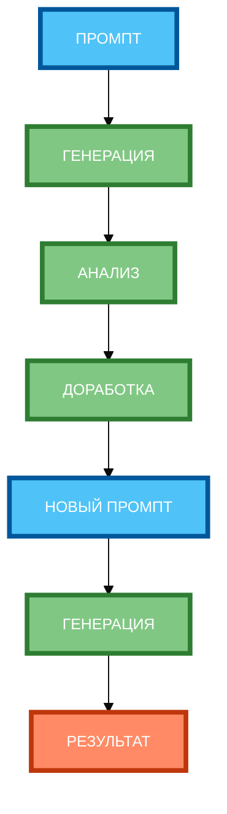

# Схема 1: «Цикл итеративного улучшения» (вертикальная компоновка)

**Рисунок 1.** «Цикл итеративного улучшения» (flowchart). 3 ряда: Промпт сверху, 4 этапа цикла в столбик (ГЕНЕРАЦИЯ, АНАЛИЗ, ДОРАБОТКА, НОВЫЙ ПРОМПТ), Результат снизу. Компактная 1:1, текст полный, цвета и рамки 4px. Вертикальная компоновка.