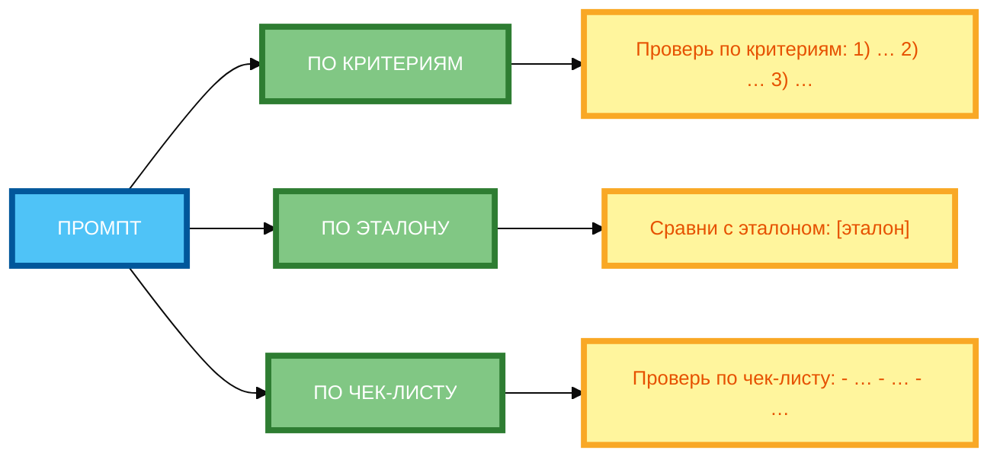

# Метод Self-Check: заставляем нейросеть проверить себя

В предыдущей статье вы узнали, как использовать итеративное улучшение промптов для последовательной доработки результата. Но даже если вы проводите итерации, **каждый цикл требует вашего участия** — вы анализируете результат и вносите изменения. В этой статье вы научитесь использовать **Self-Check** — метод, при котором нейросеть **сама проверяет и исправляет** свой ответ, без вашего вмешательства.

## Что такое Self-Check и зачем он нужен

**Self-Check** (самопроверка) — это техника, при которой вы просите нейросеть **оценить и исправить свой собственный ответ** по заданным критериям.

**Суть метода:**

- Нейросеть генерирует ответ.
- Нейросеть **анализирует** свой ответ по критериям (полнота, точность, стиль и т.д.).
- Нейросеть **исправляет** ошибки, если они есть.
- Нейросеть выдаёт **финальный ответ**.

**Зачем нужен Self-Check:**

- **Автоматизация проверки** — нейросеть сама находит и исправляет ошибки.
- **Экономия времени** — вам не нужно анализировать каждый результат.
- **Повышение качества** — нейросеть может найти ошибки, которые вы пропустили.
- **Обучение** — нейросеть учится лучше понимать критерии качества.

**Пример без Self-Check:**

```
Напиши статью о пользе медитации. Объём: 400 слов. Тон: мотивирующий. Не используй сложные термины.
```

**Результат:** Статья, которая может содержать сложные термины, не соответствовать тону или быть неполной.

**Пример с Self-Check:**

```
Напиши статью о пользе медитации. Объём: 400 слов. Тон: мотивирующий. Не используй сложные термины.

После написания статьи проверь её по критериям:
1. Полнота: все ли аспекты медитации освещены?
2. Отсутствие сложных терминов: нет ли слов, которые нужно объяснить?
3. Мотивирующий тон: есть ли призывы к действию и позитивные формулировки?

Если есть ошибки, исправь их и выведи финальный вариант.
```

**Результат:** Статья, которая **самостоятельно проверена и исправлена** нейросетью.

## Принципы работы метода: нейросеть как критик собственного ответа

**Принцип 1: Нейросеть может быть критиком**

Нейросеть способна **анализировать свой собственный ответ** и находить в нём ошибки, если вы чётко укажете критерии.

**Принцип 2: Критерии должны быть конкретными**

Чем **конкретнее** критерии, тем точнее самопроверка.

**Пример:**

- **Неконкретно:** «Проверь ответ на качество.»
- **Конкретно:** «Проверь ответ по критериям: 1) полнота, 2) отсутствие сложных терминов, 3) мотивирующий тон.»

**Принцип 3: Самопроверка — это отдельный этап**

Self-Check должен быть **отдельным этапом** после генерации, а не частью основного промпта.

**Пример:**

```
Шаг 1: Напиши статью о пользе медитации.
Шаг 2: Проверь статью по критериям: 1) полнота, 2) отсутствие сложных терминов, 3) мотивирующий тон.
Шаг 3: Если есть ошибки, исправь их и выведи финальный вариант.
```

**Принцип 4: Самопроверка не всегда идеальна**

Нейросеть может **не заметить ошибки** или **придумать проблемы**, которых нет. Self-Check — это инструмент, а не гарантия качества.

## Техники формулировки Self-Check (прямые вопросы, чек-листы, сравнение с эталоном)

**1. Прямые вопросы**

**Формулировка:** «Проверь свой ответ по вопросам: 1) … 2) … 3) …»

**Пример:**

```
После написания статьи проверь её по вопросам:
1. Все ли аспекты медитации освещены?
2. Нет ли сложных терминов?
3. Есть ли мотивирующий тон?
```

**2. Чек-листы**

**Формулировка:** «Проверь свой ответ по чек-листу: - … - … - …»

**Пример:**

```
После написания статьи проверь её по чек-листу:
- Полнота: все ли аспекты освещены?
- Отсутствие сложных терминов: нет ли слов, которые нужно объяснить?
- Мотивирующий тон: есть ли призывы к действию?
```

**3. Сравнение с эталоном**

**Формулировка:** «Сравни свой ответ с эталоном: [эталон]. Если есть отличия, исправь их.»

**Пример:**

```
После написания статьи сравни её с эталоном:
«Медитация помогает снизить стресс и улучшить концентрацию. Начните с 5 минут в день.»

Если есть отличия, исправь их и выведи финальный вариант.
```

**4. Оценка по шкале**

**Формулировка:** «Оцени свой ответ по шкале от 1 до 10 по критериям: 1) … 2) … 3) … Если оценка ниже 8, исправь ответ.»

**Пример:**

```
После написания статьи оцени её по шкале от 1 до 10 по критериям:
1. Полнота
2. Отсутствие сложных терминов
3. Мотивирующий тон

Если оценка ниже 8 по любому критерию, исправь ответ и выведи финальный вариант.
```

## Примеры Self-Check для разных задач (текст, код, анализ данных)

**Пример 1: Текст (статья)**

```
Напиши статью о пользе медитации. Объём: 400 слов. Тон: мотивирующий. Не используй сложные термины.

После написания статьи проверь её по критериям:
1. Полнота: все ли аспекты медитации освещены?
2. Отсутствие сложных терминов: нет ли слов, которые нужно объяснить?
3. Мотивирующий тон: есть ли призывы к действию и позитивные формулировки?

Если есть ошибки, исправь их и выведи финальный вариант.
```

**Пример 2: Анализ данных**

```
Проанализируй данные о продажах за 3 месяца. Данные: таблица с колонками «Месяц», «Выручка», «Затраты», «Прибыль».

После анализа проверь его по критериям:
1. Все ли расчёты верны?
2. Все ли выводы основаны на данных?
3. Нет ли логических противоречий?

Если есть ошибки, исправь их и выведи финальный анализ.
```

**Пример 3: Генерация идей**

```
Предложи 5 идей для маркетинговой кампании. Продукт: AI-платформа для управления проектами. Аудитория: руководители команд 5–15 человек в IT-компаниях.

После генерации идей проверь их по критериям:
1. Каждая идея конкретна и реалистична?
2. Каждая идея соответствует аудитории?
3. Идеи разнообразны (не повторяются)?

Если есть ошибки, исправь их и выведи финальный список.
```

## Ограничения метода: риск «самообмана», снижение креативности

**Ограничение 1: Риск «самообмана»**

Нейросеть может **не заметить ошибки** в своем ответе или **придумать проблемы**, которых нет.

**Пример:**

- Нейросеть написала статью с ошибкой.
- Нейросеть проверяет статью и **не видит ошибку**.
- Результат: статья с ошибкой.

**Решение:** Используйте Self-Check как **дополнительный инструмент**, а не единственный способ проверки.

**Ограничение 2: Снижение креативности**

Когда нейросеть проверяет свой ответ по строгим критериям, она может **стать слишком осторожной** и выдавать шаблонные ответы.

**Пример:**

- Критерий: «Не используй сложные термины.»
- Нейросеть избегает всех терминов, даже тех, которые нужны.
- Результат: статья слишком упрощённая.

**Решение:** Используйте Self-Check **после генерации**, а не во время. Сначала дайте нейросети свободу, потом проверьте.

**Ограничение 3: Не все ошибки можно найти**

Self-Check работает только с теми критериями, которые вы указали. **Непредвиденные ошибки** могут остаться незамеченными.

**Пример:**

- Критерии: полнота, отсутствие сложных терминов, мотивирующий тон.
- Нейросеть не проверяет **фактическую точность** информации.
- Результат: статья с фактическими ошибками.

**Решение:** Добавляйте критерии, которые важны для вашей задачи (например, «фактическая точность»).

## Комбинирование Self-Check с другими техниками (роли, итерации)

**Комбинирование 1: Self-Check + Роли**

```
Ты — эксперт по медитации с 10-летним опытом. Напиши статью о пользе медитации. Объём: 400 слов. Тон: мотивирующий. Не используй сложные термины.

После написания статьи проверь её по критериям:
1. Полнота: все ли аспекты медитации освещены?
2. Отсутствие сложных терминов: нет ли слов, которые нужно объяснить?
3. Мотивирующий тон: есть ли призывы к действию и позитивные формулировки?

Если есть ошибки, исправь их и выведи финальный вариант.
```

**Комбинирование 2: Self-Check + Итерации**

```
Напиши статью о пользе медитации. Объём: 400 слов. Тон: мотивирующий. Не используй сложные термины.

После написания статьи проверь её по критериям:
1. Полнота
2. Отсутствие сложных терминов
3. Мотивирующий тон

Если есть ошибки, исправь их и выведи финальный вариант.

Повтори цикл проверки и исправления 2 раза.
```

**Комбинирование 3: Self-Check + Цепочка промптов**

```
Шаг 1: Напиши статью о пользе медитации.
Шаг 2: Проверь статью по критериям: 1) полнота, 2) отсутствие сложных терминов, 3) мотивирующий тон.
Шаг 3: Если есть ошибки, исправь их и выведи финальный вариант.
```

## Практические советы по внедрению Self-Check

**Совет 1: Начинайте с 3–5 критериев**

Не перегружайте Self-Check слишком большим количеством критериев. 3–5 критериев — оптимально.

**Совет 2: Используйте конкретные критерии**

Чем конкретнее критерии, тем точнее самопроверка.

**Совет 3: Добавляйте примеры критериев**

Если критерий сложный, добавьте пример.

**Пример:**

```
Критерий: «Мотивирующий тон». Пример: «Начните с 5 минут в день — и вы почувствуете разницу!»
```

**Совет 4: Указывайте способ исправления**

Не просто «проверь ответ», а «если есть ошибки, исправь их и выведи финальный вариант».

**Совет 5: Тестируйте Self-Check на примере**

Прежде чем использовать Self-Check на реальных данных, **протестируйте** его на небольшом примере.

## Схема 1: «Алгоритм Self-Check» (flowchart)


**Рисунок 1.** «Алгоритм Self-Check» (flowchart). 3 ряда: Промпт слева, 4 этапа в столбик (ГЕНЕРАЦИЯ, САМОПРОВЕРКА, ИСПРАВЛЕНИЕ, ФИНАЛЬНЫЙ ОТВЕТ), Результат справа. Компактная 1:1, текст полный, цвета и рамки 4px. Расширение слева направо, не длинная по горизонтали.

## Схема 2: «Типы самопроверки» (classification diagram)



**Рисунок 2.** «Типы самопроверки» (classification diagram). 3 ряда: Промпт слева, 3 типа самопроверки в столбик (ПО КРИТЕРИЯМ, ПО ЭТАЛОНУ, ПО ЧЕК-ЛИСТУ), примеры справа. Компактная 1:1, текст полный, цвета и рамки 4px. Расширение слева направо, не длинная по горизонтали.

## Таблица: «Алгоритм Self-Check»

| Этап | Действие | Пример промпта |
|------|----------|----------------|
| **Генерация** | Напиши ответ на задачу | «Напиши статью о пользе медитации. Объём: 400 слов.» |
| **Самопроверка** | Проверь ответ по критериям | «После написания статьи проверь её по критериям: 1) полнота, 2) отсутствие сложных терминов, 3) мотивирующий тон.» |
| **Исправление** | Если есть ошибки, исправь их | «Если есть ошибки, исправь их и выведи финальный вариант.» |
| **Финальный ответ** | Выведи исправленный ответ | «Выведи финальный вариант статьи.» |

**Рисунок 3.** «Алгоритм Self-Check». Таблица содержит 4 этапа с действием и примером промпта.

## Практическое задание

**Задание:** Создайте промпт с самопроверкой для задачи «Напиши статью о пользе медитации».

**Требования:**

- Сгенерируй текст.
- Проверь его по критериям: 1) полнота, 2) отсутствие сложных терминов, 3) мотивирующий тон.
- Исправь при необходимости.
- Выведи финальный вариант.

**Чек-лист для самопроверки:**

- [ ] Сформулирован промпт для генерации
- [ ] Добавлен этап самопроверки («Проанализируй свой ответ по критериям…»)
- [ ] Указаны критерии оценки (3–5 пунктов)
- [ ] Предложен способ исправления («Если есть ошибки, исправь их и выведи финальный вариант»)
- [ ] Протестирован промпт на примере
- [ ] Критерии конкретны и измеримы
- [ ] Самопроверка — отдельный этап после генерации
- [ ] Указан способ вывода финального ответа

## Заключение

Self-Check — это мощный метод для автоматизации проверки качества ответов нейросети. Главное — чётко формулировать критерии, использовать конкретные вопросы и помнить, что самопроверка не всегда идеальна. В следующей статье вы узнаете, как использовать метод Tree-of-Thoughts для разветвления на несколько вариантов.