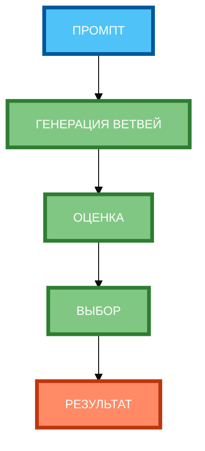

# Схема 2: «Алгоритм выбора лучшего варианта» (вертикальная компоновка)

**Рисунок 2.** «Алгоритм выбора лучшего варианта» (flowchart). **3 ряда**: Промпт сверху, 3 этапа в столбик (ГЕНЕРАЦИЯ ВЕТВЕЙ, ОЦЕНКА, ВЫБОР), Результат снизу. Компактная 1:1, текст полный, цвета и рамки 4px. Вертикальная компоновка.