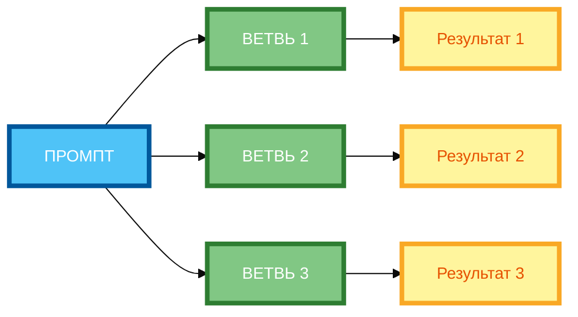

# Метод Tree-of-Thoughts: разветвление на несколько вариантов

В предыдущей статье вы узнали, как использовать Self-Check, чтобы нейросеть проверяла свой собственный ответ. Но даже если нейросеть проверила ответ, **она всё равно рассматривает только один путь решения**. В этой статье вы научитесь использовать **Tree-of-Thoughts (ToT)** — метод, который позволяет нейросети **исследовать несколько путей решения одновременно**, оценивать их и выбирать лучший.

## Концепция Tree-of-Thoughts (ToT): генерация нескольких путей решения

**Tree-of-Thoughts (ToT)** — это метод, который позволяет LLM **исследовать несколько путей рассуждения** одновременно, как дерево с ветвями. Вместо того чтобы генерировать один ответ, нейросеть создаёт **несколько вариантов** и оценивает их.

**Суть метода:**

- **Корень дерева** — это исходная задача.
- **Ветви** — это разные варианты решения.
- **Листья** — это финальные ответы.
- **Оценка** — нейросеть оценивает каждую ветвь по критериям.
- **Выбор** — выбирается лучший вариант.

**Пример без ToT:**

```
Придумай 3 концепции логотипа для эко-бренда.
```

**Результат:** Три концепции, но без сравнения и без выбора лучшей.

**Пример с ToT:**

```
Придумай 3 концепции логотипа для эко-бренда. Сгенерируй 3 ветви:

Ветвь 1 (минимализм): простой логотип с листьями.
Ветвь 2 (природа): логотип с элементами природы.
Ветвь 3 (абстракция): абстрактный логотип.

Для каждой ветви оцени по критериям: узнаваемость, экологичность, простота.

Выбери лучший вариант на основе оценки.
```

**Результат:** Три концепции, каждая оценена по критериям, и выбран лучший вариант.

## Когда применять: задачи с множеством решений, творческие задачи, анализ сценариев

**1. Задачи с множеством решений**

Когда задача имеет **несколько возможных решений**, и нужно выбрать лучшее.

**Пример:**

- Придумать концепции логотипа.
- Разработать стратегии маркетинга.
- Найти решения проблемы.

**2. Творческие задачи**

Когда нужно **генерировать идеи** и выбирать лучшие.

**Пример:**

- Придумать слоганы.
- Создать названия бренда.
- Разработать концепции продуктов.

**3. Анализ сценариев**

Когда нужно **проанализировать разные сценарии** и выбрать оптимальный.

**Пример:**

- Анализ рисков.
- Планирование сценариев развития.
- Оценка вариантов инвестиций.

## Структура ToT: корень (задача) → ветви (варианты) → листья (финальные ответы)

**1. Корень (задача)**

Это исходная задача, которую нужно решить.

**Пример:** «Придумай 3 концепции логотипа для эко-бренда.»

**2. Ветви (варианты)**

Это **разные подходы** к решению задачи.

**Пример:**

- Ветвь 1: минимализм.
- Ветвь 2: природа.
- Ветвь 3: абстракция.

**3. Листья (финальные ответы)**

Это **конкретные решения** в каждой ветви.

**Пример:**

- Ветвь 1 (минимализм): логотип с простым листом.
- Ветвь 2 (природа): логотип с деревом и водой.
- Ветвь 3 (абстракция): логотип с геометрическими фигурами.

**4. Оценка**

Это **критерии**, по которым оценивается каждая ветвь.

**Пример:** узнаваемость, экологичность, простота.

**5. Выбор**

Это **выбор лучшего варианта** на основе оценки.

**Пример:** «Выбери лучший вариант на основе оценки.»

## Способы выбора лучшего пути: критерии оценки, голосование, экспертная оценка

**1. Критерии оценки**

**Формулировка:** «Оцени каждую ветвь по критериям: 1) … 2) … 3) …»

**Пример:**

```
Оцени каждую ветвь по критериям:
1. Узнаваемость (1–10)
2. Экологичность (1–10)
3. Простота (1–10)

Выбери вариант с наибольшей суммой баллов.
```

**2. Голосование**

**Формулировка:** «Оцени каждую ветвь по критериям. Выбери вариант, который получил наибольшее количество голосов.»

**Пример:**

```
Оцени каждую ветвь по критериям:
1. Узнаваемость
2. Экологичность
3. Простота

Выбери вариант, который получил наибольшее количество голосов.
```

**3. Экспертная оценка**

**Формулировка:** «Оцени каждую ветвь как эксперт в области [область]. Выбери лучший вариант.»

**Пример:**

```
Оцени каждую ветвь как эксперт в области дизайна логотипов. Выбери лучший вариант.
```

**4. Сравнение с эталоном**

**Формулировка:** «Сравни каждую ветвь с эталоном: [эталон]. Выбери наиболее близкий вариант.»

**Пример:**

```
Сравни каждую ветвь с эталоном: «Логотип должен быть простым, узнаваемым и экологичным». Выбери наиболее близкий вариант.
```

## Примеры ToT для разных задач

**Пример 1: Концепции логотипа (полный рабочий промпт)**

```
Придумай 3 концепции логотипа для эко-бренда. Бренд: «Зелёный мир». Аудитория: люди 25–40 лет, которые заботятся об экологии.

Сгенерируй 3 ветви:

Ветвь 1 (минимализм): простой логотип с листьями.
Ветвь 2 (природа): логотип с элементами природы.
Ветвь 3 (абстракция): абстрактный логотип.

Для каждой ветви оцени по критериям:
1. Узнаваемость (1–10)
2. Экологичность (1–10)
3. Простота (1–10)

Выбери лучший вариант на основе оценки.
```

**Разбор:**

- **Корень:** «Придумай 3 концепции логотипа для эко-бренда.»
- **Ветви:** минимализм, природа, абстракция.
- **Листья:** конкретные описания логотипов.
- **Оценка:** узнаваемость, экологичность, простота.
- **Выбор:** лучший вариант на основе оценки.

**Пример 2: Стратегии маркетинга (полный рабочий промпт)**

```
Разработай стратегию маркетинга для нового продукта. Продукт: AI-платформа для управления проектами. Цена: 990 руб./мес. Аудитория: руководители команд 5–15 человек в IT-компаниях.

Сгенерируй 3 ветви:

Ветвь 1 (контент-маркетинг): блог, вебинары, подкасты.
Ветвь 2 (социальные сети): LinkedIn, Telegram, YouTube.
Ветвь 3 (партнёрства): сотрудничество с инфлюенсерами и компаниями.

Для каждой ветви оцени по критериям:
1. Охват аудитории (1–10)
2. Стоимость (1–10)
3. Эффективность (1–10)

Выбери лучший вариант на основе оценки.
```

**Разбор:**

- **Корень:** «Разработай стратегию маркетинга для нового продукта.»
- **Ветви:** контент-маркетинг, социальные сети, партнёрства.
- **Листья:** конкретные каналы и тактики.
- **Оценка:** охват, стоимость, эффективность.
- **Выбор:** лучший вариант на основе оценки.

## Ограничения: высокая ресурсоёмкость, сложность управления ветвями

**Ограничение 1: Высокая ресурсоёмкость**

ToT требует **больше вычислительных ресурсов**, чем обычный промпт, потому что нужно генерировать и оценивать несколько вариантов.

**Решение:** Ограничьте количество ветвей (3–5 оптимально).

**Ограничение 2: Сложность управления ветвями**

Когда ветвей **много**, нейросеть может **запутаться** и не понять, какую ветвь выбрать.

**Решение:** Чётко указывайте критерии оценки и способ выбора.

**Ограничение 3: Снижение креативности**

Когда нейросеть оценивает варианты по строгим критериям, она может **стать слишком осторожной** и выбирать шаблонные решения.

**Решение:** Используйте ToT для задач, где важна **точность**, а не креативность.

**Ограничение 4: Сложность формулировки**

ToT требует **сложной формулировки** промпта, что может быть сложно для новичков.

**Решение:** Используйте шаблоны и примеры.

## Практические рекомендации по реализации ToT

**Рекомендация 1: Чётко сформулируй задачу**

Прежде чем создавать ToT, чётко сформулируй, **какую задачу** нужно решить.

**Рекомендация 2: Определи количество ветвей (3–5 оптимально)**

Не делай слишком много ветвей. 3–5 ветвей — оптимально.

**Рекомендация 3: Для каждой ветви укажи направление мысли**

Чётко укажи, **какой подход** используется в каждой ветви.

**Рекомендация 4: Добавь критерии оценки ветвей (2–4 пункта)**

Укажи **конкретные критерии**, по которым будет оцениваться каждая ветвь.

**Рекомендация 5: Опиши способ выбора лучшего варианта**

Укажи **как** будет выбираться лучший вариант (критерии, голосование, экспертная оценка).

**Рекомендация 6: Тестируйте ToT на небольшом примере**

Прежде чем использовать ToT на реальных данных, **протестируйте** его на небольшом примере.

## Схема 1: «Дерево решений ToT» (tree diagram)



**Рисунок 1.** «Дерево решений ToT» (tree diagram). 3 ряда: Промпт слева, 3 ветви в столбик (ВЕТВЬ 1, ВЕТВЬ 2, ВЕТВЬ 3), результаты справа. Компактная 1:1, текст полный, цвета и рамки 4px. Расширение слева направо, не длинная по горизонтали.

## Схема 2: «Алгоритм выбора лучшего варианта» (flowchart)


**Рисунок 2.** «Алгоритм выбора лучшего варианта» (flowchart). 3 ряда: Промпт слева, 3 этапа в столбик (ГЕНЕРАЦИЯ ВЕТВЕЙ, ОЦЕНКА, ВЫБОР), Результат справа. Компактная 1:1, текст полный, цвета и рамки 4px. Расширение слева направо, не длинная по горизонтали.

## Таблица: «Шаблон Tree-of-Thoughts»

| Компонент | Описание | Пример |
|-----------|----------|--------|
| **Задача** | Чётко сформулируй задачу | «Придумай 3 концепции логотипа для эко-бренда.» |
| **Ветви** | Определи количество ветвей (3–5 оптимально) | «Сгенерируй 3 ветви: минимализм, природа, абстракция.» |
| **Направление мысли** | Для каждой ветви укажи направление | «Ветвь 1 (минимализм): простой логотип с листьями.» |
| **Критерии оценки** | Добавь критерии оценки (2–4 пункта) | «Оцени по критериям: узнаваемость, экологичность, простота.» |
| **Способ выбора** | Опиши способ выбора лучшего варианта | «Выбери лучший вариант на основе оценки.» |

**Рисунок 3.** «Шаблон Tree-of-Thoughts». Таблица содержит 5 компонентов с описанием и примером.

## Практическое задание

**Задание:** Решите задачу «Придумай 3 концепции логотипа для эко-бренда» через Tree-of-Thoughts.

**Требования:**

- Сгенерируй 3 ветви (стили: минимализм, природа, абстракция).
- Оцени каждую по критериям (узнаваемость, экологичность, простота).
- Выбери лучший вариант.

**Чек-лист для самопроверки:**

- [ ] Чётко сформулирована задача
- [ ] Определено количество ветвей (3–5 оптимально)
- [ ] Для каждой ветви указано направление мысли (стиль, подход, метод)
- [ ] Добавлены критерии оценки ветвей (2–4 пункта)
- [ ] Описан способ выбора лучшего варианта
- [ ] Каждый вариант оценён по критериям
- [ ] Выбран лучший вариант с обоснованием
- [ ] Промпт содержит конкретные инструкции

## Заключение

Tree-of-Thoughts — это мощный метод для задач, требующих исследования нескольких вариантов решения. Главное — чётко формулировать задачу, определять количество ветвей, указывать критерии оценки и описывать способ выбора. В следующей статье вы узнаете, как использовать метод ReAct для чередования рассуждения и действия.