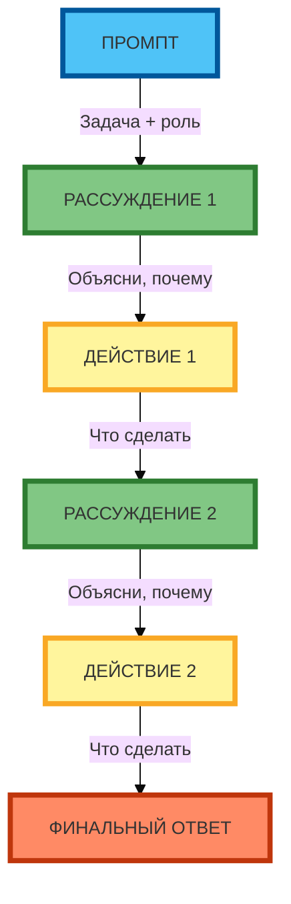

# Схема 1: «Структура ReAct» (вертикальная компоновка)

**Рисунок 1.** «Структура ReAct» (flowchart). **Вертикальная компоновка** (сверху вниз): ПРОМПТ → РАССУЖДЕНИЕ 1 → ДЕЙСТВИЕ 1 → РАССУЖДЕНИЕ 2 → ДЕЙСТВИЕ 2 → ФИНАЛЬНЫЙ ОТВЕТ. Компактная 1:1, текст полный, цвета и рамки 4px. Прямые стрелки с текстом.