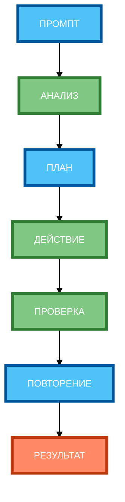

# Схема 2: «Цикл ReAct» (loop diagram, вертикальная компоновка)

**Рисунок 2.** «Цикл ReAct» (loop diagram). **Вертикальная компоновка** (сверху вниз): Промпт сверху, 4 этапа цикла в столбик (АНАЛИЗ → ПЛАН → ДЕЙСТВИЕ → ПРОВЕРКА → ПОВТОРЕНИЕ), Результат снизу. Компактная 1:1, текст полный, цвета и рамки 4px.