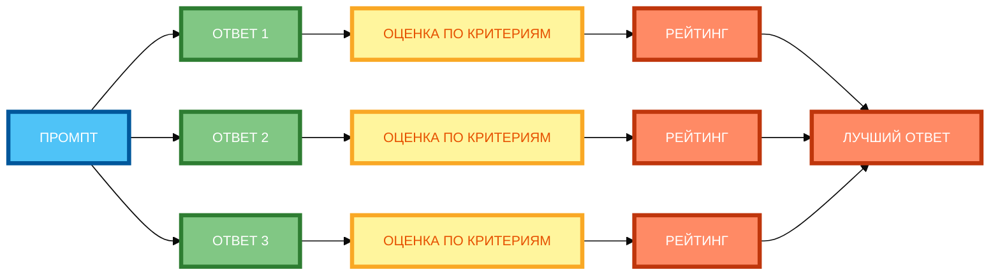

# Метод Self-Consistency: несколько ответов и выбор лучшего

В предыдущей статье вы узнали, как использовать Tree-of-Thoughts для исследования нескольких вариантов решения. Но даже если вы рассмотрели несколько вариантов, **нейросеть всё равно может выдать разные ответы** на один и тот же промпт. В этой статье вы научитесь использовать **Self-Consistency** — метод, который позволяет **генерировать несколько ответов** и выбирать **наиболее согласованный**, повышая точность результата.

## Принцип Self-Consistency (SC): генерация N вариантов → выбор лучшего

**Self-Consistency (SC)** — это метод, который улучшает рассуждения LLM, **генерируя несколько ответов** на один и тот же промпт и выбирая **наиболее согласованный** через majority vote (голосование большинства).

**Суть метода:**

- **Генерация N вариантов** — нейросеть генерирует N ответов на один и тот же промпт.
- **Сравнение** — ответы сравниваются между собой.
- **Выбор лучшего** — выбирается наиболее согласованный ответ (тот, который повторяется чаще всего).

**Пример без Self-Consistency:**

```
Рассуждай пошагово: «Когда тебе было 6, твоей сестре было 3. Разница в возрасте — 3 года. Теперь тебе 70, сколько лет сестре?»

Ответ: «35» (половина твоего возраста).
```

**Результат:** Один ответ, который может быть неправильным.

**Пример с Self-Consistency:**

```
Рассуждай пошагово: «Когда тебе было 6, твоей сестре было 3. Разница в возрасте — 3 года. Теперь тебе 70, сколько лет сестре?»

Генерируй 3 ответа:

Ответ 1: «Когда тебе было 6, сестре было 3. Разница — 3 года. Теперь тебе 70, сестре 67. Ответ: 67.»

Ответ 2: «Когда тебе было 6, сестре было 3. Разница — 3 года. Теперь тебе 70, сестре 67. Ответ: 67.»

Ответ 3: «Когда тебе было 6, сестре было 3. Разница — 3 года. Теперь тебе 70, сестре 67. Ответ: 67.»

Выбери наиболее согласованный ответ.
```

**Результат:** Три ответа, два из которых одинаковы (67). Выбирается ответ 67.

## Алгоритм работы: промпт → N генераций → сравнение → выбор

**Алгоритм Self-Consistency:**

1. **Промпт** — создаёте промпт с задачей.
2. **N генераций** — нейросеть генерирует N ответов (обычно 3–5).
3. **Сравнение** — ответы сравниваются между собой.
4. **Выбор** — выбирается наиболее согласованный ответ.

**Пример алгоритма:**

```
Промпт: «Рассуждай пошагово: «Когда тебе было 6, твоей сестре было 3. Разница в возрасте — 3 года. Теперь тебе 70, сколько лет сестре?»»

Генерируй 3 ответа:

Ответ 1: «Когда тебе было 6, сестре было 3. Разница — 3 года. Теперь тебе 70, сестре 67. Ответ: 67.»

Ответ 2: «Когда тебе было 6, сестре было 3. Разница — 3 года. Теперь тебе 70, сестре 67. Ответ: 67.»

Ответ 3: «Когда тебе было 6, сестре было 3. Разница — 3 года. Теперь тебе 70, сестре 67. Ответ: 67.»

Сравни ответы и выбери наиболее согласованный.
```

**Результат:** Выбирается ответ 67 (повторяется 3 раза).

## Критерии выбора: точность, полнота, соответствие ограничениям, креативность

**1. Точность**

**Формулировка:** «Выбери ответ, который наиболее точен.»

**Пример:**

```
Сравни 3 ответа и выбери наиболее точный.
```

**2. Полнота**

**Формулировка:** «Выбери ответ, который наиболее полон.»

**Пример:**

```
Сравни 3 ответа и выбери наиболее полный.
```

**3. Соответствие ограничениям**

**Формулировка:** «Выбери ответ, который соответствует ограничениям: 1) … 2) … 3) …»

**Пример:**

```
Сравни 3 ответы и выбери наиболее соответствующий ограничениям: 1) объём 400 слов, 2) тон мотивирующий, 3) отсутствие сложных терминов.
```

**4. Креативность**

**Формулировка:** «Выбери ответ, который наиболее креативен.»

**Пример:**

```
Сравни 3 ответа и выбери наиболее креативный.
```

**5. Голосование (majority vote)**

**Формулировка:** «Выбери ответ, который получил наибольшее количество голосов.»

**Пример:**

```
Сравни 3 ответа и выбери тот, который повторяется чаще всего.
```

## Примеры SC для разных задач

**Пример 1: Математическая задача (полный рабочий промпт)**

```
Рассуждай пошагово: «Когда тебе было 6, твоей сестре было 3. Разница в возрасте — 3 года. Теперь тебе 70, сколько лет сестре?»

Генерируй 3 ответа:

Ответ 1: «Когда тебе было 6, сестре было 3. Разница — 3 года. Теперь тебе 70, сестре 67. Ответ: 67.»

Ответ 2: «Когда тебе было 6, сестре было 3. Разница — 3 года. Теперь тебе 70, сестре 67. Ответ: 67.»

Ответ 3: «Когда тебе было 6, сестре было 3. Разница — 3 года. Теперь тебе 70, сестре 67. Ответ: 67.»

Сравни ответы и выбери наиболее согласованный.
```

**Разбор:**

- **Генерация 3 вариантов** — каждый с пошаговым рассуждением.
- **Сравнение** — все 3 ответа одинаковы (67).
- **Выбор** — выбирается ответ 67.

**Пример 2: Анализ текста (полный рабочий промпт)**

```
Проанализируй текст на логические ошибки. Текст: «Все люди смертны. Сократ — человек. Следовательно, Сократ бессмертен.»

Генерируй 3 ответа:

Ответ 1: «Ошибка: заключение противоречит посылкам. Правильный вывод: Сократ смертен.»

Ответ 2: «Ошибка: заключение противоречит посылкам. Правильный вывод: Сократ смертен.»

Ответ 3: «Ошибка: заключение противоречит посылкам. Правильный вывод: Сократ смертен.»

Сравни ответы и выбери наиболее согласованный.
```

**Разбор:**

- **Генерация 3 вариантов** — каждый с анализом ошибки.
- **Сравнение** — все 3 ответа одинаковы.
- **Выбор** — выбирается правильный анализ.

## Преимущества и недостатки метода

**Преимущества:**

- **Повышение точности** — +17.9% на GSM8K, +11.0% на SVAMP, +12.2% на AQuA.
- **Простота реализации** — не требует изменения модели.
- **Универсальность** — работает с любыми задачами, требующими рассуждения.

**Недостатки:**

- **Высокая ресурсоёмкость** — нужно генерировать N ответов вместо одного.
- **Стоимость** — N генераций стоят в N раз дороже.
- **Время** — N генераций занимают в N раз больше времени.

**Решение:** Ограничьте количество вариантов (3–5 оптимально).

## Автоматизация SC через API и инструменты

**Важно:** Мы не будем углубляться в технические детали, но важно понимать, что Self-Consistency можно **автоматизировать**.

**Как это работает:**

- Вы создаёте промпт и генерируете N ответов.
- Вы сравниваете ответы (вручную или автоматически).
- Вы выбираете наиболее согласованный ответ.

**Преимущества автоматизации:**

- Экономия времени.
- Повторяемость процесса.
- Возможность обрабатывать большие объёмы данных.

**Ограничения:**

- Нужно точно сформулировать критерии сравнения.
- Автоматическое сравнение может быть менее точным, чем ручное.
- Требуется настройка и тестирование.

## Практические рекомендации по применению SC

**Рекомендация 1: Укажи количество вариантов (3–5 оптимально)**

Не генерируйте слишком много вариантов. 3–5 — оптимально.

**Рекомендация 2: Определи критерии оценки (2–4 пункта)**

Чётко укажите, **по каким критериям** будет оцениваться каждый вариант.

**Рекомендация 3: Добавь способ выбора (голосование, рейтинг, эксперт)**

Укажите **как** будет выбираться лучший вариант.

**Рекомендация 4: Ограничь объём каждого варианта (если нужно)**

Если варианты должны быть короткими, укажите ограничение по объёму.

**Рекомендация 5: Протестируй на разных задачах**

Self-Consistency работает не для всех задач. Протестируйте на разных типах задач.

**Рекомендация 6: Комбинируй с другими методами**

Self-Consistency можно комбинировать с Chain-of-Thought, Tree-of-Thoughts и другими методами.

## Схема 1: «Процесс Self-Consistency» (flowchart)


**Рисунок 1.** «Процесс Self-Consistency» (flowchart). **3 ряда**: Промпт слева, 3 этапа в среднем ряду (ГЕНЕРАЦИЯ N ОТВЕТОВ → ОЦЕНКА → ВЫБОР ЛУЧШЕГО), Результат справа. Компактная 1:1, текст полный, цвета и рамки 4px. Расширение слева направо, не длинная по горизонтали.

## Схема 2: «Матрица сравнения ответов» (grid)



**Рисунок 2.** «Матрица сравнения ответов» (grid). **3 ряда**: Промпт слева, 3 ответа в среднем ряду (ОТВЕТ 1, ОТВЕТ 2, ОТВЕТ 3), оценка и рейтинг справа, ЛУЧШИЙ ОТВЕТ в конце. Компактная 1:1, текст полный, цвета и рамки 4px. Расширение слева направо, не длинная по горизонтали.

## Таблица: «Правила Self-Consistency»

| Правило | Описание | Пример |
|---------|----------|--------|
| **Укажи количество вариантов (3–5 оптимально)** | Не генерируйте слишком много вариантов | «Генерируй 3 ответа.» |
| **Определи критерии оценки (2–4 пункта)** | Чётко укажите, по каким критериям будет оцениваться каждый вариант | «Оцени по критериям: 1) точность, 2) полнота, 3) соответствие ограничениям.» |
| **Добавь способ выбора (голосование, рейтинг, эксперт)** | Укажите, как будет выбираться лучший вариант | «Выбери вариант, который получил наибольшее количество голосов.» |
| **Ограничь объём каждого варианта (если нужно)** | Если варианты должны быть короткими, укажите ограничение | «Каждый ответ не более 100 слов.» |
| **Протестируй на разных задачах** | Self-Consistency работает не для всех задач | «Протестируй на математических задачах, анализе текста, генерации идей.» |

**Рисунок 3.** «Правила Self-Consistency». Таблица содержит 5 правил с описанием и примером.

## Практическое задание

**Задание:** Примените Self-Consistency к задаче «Напиши 5 вариантов заголовка для статьи о цифровом детоксе».

**Требования:**

- Сгенерируй 5 заголовков.
- Оцени каждый по критериям: 1) привлекательность, 2) краткость, 3) соответствие теме.
- Выбери лучший.

**Чек-лист для самопроверки:**

- [ ] Указано количество вариантов (3–5 оптимально)
- [ ] Определены критерии оценки (2–4 пункта)
- [ ] Добавлен способ выбора (голосование, рейтинг, эксперт)
- [ ] Ограничен объём каждого варианта (если нужно)
- [ ] Протестировано на разных задачах
- [ ] Каждый вариант оценён по критериям
- [ ] Выбран лучший вариант с обоснованием
- [ ] Промпт содержит конкретные инструкции

## Заключение

Self-Consistency — это мощный метод для повышения точности ответов нейросети. Главное — генерировать несколько вариантов, чётко определять критерии оценки и выбирать наиболее согласованный ответ. В следующей статье вы узнаете, как использовать метод «Экспертный совет» для получения мнения нескольких экспертов.