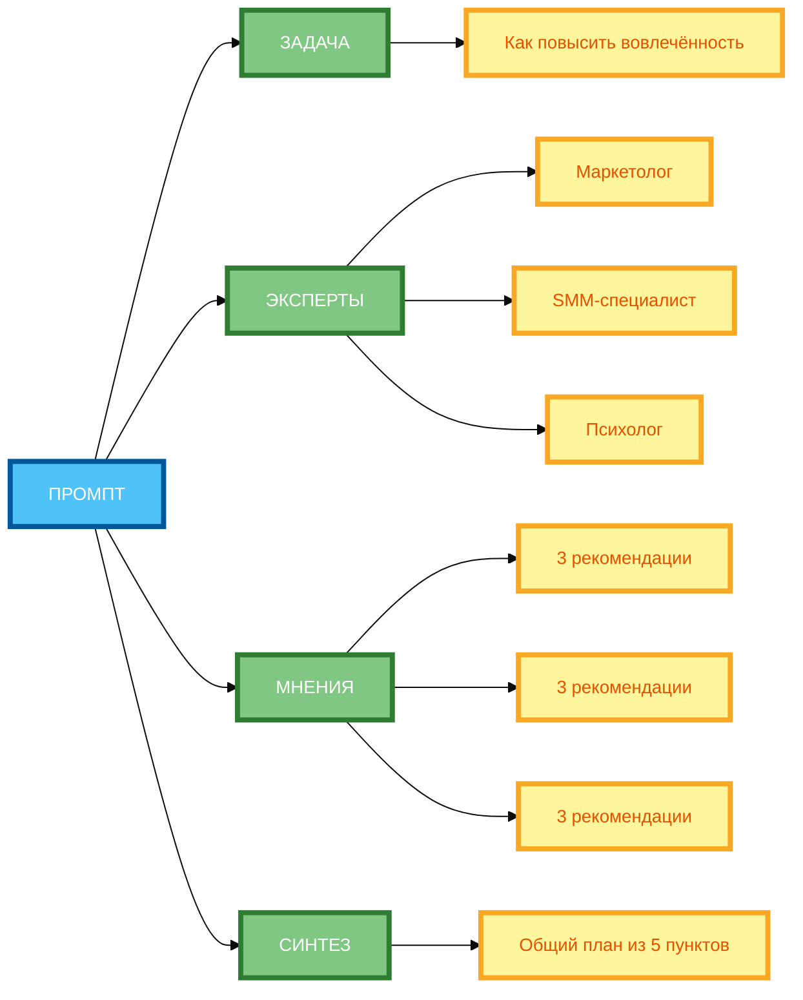
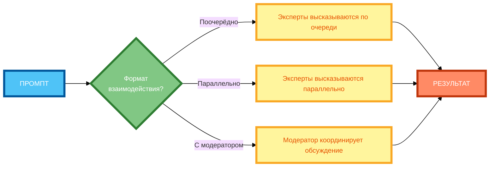

# Метод «Экспертный совет»: запрос мнения нескольких экспертов

В предыдущей статье вы узнали, как использовать Self-Consistency для выбора лучшего ответа из нескольких вариантов. Но даже если вы выбрали лучший вариант, **он всё равно представляет точку зрения одной «личности»** — нейросети. В этой статье вы научитесь использовать **метод «Экспертный совет»** — технику, которая позволяет **запросить мнения нескольких «экспертов»** с разными компетенциями и **синтезировать** их в единый ответ.

## Идея метода: запрос мнений нескольких «экспертов» → синтез ответа

**Метод «Экспертный совет»** — это техника, при которой вы **задаёте несколько ролей** (экспертов) с разными компетенциями и просите их **обсудить задачу** и дать рекомендации. Затем вы **синтезируете** их мнения в единый ответ.

**Идея метода:**

- **Задача** — чётко сформулированная проблема или вопрос.
- **Эксперты** — роли с разными компетенциями (маркетолог, психолог, инженер и т.д.).
- **Мнения** — рекомендации каждого эксперта.
- **Синтез** — объединение мнений в единый ответ.

**Пример без «Экспертного совета»:**

```
Как повысить вовлечённость аудитории в соцсетях?
```

**Результат:** Один общий ответ, который может быть поверхностным или односторонним.

**Пример с «Экспертным советом»:**

```
3 эксперта обсуждают тему «Как повысить вовлечённость аудитории в соцсетях»:

Эксперт 1 (маркетолог): Специализация — контент-маркетинг, полномочия — определять стратегию контента. Дай 3 рекомендации.

Эксперт 2 (SMM-специалист): Специализация — социальные сети, полномочия — определять форматы и каналы. Дай 3 рекомендации.

Эксперт 3 (психолог): Специализация — поведение аудитории, полномочия — определять психологические триггеры. Дай 3 рекомендации.

Синтезируй общий план из 5 пунктов, объединив лучшие рекомендации.
```

**Результат:** Три точки зрения + синтезированный план из 5 пунктов.

## Как задать роли экспертов: специализация, полномочия, ограничения

**1. Специализация**

**Формулировка:** «Эксперт [название]: Специализация — [область].»

**Пример:**

```
Эксперт 1 (маркетолог): Специализация — контент-маркетинг.
```

**2. Полномочия**

**Формулировка:** «Полномочия — [что может делать эксперт].»

**Пример:**

```
Эксперт 1 (маркетолог): Специализация — контент-маркетинг, полномочия — определять стратегию контента.
```

**3. Ограничения**

**Формулировка:** «Ограничения — [что эксперт не может делать].»

**Пример:**

```
Эксперт 1 (маркетолог): Специализация — контент-маркетинг, полномочия — определять стратегию контента, ограничения — не определять технические аспекты.
```

**4. Формат взаимодействия**

**Формулировка:** «Каждый эксперт даёт [количество] рекомендаций.»

**Пример:**

```
Каждый эксперт даёт 3 рекомендации.
```

## Организация диалога между экспертами (поочерёдно, параллельно, с модератором)

**1. Поочерёдно**

**Формулировка:** «Эксперты высказываются по очереди.»

**Пример:**

```
Эксперты высказываются по очереди: сначала маркетолог, затем SMM-специалист, затем психолог.
```

**2. Параллельно**

**Формулировка:** «Эксперты высказываются параллельно.»

**Пример:**

```
Эксперты высказываются параллельно, каждый даёт свои рекомендации независимо.
```

**3. С модератором**

**Формулировка:** «Модератор координирует обсуждение.»

**Пример:**

```
Модератор координирует обсуждение: сначала каждый эксперт даёт рекомендации, затем модератор выявляет совпадения и противоречия.
```

## Синтез ответов: объединение, компромисс, выбор лучшего варианта

**1. Объединение**

**Формулировка:** «Объедини рекомендации всех экспертов.»

**Пример:**

```
Объедини рекомендации всех экспертов в единый план.
```

**2. Компромисс**

**Формулировка:** «Найди компромисс между противоречивыми рекомендациями.»

**Пример:**

```
Найди компромисс между противоречивыми рекомендациями маркетолога и психолога.
```

**3. Выбор лучшего варианта**

**Формулировка:** «Выбери лучшие рекомендации на основе критериев.»

**Пример:**

```
Выбери лучшие рекомендации на основе критериев: актуальность, реализуемость, эффективность.
```

**4. Голосование**

**Формулировка:** «Выбери рекомендации, которые получили наибольшее количество голосов.»

**Пример:**

```
Выбери рекомендации, которые получили наибольшее количество голосов от экспертов.
```

## Примеры «экспертного совета» для разных задач (бизнес-анализ, креатив, научные исследования)

**Пример 1: Бизнес-анализ (полный рабочий промпт)**

```
3 эксперта обсуждают тему «Как повысить конверсию лендинга»:

Эксперт 1 (маркетолог): Специализация — контент-маркетинг, полномочия — определять стратегию контента, ограничения — не определять технические аспекты. Дай 3 рекомендации.

Эксперт 2 (UX-дизайнер): Специализация — пользовательский опыт, полномочия — определять структуру страницы, ограничения — не определять маркетинговую стратегию. Дай 3 рекомендации.

Эксперт 3 (аналитик): Специализация — данные и метрики, полномочия — определять KPI и метрики, ограничения — не определять креативные решения. Дай 3 рекомендации.

Синтезируй общий план из 5 пунктов, объединив лучшие рекомендации на основе критериев: актуальность, реализуемость, эффективность.
```

**Разбор:**

- **Задача:** «Как повысить конверсию лендинга».
- **Эксперты:** маркетолог, UX-дизайнер, аналитик.
- **Специализация и полномочия:** чётко определены.
- **Рекомендации:** 3 от каждого эксперта.
- **Синтез:** объединение лучших рекомендаций на основе критериев.

**Пример 2: Креатив (полный рабочий промпт)**

```
3 эксперта обсуждают тему «Придумай концепцию рекламной кампании для нового продукта»:

Эксперт 1 (креативный директор): Специализация — креативные концепции, полномочия — определять творческое направление, ограничения — не определять бюджет. Дай 3 рекомендации.

Эксперт 2 (стратег): Специализация — маркетинговые стратегии, полномочия — определять позиционирование, ограничения — не определять креативные решения. Дай 3 рекомендации.

Эксперт 3 (медиапланер): Специализация — медиапланирование, полномочия — определять каналы и форматы, ограничения — не определять креативные решения. Дай 3 рекомендации.

Синтезируй общую концепцию, объединив лучшие рекомендации на основе критериев: оригинальность, соответствие бренду, эффективность.
```

**Разбор:**

- **Задача:** «Придумай концепцию рекламной кампании для нового продукта».
- **Эксперты:** креативный директор, стратег, медиапланер.
- **Специализация и полномочия:** чётко определены.
- **Рекомендации:** 3 от каждого эксперта.
- **Синтез:** объединение лучших рекомендаций на основе критериев.

## Риски: конфликты ролей, избыточность информации, противоречивость выводов

**Риск 1: Конфликты ролей**

Когда эксперты имеют **противоречивые полномочия**, их рекомендации могут конфликтовать.

**Пример:**

- Маркетолог: «Нужно яркое оформление для привлечения внимания.»
- UX-дизайнер: «Нужно минималистичное оформление для удобства использования.»

**Решение:** Чётко определите **приоритет** при конфликте (например, «приоритет у маркетолога, если цель — конверсия»).

**Риск 2: Избыточность информации**

Когда экспертов **слишком много**, их рекомендации могут дублироваться.

**Пример:**

- Маркетолог 1: «Нужно использовать Instagram.»
- Маркетолог 2: «Нужно использовать Instagram и Facebook.»

**Решение:** Ограничьте количество экспертов (2–4 оптимально).

**Риск 3: Противоречивость выводов**

Когда эксперты дают **противоречивые рекомендации**, синтез может быть сложным.

**Пример:**

- Маркетолог: «Нужно яркое оформление.»
- UX-дизайнер: «Нужно минималистичное оформление.»

**Решение:** Укажите **способ синтеза** (объединение, компромисс, выбор лучшего).

## Практические советы по реализации метода и минимизации рисков

**Совет 1: Чётко определи задачу для обсуждения**

**Некорректно:** «Обсуди тему маркетинга.»

**Корректно:** «Обсуди тему „Как повысить вовлечённость аудитории в соцсетях“.»

**Совет 2: Выбери 2–4 эксперта с разными компетенциями**

**Некорректно:** 5 маркетологов.

**Корректно:** Маркетолог, SMM-специалист, психолог.

**Совет 3: Для каждого эксперта укажи специализацию и полномочия**

**Некорректно:** «Эксперт 1: маркетолог.»

**Корректно:** «Эксперт 1 (маркетолог): Специализация — контент-маркетинг, полномочия — определять стратегию контента, ограничения — не определять технические аспекты.»

**Совет 4: Определи формат взаимодействия (поочерёдно/параллельно)**

**Некорректно:** «Эксперты обсуждают тему.»

**Корректно:** «Эксперты высказываются параллельно, каждый даёт свои рекомендации независимо.»

**Совет 5: Укажи критерии оценки рекомендаций (актуальность, реализуемость, эффективность)**

**Некорректно:** «Выбери лучшие рекомендации.»

**Корректно:** «Выбери лучшие рекомендации на основе критериев: актуальность, реализуемость, эффективность.»

**Совет 6: Опиши способ синтеза (объединение, голосование, выбор лучшего)**

**Некорректно:** «Синтезируй общий план.»

**Корректно:** «Синтезируй общий план, объединив лучшие рекомендации на основе критериев.»

**Совет 7: Добавь финальный этап: обобщение и структурирование выводов**

**Некорректно:** «Синтезируй общий план.»

**Корректно:** «Синтезируй общий план из 5 пунктов, объединив лучшие рекомендации.»

## Комбинирование метода с другими техниками (цепочки промптов, Self-Check)

**Комбинирование 1: «Экспертный совет» + Цепочка промптов**

```
Шаг 1: 3 эксперта обсуждают тему «Как повысить вовлечённость аудитории в соцсетях». Каждый даёт 3 рекомендации.

Шаг 2: Синтезируй общий план из 5 пунктов, объединив лучшие рекомендации.

Шаг 3: Проверь план по критериям: актуальность, реализуемость, эффективность.

Шаг 4: Если есть ошибки, исправь их и выведи финальный план.
```

**Комбинирование 2: «Экспертный совет» + Self-Check**

```
3 эксперта обсуждают тему «Как повысить вовлечённость аудитории в соцсетях». Каждый даёт 3 рекомендации.

Синтезируй общий план из 5 пунктов, объединив лучшие рекомендации на основе критериев: актуальность, реализуемость, эффективность.

После синтеза проверь план по критериям:
1. Полнота: все ли аспекты освещены?
2. Реализуемость: можно ли внедрить эти рекомендации?
3. Эффективность: приведут ли эти рекомендации к цели?

Если есть ошибки, исправь их и выведи финальный план.
```

## Схема 1: «Структура „Экспертного совета“» (mind map)



**Рисунок 1.** «Структура „Экспертного совета“» (mind map). **3 ряда**: Промпт слева, 4 компонента в среднем ряду (ЗАДАЧА, ЭКСПЕРТЫ, МНЕНИЯ, СИНТЕЗ), подкомпоненты справа. Компактная 1:1, текст полный, цвета и рамки 4px. Расширение слева направо, не длинная по горизонтали.

## Схема 2: «Алгоритм синтеза мнений экспертов» (flowchart)


**Рисунок 2.** «Алгоритм синтеза мнений экспертов» (flowchart). **3 ряда**: Промпт слева, 4 этапа в среднем ряду (СБОР МНЕНИЙ → ВЫЯВЛЕНИЕ СОВПАДЕНИЙ/ПРОТИВОРЕЧИЙ → ОБЪЕДИНЕНИЕ/ВЫБОР → ФИНАЛЬНЫЙ ОТВЕТ), Результат справа. Компактная 1:1, текст полный, цвета и рамки 4px. Расширение слева направо, не длинная по горизонтали.

## Схема 3: «Варианты организации диалога» (decision tree)



**Рисунок 3.** «Варианты организации диалога» (decision tree). **3 ряда**: Промпт слева, вопрос и 3 варианта в среднем ряду, Результат справа. Компактная 1:1, текст полный, цвета и рамки 4px. Расширение слева направо, не длинная по горизонтали.

## Таблица: «Шаблон „экспертного совета“»

| Роль эксперта | Задача эксперта | Критерии оценки | Способ синтеза |
|---------------|-----------------|-----------------|----------------|
| **Маркетолог** | Определять стратегию контента | Актуальность, реализуемость, эффективность | Объединение лучших рекомендаций |
| **SMM-специалист** | Определять форматы и каналы | Охват аудитории, стоимость, эффективность | Голосование |
| **Психолог** | Определять психологические триггеры | Воздействие на поведение, этичность | Выбор лучшего варианта |
| **UX-дизайнер** | Определять структуру страницы | Удобство использования, конверсия | Компромисс |
| **Аналитик** | Определять KPI и метрики | Измеримость, точность | Объединение |

**Рисунок 4.** «Шаблон „экспертного совета“». Таблица содержит 5 ролей с задачей, критериями и способом синтеза.

## Практическое задание

**Задание:** Создайте промпт «3 эксперта обсуждают тему „Как повысить вовлечённость аудитории в соцсетях“».

**Требования:**

- Эксперты: маркетолог, SMM-специалист, психолог.
- Каждый даёт 3 рекомендации.
- Синтезируйте общий план из 5 пунктов.

**Чек-лист для самопроверки:**

- [ ] Чётко определена задача для обсуждения
- [ ] Выбраны 2–4 эксперта с разными компетенциями
- [ ] Для каждого эксперта указана специализация и полномочия
- [ ] Определён формат взаимодействия (поочерёдно/параллельно)
- [ ] Указаны критерии оценки рекомендаций (актуальность, реализуемость, эффективность)
- [ ] Описан способ синтеза (объединение, голосование, выбор лучшего)
- [ ] Добавлен финальный этап: обобщение и структурирование выводов
- [ ] Промпт содержит конкретные инструкции

## Заключение

Метод «Экспертный совет» позволяет получать более качественные и сбалансированные ответы за счёт учёта мнений нескольких экспертов с разными компетенциями. Главное — чётко определять роли, полномочия и критерии оценки, а также описывать способ синтеза мнений. В следующей статье вы узнаете, как организовать «Дебаты» между двумя позициями.