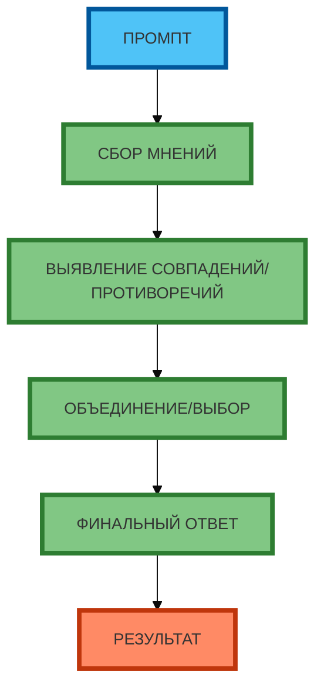

# Схема 2: «Алгоритм синтеза мнений экспертов» (flowchart, линейная, сверху вниз)

**Рисунок 2.** «Алгоритм синтеза мнений экспертов» (flowchart). **Ровно 6 элементов** (сверху вниз): ПРОМПТ → СБОР МНЕНИЙ → ВЫЯВЛЕНИЕ СОВПАДЕНИЙ/ПРОТИВОРЕЧИЙ → ОБЪЕДИНЕНИЕ/ВЫБОР → ФИНАЛЬНЫЙ ОТВЕТ → РЕЗУЛЬТАТ. Компактная 1:1, текст полный, цвета и рамки 4px. Прямые стрелки.