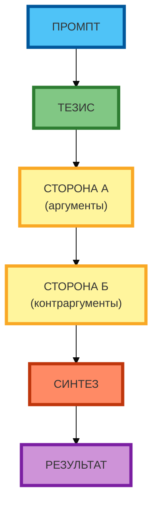

# Схема 1: «Структура дебатов» (вертикальная линейная компоновка)

**Рисунок 1.** «Структура дебатов» (flowchart). **Вертикальная линейная компоновка** (сверху вниз): ПРОМПТ → ТЕЗИС → СТОРОНА А (аргументы) → СТОРОНА Б (контраргументы) → СИНТЕЗ → РЕЗУЛЬТАТ. Компактная 1:1, текст полный, цвета и рамки 4px. Прямые стрелки. Видны сами дебаты (аргументы и контраргументы).