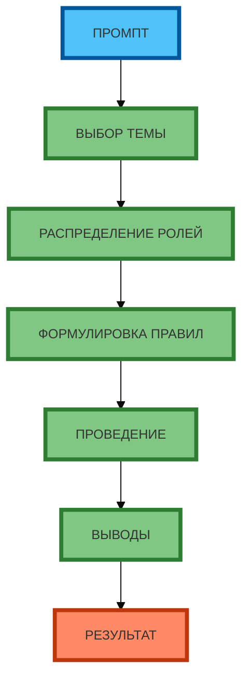

# Схема 2: «Правила организации дебатов» (flowchart, линейная, сверху вниз)

**Рисунок 2.** «Правила организации дебатов» (flowchart). **Линейная зависимость** (сверху вниз): ПРОМПТ → ВЫБОР ТЕМЫ → РАСПРЕДЕЛЕНИЕ РОЛЕЙ → ФОРМУЛИРОВКА ПРАВИЛ → ПРОВЕДЕНИЕ → ВЫВОДЫ → РЕЗУЛЬТАТ. Компактная 1:1, текст полный, цвета и рамки 4px. Прямые стрелки.